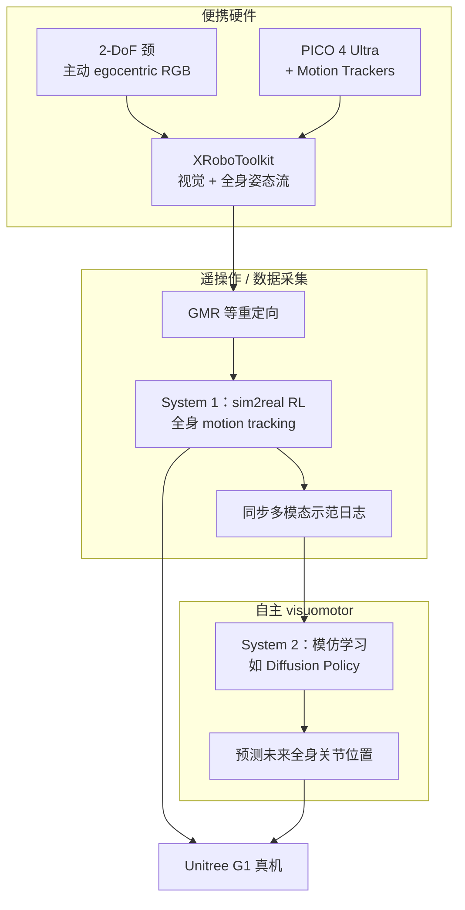

# TWIST2

**TWIST2**（*Scalable, Portable, and Holistic Humanoid Data Collection System*，arXiv:2511.02832，**ICRA 2026**）是 Amazon FAR 等团队提出的 **下一代便携全身人形数据采集与遥操作系统**：在 [TWIST](./paper-twist.md) 跟踪控制器之上，用 **2-DoF 颈增广**、**PICO 便携全身流** 与 **分层 visuomotor 学习**（RL 低层 + 模仿高层）把「能遥操作」推进到「**能规模化攒数据并学自主**」。

## 英文缩写速查

| 缩写 | 英文全称 | 简要说明 |
|------|----------|----------|
| RL | Reinforcement Learning | 通过与环境交互最大化长期回报来学习策略的范式 |
| BFM | Behavior Foundation Model | 大规模行为数据预训练的可复用全身行为先验 |
| WBT | Whole-Body Tracking | 全身参考运动跟踪，常作人形低层控制接口 |
| IL | Imitation Learning | 从示范轨迹学习策略的范式 |
| G1 | Unitree G1 Humanoid | 宇树教育科研人形平台，TWIST2 默认可复现机体 |
| GMR | General Motion Retargeting | 人体动作到机器人骨架的在线/离线重定向 |

## 为什么重要

- 在 [运动小脑 64 篇技术地图](../overview/humanoid-motion-cerebellum-technology-map.md) 中归类为 **F 跨本体与遥操作**（44/64）：遥操作：可扩展、可携带的全身数据采集。
- **数据飞轮需要工程化**：BFM 与 visuomotor 策略依赖 **持续、长时程、全身灵巧** 示范；TWIST2 把采集效率推到 **15 分钟级百次成功**（双手灵巧 / 移动操作）。
- **Egocentric 主动感知**：自研 **2-DoF 颈** 让遥操作员获得 **主动第一人称视角**——长时程叠毛巾、穿门搬运等任务对 **视觉–运动闭环** 至关重要。
- **从遥操作到自主的完整闭环**：同一管线可训 **Diffusion Policy** 等高层策略（Kick-T、WB-Dex），而非只停留在示范录制。
- **全栈开源**：颈 BOM、训练/部署代码、控制器权重与 [TWIST-Data](https://twist-data.github.io/) 社区数据集降低 G1 复现门槛。

## 流程总览

## 核心机制（归纳）

### 1）便携采集栈

| 组件 | 作用 |
|------|------|
| 2-DoF 颈 | 增广 G1 主动 egocentric 感知；MuJoCo 颈建模评测 |
| PICO 4 Ultra + Trackers | 便携全身 6-DoF 流；Passthrough / Egocentric 双模式 |
| XRoboToolkit | 统一 egocentric 视频与全身姿态流 |

### 2）分层 visuomotor 控制

- **System 1（低层）**：sim2real RL **全身 tracking** 策略——承接遥操作参考并保证动态可行（继承 TWIST 跟踪范式）。
- **System 2（高层）**：从 TWIST2 数据 **模仿学习** visuomotor 策略；项目页展示 **Diffusion Policy 预测全身关节 ghost 轨迹**（含上下身）。

### 3）规模化与长时程能力

- **采集效率**：15 min 内 128 次双手灵巧 pick-place；50 次移动 pick-place。
- **长时程技能**：连续叠毛巾、找布折叠、踢球/篮球、穿门搬运、地面捡砖、绕圈 locomotion 等。
- **自主技能**：Kick-T（踢 T 形箱到目标区）、WB-Dex（灵巧 pick-place）。

## 常见误区或局限

- **主要在局部帧跟踪**：全身跟踪在 **机器人局部坐标系** 运行，长时程 **全局位姿漂移** 仍是痛点——[CLOT](./paper-amp-survey-16-clot.md) 等闭环全局方案与之互补对照。
- **不是无机器人采集**：[BifrostUMI](./paper-bifrost-umi.md) 用 Pico+夹爪 **无需 G1 即可示范**；TWIST2 强调 **真机便携遥操作 + 数据规模**，二者解决不同瓶颈。
- **重载 VR 对照**：[HEFT](./paper-heft.md) 在 G1/L7 上以 TWIST2 为跟踪基线，并额外用 **PMG + WPC** 处理 **嘈杂 raw VR** 与 **双手 24 kg 级负载**——与 TWIST2「便携采集 + visuomotor」主叙事互补。
- **硬件仍要装配**：虽比整机机房轻，但颈 3D 打印、PICO 与 G1 联调仍有工程成本（项目页提供五步复现教程）。

## 与其他页面的关系

- 前作：[paper-twist.md](./paper-twist.md)
- 无机器人采集对照：[paper-bifrost-umi.md](./paper-bifrost-umi.md)
- 全局闭环遥操作：[paper-amp-survey-16-clot.md](./paper-amp-survey-16-clot.md)（论文仿真以 TWIST2 为基线）
- 分层 benchmark 后端：[paper-humanoidarena.md](./paper-humanoidarena.md) — 与 SONIC 并列作双 GMT 评测（arXiv:2606.17833）
- RL 身体系统栈：[humanoid-rl-motion-control-body-system-stack.md](../overview/humanoid-rl-motion-control-body-system-stack.md)
- BFM 技术地图：[bfm-41-papers-technology-map.md](../overview/bfm-41-papers-technology-map.md)
- 任务：[teleoperation.md](../tasks/teleoperation.md)、[loco-manipulation.md](../tasks/loco-manipulation.md)

## 实验与评测

- **采集吞吐量**：15 min 级百次成功示范（双手 / 移动操作，项目页视频）。
- **长时程遥操作**：多步骤家务/运动/导航类复合技能（项目页 Long-Horizon 分区）。
- **自主迁移**：Kick-T、WB-Dex 等 visuomotor 策略真机演示。
- 量化 sim2real 指标与消融以 **论文 PDF** 为准；[CLOT](./paper-amp-survey-16-clot.md) 在 G1 仿真中以官方 TWIST2 权重为对比基线。

## 参考来源

- [twist2-project.md](../../sources/sites/twist2-project.md) — 官方项目页一手摘录
- [twist2.md](../../sources/repos/twist2.md) — GitHub 仓库归档
- [bfm_awesome_twist2_arxiv_2505_02833.md](../../sources/papers/bfm_awesome_twist2_arxiv_2505_02833.md) — BFM 41 篇策展
- [humanoid_rl_stack_10_twist2_scalable_portable_and_holistic_humanoid_d.md](../../sources/papers/humanoid_rl_stack_10_twist2_scalable_portable_and_holistic_humanoid_d.md) — 42 篇栈策展
- [wechat_embodied_ai_lab_humanoid_rl_motion_survey.md](../../sources/blogs/wechat_embodied_ai_lab_humanoid_rl_motion_survey.md)
- 论文：<https://arxiv.org/abs/2511.02832>

## 推荐继续阅读

- [TWIST2 项目页](https://yanjieze.com/projects/TWIST2/)
- [TWIST2 GitHub](https://github.com/amazon-far/TWIST2)
- [TWIST-Data 社区数据集](https://twist-data.github.io/)
- [CLOT（全局闭环遥操作对照）](./paper-amp-survey-16-clot.md) — arXiv:2602.15060
- [BifrostUMI（无机器人全身采集对照）](./paper-bifrost-umi.md) — arXiv:2605.03452
