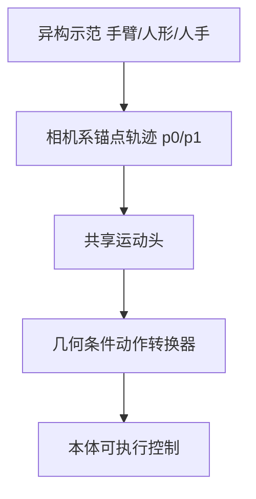

# UCAG-P

**One Policy, Many Embodiments: Unified Camera-Centric Action Geometry Pre-training for Heterogeneous Embodied Manipulation**（[arXiv:2608.26058](https://arxiv.org/abs/2608.26058)，[项目页](https://public-bots.github.io/UCAG-P)）——小米机器人实验室（Xiaomi Embodied Intelligence）；澳门大学（University of Macau）。

## 一句话定义

**跨本体学习的共享目标不应是关节指令，而应是相机里人人都能看见的锚点运动。**

## 英文缩写速查

| 缩写 | 英文全称 | 简要说明 |
|------|----------|----------|
| UCAG-P | Unified Camera-centric Action Geometry Pre-training | 本文相机中心统一动作预训练 |
| VLA | Vision-Language-Action | 共享策略主干 |
| EEF | End-Effector | 末端执行器，对应腕部/抓取中心锚点 |
| GR-1 | Fourier GR-1 | RoboCasa 29-DoF 人形评测本体 |

## 为什么重要

- 纳入 [具身智能小站 2026-08-28 九篇盘点](../../sources/blogs/wechat_embodied_station_wam_vla_cross_embodiment_9_papers_2026-08-28.md)：动作可以在本体之外用统一几何表示。
- 开源状态（入库日）：**待发布**。

## 核心信息

| 项 | 内容 |
|----|------|
| **机构** | 小米机器人实验室；澳门大学 |
| **出处** | arXiv:2608.26058（2026-08），Technical Report |
| **开源** | **待发布** |
| **数据** | 机器人+仿真 4030 h；人类示范 2340 h |

### 流程总览

## 工程实践

| 项 | 内容 |
|----|------|
| **三阶段** | ① 全数据相机中心特化 ② 真值轨迹训转换器 ③ 混合人机联合训练（用策略预测轨迹对齐推理） |
| **锚点** | 腕部 / 末端 + 抓取中心的 2D 图像与 3D 相机系轨迹 |
| **失败源** | 标定、深度、运动学或人手关键点误差会传入共享目标 |

## 评测

| 项 | 内容 |
|----|------|
| **LIBERO** | **98.3%**（四套件，单检查点、无基准特化微调） |
| **LIBERO-Plus** | 零样本 **82.0%** |
| **RoboTwin Easy / Hard** | **88.7% / 89.2%** |
| **RoboCasa GR-1** | **62.0%** |

- 数据出处：[ingest 摘录「评测」](../../sources/papers/ucag_p_arxiv_2608_26058.md)。

## 结论

**先共享可观察几何，再翻译执行细节——这比统一关节空间更适合异构数据。**

1. 人手示范能直接监督共享策略，因为目标不在机器人关节里。
2. 转换器必须看到相机到基座、雅可比与本体状态，否则共享运动落不了地。
3. 单检查点跨单臂/双臂/人形是卖点；接触丰富与关节物体仍是短板。
4. 代码未发布，标定/深度误差会放大到控制器。

## 源码运行时序图

**不适用**（截至 **2026-08-28**）：[`Public-BOTs/UCAG-P`](https://github.com/Public-BOTs/UCAG-P) 仅项目页资产，README 写 Code Release Soon。

## 局限与风险

- 项目页 Limitations：标定、深度、运动学、手关键点误差会传播。
- 跨本体接触丰富与关节物体任务仍然难。
- 公众号原文「项目页与代码」未给完整 URL，以 arXiv comments 中的项目页为准。

## 与其他工作对比

- 相对显式动作重定向 / 人到机器人视频合成 / 数据集分支：UCAG-P 把异构数据对齐到共享几何空间，而不是各训一套头。
- 相对 [Zero-WAM](./paper-zero-wam.md)：一个统一**动作几何**，一个统一**任务规格（视频）**。

## 关联页面

- [VLA](../methods/vla.md)
- [LIBERO](./libero-benchmark.md)
- [Manipulation](../tasks/manipulation.md)
- [WAM / VLA / 跨本体 9 篇技术地图](../overview/wam-vla-cross-embodiment-9-papers-technology-map.md)

## 参考来源

- [ucag_p_arxiv_2608_26058](../../sources/papers/ucag_p_arxiv_2608_26058.md)
- [ucag-p 项目页](../../sources/sites/ucag-p.md)
- [ucag-p 仓库](../../sources/repos/ucag-p.md)
- [具身智能小站 9 篇盘点](../../sources/blogs/wechat_embodied_station_wam_vla_cross_embodiment_9_papers_2026-08-28.md)

## 推荐继续阅读

- [arXiv:2608.26058](https://arxiv.org/abs/2608.26058)
- [UCAG-P 项目页](https://public-bots.github.io/UCAG-P)
