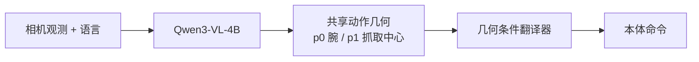

# UCAG-P：跨本体统一动作几何

**UCAG-P**（*Unified Cross-embodiment Action Geometry for Policy Learning*，[arXiv:2608.26058](https://arxiv.org/abs/2608.26058)，[项目页](https://public-bots.github.io/UCAG-P/)）由 **小米具身智能 × 澳门大学** Yifan Xu、Yiming Li、Xinyu Zhan 等提出：在相机系用双锚点运动定义共享动作空间，再经几何条件翻译器映到各本体命令。

## 一句话定义

**跨本体先对齐「相机里腕和夹爪中心怎么动」，再翻译成本体关节/末端命令——单 checkpoint、榜上不微调，靠的是动作几何而不是为每个臂重训头。**

## 英文缩写速查

| 缩写 | 英文全称 | 简要说明 |
|------|----------|----------|
| UCAG-P | Unified Cross-embodiment Action Geometry for Policy | 本文框架与单 checkpoint 策略 |
| EEF | End-Effector | 对照 [Qwen-RobotManip](./qwen-robot-manip.md) 的相机系末端增量 |
| VLA | Vision-Language-Action | 骨干是 Qwen3-VL-4B |
| LIBERO | Lifelong Robot Learning benchmark | 桌面操作仿真榜；本文 98.3% |
| GR-1 | RoboCasa GR-1 设定 | 厨房操作对照；本文 62.0% |

## 为什么重要

- **动作空间比「再做一个 VLA 头」更可迁移：** 共享量是相机系 \(p_0\)（腕/末端）与 \(p_1\)（抓取中心）的运动，本体差异下放到翻译器。
- **单 ckpt 无榜微调** 是评测协议的核心，不是「我们也报了 LIBERO」。
- **与通义操作 foundation 同属相机系动作：** [Qwen-RobotManip](./qwen-robot-manip.md) 用 80 维 canonical + 相机系 EEF delta；UCAG-P 显式加抓取中心锚点，数据量 6374 h（含人手）而非 3 万小时级。

## 核心信息

| 项 | 内容 |
|----|------|
| **机构** | 小米机器人实验室（Xiaomi Robotics）；澳门大学（University of Macau） |
| **骨干** | Qwen3-VL-4B |
| **数据** | 6374 h（机器人 + 仿真 + 人手） |
| **真机** | Piper：面包 / 抽屉 / 碗 |
| **开源** | **宣称将开源 / 待发布**：仓为论文图与项目页，README 写 code coming soon；无 LICENSE |

## 核心原理（方法）

共享动作：相机坐标系下锚点 \(p_0\)（腕或末端）与 \(p_1\)（抓取中心）的运动。几何条件翻译器按当前本体运动学把该几何增量写成可执行命令。策略在共享几何上学习，部署时只换翻译器，不换视觉–语言骨干。

## 工程实践

| 项 | 说明 |
|----|------|
| 源码运行时序图 | **不适用**（无可运行训练/推理实现；仓语言为 HTML） |
| 跨本体选型 | 先读 [跨本体迁移策略](../queries/cross-embodiment-transfer-strategy.md)：本页是「统一动作空间」路径，不是重定向后重训 |
| 对照相机系 EEF | Qwen-RobotManip 已把相机系末端当 alignment 前提；UCAG-P 多一个抓取中心锚点 |

## 实验与评测

单 checkpoint、**无榜微调**：

| 基准 | UCAG-P |
|------|--------|
| LIBERO | **98.3%** |
| RoboTwin Easy / Hard | **88.7 / 89.2** |
| LIBERO-Plus | **82.0** |
| RoboCasa GR-1 | **62.0** |
| Piper 真机 面包 / 抽屉 / 碗 | 60 / 90 / 75% |

## 结论

**UCAG-P 值得记的是「相机系双锚点 + 翻译器」这条跨本体接口，不是 LIBERO 98.3% 本身——厨房 GR-1 掉到 62%、真机面包 60%，说明几何对齐没有取消场景与接触难度。**

1. **无榜微调是协议**；拿去和「每榜 SFT」的 VLA 比要先对齐训练预算。
2. **\(p_1\) 抓取中心** 才是相对纯 EEF delta 的增量；不要把本文缩成「又一个相机系动作」。
3. **6374 h 含人手**，跨本体故事部分来自人数据，不只是多臂关节对齐。
4. **Piper 三任务不能外推到双臂/人形。**
5. **代码未发布**；clone `Public-BOTs/UCAG-P` 只能看到图和项目页。

## 与其他工作对比

| 对比轴 | UCAG-P | [Qwen-RobotManip](./qwen-robot-manip.md) | 关节空间 VLA |
|--------|--------|------------------------------------------|--------------|
| 共享量 | 相机系 \(p_0,p_1\) 运动 | 80 维 canonical + 相机系 EEF delta | 各本体关节 |
| 骨干 | Qwen3-VL-4B | Qwen3.5-4B VL + DiT | 不等 |
| 数据 | 6374 h | >38,100 h（含 H2R） | 不等 |
| 开源 | **待发布** | **已开源** 预训练叙事 | 视模型 |

## 局限与风险

- **占位仓、无许可证。**
- **LIBERO 98.3% 接近饱和**，区分度在 LIBERO-Plus / RoboCasa / 真机。
- **翻译器若依赖精确运动学标定**，真机换夹爪/相机外参会把「统一几何」打穿。
- **作者名单与数据配比未在 wiki 层展开**，复现以论文与未来代码为准。

## 关联页面

- [跨本体迁移策略](../queries/cross-embodiment-transfer-strategy.md)
- [Qwen-RobotManip](./qwen-robot-manip.md) — 相机系 EEF 对齐的开源对照
- [Qwen-VLA](./qwen-vla.md)
- [Manipulation](../tasks/manipulation.md)
- [VLA](../methods/vla.md)

## 参考来源

- [UCAG-P 论文摘录](../../sources/papers/ucag_p_arxiv_2608_26058.md)
- [UCAG-P 仓归档](../../sources/repos/ucag-p.md)
- [UCAG-P 项目页归档](../../sources/sites/ucag-p.md)

## 推荐继续阅读

- 项目页 — <https://public-bots.github.io/UCAG-P/>
- 论文 — <https://arxiv.org/abs/2608.26058>
- GitHub — <https://github.com/Public-BOTs/UCAG-P>
