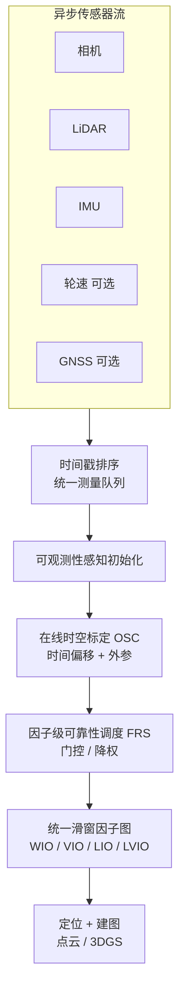

# Ultra-Fusion（韧性多传感器融合 SLAM）

**Ultra-Fusion**（Tian et al., arXiv:2606.21223，[项目页](https://sjtuyinjie.github.io/ultrafusion-web/)）面向 **智能交通系统（ITS）** 中的 **轮式、腿式与低空 UAV** 定位，提出 **紧耦合、可配置传感器栈** 的统一 SLAM 框架。核心是在 **单一滑窗因子图** 内按时间戳排序异构测量，支持 **WIO / VIO / LIO / LVIO** 及可选 **轮速 / GNSS**，并通过 **可观测性感知初始化**、**因子级可靠性调度（FRS）** 与 **在线 LiDAR–IMU 时空标定（OSC）** 应对 **传感器退化**（弱光、LiDAR 退化、打滑、GNSS 拒止）与 **时空标定扰动**。论文在 **M3DGR、M2DGR-Plus、KAIST、GrandTour、MARS-LVIG** 上对 **60+** 开源 SLAM 系统做系统评测，并扩展 M3DGR 仿真退化轨迹。

## 一句话定义

**把 WIO/VIO/LIO/LVIO 及轮速/GNSS 放进同一滑窗优化器，用可观测性引导启动、因子级门控抑制退化量测，并在线估计时间偏移与外参，使 ITS 多平台在退化与标定误差下仍保持可用定位。**

## 英文缩写速查

| 缩写 | 英文全称 | 简要说明 |
|------|----------|----------|
| Ultra-Fusion | Ultra-Fusion SLAM Framework | 本文统一多传感器紧耦合定位框架 |
| ITS | Intelligent Transportation Systems | 智能交通系统；含自动驾驶、配送机器人、巡检 UAV |
| SLAM | Simultaneous Localization and Mapping | 同步定位与建图 |
| LVIO | LiDAR-Visual-Inertial Odometry | 激光-视觉-惯性融合里程计 |
| LIO | LiDAR-Inertial Odometry | 激光-惯性里程计 |
| VIO | Visual-Inertial Odometry | 视觉-惯性里程计 |
| WIO | Wheel-Inertial Odometry | 轮速-惯性里程计 |
| FRS | Factor-Wise Reliability Scheduling | 因子级可靠性调度，退化感知门控/降权 |
| OSC | Online Spatiotemporal Calibration | 在线时空标定（时间偏移 + 外参） |
| GNSS | Global Navigation Satellite System | 全球导航卫星系统，可选全局锚定 |
| ATE | Absolute Trajectory Error | 绝对轨迹误差（常与 RMSE 一并报告） |

## 为什么重要

- **传感器栈不统一：** ITS 车队从 **乘用车、园区轮式机器人** 到 **四足配送** 与 **低空巡检 UAV**，难以为每种组合维护独立 SLAM 管线；Ultra-Fusion 用 **共享状态与边缘化接口** 覆盖多种配置。
- **退化是常态而非边角：** 城市峡谷、隧道、夜间、长廊几何退化、轮速打滑与 GNSS 拒止会同时出现；**固定置信度融合** 易引入偏置或跟踪丢失，需要 **图内** 可靠性控制而非子系统硬切换。
- **时空标定不能只做离线：** 大平台振动、温漂与异步触发使 **时间偏移与外参误差** 在运行中持续存在；在线标定若缺乏 **可观测性与可靠性门控** 会放大漂移。
- **评测缺口：** 论文扩展 **M3DGR** 并对比 **60+** 系统，提供退化、标定注入与跨平台（轮式/腿式/空中）的 **系统性鲁棒性画像**，对 [LiDAR/VIO 选型](../comparisons/lidar-slam-lio-vio-selection.md) 有参考价值。

## 核心信息

| 字段 | 内容 |
|------|------|
| 机构 | 北京理工大学；重庆大学；四川大学；西北工业大学；上海交通大学 |
| 出处 | arXiv:2606.21223 |
| 项目 | <https://sjtuyinjie.github.io/ultrafusion-web/> |

## 方法与核心结构

| 模块 | 作用 |
|------|------|
| **统一滑窗估计器** | 时间戳排序 → 可选因子（LiDAR 点残差、视觉重投影、IMU 预积分、轮速、GNSS）→ 联合非线性优化与边缘化 |
| **可观测性感知初始化** | 按当前传感器可观测性选择引导模式，缩短启动延迟并稳定前 20 s 轨迹 |
| **因子级可靠性调度（FRS）** | 对各模态残差做退化检测、门控与降权，抑制低置信测量进入优化 |
| **在线时空标定（OSC）** | 在激励充分且传感器可靠时估计 **IMU–LiDAR 时间偏移** 与 **旋转外参** |
| **建图扩展** | 优化位姿支撑 **彩色点云** 与 **LiDAR 引导 3D Gaussian Splatting** 稠密重建 |

### 流程总览

## 实验与评测（论文报告摘要）

| 基准 / 场景 | 配置亮点 | 论文结论（相对强基线） |
|-------------|----------|------------------------|
| **M3DGR** | WIO / VWIO / LWIO / **LVWIO** 分组 | 各兼容传感器组内综合排名前列；如 **Dark01** 夜间 ATE **0.08 m**；**Corridor01** 长廊退化 **0.02 m**（Rank 1） |
| **M2DGR-Plus** | 校园轮式 **LVWIO** | 平均漂移 **0.59% / 0.24 m**；FAST-LIVO2 **2.32% / 1.48 m**；Ground-Fusion++ 多序列失败 |
| **Isaac Sim 退化** | 隧道 / 野外几何弱约束 | 相对 FAST-LIVO、R3LIVE 等在 **Tunnel** 序列 RMSE 降至 **分米级** |
| **KAIST Urban 29** | 高速城市场景（峰值 **>29 km/h**） | 全 KAIST 平均漂移约 **0.38%**；长时 GNSS 辅助可降低漂移 |
| **GrandTour** | 四足 **LVIO** | **SPX-2 / SNOW-2 / EIG-1** 等序列 RTE **厘米级** 且多序列 Rank 1 |
| **MARS-LVIG** | 低空 UAV | 平均 rank / RMSE **1.5 / 1.47**；机场、岛屿等高空稀疏结构稳定 |
| **标定扰动** | 注入 IMU 时间偏移、外参旋转 | **±300 ms** 延迟下全模型仍 **~4 cm** 级；**10°** 外参扰动下优于 FAST-LIVO2 数个数量级 |
| **运行时** | i9-14900K，实时滑窗配置 | 每步优化 **5.48–10.73 ms** |

**消融：** FRS 对 LiDAR / 视觉 / 轮速分别带来显著 ATE 下降；**自适应初始化** 将平均启动延迟从 **4.642 s** 降至 **0.153 s**。

## 与代表性系统的对照

| 维度 | FAST-LIVO2 | Ground-Fusion++ | Ultra-Fusion |
|------|------------|-----------------|--------------|
| 传感器 | 固定 CIL | CIDWGL，GNSS 可选 | **CIDWGL，WIO/VIO/LIO/LVIO 可配置** |
| 耦合方式 | 紧耦合，固定栈 | 子系统级可靠性 | **统一滑窗，图内 FRS** |
| 在线标定 | 有限 | 主要空间 | **时空 OSC + 可靠性门控** |
| 退化处理 | 部分场景脆弱 | 模态受限 | **LiDAR/视觉/轮速/GNSS 因子级调度** |
| 评测规模 | 常规基准 | M3DGR 等 | **60+ 系统 + 仿真扰动 + 跨平台** |

## 常见误区或局限

- **误区：「多传感器融合 = 把所有传感器永远全开」。** 本文强调 **可靠性调度**；退化模态应 **降权或门控**，而非硬融合。
- **误区：「LVIO 一定优于 LIO」。** 视觉在弱纹理/夜间仍可能失效；需结合 [选型对比](../comparisons/lidar-slam-lio-vio-selection.md) 与平台传感器配置判断。
- **局限：** 代码与扩展数据集 **论文接受后发布**；真机部署仍需 **传感器标定、时间同步与算力预算** 验证。
- **局限：** 与 [FAST-LIO](./fast-lio.md) 等 **轻量 LIO** 相比，全模态 LVWIO + 在线标定 **复杂度更高**，适合 **多模态 ITS 平台** 而非极简 3D LIO 场景。

## 与其他页面的关系

- [Sensor Fusion（概念）](../concepts/sensor-fusion.md) — 多模态融合与退化感知的一般语境
- [State Estimation（概念）](../concepts/state-estimation.md) — 位姿/速度估计在控制栈中的位置
- [LiDAR SLAM / LIO / VIO 选型](../comparisons/lidar-slam-lio-vio-selection.md) — 开源系统横向对照；本文提供 **退化与标定扰动** 维度的补充证据
- [导航·SLAM 栈总览](../overview/navigation-slam-autonomy-stack.md) — Nav2 上游里程计/SLAM 分层
- [状态估计专题汇总](../overview/topic-state-estimation.md) — 专题入口
- [FAST-LIO（实体）](./fast-lio.md) — 3D LIO 轻量基线对照

## 参考来源

- [ultra_fusion_arxiv_2606_21223.md](../../sources/papers/ultra_fusion_arxiv_2606_21223.md)
- Tian et al., *Ultra-Fusion: A Resilient Tightly-Coupled Multi-Sensor Fusion SLAM Framework under Sensor Degradation and Spatiotemporal Perturbation for Intelligent Transportation Systems*, arXiv:2606.21223, 2026 — <https://arxiv.org/abs/2606.21223>

## 推荐继续阅读

- [Ultra-Fusion 项目页](https://sjtuyinjie.github.io/ultrafusion-web/) — 交互点云/3DGS demo 与分场景视频
- Zheng et al., *FAST-LIVO2* — 固定 CIL 紧耦合 LVIO 强基线（<https://github.com/hku-mars/FAST-LIVO2>）
- Yin et al., *Ground-Fusion / Ground-Fusion++* — 同一团队 IROS 路线，对比 **统一估计器** 的演进
- [M3DGR 扩展基准](https://github.com/sjtuyinjie/M3DGR) — 退化与多模态 ITS 评测数据
