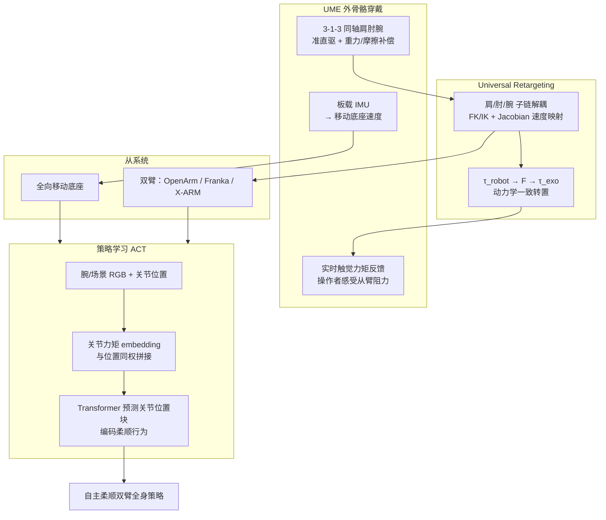

# UME-EXO（Universal Manipulation Exoskeleton）

**UME**（Universal Manipulation Exoskeleton）是 Ant Group 与 Stanford 团队提出的 **上肢外骨骼遥操作与数据采集** 系统（arXiv:2606.14218，[项目页](https://ume-exo.github.io/)）：操作者穿戴约 **$1900** 的便携外骨骼，**实时感受从臂接触阻力**，同时记录 **全身关节位置与力矩**；经 **通用子链重定向** 可驱动 OpenArm、Franka、X-ARM 等不同 DoF 机械臂，并用板载 **IMU** 同步遥操作移动底座。采集数据训练 **ACT** 策略（力矩与位置同权嵌入）后，在 **力主导、视觉遮挡、极窄空间、长时程移动操作** 四类任务上成功率显著高于 **无力矩** 与 **UMI 式仅末端位姿** 基线。

## 英文缩写速查

| 缩写 | 英文全称 | 简要说明 |
|------|----------|----------|
| UME | Universal Manipulation Exoskeleton | 本文提出的上肢外骨骼遥操作与采集平台 |
| ACT | Action Chunking with Transformers | 预测动作块的序列模型，本文策略学习骨干 |
| UMI | Universal Manipulation Interface | 手持夹爪无机器人示教范式，本文对照基线之一 |
| IMU | Inertial Measurement Unit | 测量姿态，用于移动底座速度映射 |
| FK | Forward Kinematics | 由关节角求末端/子链姿态 |
| IK | Inverse Kinematics | 由任务空间目标反解关节角 |
| RoM | Range of Motion | 关节可达运动范围 |
| WBC | Whole-Body Control | 移动操作中的全身/双臂协调执行 |

## 为什么重要

- **补齐「力矩模态」采集缺口**：相对 [ALOHA](https://arxiv.org/abs/2304.13705) / [GELLO](https://arxiv.org/abs/2307.04796) 等 leader–follower，UME **同步记录并回传关节力矩**，使操作者与策略都能利用接触信息——对 **非抓取、环境借力**（靠墙翻箱、推物至视觉不可见尽头）至关重要。
- **全身臂形 vs 仅末端**：相对 [UMI](https://umi-gripper.github.io/) 的 6D 末端示教，UME 记录 **整条臂配置**，在 **~5 mm 间隙 GPU 取放** 等任务中避免「微弯即碰障」；Table 1 中 UMI 在 GPU picking 与 box flipping 上成功率为 **0**。
- **便携移动操作**：嵌入式 IMU（约 $9）将上身姿态映射为全向底座速度，无需昂贵 VR 全身追踪即可采集 **冰箱开门 + 双臂递接** 等长时程 loco-manip 示范（157 条 demo）。
- **工程可负担**：外骨骼 **$1900**、自研移动双臂平台约 **$9533**（OpenArm 1.0 双臂 + Hexfellow PCW-25 等），与工业级数据手套 / 高成本 MoCap 形成对照；用户研究中力反馈使 box flipping 采集吞吐达无力矩版的 **3.3×**。

## 流程总览

## 核心机制（归纳）

### 1）机械与同轴 3-1-3 设计

人臂 **肩 3 + 肘 1 + 腕 3** DoF。UME 将 J1–J3、J5–J7 作 **同轴** 布置，旋转轴分别汇于肩/腕球心，减少等构 leader 常见的结构遮挡，覆盖大部分人肩腕 **RoM**。执行器选用 **Damiao / Unitree** 等 **低减速比准直驱**，相对 Dynamixel 高减速更易实现 **透明力矩反馈**。

### 2）通用子链重定向

UME 与从臂运动链均分解为三个子操纵器：**虚拟肩球关节（3DoF）+ 肘（1DoF）+ 虚拟腕球关节（3DoF）**。

| 通道 | 做法 |
|------|------|
| 位置前馈 | 各子链 FK 得 \(SO(3)\) 姿态 → 从臂子链 IK 得目标关节角；肘角 **直接镜像** |
| 速度前馈 | 子链 Jacobian 将 \(\dot{q}_{exo}\) 映为虚拟角速度 \(\omega\)，再从臂 \(J^\dagger \omega\) 得 \(\dot{q}_{robot}\) |
| 触觉反馈 | 从臂测得 \(\tau_{robot}\) → 空间力矩 \(F = \bar{J}^T \tau\) → 外骨骼 \(\tau_{exo} = J_{exo}^T F\)；肘力矩一对一映射 |

子链 **隔离计算** 减轻 6D 末端控制在约束空间附近的奇异与耦合，提升窄空间遥操作可预测性。

### 3）移动操作：IMU → 底座

上身 IMU 欧拉角 **线性映射** 为 \([\dot{x}, \dot{y}, \dot{\theta}]\)；外骨骼相对重力方向用于 **重力补偿力矩**。底座为 Tidybot++ 升级版：更低减速、更小回差的全向轮，改善顺应性与里程计。

### 4）学习：ACT + 力矩模态

沿用 [ACT](../methods/action-chunking.md) 的图像（ResNet18）与关节本体接口，将 **关节力矩与位置同样处理为 embedding 后拼接**，再经 Transformer 编解码预测 **目标关节位置**——位置目标隐含柔顺/输出力矩信息。四任务示范量：26 / 40 / 42 / 157 条。

## 实验与评测（含基线对比，20 次/任务）

| 任务 | 挑战 | Demo 数 | UME | No-torque | UMI |
|------|------|---------|-----|-----------|-----|
| Visually occluded box pushing | 力主导 + 视觉不可见空隙 | 26 | **0.90** | 0.50 | 0.40 |
| Force-mediated box flipping | 力主导 + 桌面障碍 | 40 | **0.85** | 0 | 0 |
| Space-constrained GPU picking | 极窄间隙 + 全身伸直 | 42 | **0.95** | 0.75 | 0 |
| Fridge drink retrieval | 长时程移动双臂 + 开门力控 | 157 | **0.95** | 0.90 | 0 |

**消融解读（归纳）**：

- **No-torque**：去掉力矩 embedding；在需「持续加力直至阻力饱和」的任务（推箱、翻箱）上过早停止或无法区分视觉相同但力矩不同的状态。
- **UMI 基线**：同数据集仅用 **末端 6D 位姿 + 全身 IK** 作监督；在需 **全臂伸直** 或 **腕载相机/夹爪避障** 的任务上频繁碰撞。

跨形态：真机 **6DoF X-ARM** 双臂递接；仿真 **7DoF Franka**（真机待交付）。

## 常见误区或局限

- **不是无机器人 UMI**：UME 是 **具身 leader–follower 外骨骼**，需从臂在线；与 [BifrostUMI](./paper-bifrost-umi.md) 等「无目标机器人采集」路线互补而非替代。
- **连杆与材料**：当前 **PLA** 连杆偏重、载荷有限；连杆长度 **不可调**；生产级轻量化仍待迭代。
- **代码未开源**：项目页标注 Coming Soon；复现需等待官方仓库与 BOM。
- **策略范式固定于 ACT**：未系统对比 Diffusion Policy / VLA；力矩信息如何与更大规模基础模型结合仍是开放问题。

## 关联页面

- [Teleoperation](../tasks/teleoperation.md) — 力矩反馈外骨骼在遥操作谱系中的位置
- [Bimanual Manipulation](../tasks/bimanual-manipulation.md) — 双臂递接、开门扶罐等任务形态
- [Loco-Manipulation](../tasks/loco-manipulation.md) — 移动底座 + 双臂长时程协调
- [Motion Retargeting](../concepts/motion-retargeting.md) — 子链解耦重定向 vs 全局末端 IK
- [Action Chunking](../methods/action-chunking.md) — 策略学习骨干
- [BifrostUMI](./paper-bifrost-umi.md) — 无机器人全身示范对照
- [Imitation Learning](../methods/imitation-learning.md) — 示教驱动部署主线

## 参考来源

- [sources/papers/ume_exo_arxiv_2606_14218.md](../../sources/papers/ume_exo_arxiv_2606_14218.md)
- [sources/sites/ume-exo-project.md](../../sources/sites/ume-exo-project.md)
- Liang et al., *Universal Manipulation Exoskeleton: Learning Compliant Whole-body Policies with Real-time Torque Feedback*, arXiv:2606.14218, 2026. <https://arxiv.org/abs/2606.14218>

## 推荐继续阅读

- [UME 项目主页](https://ume-exo.github.io/)
- Chi et al., *Universal Manipulation Interface* (RSS 2024) — <https://arxiv.org/abs/2402.10329>
- Zhao et al., *ALOHA* (RSS 2023) — 无力矩 leader–follower 对照
- Choi et al., *In-the-wild Compliant Manipulation with UMI-FT* (2026) — UMI 路线上的柔顺扩展
