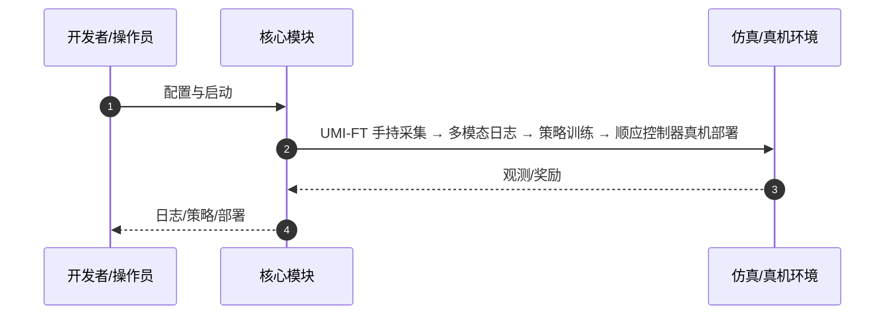

# In-the-Wild Compliant Manipulation with UMI-FT（arXiv:2601.09988）

**In-the-Wild Compliant Manipulation with UMI-FT**（Hojung Choi, Yifan Hou, Chuer Pan, Seongheon Hong, Austin Patel, Xiaomeng Xu, Mark R. Cutkosky, Shuran Song；Stanford University；[arXiv:2601.09988](https://arxiv.org/abs/2601.09988)，[项目页](https://umi-ft.github.io/)）— 在 UMI 手持夹爪每指安装紧凑六维力传感器，野外采集多模态示范并训练自适应顺应策略，规模化学习力敏感操作。

## 一句话定义

在 UMI 手持夹爪每指安装紧凑六维力传感器，野外采集多模态示范并训练自适应顺应策略，规模化学习力敏感操作。

## 英文缩写速查

| 缩写 | 英文全称 | 简要说明 |
|------|----------|----------|
| UMI-FT | Universal Manipulation Interface with Force-Torque | 本文采集平台 |
| UMI | Universal Manipulation Interface | 前序无机器人手持示教 |
| ACP | Adaptive Compliance Policy | 预测位姿/力/刚度的策略 |
| F/T | Force/Torque | 指端六维力矩测量 |

## 为什么重要

商业 F/T 传感器贵且笨重，阻碍野外力感知数据规模；UMI-FT 把力感知做成可携带接口。

## 核心原理（方法）

CoinFT 指端传感器 + iPhone RGB/深度；策略融合视觉、深度、F/T、本体感觉，输出位姿目标与抓取力/刚度给顺应控制器。

## 实验与评测

白板擦拭、插灯泡、穿西葫芦三任务；相对无顺应/无力传感基线显著更稳。

## 结论

UMI-FT 把「力感知数据采集」从实验室拉进野外，是 UMI 路线在接触操作上的关键延伸。

- 指端力同时捕获外接触与内抓取力
- 与标准顺应控制器对接，工程路径清晰
- 开源硬件+软件降低复现门槛
- 泛化到未见场景与 clutter

## 源码运行时序图

官方入口见 frontmatter `code` / 项目页。运行时主干：

- **最短路径：** 克隆官方仓库 → 按 README 安装依赖 → 运行训练/采集/部署入口脚本。

## 局限与风险

依赖 CoinFT 硬件供应链；策略仍受示范覆盖限制。

## 与其他工作对比

相对纯 UMI，增加力通道；相对机器人内置 ATI，更便携廉价。

## 关联页面

- [paper-ume-exo](./paper-ume-exo.md)
- [paper-minimalist-compliance-control](./paper-minimalist-compliance-control.md)
- [teleoperation](../tasks/teleoperation.md)
- [REALab 14 篇技术地图](../overview/realab-14-papers-technology-map-2026.md)

## 参考来源

- [umi_ft_arxiv_2601_09988.md](../../sources/papers/umi_ft_arxiv_2601_09988.md)
- [wechat_shenlan_realab_14_papers_2026.md](../../sources/blogs/wechat_shenlan_realab_14_papers_2026.md)

## 推荐继续阅读

- 论文：<https://arxiv.org/abs/2601.09988>
- 项目页：<https://umi-ft.github.io/>
