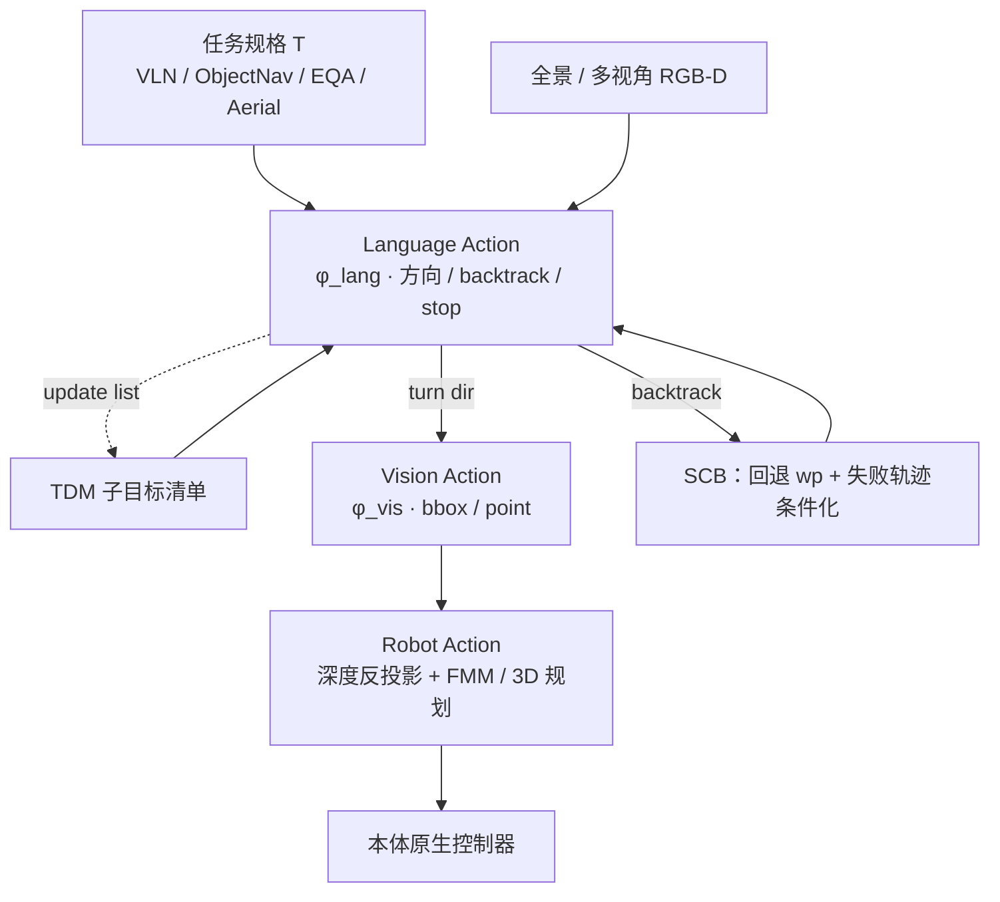
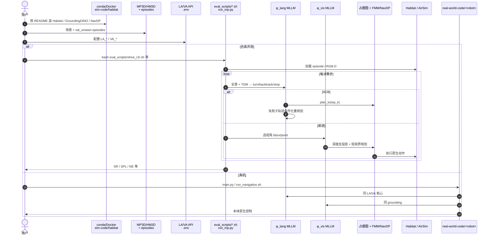

# Uni-LaViRA：统一具身导航的语言–视觉–机器人动作翻译

**Uni-LaViRA**（*Language-Vision-Robot Actions Translation for Unified Embodied Navigation*，arXiv:[2605.27582](https://arxiv.org/abs/2605.27582)，[项目页](https://xetroubadour.github.io/Uni-LaViRA/)，[代码](https://github.com/NJU-R-L-Group-Embodied-Lab/uni-lavira-code)）由 **南京大学** 联合 **中科院自动化所、北航、宝马南京信息技术、罗切斯特大学** 提出：把具身导航写成 **Language Action → Vision Action → Robot Action** 三层翻译，用预训练 MLLM 做 **零机器人数据训练** 的统一 agent，覆盖四任务族与四异质真机。

## 一句话定义

**用「语言语义方向 + 像素级视觉目标 + 几何控制器」把导航钉在 MLLM 自然输出流形内，再以 TDM/SCB 做长时程记忆与错误条件化重规划——一种 training-free 的统一具身导航 agent。**

## 英文缩写速查

| 缩写 | 英文全称 | 简要说明 |
|------|----------|----------|
| Uni-LaViRA | Unified Language-Vision-Robot Actions | 本文统一导航框架（扩展自 LaViRA） |
| TDM | TODO List Memory | 逐步改写的结构化子目标清单 |
| SCB | Second Chance Backtrack | 回退航点并用失败子轨迹条件化重规划 |
| VLN-CE | Vision-and-Language Navigation in Continuous Environments | 连续环境语言导航（R2R/RxR） |
| ObjectNav | Object-Goal Navigation | 按物体类别定位与到达 |
| EQA | Embodied Question Answering | 导航 + 主动感知问答 |
| MLLM | Multimodal Large Language Model | 多模态大模型；本文 LA/VA 骨干 |
| VLA | Vision-Language-Action | 大规模轨迹训练的视觉–语言–动作通才对照路线 |

## 核心信息

| 字段 | 内容 |
|------|------|
| **机构** | 南京大学（NJU）；中国科学院自动化研究所（CASIA）；北京航空航天大学（BUAA）；宝马南京信息技术（BMW Nanjing Information Technology）；罗切斯特大学（University of Rochester） |
| **arXiv** | [2605.27582](https://arxiv.org/abs/2605.27582) |
| **前序** | LaViRA（arXiv:2510.19655）— 仅 VLN-CE |
| **任务族** | VLN-CE（R2R/RxR）、ObjectNav（HM3D-v2 / OVON）、EQA（MP3D）、Aerial-VLN（OpenUAV） |
| **真机** | Agilex Cobot Magic、Unitree Go1、Unitree G1、自研 UAV |
| **骨干（实验）** | LA：Gemini-3.1-Pro；VA：Qwen3.5-27B（纯推理 API，无微调） |
| **开源（截至 2026-07-22）** | **已开源**：仿真评测 + 真机入口；**CC BY-NC-SA 4.0** |

## 为什么重要

- **对照「导航 = 堆轨迹训 VLA」叙事：** 主张导航决策已落在 MLLM 输出流形内，**结构性分解** 可换取跨任务 / 跨本体一般性，而不必百万级机器人轨迹。
- **一张 agent 骨架覆盖四任务：** 同一 prompt 接口、动作集与控制器栈；仅任务规格 \(\mathcal{T}\) 与观测布置（UAV 多一眼下视）差异。
- **agent loop 补齐长时程与纠错：** TDM 解决 RxR/多段航线「忘子目标 / 过早 stop」；SCB 把失败子轨迹当证据而非丢弃。
- **工程可复现入口清晰：** 官方仓分 `sim-code/` 与 `real-world-code/`，与 [四范式复现路径](../overview/vln-open-source-repro-paradigms.md) 中训练式 Uni-NaVid 形成 **零样本 agentic** 对照。

## 流程总览

## 核心原理

### 1）输出流形分解

每步不直接回归本体连续控制，而拆成：

1. 离散方向（front/left/right/back）+ 停止判定  
2. 所选视角上的 2D 像素目标（bbox/point）→ 深度反投影得 3D  
3. 确定性短视界几何执行  

语言方向与像素框均是预训练 MLLM 擅长的输出，故上层 **无需机器人数据微调**。

### 2）Language / Vision / Robot

- **LA：** 工具调用式 JSON；含 `progress_analysis` / `action_reasoning`；可 `double_check` 后再 stop。  
- **VA：** 抑制过近目标，减轻 value-map 类局部最优；**不依赖** 场景专用 waypoint predictor。  
- **RA：** 唯一本体相关层——地面 2D 占据 + Fast-Marching；UAV 3D 体素 + 可见性图。换本体只换控制器。

### 3）TDM

有序清单 \(\mathcal{L}_t\)；操作 `update` / `rewrite` / `add` / `remove`；无 `result` 的 completed 会被 parser 回滚。实现全在 prompt 空间。

### 4）SCB

航点缓冲 + `backtrack(wp_k)`；到达后把 **失败方向** 与 **失败子轨迹图像** 喂回 LA 再决策，避免盲重试。与 TDM 正交：回退后清单可保留并改写。

## 评测要点

| 基准 | 主指标（文中，三种子均值） |
|------|---------------------------|
| VLN-CE R2R | SR **60.7%** · SPL 47.7% · NE 3.66 |
| VLN-CE RxR | SR **51.3%** · SPL 34.0% · nDTW 53.7 |
| HM3D-v2 | SR **77.7%** · SPL 46.1% |
| HM3D-OVON | SR **60.0%** · SPL 40.5% |
| MP3D-EQA | ACC **54.7%** |
| OpenUAV Full | SR **40.0%** · SPL 30.37（零样本首报该榜） |

说明：主表基于 **分层 100-episode** 子集；作者用公开基线对齐全量 val-unseen，多数格点差在 ±2 内。

## 开源状态

**已开源**（截至 **2026-07-22** 项目页与 README 核查）：

| 产物 | 状态 |
|------|------|
| 论文 / 项目页 / demo | 已发布 |
| 代码 | [uni-lavira-code](https://github.com/NJU-R-L-Group-Embodied-Lab/uni-lavira-code) |
| Habitat 五任务评测脚本 | **可运行**（需场景数据 + MLLM API） |
| AirSim OpenUAV | **可运行** |
| 四本体真机入口 | **可运行脚本**（依赖各自硬件栈） |
| License | **CC BY-NC-SA 4.0**（非商业） |

## 源码运行时序图

节点对齐 [`sources/repos/uni-lavira-code.md`](../../sources/repos/uni-lavira-code.md)。系统 **无训练循环**；复现主路径是评测 / 部署推理。

- **最短复现：** Docker/conda → 下载 stratified 100-ep + 权重依赖 → 配 API → `eval_scripts/*.sh`。  
- **空中：** `sim-code/airsim/scripts/unilavira_eval.sh`。  
- **真机：** 仅换 `real-world-code/<robot>/` 低层，不改 LA/VA。

## 工程实践

| 项 | 实践要点 |
|----|----------|
| API 成本 | 每步调 LA+VA；文中有推理成本分析；低成本可试 Qwen 作 LA |
| 数据门槛 | Matterport / HM3D 需申请；episodes 另有 Drive 包 |
| 观测约定 | 地面单目前视，航点处原地转出四向；UAV 五相机含下视 |
| 调试 | 先查 TDM 是否过早 completed；接地失败看 VA 框是否贴障碍 |
| 选型 | 要 **零训练跨任务** 且能接受 API/非商用协议 → Uni-LaViRA；要 **端到端可离线权重** → Uni-NaVid 等导航 VLA |

## 局限与风险

- **依赖闭源/商用 MLLM API** 与提示工程；骨干更换会改绝对分数。  
- **CC BY-NC-SA** 限制商业部署。  
- **100-episode 子集** 非官方全量榜；OpenUAV 方差大。  
- **接触丰富操作** 明确不在本文流形论证范围内。  
- 低层仍依赖地图累积与几何规划；深度噪声 / 动态障碍会放大 RA 层误差。

## 与其他工作对比

| 路线 | 与 Uni-LaViRA 的分界 |
|------|---------------------|
| **导航 VLA**（Uni-NaVid / NavFoM 等） | 大规模轨迹端到端训权重；可离线部署。本页 **零训练 + API agent**，跨任务靠结构而非数据混合。 |
| **LaViRA（前序）** | 仅 VLN-CE；无 TDM/SCB；真机更少。本页扩至四任务 × 四本体。 |
| **WorldVLN** | 空中 VLN 的 **训练式 WAM**（潜世界转移）；本页同覆盖 Aerial-VLN 但无世界模型学习。 |
| **Value-map 零样本**（VLFM 等） | LLM 多离线解析指令；本页 LA **每步在线推理**，VA 直接像素接地。 |
| **ZONDA**（多楼层动态 ObjectNav） | 同为零样本 ObjectNav，但主线是 **地图–前沿–跨层几何 + 多视角核验 + 行人预测**；本页更偏 **统一多任务 MLLM agent**（含 VLN/EQA/Aerial）。见 [ZONDA](./paper-zonda.md)。 |

## 关联页面

- [视觉–语言导航（VLN）](../tasks/vision-language-navigation.md) — R2R/RxR 与空中子域任务坐标  
- [VLN 四范式开源复现](../overview/vln-open-source-repro-paradigms.md) — 训练式导航 VLA 学习路径；本页为 zero-shot agentic 对照  
- [VLA](../methods/vla.md) — 大规模轨迹 foundation policy 对照轴  
- [WorldVLN](./paper-worldvln-aerial-vln-wam.md) — 空中 VLN 的训练式 WAM 路线  
- [ZONDA](./paper-zonda.md) — 多楼层动态零样本 ObjectNav（地图式；暂未开源）  
- [Unitree G1](./unitree-g1.md) — 本文真机人形平台之一  
- [VLM/VLN/VLA/VLX/WM 分类](../comparisons/vlm-vln-vla-vlx-world-model-taxonomy.md) — 导航在具身模型谱系中的位置  

## 参考来源

- [Uni-LaViRA 论文摘录（arXiv:2605.27582）](../../sources/papers/uni_lavira_arxiv_2605_27582.md)
- [Uni-LaViRA 项目页归档](../../sources/sites/xetroubadour-uni-lavira-github-io.md)
- [uni-lavira-code 仓库归档](../../sources/repos/uni-lavira-code.md)
- [ZONDA 论文摘录（arXiv:2607.21025）](../../sources/papers/zonda_arxiv_2607_21025.md) — ObjectNav 零样本对照

## 推荐继续阅读

- [项目页](https://xetroubadour.github.io/Uni-LaViRA/) — demo 与主结果表  
- [官方代码](https://github.com/NJU-R-L-Group-Embodied-Lab/uni-lavira-code) — Habitat / AirSim / 真机 README  
- [LaViRA 前序项目页](https://robo-lavira.github.io/lavira-zs-vln/) — 单任务三层翻译原型  
