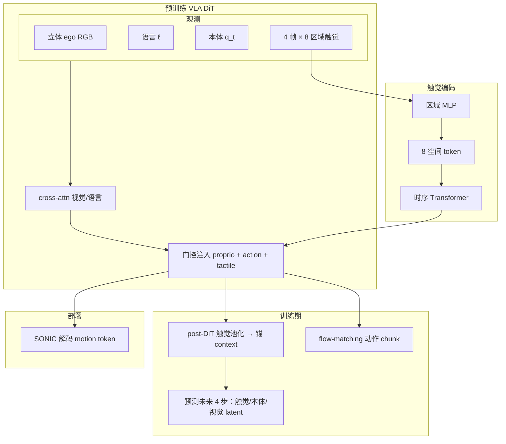

# Uni-VLaT（arXiv:2609.35450）

**Uni-VLaT**（*Whole-Body Tactile Adaptation of VLA Policies for Humanoid Loco-Manipulation*，[arXiv:2609.35450](https://arxiv.org/abs/2609.35450)，[项目页](https://uni-vlat.github.io/)）在 **预训练人形 VLA** 上增加 **分布式全身触觉** 与 **训练期多模态未来表征预测**：触觉 token 经 DiT 与视觉/语言/本体/动作交互后，作为 **物理锚** 预测未来触觉、本体与视觉 latent，部署时去掉预测头，经 **SONIC** 解码 **64-D motion token** 做全身 loco-manipulation。

## 一句话定义

**用触觉当「接触发生在哪、身体如何响应、场景如何变」的锚点**，把预训练 VLA 从「只看与动」扩展到 **接触丰富全身交互**。

## 英文缩写速查

| 缩写 | 英文全称 | 简要说明 |
|------|----------|----------|
| VLA | Vision-Language-Action | 视觉-语言-动作策略 |
| DiT | Diffusion Transformer | 动作 flow-matching 主干；触觉门控注入 |
| SONIC | Scalable Online Neural Interface Controller | 低层 64-D latent → 全身 joint PD |
| EMA | Exponential Moving Average | 触觉/本体 target encoder |
| G1 | Unitree G1 Humanoid | 五任务真机平台 |

## 为什么重要

- **补 VLA 接触盲区：** [VLA](../methods/vla.md) 与 [loco-manipulation](../tasks/loco-manipulation.md) 主流仍 **视觉+本体**；遮挡背触、负载变化、人机拥抱等需 **空间解析触觉**。
- **相对「只加触觉输入」：** 仅 concat 触觉 **68%** 均值，加 **三模态未来预测** 到 **75%** — 预测目标强制 **接触–本体–场景** 耦合。
- **相对 WT-UMI / HTD：** [WT-UMI](./paper-loco-manip-07-wt-umi.md) 偏示范接口与力监督规划；Uni-VLaT 明确 **冻结 VLA 语义先验 + post-train 适配**。
- **跨 backbone：** Isaac-GR00T 与 π0.5 上 **Table Sweeping / Back-Tap** 均显著提升。

## 核心信息

| 项 | 内容 |
|----|------|
| **机构** | 清华大学；北京航空航天大学；中国传媒大学；香港大学 等 |
| **arXiv** | [2609.35450](https://arxiv.org/abs/2609.35450) |
| **项目页** | <https://uni-vlat.github.io/> |
| **平台** | Unitree G1；SONIC Protocol v4 |
| **开源状态** | **截至 2026-09-30 未开源**（项目页无 GitHub；Anonymous 页） |

## 流程总览

## 核心原理

1. **触觉几何：** 8 区域（胸、背、肩、上背、双臂）；区域 MLP → 8 可学习 query 聚合 → 轴向池化降 **袖套旋转** 敏感。
2. **注入点：** 学习标量 **gate** 缩放 tactile token，与 proprio、noisy action 一并进 DiT；视觉/语言仍 cross-attention。
3. **预测：** **post-DiT** contextualized tactile 池化为锚；三头预测 **绝对** 未来 latent（非 delta — 消融 delta 均值 **35%**）。
4. **动作空间：** \(H_A=40\) chunk，每步 64-D SONIC motion token；低层 **冻结** SONIC 解码为 \(q^{\mathrm{des}}\)。

## 源码运行时序图

**不适用** — 截至 **2026-09-30** 项目页与论文均未提供官方训练/部署仓库。

## 工程实践

| 检查项 | 建议 |
|--------|------|
| 数据规模 | 主实验 **50 demos/任务**；扩任务需评估触觉标定漂移 |
| 安全 | from-scratch DP 同接口输出被 **部署安全拒绝** — 触觉适配仍须关节限位与人机协议 |
| 预测头 | 部署 **移除** 预测器与 EMA encoder — 仅留 tactile 编码与 DiT |
| backbone | GR00T / π0.5 **共享** 适配 recipe；Back-Tap 上 **有触觉即 85%+** |
| 仿真 | 作者承认 **缺大规模触觉 sim** — 鲁棒性主要靠真机五任务 |

## 实验与评测读法

- **主表（GR00T）：** 平均 **75%** vs No Tactile **32%**、Tactile w/o Pred. **68%**、仅触觉预测 **69%**。
- **Basket Loading：** 负载变化 — Uni-VLaT 接触响应 **低于** No Tactile 的「一旦撑住就高接触」模式（页内 ADC 曲线）。
- **消融：** post-DiT 锚 **80%** vs pre-DiT **55%** — **上下文化 tactile** 是预测有效前提。
- **π0.5：** Table Sweeping **30→60%**；Back-Tap **0→90%**。

## 与其他工作对比

| 维度 | Uni-VLaT | 对照 |
|------|-------------|------|
| 触觉如何进策略 | 8 区域全身触觉 token 门控注入预训练 VLA 的 DiT，训练期预测未来触觉 / 本体 / 视觉 latent | [WT-UMI](./paper-loco-manip-07-wt-umi.md)：全身触觉图像与接触力训练力监督 planner，再由触觉 admittance controller 闭环执行 |
| 触觉的使用时机 | 触觉当物理锚，post-DiT 池化后做多模态未来预测；部署去掉预测头 | [DeCAL](./paper-decal.md)：接触感知门控决定何时信触觉，并用视触 latent co-imagination 补视觉看不见的动力学 |
| 平台与动作空间 | 人形 G1 全身 loco-manipulation，SONIC 解码 64-D motion token | [DeCAL](./paper-decal.md)：面向灵巧操作 VLA，MoT 分专家做理解 / 想象 / 动作 |
| 是否用触觉 | 分布式全身触觉 + 视觉 / 语言 / 本体 | [TANGO](./paper-tango-vla.md)：全身 VLA 语言导航，监督在仿真合成（路径规划→全身运动→RL tracking），不涉及触觉 |

## 结论

**Uni-VLaT 表明：全身触觉适配预训练 VLA 的关键不仅是多一路传感器，而是 tactile-anchored 的多模态未来表征监督。**

1. **+43 pt（32→75）** 相对无触觉 — 接触触发 locomotion（Back-Tap）与负载任务（Basket）收益最大。
2. **绝对 future target** 优于 delta — 持久接触与体状态不可丢。
3. **post-DiT 预测** 优于 pre-DiT — 触觉须先与任务语义对齐再预测物理演化。
4. **双 backbone** 验证 — 适配层可复用在 GR00T 与 π0.5，而非单模型 overfit。
5. **代码未发布** — 复现依赖后续仓库；SONIC + G1 硬件门槛高。

## 局限与风险

- **传感器域：** taxel 噪声与安装 variation；跨机器人迁移未充分展开。
- **任务覆盖：** 五类代表性 loco-manip；非通用 VLA 替换。
- **双盲页：** 机构与代码链待论文定稿后更新 — ingest 以 arXiv + 项目页为准。

## 关联页面

- [VLA](../methods/vla.md)
- [Loco-Manipulation](../tasks/loco-manipulation.md)
- [Whole-Body Control](../concepts/whole-body-control.md)
- [WT-UMI](./paper-loco-manip-07-wt-umi.md)
- [DeCAL](./paper-decal.md)
- [Unitree G1](./unitree-g1.md)

## 参考来源

- [uni_vlat_arxiv_2609_35450.md](../../sources/papers/uni_vlat_arxiv_2609_35450.md)
- [uni-vlat-github-io.md](../../sources/sites/uni-vlat-github-io.md)
- [arXiv:2609.35450](https://arxiv.org/abs/2609.35450)

## 推荐继续阅读

- [Uni-VLaT 项目页](https://uni-vlat.github.io/)
- [SONIC 相关 loco-manip 栈](./paper-notebook-architecture-is-all-you-need-diversity-enabled-s.md)
