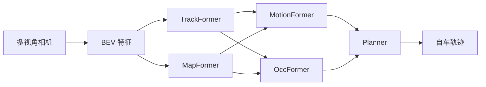
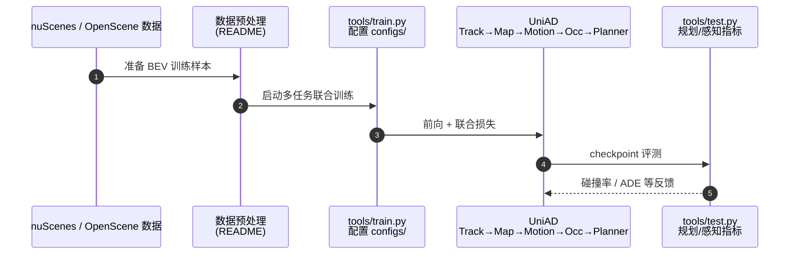

# UniAD（Planning-oriented Autonomous Driving · arXiv:2212.10156）

**UniAD**（*Planning-oriented Autonomous Driving*，[2212.10156](https://arxiv.org/abs/2212.10156)，CVPR 2023 Best Paper）由 **自动驾驶开放实验室（OpenDriveLab）；武汉大学（WHU）；商汤科技（SenseTime）** 提出，收录于深蓝AI《端到端自动驾驶：十大前沿算法盘点》**规划导向** 线索代表作。

## 一句话定义

以规划为优化中心，把多视角相机 BEV 上的 Track/Map/Motion/Occ 与 Planner 串成可解释端到端管线。

## 英文缩写速查

| 缩写 | 英文全称 | 简要说明 |
|------|----------|----------|
| UniAD | Unified Autonomous Driving | 规划导向端到端统一框架 |
| BEV | Bird's-Eye View | 鸟瞰特征空间 |
| E2E | End-to-End | 传感器到轨迹的联合学习 |
| Occ | Occupancy | 占用栅格/网格预测 |
| ADE | Average Displacement Error | 轨迹位移误差 |

## 为什么重要

- 首次把感知、预测与规划在同一网络里按「服务规划」目标联合优化，直接回应模块化栈的累积误差与目标不对齐。
- CVPR 2023 Best Paper，成为后续向量化 / 稀疏化 / 并行 Transformer 路线的共同参照基线。
- 保留中间可解释表征（agent、地图、占用、轨迹），证明端到端不必等于不可审计黑盒。

## 核心信息

| 字段 | 内容 |
|------|------|
| **机构** | 自动驾驶开放实验室（OpenDriveLab）；武汉大学（WHU）；商汤科技（SenseTime） |
| **arXiv** | [2212.10156](https://arxiv.org/abs/2212.10156) |
| Venue | CVPR 2023 Best Paper |
| **演进线索** | 规划导向 |
| **开源** | **已开源** — [`OpenDriveLab/UniAD`](https://github.com/OpenDriveLab/UniAD) |
| **指标索引** | nuScenes 多子任务 SOTA；文内/盘点称规划平均碰撞率约 **0.29%**（以原论文表为准）。 |

## 核心原理

### 五模块串联（规划导向）

| 模块 | 角色 |
|------|------|
| **TrackFormer** | 生成并跟踪交通参与者（Agent） |
| **MapFormer** | 在线构建道路结构 |
| **MotionFormer** | 预测各参与者未来轨迹 |
| **OccFormer** | 场景占用网格，服务碰撞约束 |
| **Planner** | 综合以上输出自车安全轨迹 |

仅多视角相机 → BEV 特征空间；各 Transformer 模块共享规划导向的联合损失，而不是各自刷检测/分割榜。

### 流程总览

## 源码运行时序图

关键复现路径：官方 [`OpenDriveLab/UniAD`](https://github.com/OpenDriveLab/UniAD) README 的 install → data → train/test 入口。

## 实验与评测

| 维度 | 记录 |
|------|------|
| 数据集 | nuScenes（开环） |
| 传感 | 多视角相机（无 LiDAR） |
| 报告点 | 多任务感知 + 规划；盘点称平均碰撞率约 **0.29%** |
| 对照定位 | 模块化级联与早期 E2E 多任务头 |

定量以原论文表为准；本页保留策展量级便于选型对照。

## 与相邻路线对比

| 路线 | 相对 UniAD | 取舍 |
|------|------------|------|
| [VAD](./paper-vad-vectorized-scene.md) | 用向量化减栅格成本 | 仍可能依赖稠密特征底 |
| [SparseDrive](./paper-sparsedrive.md) | 彻底稀疏实例 | 召回失败更致命 |
| [DriveTransformer](./paper-drivetransformer.md) | 打破级联并行 | 统一块调参更复杂 |
| 模块化栈专辑 | 分工清晰可解释 | 累积误差与目标不对齐 |

## 工程实践

| 维度 | 记录 |
|------|------|
| 典型评测 | nuScenes / NAVSIM / Bench2Drive / Waymo Open（依论文） |
| 开源状态 | **已开源** — [`OpenDriveLab/UniAD`](https://github.com/OpenDriveLab/UniAD) |
| 复现入口 | https://github.com/OpenDriveLab/UniAD |
| 工程关注点 | 延迟、帧间一致性、可解释中间量表征、与模块化栈的接口 |

## 局限与风险

- 内部仍是感知→预测→规划级联，误差可沿模块传播（DriveTransformer 针对此点并行化）。
- 底层仍依赖稠密 BEV，车端算力与延迟压力大（VAD/SparseDrive 后续稀疏化）。
- 开环 nuScenes 指标不能直接等同闭环/量产安全性。

## 关联页面

- [e2e-autonomous-driving-top10-algorithms](../overview/e2e-autonomous-driving-top10-algorithms.md) — 十大盘点父节点
- [自动驾驶核心算法盘点专辑](../overview/autonomous-driving-core-algorithms-series.md) — 模块化栈姊妹篇
- [生成式世界模型](../methods/generative-world-models.md)
- [S²-VLA](./paper-s-squared-vla.md) — 驾驶 VLA / NAVSIM 对照
- [M⁴World](./paper-m4world.md) — 驾驶世界模型后继
- [VLA](../methods/vla.md)

## 参考来源

- [深蓝AI：端到端自动驾驶十大前沿算法盘点](../../sources/blogs/wechat_shenlan_ai_ad_e2e_top10.md)
- [e2e_ad_uniad.md](../../sources/papers/e2e_ad_uniad.md) — 论文 source
- arXiv: [2212.10156](https://arxiv.org/abs/2212.10156)
- [repos/opendrivelab_uniad.md](../../sources/repos/opendrivelab_uniad.md)
- [sites/opendrivelab-uniad.md](../../sources/sites/opendrivelab-uniad.md)

## 推荐继续阅读

- 论文 PDF：<https://arxiv.org/pdf/2212.10156.pdf>
- 官方代码：<https://github.com/OpenDriveLab/UniAD>
- 项目页/博客：<https://opendrivelab.github.io/UniAD/>
