# 统一流体-机器人多物理可微仿真（Realizing Robotic Swimming with Unified Fluid-Robot Multiphysics）

**Unified Fluid-Robot Multiphysics**（*Realizing Robotic Swimming with Unified Fluid-Robot Multiphysics*，[arXiv:2506.05012](https://arxiv.org/abs/2506.05012)，CMU Majidi Lab / Manchester Group，[项目页](https://unified-fluid-robot-multiphysics.github.io/)，[代码 Aquarium.jl](https://github.com/RoboticExplorationLab/Aquarium.jl)，**RSS 2026 Finalist**）提出从 **单一 Lagrangian 框架** 同时推导耦合 **多体刚/柔体动力学** 与 **不可压缩 Navier-Stokes 流体方程** 的 **可微统一多物理仿真器**，用于优化水下机器人（柔性鱼型、机械臂游泳体）的波动游泳与 C-start 动作，实现约 **75% 更低轨迹误差** 相比粒子-流体基线，并成功迁移到真机硬件。

## 一句话定义

**从单一 Lagrangian 推导耦合刚/柔体 + 不可压缩 Navier-Stokes 的可微多物理仿真器——梯度穿透流体-机器人边界，直接优化游泳轨迹并迁移到真机。**

## 英文缩写速查

| 缩写 | 英文全称 | 简要说明 |
|------|----------|----------|
| NS | Navier-Stokes | 不可压缩流体动力学方程；仿真流体部分的核心方程 |
| FSI | Fluid-Structure Interaction | 流固耦合；机器人体与周围流体的双向动力学耦合 |
| MBD | Multibody Dynamics | 多体动力学；刚/柔体链式系统建模 |
| FEM | Finite Element Method | 有限元方法；离散化流体域或柔性体的常用方法 |
| AJF | Aquarium.jl Framework | 本文 Julia 开源仿真框架：Aquarium.jl |
| SPH | Smoothed Particle Hydrodynamics | 平滑粒子流体动力学；对比基线之一 |
| RSS | Robotics: Science and Systems | 本文投稿顶会；2026 年度 Finalist |
| DOF | Degree of Freedom | 自由度；多体系统关节数 |

## 为什么重要

- **水下机器人仿真的根本挑战：** 游泳机器人（鱼型、鳐型等）的运动性能深度依赖机体与流体的双向耦合——传统做法要么单独建模刚体（忽略流体），要么用粒子流体（SPH）近似，两者均丧失精确的流体力反馈，优化效果有限。
- **统一可微框架的系统价值：** 从单一 Lagrangian 推导意味着流体-机体梯度连续可穿透，优化器（如轨迹优化、直接微分策略梯度）可以 **无间隙地** 从末端运动目标反传到初始控制序列，无需链式近似。
- **性能验证：** 约 75% 更低轨迹误差比粒子-流体基线，在波动游泳（undulatory swimming）与逃逸动作（C-start）两个有代表性的水下运动任务上均显示。
- **开源 Julia 生态：** [Aquarium.jl](https://github.com/RoboticExplorationLab/Aquarium.jl) 已公开，代码基于 Julia 的自动微分生态（Zygote 等），可直接与 [RoboticExplorationLab](https://github.com/RoboticExplorationLab) 的其他优化工具组合。

## 核心原理与方法

### 单一 Lagrangian 耦合推导

传统流固耦合通常通过边界条件在两个独立求解器之间迭代交换力与速度，导致计算耦合松散、梯度不连续。本文从 **单一广义坐标 Lagrangian** 出发：

$$L = T_{\text{robot}} + T_{\text{fluid}} - V_{\text{robot}} - \Phi_{\text{fluid}}$$

其中 $T_{\text{robot}}, T_{\text{fluid}}$ 为刚/柔体与流体的动能，$V_{\text{robot}}$ 为关节势能，$\Phi_{\text{fluid}}$ 为流体约束势。通过变分推导 Euler-Lagrange 方程，**同时得到**：
- 多体刚体（关节链式）+ 柔性体运动方程
- 不可压缩 NS 流体方程
- 流体-机体耦合边界条件（自然嵌入，无需显式迭代）

整个推导保证可微性，梯度通过整个系统（流体 + 机体）回传。

### 系统流程

```mermaid
flowchart TB
  subgraph sim["Aquarium.jl 可微仿真器"]
    I["控制序列 u(t)\n（关节力矩 / 驱动频率）"]
    MB["多体动力学求解\n（刚/柔体关节链）"]
    NS["不可压缩 NS 流体求解\n（离散化流体域）"]
    FSI["流固耦合边界\n（自动从 Lagrangian 导出）"]
    I --> MB
    MB <--> FSI
    NS <--> FSI
  end
  subgraph opt["轨迹优化"]
    Cost["目标函数\n（游泳速度、C-start 距离等）"]
    Grad["可微反传\n∂Cost/∂u（穿越 FSI）"]
    Update["控制参数更新"]
    Cost --> Grad --> Update --> I
  end
  subgraph hw["真机迁移"]
    Robot["柔性鱼型 / 机械游泳体"]
    Transfer["仿真优化控制序列\n直接迁移"]
    Update --> Transfer --> Robot
  end
```



## 评测任务与基线对比

| 任务 | 说明 | 关键指标 |
|------|------|----------|
| 波动游泳（Undulatory Swimming） | 鱼型机体通过身体波动推进 | 游泳速度、轨迹误差 |
| C-start | 快速逃逸机动（C 形身体弯曲后急速推进） | 轨迹误差、加速度 |

对比基线：SPH 粒子-流体仿真；本文约 **75% 更低轨迹误差**。

## 工程实践

### 源码开放状态

[RoboticExplorationLab/Aquarium.jl](https://github.com/RoboticExplorationLab/Aquarium.jl) 已**公开发布**，Julia 语言实现，依赖 Julia 自动微分生态。

### 源码运行时序图

```mermaid
sequenceDiagram
  autonumber
  participant U as 用户
  participant Env as environment.jl<br>（机器人 + 流体场景定义）
  participant Sim as aquarium_sim.jl<br>（可微仿真步进）
  participant Opt as trajectory_opt.jl<br>（轨迹优化）
  participant HW as 真机接口<br>（硬件控制）

  U->>Env: 定义机器人几何、流体域参数
  U->>Opt: 设置任务目标（游泳速度、C-start）
  Opt->>Sim: 调用前向仿真 rollout(u)
  Sim->>Sim: 多体 + NS 联合步进（Lagrangian 框架）
  Sim->>Opt: 返回轨迹 τ 与 cost
  Opt->>Opt: Zygote 自动微分 ∂cost/∂u
  Opt->>Opt: 梯度下降/二阶优化更新 u
  Opt-->>Sim: 迭代直至收敛
  Opt->>HW: 输出优化控制序列
  HW->>HW: 直接执行（无额外微调）
```

关键复现路径：`Pkg.add("Aquarium")` → 参照 README 设置机器人场景 → 调用 `optimize_trajectory()` → 真机部署控制序列。

### 硬件平台

- **柔性鱼型机器人** / 铰接多体游泳机械结构
- 仿真优化控制序列**直接迁移**到真机，无需额外真机微调（论文验证）

### 环境依赖

- Julia 1.9+
- 自动微分：Zygote.jl
- 线性代数：LinearAlgebra（标准库）
- 可与 [RoboticExplorationLab](https://github.com/RoboticExplorationLab) 其他 Julia 工具（TrajectoryOptimization.jl 等）组合

## 局限与风险

- **计算成本：** 完整 NS 流体求解比简化流体模型（resistive force theory、blade element 等）计算代价高，长 horizon 优化需适当网格分辨率权衡。
- **Julia 生态门槛：** 与 Python/C++ 主流机器人工具链集成需额外工程，非 Julia 用户有学习曲线。
- **流体网格分辨率依赖：** 低分辨率网格可能丢失关键流涡结构，影响优化质量；高分辨率则内存/计算开销显著增加。
- **仅水下场景验证：** 当前框架针对不可压缩水下运动；气动（空中飞行）场景需额外扩展（可压缩 NS 等）。
- **柔性体建模精度：** 柔性/软体机器人的材料参数（弹性模量等）仍需实验标定，参数误差影响 sim2real 精度。

## 关联页面

- [Locomotion（运动任务）](../tasks/locomotion.md) — 游泳作为水下运动任务的代表
- [Sim2Real](../concepts/sim2real.md) — 可微多物理仿真的 sim2real 精度与真机迁移
- [Differentiable Simulation（可微仿真）](../concepts/differentiable-simulation.md) — Aquarium.jl 是可微仿真在流固耦合领域的典型案例

## 参考来源

- [量子位：RSS 2026 三项最佳论文报道](../../sources/blogs/wechat_qbitai_rss2026_awards_2026-07-16.md)
- [Unified Fluid-Robot Multiphysics 论文摘录（arXiv:2506.05012）](../../sources/papers/unified_fluid_robot_multiphysics_arxiv_2506_05012.md)
- [项目页归档](../../sources/sites/unified-fluid-robot-multiphysics-github-io.md)
- [Aquarium.jl 代码仓库](../../sources/repos/aquarium-jl.md)

## 推荐继续阅读

- [arXiv:2506.05012](https://arxiv.org/abs/2506.05012) — 原始论文（PDF + HTML）
- [项目页与演示视频](https://unified-fluid-robot-multiphysics.github.io/) — 波动游泳与 C-start 动作演示
- [Aquarium.jl GitHub](https://github.com/RoboticExplorationLab/Aquarium.jl) — Julia 可微流固仿真框架
- [Differentiable Simulation 概念页](../concepts/differentiable-simulation.md) — 可微仿真在机器人领域的系统归纳
