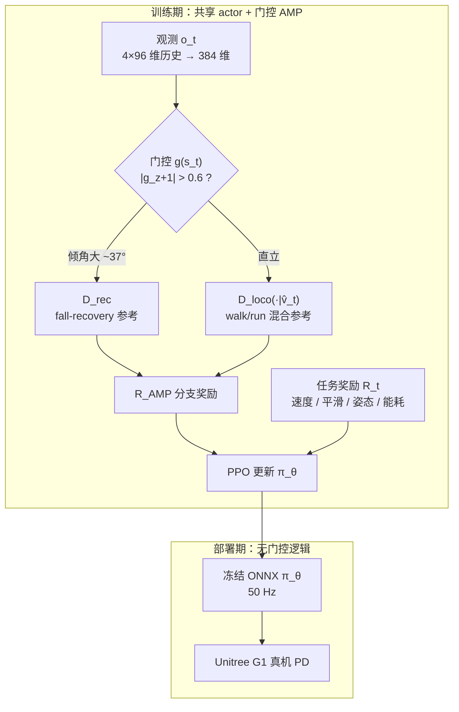

# SD-AMP：统一走、跑与起身的对抗运动先验

**State-Dependent Adversarial Motion Priors（SD-AMP）** 是香港大学团队提出的统一人形控制框架（arXiv:2605.18611）：在 **Unitree G1** 上用**单一 RL 策略**覆盖行走、跑步与跌倒恢复，真机验证且**部署期无需显式模式命令**。核心是把经典 [AMP](../methods/amp-reward.md) 的全局参考分布换成**训练期状态门控**，使风格正则始终与当前行为 regime 一致。

## 英文缩写速查

| 缩写 | 英文全称 | 简要说明 |
|------|----------|----------|
| Sim2Real | Simulation to Real | 把仿真中学到的策略迁移落地真机的工程主线 |
| AMP | Adversarial Motion Prior | 用对抗判别约束状态转移接近专家运动分布的先验 |
| G1 | Unitree G1 Humanoid | 宇树入门级教育科研人形平台 |
| ONNX | Open Neural Network Exchange | 跨框架神经网络模型交换格式 |
| RL | Reinforcement Learning | 通过与环境交互最大化长期回报来学习策略的范式 |
| Locomotion | Robot Locomotion | 足式/人形等无轮移动能力的总称 |
| PD | Proportional–Derivative | 关节位置/阻抗底层控制，策略输出常为其 setpoint |
| Isaac Lab | NVIDIA Isaac Lab | 基于 Omniverse 的机器人学习训练框架 |
| PPO | Proximal Policy Optimization | 人形/足式 locomotion 中最常用的 on-policy 策略梯度算法 |
| MoCap | Motion Capture | 动作捕捉，参考动作与演示数据的主要来源 |

## 为什么重要

- **少参考、多行为：** 仅 **3 条 LAFAN1** retarget 片段（walk / run / fallAndGetUp）即可正则化完整行为集，说明 **recovery 与 locomotion 先验的结构分离** 有时比参考多样性更关键。
- **消灭部署 FSM：** 与模块化「走控 + 跑控 + 起身控 + 手调切换」相比，硬件 rollout 展示 **recovery → walk → run** 连续序列，同一冻结 ONNX（50 Hz）。
- **与工程线对照：** [AMP_mjlab](./amp-mjlab.md) 在 mjlab 上用统一判别器 + 分区参考；本文用**双判别器 + 固定重力阈值**，理论化「何时用哪种 prior」。
- **与 Heracles 互补：** [Heracles](./paper-heracles-humanoid-diffusion.md) 用扩散中间件改参考；本文在 **单策略 AMP+RL** 内解决问题——选型见 [人形运动跟踪方法选型](../queries/humanoid-motion-tracking-method-selection.md)。

## 流程总览

## 核心机制（归纳）

### 1）双判别器 + 速度条件 locomotion

- **Recovery 判别器** $D_\phi^{\mathrm{rec}}$：只吃跌倒–起身转移。
- **Locomotion 判别器** $D_\phi^{\mathrm{loco}}(s_t,s_{t+1}\mid \hat{v}_t)$：$\hat{v}_t=\min(v_x^{\mathrm{cmd}}/v_{\max},1)$，参考采样以 $(1-\hat{v}_t)$ / $\hat{v}_t$ 在 walk / run clip 间混合——**单网络覆盖全速域**，无需 walk/run 两套判别器。

### 2）固定重力门控（仅训练期）

$$
z_t = \begin{cases}
\mathrm{rec} & |g_z+1|>0.6 \\
\mathrm{loco} & \text{otherwise}
\end{cases}
$$

$g_z$ 为投影重力 $z$ 分量；阈值落在经验分布低占用区，作者强调**无需学习门控**。跌倒态转移在训练中持续路由到 $D^{\mathrm{rec}}$，故**无需单独 recovery 训练阶段**。

### 3）观测、训练与真机

- **动作：** 29 维关节目标位置 + PD；与 [AMP_mjlab](./amp-mjlab.md) 同类接口叙事。
- **仿真：** Isaac Lab + PPO，$\lambda_{\mathrm{amp}}=0.5$。
- **速度域：** 正常模式约 $[-0.5,1.0]$ m/s；快速模式（操作员启用）约 $[-1.5,3.0]$ m/s——后者为**安全相关显式操作**，非行为 mode ID。

## 常见误区

1. **门控在部署运行：** 式 (5) 仅用于**训练时选判别器**；推理时策略已内化，不读 $g_z$ 做切换。
2. **三条参考 = 能力上限：** 论文主张的是**先验分离**而非 MoCap 规模；换平台仍需 retarget 与任务奖励调参。
3. **SD-AMP = Selective AMP：** [Selective AMP](../../sources/papers/multi-gait-learning.md) 按**步态周期 vs 高动态**决定是否加 AMP；本文按**机体是否跌倒**切换**不同判别器**。

## 实验与评测

- 量化指标、消融与 sim2real / 实机结果见 **原文 PDF** 与 [参考来源](#参考来源)；本页正文侧重方法结构与知识库交叉引用。

## 与其他工作对比

- 正文已给出与相邻路线 / baseline 的 **定性对照**；定量表格与 ablation 见原文（[参考来源](#参考来源)）。
- **[HoST](./paper-host-humanoid-standingup.md)（arXiv:2502.08378）** 专注**无 MoCap 的纯起身**与**墙/台/坡等非地面初始姿态**；SD-AMP 则用 **AMP 先验**把 **locomotion + recovery** 压进**单策略**。二者可组合理解：HoST 提供「站起来」子技能，SD-AMP 提供「站起来后继续走跑」的统一 prior。

## 参考来源

- [Unified Walking, Running, and Recovery…（arXiv:2605.18611）](../../sources/papers/unified_walk_run_recovery_sdamp_arxiv_2605_18611.md)
- Peng et al., *AMP: Adversarial Motion Priors* (2021) — 方法基线
- Harvey et al., *LAFAN1* (2020) — 三条参考动作来源
- [SPRINT（arXiv:2605.28549）](../../sources/papers/sprint_arxiv_2605_28549.md) — 五条 LAFAN1 参考 + 频谱先验，G1 冲刺 6 m/s

## 关联页面

- [AMP & HumanX](../methods/amp-reward.md)、[Locomotion](../tasks/locomotion.md)、[Balance Recovery](../tasks/balance-recovery.md)
- [Unitree G1](./unitree-g1.md)、[AMP_mjlab](./amp-mjlab.md)、[LAFAN1](./lafan1-dataset.md)
- [Heracles](./paper-heracles-humanoid-diffusion.md)、[SPRINT](./paper-sprint-humanoid-athletic-sprints.md)、[人形运动跟踪方法选型](../queries/humanoid-motion-tracking-method-selection.md)

## 推荐继续阅读

- [arXiv:2605.18611 HTML](https://arxiv.org/html/2605.18611v1) — 方法细节与硬件 Fig.2
- [AMP 项目页](https://xbpeng.com/projects/AMP/index.html) — 对抗运动先验背景
- [Isaac Lab 文档](https://isaac-sim.github.io/IsaacLab/) — 论文训练环境
