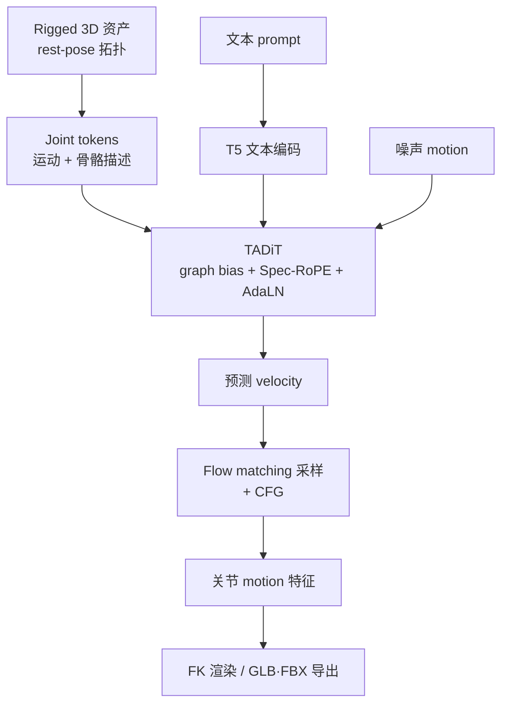
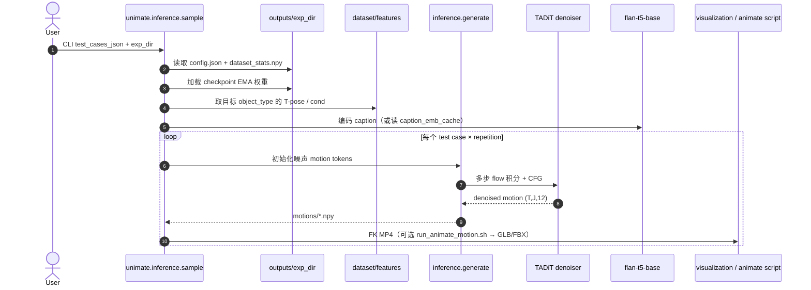

# UniMate：跨拓扑骨骼的统一文本驱动动画基础模型

**UniMate**（*One Unified Model to Animate Diverse Skeletons*，[arXiv:2609.05415](https://arxiv.org/abs/2609.05415)，**SIGGRAPH Asia 2026**，[项目页](https://linzhanmou.com/unimate/)）由 **Linzhan Mou**（普林斯顿）、**Jiahui Lei**（伯克利）、**Zhiyang Dou**（MIT）等提出：在 **已 rig 的 3D 资产** 与 **自然语言 prompt** 条件下，**单一 feed-forward 模型** 为 biped / quadruped / avian / marine / insect / serpentine / articulated rigid 等 **异构骨骼** 合成时序连贯动作，**无需 per-skeleton 微调或 test-time optimization**。

## 一句话定义

**把骨骼拓扑显式写进扩散 Transformer 的注意力与位置编码（TADiT），在 UniML3D 上联合训练后，任意 rig + 文本即可一次前向出动画——面向内容管线，不是 SMPL 模板人体 T2M 的简单换皮。**

## 英文缩写速查

| 缩写 | 英文全称 | 简要说明 |
|------|----------|----------|
| UniMate | One Unified Model to Animate Diverse Skeletons | 本文跨拓扑动画基础模型 |
| TADiT | Topology-Aware Diffusion Transformer | 图偏置注意力 + Spec-RoPE + 拓扑 AdaLN 的去噪骨干 |
| Spec-RoPE | Spectral Rotary Position Embedding | 由图 Laplacian 谱推广 RoPE，适配可变关节数/连通性 |
| UniML3D | UniMate 3D Motion Dataset | 13,006 文本配对序列，多源统一 canonicalization |
| CFG | Classifier-Free Guidance | 训练时随机 drop 条件；采样时条件/无条件插值 |
| FK | Forward Kinematics | 由关节旋转恢复骨架/网格姿态（推理可视化与导出） |
| LBS | Linear Blend Skinning | 游戏/仿真管线常用的 rig 驱动方式；与骨骼输出天然兼容 |
| T2M | Text-to-Motion | 文本条件运动生成；本文条件含 **目标 skeleton 拓扑** |

## 为什么重要

- **补 rigging 之后的一环：** 自动 rig 已规模化（项目页与论文 §1），**驱动 motion** 仍是内容管线瓶颈；UniMate 对准「任意 rig 进来就能动」。
- **拓扑不再是 hidden prior：** 相对 HumanML3D/SMPL 系 T2M，**关节数、树结构、物种形态** 作为 **显式 conditioning**，支持 **零样本 cross-topology**（同一 prompt 换 rig）。
- **数据与表示一并给出：** UniML3D + 16 步清洗/标注/canonicalize 管线开源，利于复现与扩展新物种。
- **与机器人 Sim 的接口：** 输出是 **骨骼关节轨迹**（非逐顶点 unconstrained deformation），经 [GMR](../methods/motion-retargeting-gmr.md) 等可进入 **仿真角色/数字孪生**；但 **无物理/contact 约束**，勿当 WBC 参考直接上真机。
- **官方栈可跑：** [GitHub](https://github.com/Friedrich-M/UniMate) 释训练/推理；[HF 权重](https://huggingface.co/Linzhan/UniMate) preview 与论文配置对齐。

## 核心信息

| 字段 | 内容 |
|------|------|
| 作者 | Linzhan Mou、Jiahui Lei、Zhiyang Dou、Chenyue Cai、Chaoyue Song、Adam Finkelstein、Szymon Rusinkiewicz |
| 机构 | 普林斯顿大学（Princeton）；加州大学伯克利分校（Berkeley）；麻省理工学院（MIT）；南洋理工大学（NTU） |
| 出处 | SIGGRAPH Asia 2026；arXiv:2609.05415 |
| 输入 | Rest-pose / T-pose 骨骼拓扑 + 文本 prompt（+ 可选部分 joint 固定用于编辑） |
| 输出 | 固定窗口关节 motion 特征（训练默认 60 帧 @ 30 FPS 管线）；可导出 MP4 / `.npy` / GLB·FBX |
| 文本编码 | 默认 `google/flan-t5-base`（可预计算 embedding 缓存） |

## 核心方法结构

| 模块 | 作用 |
|------|------|
| **统一 skeleton/motion 表示** | 广度优先 joint 序；直径缩放；y-up 规范帧；相对 rest-pose 旋转；root 全局 / 其余局部归一化 |
| **Graph-aware attention bias** | 边类型、图距离、深度注入 self-attention，强化解剖邻接又不失长程协调 |
| **Spec-RoPE** | Laplacian 谱角上的 rotary 编码；置换 equivariance / 谱坐标平移不变性（论文命题） |
| **Global topological conditioner** | Rest-pose skeleton token attention-pool → **AdaLN-Zero** 调制各 block |
| **Flow matching 训练** | 线性插值路径上预测 velocity；masked L2 + geodesic rotation + velocity smoothness |
| **在线拓扑增广** | 加关节、删叶、链池化、骨长扰动 — 扩训练所见拓扑 |

### 流程总览

## 源码运行时序图

官方推理主路径（文本条件采样，对齐 [Friedrich-M/UniMate](https://github.com/Friedrich-M/UniMate) README）：

**关键复现路径：** 训练产物目录需含 `config.json` 与 `dataset_stats.npy`；与模型同源的 `dataset/features/<dataset>/` 必须存在以提供 skeleton conditioning。Released HF checkpoint 目录布局与本地 `outputs/<exp>/` 一致。

## UniML3D 与工程实践

| 项 | 内容 |
|----|------|
| **规模** | 13,006 clips，~20h；3,584 唯一文本 prompt |
| **来源** | Truebones ZOO、Mixamo、Objaverse-XL rigged animated |
| **处理** | 仓库 `data_process/`：下载 → 导出 → 渲染 → 多模态 caption → joint 命名/朝向 → NPZ 特征 |
| **HF** | [UniML3D](https://huggingface.co/datasets/Linzhan/UniML3D) 与分源子集；Truebones **动作包** 需向 Truebones 购买，仓库仅消费标准目录布局 |
| **训练** | `accelerate launch -m unimate.training.train --config configs/uniml3d_60frames_graph_adaln.json` |
| **推理** | `python -m unimate.inference.sample --exp_dir ... --test_cases_json ...` |
| **编辑 API** | `motion_inbetweening` / `motion_expansion` / `motion_editing`（固定 token 再采样） |
| **开源状态** | **已开源** — 见下节 |

### 开源状态（步骤 2.5，2026-09-30）

| 资源 | 状态 |
|------|------|
| arXiv / PDF | **已公开** |
| 项目页 | [linzhanmou.com/unimate](https://linzhanmou.com/unimate/) |
| **GitHub** | **已发布** — [Friedrich-M/UniMate](https://github.com/Friedrich-M/UniMate)（2026-09-06 训练/推理） |
| **权重** | **Preview** — [HF Linzhan/UniMate](https://huggingface.co/Linzhan/UniMate) |
| **数据** | **已发布**（含处理代码；Truebones 本体受限） |

## 评测与对比（归纳）

论文相对 **topology-constrained T2M**（SMPL/SMAL 模板）、**AnyTop**（无 text、inference 需目标 skeleton motion 估统计）、**mesh 顶点回归** 与 **per-asset distillation** 等基线，报告生成质量、跨拓扑泛化与 runtime；项目页以 qualitative + 交互 Demo 为主。机器人读者若关心 HumanML3D FID/R-Precision，应查 **人体专用** 模型（见 [Awesome T2M](./awesome-text-to-motion-zilize.md)），UniMate 指标定义在 **多拓扑 rig** 设定下。

| 对照 | 读法 |
|------|------|
| HumanML3D / SMPL T2M | 固定人体模板；UniMate 面向 **任意 rig 拓扑** |
| AnyTop | 联合训练动物 diffusion，但 **无 text** 且 inference 依赖目标 motion 统计 |
| GANimator / SinMDM | per-skeleton 模型，不跨拓扑共享权重 |
| 机器人 GMT / GenTrack | 机器人坐标 + 物理跟踪；UniMate 无 contact/平衡约束 |

## 主要能力与局限

**能力（论文 + 项目页）：**

- 单 prompt 多拓扑 / 单拓扑多 prompt / 同条件多样本。
- **零样本** in-betweening、分段 expansion、局部 joint 固定 + 新 prompt 编辑。
- 相对 AnyTop 等：**文本条件**、更广拓扑覆盖、inference **不需目标 skeleton 的 reference motion**（AnyTop 需 motion 估归一化统计）。

**局限：**

- **运动学生成：** 无地面接触、碰撞、动量约束；快速转身/跳跃可能物理不可信。
- **窗口长度：** 默认 60 帧 clip；长剧情靠 expansion 拼接，需人工验连贯性。
- **Objaverse 子集噪声：** README 警告 defective rig/clip 可致训练不稳定，需 skip list。
- **机器人落地：** 与 [HumanML3D](./paper-notebook-humanml3d.md) 系 T2M 一样，进 G1 等需 **重定向 + 跟踪/RL**；UniMate 强项在 **非常规拓扑**（多足/翼/关节物体），不是人形 loco-manip 专用。

## 结论

**UniMate 把「骨骼拓扑」从隐式模板里拉出来写进 DiT，在 UniML3D 上证明了跨物种/刚体 rig 的单模型 text 动画可行，并给出可复现的开源训练推理栈。**

1. **选型：** 需要 **任意 rig + 语言** 的内容动画 → 优先 UniMate；仅 SMPL 人体、HumanML3D 指标 → 仍看 [HY-Motion](../methods/hy-motion-1.md) / MoMask 系。
2. **复现：** 从 HF checkpoint + 官方 `configs/uniml3d_60frames_graph_adaln.json` 起；确保 `dataset/features` 与训练源一致。
3. **数据扩展：** 新物种走 `data_process/` 全管线，不要跳过 canonicalize（否则 cross-topology 统计漂移）。
4. **Sim/机器人：** 产出作 **视觉/仿真 populate** 或 **重定向参考**；物理可执行性需下游控制器验证。
5. **编辑工作流：** in-between / expansion 模块与主采样 **同一权重**，仅 mask 策略不同 — 部署时可共用服务。
6. **权重：** 当前为 **preview**；生产环境关注 HF 同步与 `dataset_stats.npy` 版本匹配。

## 关联页面

- [Diffusion-based Motion Generation](../methods/diffusion-motion-generation.md) — 机器人域扩散轨迹；对照「骨骼拓扑显式条件」
- [General Motion Retargeting（GMR）](../methods/motion-retargeting-gmr.md) — 动画骨骼 → 机器人执行参考
- [Skeleton-based Action Recognition](../methods/skeleton-action-recognition.md) — 异构骨架表示语境
- [Awesome Text-to-Motion（Zilize）](./awesome-text-to-motion-zilize.md) — 人体 T2M 索引；UniMate 为 **跨拓扑 rig** 扩展
- [HumanML3D](./paper-notebook-humanml3d.md) — 经典文本–人体运动基准对照

## 参考来源

- [unimate_arxiv_2609_05415.md](../../sources/papers/unimate_arxiv_2609_05415.md)
- [unimate-linzhanmou.md](../../sources/sites/unimate-linzhanmou.md)
- [unimate-friedrich-m.md](../../sources/repos/unimate-friedrich-m.md)

## 推荐继续阅读

- [项目页（含交互 Demo）](https://linzhanmou.com/unimate/)
- [GitHub: Friedrich-M/UniMate](https://github.com/Friedrich-M/UniMate)
- [Hugging Face: Linzhan/UniMate checkpoints](https://huggingface.co/Linzhan/UniMate)
- [arXiv PDF](https://arxiv.org/pdf/2609.05415)
