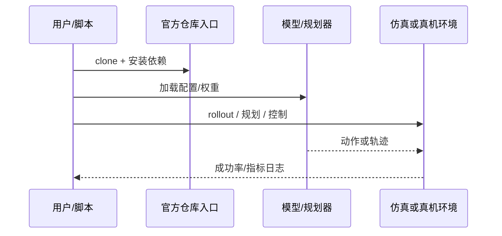

# UniMPA（arXiv:2609.11875）

**UniMPA**（[UniMPA: A Unified Memory-Prediction-Action Model via Action-Grounded Transition Modeling](https://arxiv.org/abs/2609.11875)）来自 [具身智能小站 14 篇盘点](../../sources/blogs/wechat_embodied_station_14_papers_dexterous_wm_humanoid_2026-09-11.md)。进度流 + 转移关键像素 + 视觉—动作记忆库统一记忆-预测-动作；LIBERO/RoboTwin 2.0/VLABench/双臂真机评测。

## 一句话定义

**用动作接地的转移建模，把未来预测与可执行动作原型绑定在同一记忆-预测-动作栈。**

## 英文缩写速查

| 缩写 | 英文全称 | 简要说明 |
|------|----------|----------|
| VLA | Vision-Language-Action | 视觉-语言-动作策略 |
| VLM | Vision-Language Model | 视觉-语言多模态模型 |
| WM | World Model | 预测未来观测或表征的动力学模型 |
| IL | Imitation Learning | 模仿学习 |
| RL | Reinforcement Learning | 强化学习 |
| DoF | Degrees of Freedom | 自由度 |

## 为什么重要

- 纳入本期 **灵巧手 / 世界模型 / 人形控制 / VLA** 主线之一。
- 开源状态：**已开源**（步骤 2.5 核查，2026-09-11）。
- 与 [14 篇技术地图](../overview/dexterous-wm-humanoid-14-papers-technology-map.md) 中同类工作可横向对照。

## 核心机制

| 项 | 内容 |
|----|------|
| **arXiv** | [2609.11875](https://arxiv.org/abs/2609.11875) |
| **项目页** | https://jiutian-vl.github.io/UniMPA-page/ |
| **代码/资源** | https://github.com/JiuTian-VL/UniMPA |
| **开源** | **已开源** |
| **文内指标** | LIBERO、RoboTwin 2.0、VLABench 与双臂真机套件评测。 |

## 源码运行时序图

## 实验与评测

| 项 | 文内口径 |
|----|----------|
| 要点 | LIBERO、RoboTwin 2.0、VLABench 与双臂真机套件评测。 |

- **读法：** 本页为索引级摘要，上表取自 [公众号盘点](../../sources/blogs/wechat_embodied_station_14_papers_dexterous_wm_humanoid_2026-09-11.md) 与项目页；具体对照方法、任务集与逐项指标以 **原文 PDF** 为准（[参考来源](#参考来源)）。

## 结论

**UniMPA 适合作为本期「已开源」边界下的快速索引页，部署前请核对仓库/README 可运行性。**

1. 核心贡献：用动作接地的转移建模，把未来预测与可执行动作原型绑定在同一记忆-预测-动作栈。
2. 开源结论：**已开源** — 以项目页实际链接为准（入库日 2026-09-11）。
3. 横向对照见 [14 篇技术地图](../overview/dexterous-wm-humanoid-14-papers-technology-map.md)，避免与同 arXiv 重复造页。

## 关联页面

- [14 篇技术地图](../overview/dexterous-wm-humanoid-14-papers-technology-map.md)
- [VLA（Vision-Language-Action）](../methods/vla.md)
- [Generative World Models](../methods/generative-world-models.md)
- [Manipulation](../tasks/manipulation.md)

## 参考来源

- [unimpa_arxiv_2609_11875.md](../../sources/papers/unimpa_arxiv_2609_11875.md)
- [wechat 14篇盘点](../../sources/blogs/wechat_embodied_station_14_papers_dexterous_wm_humanoid_2026-09-11.md)
- [arXiv:2609.11875](https://arxiv.org/abs/2609.11875)

## 推荐继续阅读

- [arXiv PDF](https://arxiv.org/pdf/2609.11875)
- [项目页/资源](https://jiutian-vl.github.io/UniMPA-page/)
- [代码/资源](https://github.com/JiuTian-VL/UniMPA)
