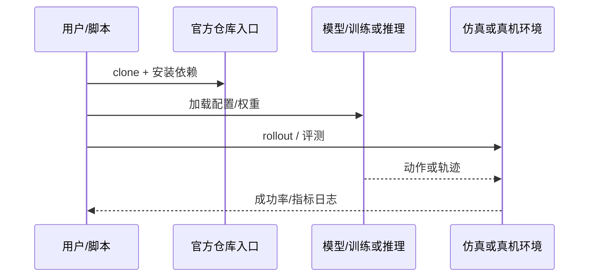

# UniPart（arXiv:2609.12898）

**UniPart**（[UniPart: Towards Zero-shot Language-Grounded 3D Part Segmentation for Embodied Interaction](https://arxiv.org/abs/2609.12898)）来自 [具身智能小站 11 篇 VLA/TAMP 盘点](../../sources/blogs/wechat_embodied_station_11_papers_vla_tamp_planning_2026-09-14.md)。精细操作需要定位可操作部件而非整物体；UniPart 用语言指向抽屉把手、杯盖边缘等部件。

## 一句话定义

**CLIP 文本条件化前馈 3D Transformer + LangPart-1M（8M 文本—部件对），面向开放词汇 3D 部件分割与语言条件抓取。。**

## 英文缩写速查

| 缩写 | 英文全称 | 简要说明 |
|------|----------|----------|
| VLA | Vision-Language-Action | 视觉-语言-动作策略 |
| VLM | Vision-Language Model | 视觉-语言多模态模型 |
| WM | World Model | 预测未来观测或表征的动力学模型 |
| TAMP | Task and Motion Planning | 任务与运动规划 |
| OOD | Out-of-Distribution | 分布外泛化评测 |

## 为什么重要

- 精细操作需要定位可操作部件而非整物体；UniPart 用语言指向抽屉把手、杯盖边缘等部件。
- 开源状态：**已开源**（步骤 2.5 核查，2026-09-14）。
- 与 [11 篇技术地图](../overview/vla-tamp-planning-11-papers-technology-map.md) 中同类工作可横向对照。

## 核心机制

| 项 | 内容 |
|----|------|
| **arXiv** | [2609.12898](https://arxiv.org/abs/2609.12898) |
| **项目页** | https://xinqiangyu.github.io/UniPart/ |
| **代码** | https://github.com/xinqiangyu/UniPart |
| **开源** | **已开源** |
| **文内指标** | 构建 LangPart-1M 数据集（8M 文本—部件对）；面向零样本语言接地 3D 部件分割。 |

## 源码运行时序图

## 实验与评测

| 项 | 文内口径 |
|----|----------|
| 要点 | 构建 LangPart-1M 数据集（8M 文本—部件对）；面向零样本语言接地 3D 部件分割。 |

- **读法：** 本页为索引级摘要，上表取自 [公众号盘点](../../sources/blogs/wechat_embodied_station_11_papers_vla_tamp_planning_2026-09-14.md) 与项目页；具体对照方法、任务集与逐项指标以 **原文 PDF** 为准。

## 结论

**UniPart 适合作为本期「已开源」边界下的快速索引页，部署前请核对项目页/仓库可运行性。**

1. 核心贡献：精细操作需要定位可操作部件而非整物体；UniPart 用语言指向抽屉把手、杯盖边缘等部件。
2. 开源结论：**已开源** — 以项目页实际链接为准（入库日 2026-09-14）。
3. 横向对照见 [11 篇技术地图](../overview/vla-tamp-planning-11-papers-technology-map.md)，避免与同 arXiv 重复造页。

## 关联页面

- [11 篇技术地图](../overview/vla-tamp-planning-11-papers-technology-map.md)
- [VLA（Vision-Language-Action）](../methods/vla.md)
- [Generative World Models](../methods/generative-world-models.md)
- [Manipulation](../tasks/manipulation.md)

## 参考来源

- [unipart_arxiv_2609_12898.md](../../sources/papers/unipart_arxiv_2609_12898.md)
- [wechat_embodied_station_11_papers_vla_tamp_planning_2026-09-14.md](../../sources/blogs/wechat_embodied_station_11_papers_vla_tamp_planning_2026-09-14.md)
- [arXiv:2609.12898](https://arxiv.org/abs/2609.12898)

## 推荐继续阅读

- [arXiv PDF](https://arxiv.org/pdf/2609.12898)
- [项目页](https://xinqiangyu.github.io/UniPart/)
- [https://github.com/xinqiangyu/UniPart](https://github.com/xinqiangyu/UniPart)
