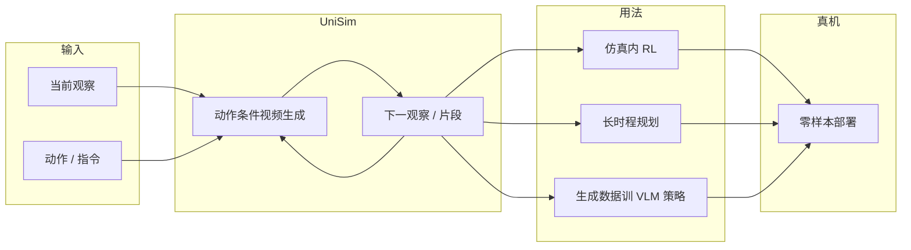

# UniSim（Learning Interactive Real-World Simulators）

**UniSim**（[arXiv:2310.06114](https://arxiv.org/abs/2310.06114)，2023，Sherry / Mengjiao Yang 等 · **加州大学伯克利分校（UC Berkeley）** / **谷歌 DeepMind（Google DeepMind）** / **麻省理工（MIT）**；[项目页](https://universal-simulator.github.io/unisim/)）学习 **可交互的真实世界模拟器**：以动作条件的视频生成做长时程闭环 rollout，使 RL 与规划可在仿真中完成后再 **零样本** 部署真机。

## 一句话定义

**用数据驱动的交互式视频模拟器代替昂贵真机试错：观察+动作→下一观察，支持长时程搜索、RL 与规划。**

## 英文缩写速查

| 缩写 | 英文全称 | 简要说明 |
|------|----------|----------|
| UniSim | Universal / Interactive Real-World Simulator | 本文交互式真实世界模拟器 |
| WM | World Model | 广义标签；本文输出以视频为主 |
| RL | Reinforcement Learning | 可在 UniSim 内纯仿真训练再迁真机 |
| VLM | Vision-Language Model | 可用模拟长视频训目标条件策略 |
| MPC | Model Predictive Control | 长时程仿真支撑的决策用法之一 |
| I2V | Image-to-Video | 动作条件视频生成的相关技术族 |

## 为什么重要

- **模拟器形态切换：** 相对 [World Models](./paper-ha-schmidhuber-world-models.md) / [PlaNet](./paper-planet-latent-dynamics.md) / [DreamerV3](./paper-shenlan-wm-13-dreamerv3.md) / [TD-MPC2](./paper-td-mpc2.md) 的 **低维 latent**，UniSim 把「世界变化」记成 **可检查的未来视频**。
- **真机闭环叙事：** 项目页强调仿真内 RL / 长时程规划 → 真机零样本，对齐虚拟沙盒路线。
- **保真度警示入口：** 策展文将其放入「未来图像/视频」族，并点明风险：**画面连续 ≠ 动力学正确**（见 [物理保真度输出轴](../overview/world-model-physics-fidelity-outputs.md)）。
- **工程现实：** 影响力大但 **官方代码未开**——选型时必须分开「论文能力」与「可复现资产」。

## 核心信息

| 字段 | 内容 |
|------|------|
| 论文 | Learning Interactive Real-World Simulators |
| arXiv | [2310.06114](https://arxiv.org/abs/2310.06114) |
| 作者 | Yang, Du, Ghasemipour, Tompson, Kaelbling, Schuurmans, Abbeel |
| 机构 | UC Berkeley；Google DeepMind；MIT |
| 项目页 | [universal-simulator.github.io/unisim](https://universal-simulator.github.io/unisim/) |
| 开源 | **未开源 / 仅项目页演示**（截至 2026-07-27） |
| 输出族 | 未来图像 / 视频 |
| 下游 | 仿真 RL、长时程规划、VLM 策略数据 |

## 流程总览

## 核心原理 / 机制

### 交互式真实世界模拟

核心接口是闭环：给定当前观察与动作（及语言等条件），预测下一观察，并可滚动成 **长时程** 交互体验。价值不在单帧好看，而在支持搜索 / 规划 / RL 所需的长 episode。

### 仿真内学习 → 真机迁移

项目页展示：策略可 **完全在 UniSim 中训练**，再部署到真实机器人；降低真机干预成本。这要求模拟器在任务相关维度上足够「可执行」，而不仅是视觉流畅。

### 长时程规划与数据生成

将长指令串接，反复 rollout 得到视频轨迹，用于训练目标条件 VLM 策略；演示零样本真机执行。连接了生成式世界模型与语言条件策略数据引擎。

### 与 latent MBRL 的读法差异

| 问题 | Latent 族（Dreamer / TD-MPC2…） | UniSim 视频族 |
|------|-----------------------------------|---------------|
| 人能不能直接看错在哪 | 难 | 相对容易（画面） |
| 是否等于动力学正确 | 不一定 | **也不一定** |
| 规划算力 | 通常更轻 | 视频生成更重 |

## 工程实践

| 项 | 实践要点 |
|----|----------|
| **开源状态** | **未开源 / 仅项目页演示**（核查日 **2026-07-27**）。[`sources/sites/universal-simulator-github-io.md`](../../sources/sites/universal-simulator-github-io.md)：无官方 GitHub/权重链接。 |
| **源码运行时序图** | **不适用** — 无可运行官方训练/推理入口；勿把第三方同名仓误认为官方实现。 |
| 可读资产 | arXiv PDF + 项目页视频/叙事；相关工作链 UniPi、Video Adapter、FMDM workshop |
| 复现策略 | 若需可跑视频 WM，改选已开源生成式 WM（如 Masked Visual Actions、各开源 I2V-WM）；本页作概念与评测对照 |
| 评测建议 | 按四类测试：动作敏感性、动力学敏感性、可执行性、策略相关性（见物理保真度博客） |
| 选型 | 要「可检查画面的交互模拟」读本页；要可训练代码优先 [TD-MPC2](./paper-td-mpc2.md) / [DreamerV3](./paper-shenlan-wm-13-dreamerv3.md) |

## 实验与评测

| 轴 | 报告口径（以论文 / 项目页为准） |
|----|--------------------------------|
| 长时程仿真 | 多段交互式视频 rollout 演示 |
| RL | 仿真训练策略 → 真机执行对比 |
| 规划 | 长指令串接计划的仿真与真机 |
| 开源复现 | **无官方代码** → 定量表格以 PDF 为准，工程上不可一键复现 |

本页不臆造未核对的成功率数字；细节回 PDF。

## 结论

**UniSim 把世界模型做成可交互的视频级真实世界模拟器，并展示仿真策略迁真机；但官方未开源，且视频流畅不能代替动力学与可执行性验收。**

1. **输出是视频轨迹** — 便于人检，却易产生「看起来对」的虚假信心。
2. **长时程才是卖点** — 短片段 demo 不足以支撑规划/RL 结论。
3. **仿真→真机零样本** — 叙事强；落地必须加可执行性与策略相关测试。
4. **开源边界清晰** — 仅项目页；仓库知识库按未开源处理。
5. **与 latent 线互补** — 不要用 UniSim 替代 Dreamer/TD-MPC2 的样本效率故事，反之亦然。
6. **命名** — 勿与其它「universal simulator」社区项目或 dexterous DWM 混淆。

## 局限与风险

- **未开源：** 无法官方复现训练；二次研究受限。
- **运动学幻觉风险：** 画面连续可能掩盖错误接触/力。
- **算力：** 长时程视频生成成本高。
- **评测口径：** 项目页偏演示；严肃对比需统一真机协议。

## 与其他工作对比

| 对比轴 | UniSim | [TD-MPC2](./paper-td-mpc2.md) | [DreamerV3](./paper-shenlan-wm-13-dreamerv3.md) | [World Models](./paper-ha-schmidhuber-world-models.md) |
|--------|--------|-------------------------------|--------------------------------------------------|--------------------------------------------------------|
| 世界记录形式 | 视频观察 | 隐式 latent | 分类/离散 latent | VAE \(z\) + RNN |
| 真机叙事 | 强（项目页） | 仿真连续控制为主 | 仿真通配为主 | 游戏域 |
| 开源 | 未开源 | MIT 完备 | MIT 复现 | 交互站+历史仓 |
| 保真度风险 | 画面≠动力学 | 压缩丢细节 | 压缩丢细节 | 梦境钻洞 |

## 关联页面

- [世界模型物理保真度 × 输出轴](../overview/world-model-physics-fidelity-outputs.md)
- [Model-Based RL](../methods/model-based-rl.md)
- [Latent Imagination](../concepts/latent-imagination.md)
- [Generative World Models](../methods/generative-world-models.md)
- [Video-as-Simulation](../concepts/video-as-simulation.md)
- [World Models](./paper-ha-schmidhuber-world-models.md) · [PlaNet](./paper-planet-latent-dynamics.md) · [DreamerV3](./paper-shenlan-wm-13-dreamerv3.md) · [TD-MPC2](./paper-td-mpc2.md)

## 参考来源

- [UniSim 论文归档（arXiv:2310.06114）](../../sources/papers/unisim_arxiv_2310_06114.md)
- [UniSim 项目页归档](../../sources/sites/universal-simulator-github-io.md)
- [微信：世界模型物理保真度策展](../../sources/blogs/wechat_embodied_ai_lab_world_model_physics_fidelity.md)

## 推荐继续阅读

- [项目页](https://universal-simulator.github.io/unisim/)
- [arXiv:2310.06114](https://arxiv.org/abs/2310.06114)
- [TD-MPC2](./paper-td-mpc2.md) — 可开源跑的 latent 对照
- [Generative World Models](../methods/generative-world-models.md) — 视频 WM 谱系
