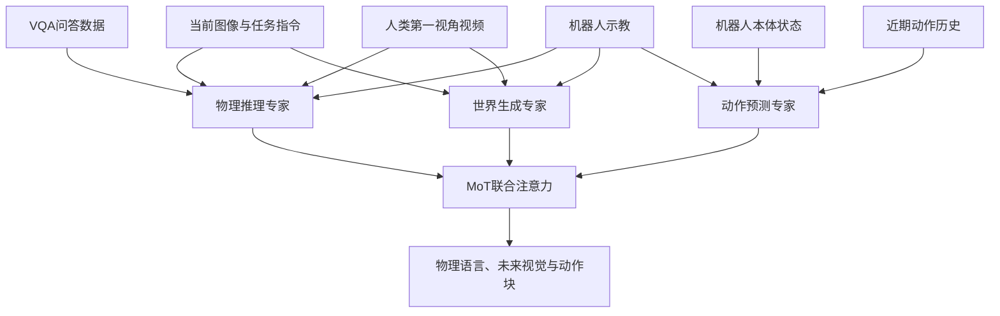

# UniWAM：统一物理理解、世界预测与动作生成

**UniWAM（Unified World-Action Model）** 将视觉语言理解、未来视觉生成与机器人动作生成统一在 Mixture-of-Transformers（MoT）中。它用语言形式监督机器人动作语义，并按 VQA、人类第一视角视频、机器人示教的特点分别安排训练目标；后训练再加入未来视觉噪声增强和历史动作条件流匹配。

- **论文：** [arXiv:2610.02054](https://arxiv.org/abs/2610.02054) · [HTML v1](https://arxiv.org/html/2610.02054v1) · [PDF](https://arxiv.org/pdf/2610.02054)
- **项目页：** [uniwam.github.io](https://uniwam.github.io/)
- **官方代码：** [UniWAM/UniWAM](https://github.com/UniWAM/UniWAM)（Apache-2.0）
- **模型权重：** [ModelScope UniWAM collection](https://www.modelscope.cn/collections/Kosmos524/UniWAM)
- **作者：** Jiayi Chen, Wenxuan Song, Jingbo Wang, Shuai Zhou, Xicheng Gong, Zehua Fan, Ziyang Zhou, Junwu E, Haodong Yan, Fuhao Li, Qize Yu, Xu Huang, Pengwei Wang, Wen Chen, Shunbo Zhou, Haoang Li
- **机构：** The Hong Kong University of Science and Technology (Guangzhou)、OLA Dimensions、Carnegie Mellon University、Peking University、Shanghai Jiao Tong University、Beijing Academy of Artificial Intelligence
- **项目角色：** 官网列 Jiayi Chen 等为核心贡献者、Wenxuan Song 为 project lead、Shunbo Zhou 为 PI；论文作者列表仍按 arXiv 顺序列出。

## 一句话理解

**让一个模型同时回答“现在发生了什么”“接下来视觉世界如何变化”和“机器人该执行什么动作”，再用物理语言把三种能力接起来。**

## 英文缩写速查

| 缩写 | 英文全称 | 本文含义 |
|---|---|---|
| WAM | World-Action Model | 联合学习未来世界表征与动作生成的具身模型 |
| MoT | Mixture-of-Transformers | 多个模态专家通过联合注意力交换信息的架构 |
| VQA | Visual Question Answering | 以图像/视频为条件的问答数据，为语义推理提供语言监督 |
| VGM | Video Generation Model | UniWAM 世界生成专家的预训练骨干 |
| IFR | Instruction-Following Rate | 是否正确识别指令中的目标物体和交互方式 |
| SR | Success Rate | 是否完整完成指令指定的任务 |

## 要解决的问题

VLA 从视觉语言模型获得较强的语义和指令理解，但只用动作标签训练时，对物理世界的动态变化监督有限；视频生成式 WAM 能从视频学习时空变化，却可能在复杂语言推理和分布外场景上受限。UniWAM 将二者放进一个可共享信息的模型中，并在数据侧处理不同来源的监督冲突。

模型联合学习的目标可概括为：

$$p(y, o_{t+1:t+h}, a_{t+1:t+h} \mid o_t, s_t, I)$$

其中 $o_t$ 是当前视觉观测，$s_t$ 是机器人本体状态，$I$ 是任务指令；模型输出物理语言或 VQA 答案 $y$、未来视觉观测以及动作块。

## 架构与训练数据

官方代码仓库将 UniWAM 描述为约 **8B 参数**的 MoT，由三个模态专家组成：

| 专家 | Backbone / 表示 | 职责 |
|---|---|---|
| 物理推理专家 | Qwen3-VL-2B-Instruct | 理解当前图像与语言指令，生成物理语言，也保留 VQA 问答能力 |
| 世界生成专家 | Wan2.2-TI2V-5B | 在冻结视频自编码器的 latent 空间预测未来视觉变化 |
| 动作预测专家 | 连续动作块 + flow matching | 结合本体状态和上下文预测可执行动作块 |

三组专家通过 **joint multimodal attention** 交换 token：动作预测可读取物理语义和逐步变化的视觉预测，而各专家仍使用自己的模态处理层。

数据配方按不同监督精度分工，而不是把所有数据都喂给每个头：

- **VQA：** 约 8.293M 问答样本，训练物理推理专家，帮助保留空间理解、时序理解和具身语义。
- **人类第一视角数据：** 表 1 合计约 5,072 小时，来自 EgoVerse、EgoDex、VITRA。训练推理和世界生成专家，不要求低精度的人类动作标签直接监督机器人动作。
- **机器人数据：** 表 1 小计约 4,958 小时，覆盖 AgiBotWorld、Bridge、DROID、Fractal、RoboCOIN、InterData-A1；监督推理、世界生成和动作专家。
- **物理语言：** 用自然语言描述局部操作动作，作为跨人类与机器人数据的语义接口；EgoANT 管线为 EgoDex 长视频切分原子操作并产生分段描述。

## 后训练：提高鲁棒性并减少动作去噪步数

### 未来视觉噪声增强

联合注意力可能让动作过度依赖接近干净的未来视觉 latent。后训练以 0.5 概率额外扰动未来帧 latent，当前观测保持干净、目标和时间步不变，鼓励动作专家在未来预测不完美时仍提取控制相关语义。

### 历史条件流匹配

动作生成不再只从高斯噪声开始，而是把上一动作块加少量噪声作为 flow matching 的 source，再生成下一动作块。它利用近期动作提供的时间连续性，减少动作生成需要的 denoising steps。视觉生成分支仍从高斯噪声开始。

## 评测结果

以下均为论文报告值；跨仿真、随机化、实机设置的数字不能直接相互替代。

| 评测 | UniWAM 结果 | 读数边界 |
|---|---:|---|
| LIBERO | 平均 SR **99.2%** | Spatial / Object / Goal / Long 四套任务的平均 |
| LIBERO-Plus | 总体 SR **92.6%** | 七类扰动的 overall 指标；论文所列方法中最高 |
| RoboTwin 2.0 Clean2Clean | SR **75.14%** | 干净数据训练、干净环境测试 |
| RoboTwin 2.0 Clean2Rand | SR **68.32%** | 干净数据训练、域随机化测试；较 C2C 下降 6.82 个百分点 |
| AgileX Piper 双臂真机 | 四项指令任务平均 SR **67.5%**、IFR **82.5%** | 相较论文中的 π₀.₅ 基线分别高 13.1、21.9 个百分点 |
| 桌面整理长程任务 | 平均进度 **5.0 / 6** | π₀.₅ 为 4.8，Motus 为 3.2；测试时只给 “Tidy up the desk” 高层指令 |

真机平台由两台 6-DoF AgileX Piper 机械臂构成，每臂配平行夹爪和腕部相机，另有一台全局相机；四项任务测试目标识别、交互动作、空间关系和抽屉收纳，场景最多含 18 个物体。

## 消融与关键观察

- **人类数据收益依赖规模：** 论文在 250、500、1k、2.5k、5k 小时机器人数据上做缩放实验；少量机器人数据时加入人类视频会降低表现，约 1k 小时以后开始带来收益，较大规模时收益更明显。
- **三类数据互补：** 机器人数据提供更准确的动作标签；人类视频提供丰富的物体交互与环境变化；VQA 保持和增强语义、空间推理。
- **动作历史初始化有效：** RoboTwin 消融中，action-to-action generation 将平均 SR 从 64.80% 提高到 69.73%；加未来视觉噪声增强后到 71.34%。
- **语义性能要区分指标：** IFR 只衡量是否选对目标和交互，SR 还要求整项任务完成；不能把 IFR 当任务成功率。

## 复现边界与局限

- **代码与模型已公开：** 官方 GitHub 仓库提供模型、训练脚本和推理示例；官方项目页链接到 ModelScope checkpoint collection。README 说明 RoboTwin 2.0 后训练约需 8 张 H100、10 小时。
- **公开推理范围有限：** README 明确说明 Bridge、DROID、Fractal 和 real-world inference 不在当前 release 范围内。因此论文真机结果不能等同于仓库已提供可直接复现的真机部署流程。
- **训练数据总量存在文字差异：** 表 1 的机器人数据小计约 4,958 小时、人类数据约 5,072 小时；正文 §3.1.1 另称机器人所选数据约 4,363 小时。入库时保留表格口径并标出这处不一致，复现时应回看论文版本或作者说明。
- **规模与成本较高：** 8B 模型与多源视频/机器人预训练需要较大算力；公开仓库中的 8×H100、10 小时描述针对 RoboTwin 后训练，不代表完整预训练成本。
- **基准比较有协议边界：** 结果来自论文所列数据、任务划分和对照方法，不能推出 UniWAM 在所有机器人本体、任务或开放环境中都占优。

## 与相关 WAM 的区别

- **与 OpenWAM：** OpenWAM 重点是模块化预训练基础设施和训练流程研究；UniWAM 的核心是把物理语言推理、未来视频预测和动作生成做成同一 MoT，并使用 VQA、人类和机器人三源数据。
- **与 PointWAM：** PointWAM 用共同 3D 坐标下的场景点/手部轨迹作为结构化世界状态；UniWAM 使用视频 latent、语言语义和动作 token 进行联合建模。
- **与 SkeleWAM：** SkeleWAM 用稀疏 3D 骨架做未来几何辅助监督；UniWAM 保留未来视觉生成专家，并显式加入物理语言推理专家。

## 关联页面

- [World Action Models（WAM）](../concepts/world-action-models.md) — WAM 定义、架构与代表论文索引。
- [VLA](../methods/vla.md) — 语言条件视觉动作策略的对照范式。
- [生成式世界模型](../methods/generative-world-models.md) — 未来视觉预测与 latent 世界建模。
- [机器人操作](../tasks/manipulation.md) — 操作任务与评测背景。
- [论文来源归档](../../sources/papers/uniwam_arxiv_2610_02054.md)
- [官方代码归档](../../sources/repos/uniwam.md)

## 结论

UniWAM 的主要贡献是把 **物理语义、世界动态和动作生成**统一训练，并用数据专属监督减少不同来源之间的冲突。论文显示，语义/世界/动作协同训练在 LIBERO、LIBERO-Plus、RoboTwin 与 Piper 真机任务上有较强结果；但人类数据带来的收益依赖机器人数据规模，完整预训练成本高，官方推理 release 也尚不含真机流程。

## 参考来源

- [arXiv 摘要页](https://arxiv.org/abs/2610.02054)
- [arXiv HTML v1](https://arxiv.org/html/2610.02054v1)
- [官方项目页](https://uniwam.github.io/)
- [官方代码仓库](https://github.com/UniWAM/UniWAM)
- [ModelScope 权重集合](https://www.modelscope.cn/collections/Kosmos524/UniWAM)
