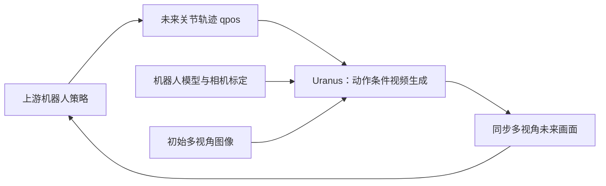
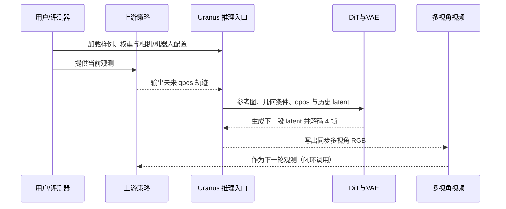

# Uranus：面向具身 AI 的下一代模拟基础设施

**Uranus**（*Building the Next-Generation Simulation Infrastructure for Embodied AI*，[arXiv:2609.24815](https://arxiv.org/abs/2609.24815)）由 **地瓜机器人（D-Robotics）大模型团队**提出。它把机器人结构、相机几何和上游策略给出的未来关节轨迹作为条件，滚动生成同步多视角视频。需要特别区分：Uranus 模拟的是动作之后的**视觉观测**，不负责产生策略动作，也不是带有显式接触求解的通用物理引擎。

## 英文缩写速查

| 缩写 | 英文全称 | 简要说明 |
|------|----------|----------|
| WM | World Model | 根据状态/动作预测环境未来的模型；此处强调视觉后果预测 |
| qpos | Joint Position | 机器人关节位置向量；Uranus 的动作条件接口之一 |
| DiT | Diffusion Transformer | 用 Transformer 主干实现扩散/流匹配生成的架构 |
| VAE | Variational Autoencoder | 将视频帧压缩为 latent 并解码回图像 |
| KV cache | Key–Value Cache | 保存注意力历史以减少自回归生成重复计算 |
| FPS | Frames Per Second | 每秒帧数；论文报告 Uranus 达到 24 FPS |

## 为什么重要

传统物理仿真可以提供显式状态与接触动力学，但高保真渲染和资产/场景搭建成本高；纯视频生成则往往缺少可控的机器人动作接口。Uranus 的切入点是把**可执行的关节轨迹**变成显式条件，并把多视角相机几何和机器人骨架纳入生成，使其可作为具身策略的交互式视觉评测环境。项目公开了推理代码、模型权重和小规模演示数据，有利于直接检验这一接口，但不代表全量训练栈与训练数据已开放。

## 方法与架构

1. **条件输入：** 多视角参考 RGB、相机标定/Plücker rays、机器人 MJCF/URDF 骨架，以及上游策略提供的未来 qpos 序列。策略是动作源，Uranus 是视觉后果模型。
2. **条件视频生成：** 外层自回归滚动；内层通过 flow-matching latent diffusion transformer 生成下一段 latent，再由 VAE 解码成 4 帧同步多视角 RGB。
3. **跨相机与跨时间：** 交替使用跨视角空间注意力和单相机时间注意力；机器人骨架和相机射线编码帮助模型在视点变化时维持几何对应。
4. **在线推理：** 将历史写入 DiT KV cache，逐段追加生成结果，并以滑动窗口限制上下文长度。论文报告 24 FPS 在线生成。

## 评测、对比与解释

论文在 WorldOlympiad 等设置评估交互、物理合理性与 3D 一致性，报告 Uranus-1.3B 综合分数 0.722；这是论文特定基准与设置下的结果，基线用途、预测长度和调用粒度不同，不宜当作通用模拟器排行榜。系统实验显示其可用于策略闭环评测；但作者报告真实一致性测试中训练样本得分 86%、测试样本 58%，说明场景泛化仍是明显短板。

它与 [Isaac Lab](./isaac-lab.md)、[Newton Physics](./newton-physics.md) 的关系是互补而非替代：Isaac Lab/Newton 侧重显式状态推进、控制训练或物理计算，Uranus 侧重从动作条件生成图像。若任务依赖碰撞、受力或精确接触状态，应保留物理仿真/真机作为校验。

## 源码运行时序图

公开仓库提供推理入口、模型权重和演示数据。高层运行逻辑如下；具体命令行参数与依赖版本以 [Uranus-OSS README](https://github.com/D-Robotics-AI-Lab/Uranus-OSS) 为准。

### 复现前检查

- 先用仓库 demo 确认权重、依赖和推理环境工作，再替换成自有机器人数据。
- 自有样例需保证 qpos 时间序列、机器人描述、参考帧和相机外参/内参彼此对齐；坐标系错误会表现为视觉运动失真。
- 把输出用于策略评测时，记录策略版本、相机、机器人模型、生成配置及失败轨迹，并用真机或物理模拟器做抽样复核。
- 模型权重与 demo 数据下载体量可观；仓库 README/模型卡说明应优先于二手教程。

## 局限

- 不计算明确的动力学、接触力或物体状态约束，抓取/接触动作可能出现视觉上不一致的结果。
- 自回归长时预测会累积误差；分布外机器人、视角与场景可能退化。
- 视觉一致性不能自动推出动力学有效性，不能仅凭生成帧判断策略安全或真实成功率。
- 公开 demo 不等于全量训练数据，开源推理也不等于公开完整训练管线。

## 结论

**判断：** Uranus 是“由真实动作接口驱动的生成式视觉模拟器”，适合快速闭环测试和反事实视觉预测，但尚不能取代显式物理仿真或真机安全验证。

- 先把它作为策略开发的视觉筛选/数据扩增层，不作为唯一安全验证层。
- 严格核对 qpos、MJCF/URDF 和多相机标定；对齐程度决定动作条件是否有效。
- 对抓取、接触、长时任务和 OOD 场景，做物理仿真或真机对照。
- 复现实验时分别标注公开 demo、公开权重、推理代码和不可获得的训练数据/配方，避免将“开源项目”误解为全量可复现。

## 关联页面

- [World Action Models（WAM）](../concepts/world-action-models.md)：任务相关的动作与未来联合建模；Uranus 与之共享动作条件预测，但本身不是生成动作的 WAM 策略。
- [生成式世界模型](../methods/generative-world-models.md)：扩散与视频生成式环境预测。
- [Isaac Lab](./isaac-lab.md)：显式机器人仿真与学习框架。
- [Newton Physics](./newton-physics.md)：机器人/物理仿真工具链。

## 参考来源

- [论文与开源状态归档](../../sources/papers/uranus_arxiv_2609_24815.md)
- [官方项目页归档](../../sources/sites/d-robotics-uranus.md)
- [官方推理仓库归档](../../sources/repos/uranus-oss.md)
- [arXiv 论文](https://arxiv.org/abs/2609.24815)
- [Uranus-OSS](https://github.com/D-Robotics-AI-Lab/Uranus-OSS)
- [Demo Data](https://huggingface.co/datasets/D-Robotics/Uranus-Demo-Data)
- [模型集合](https://huggingface.co/collections/D-Robotics/uranus)
