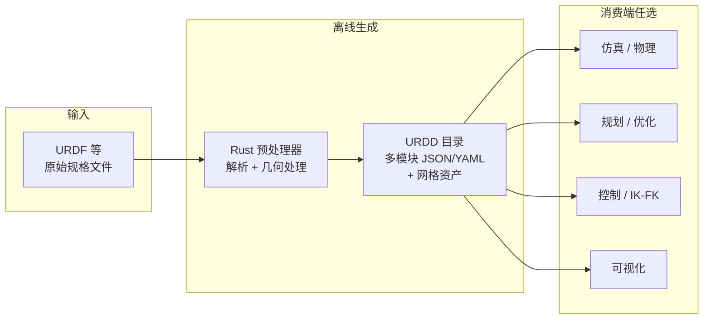

# URDD（Beyond URDF: Universal Robot Description Directory）

**URDD** 是 Klein-Seetharaman 与 Rakita 提出的 **机器人描述「派生层」**：保留 **URDF（等）原始规格** 的同时，把下游常算的 **结构化派生信息** 分模块写入 **目录树**（JSON / YAML 为主），使仿真、控制、规划、可视化等栈可以 **共享同一份预处理结果**，而不是各自解析 URDF 再各算一遍。

## 为什么重要

- **对准真实工程摩擦**：URDF 往往 **不直接给出** DOF 数、链上路径、凸分解几何、自碰撞可跳过对等，却几乎每个栈都要；URDD 试图把这类信息 **标准化为可交换资产**。
- **扩展方式不同**：新能力以 **新子目录 / 新模块文件** 加入并 **独立版本化**，降低「改单一巨型 XML 规格导致全局解析器连锁升级」的风险（与 URDF+ 等 **改规格本身** 的路线互补）。
- **可验证**：论文强调 **Bevy** 与 **浏览器** 两套检视器，让预处理结果对开发者可见，减少「黑盒离线脚本」带来的 silent error。

## 流程总览

## 核心机制（归纳）

### 模块化内容（示例）

论文与公开资产中可见的代表性模块包括（**完整 15 模块列表以作者维护文档为准**）：

- **URDF 模块**：把原始 URDF 信息转存为更易解析的 JSON/YAML。
- **DOF / Bounds**：自由度计数与关节↔DOF 向量映射、关节上下限。
- **Chain / Connections**：运动链父子关系与 link 对之间的路径，支撑 FK / Jacobian 等拼装。
- **Mesh 与 Link Shapes**：原网格与凸包、凸分解、OBB / 包围球等近似；并承载 **自碰撞跳过**、距离统计等 **碰撞管线友好** 元数据（论文与作者既有 Proxima / MeshPreprocessor 等工作对齐叙述）。

### 工具链

- **Rust**：批处理与单机构型生成、凸分解与网格导出、**Bevy** GUI 中编辑/验证 **碰撞跳过对**；支持将 **多个 URDD 组合** 成复合系统（论文图 2 叙事）。
- **JavaScript / Three.js**：`apollo-lab-yale.github.io/apollo-resources` 上提供 **零安装** 检视；模块来自 `Apollo-Lab-Yale/apollo-resources` 仓库公开目录结构。
- **Python**：论文给出基于模块拼装 FK 的极简消费示例；工程入口见 `apollo-py` 仓库（当前 README 较简，以仓内演进为准）。

### 评测结论（量级）

在论文给出的 **笔记本配置** 与 **五台代表机型** 上，完整 URDD 生成时间为 **约 21–90 s** 量级；磁盘占用相对「仅 URDF + 原网格」显著增大，但换来 **可重复使用的派生几何与拓扑资产**（详见论文表 I–II）。

## 常见误区或局限

- **不是又一个单一 XML 替代格式**：输入仍可主要是 URDF；URDD 是 **派生产物**，与 URDF+ / Extended URDF 等 **规格层扩展** 正交互补。
- **体积与新鲜度**：含凸分解与多格式网格时目录变大；模块 **版本标签** 意味着流水线需要 **缓存失效 / 再生成策略**。
- **权威模块集合**：以作者公开文档（论文脚注中的 Notion 文档入口）为准，本页不复制其模块枚举全文。

## 关联页面

- [Robot Viewer](./robot-viewer.md)（浏览器侧多格式模型检视）
- [URDF-Studio](./urdf-studio.md)（URDF 编辑与多格式导出）
- [MuJoCo](./mujoco.md)（MJCF 作为另一仿真侧描述栈，可与 URDD「数据预处理层」对照理解）
- [Pinocchio](./pinocchio.md)（常见「URDF → 模型对象 → 动力学/几何」库路线）
- [Isaac Gym / Isaac Lab](./isaac-gym-isaac-lab.md)（大量工作流仍以 URDF/MJCF 导入为起点）

## 推荐继续阅读

- Klein-Seetharaman & Rakita, *Beyond URDF: The Universal Robot Description Directory for Shared, Extensible, and Standardized Robot Models*, [arXiv:2512.23135](https://arxiv.org/abs/2512.23135)
- 浏览器演示与资产布局：<https://apollo-lab-yale.github.io/apollo-resources/>
- 预处理与示例输出入口：<https://github.com/Apollo-Lab-Yale/apollo-rust>

## 参考来源

- [URDD 论文摘录](../../sources/papers/urdd_beyond_urdf_arxiv_2512_23135.md)
- [apollo-resources 仓库归档](../../sources/repos/apollo-lab-yale-apollo-resources.md)
- [apollo-rust 仓库归档](../../sources/repos/apollo-lab-yale-apollo-rust.md)
- [apollo-three-engine 仓库归档](../../sources/repos/apollo-lab-yale-apollo-three-engine.md)
- [apollo-py 仓库归档](../../sources/repos/apollo-lab-yale-apollo-py.md)
- [apollo-resources GitHub Pages 站点归档](../../sources/sites/apollo-lab-yale-apollo-resources-github-io.md)
