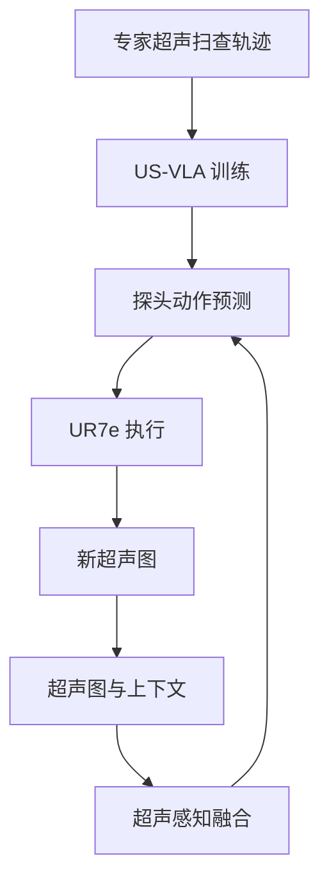
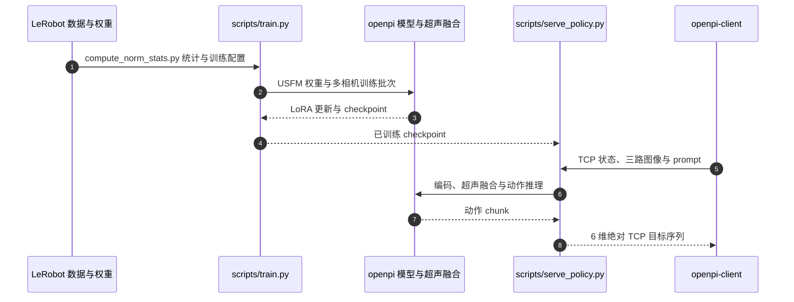

# US-VLA

**US-VLA: An Ultrasound Vision-Language-Action Model for Embodied Abdominal Scanning**（arXiv:[2608.16074](https://arxiv.org/abs/2608.16074)）— **中国海洋大学、山东大学、合肥工业大学等**。多模空间 [2026.08.17–08.23 周报](../../sources/blogs/wechat_duomo_vla_weekly_trends_2026-08-17_part1.md) 策展条目；细节以 arXiv 为准。

## 一句话定义

超声 VLA 控探头；VMVLab/US-VLA 已开源。

## 英文缩写速查

| 缩写 | 英文全称 | 简要说明 |
|------|----------|----------|
| VLA | Vision-Language-Action | 视觉–语言–动作策略 |
| RL | Reinforcement Learning | 强化学习后训练或微调 |
| TTA | Test-Time Augmentation / Adaptation | 测试时增强或适配 |
| SR | Success Rate | 任务成功率 |
| LIBERO | LIBERO Benchmark | 常见操作仿真基准套件 |

## 流程总览

以下按本页已归纳的机制与资料绘制，表示模块或阅读路径关系。

## 核心信息

| 项 | 内容 |
|----|------|
| **机构** | 中国海洋大学、山东大学、合肥工业大学等 |
| **评测** | UR7e + HISENSE HD60 等 |
| **开源** | 已开源 |

## 为什么重要

- 纳入 [一周 VLA 趋势（2026.08.17 第一篇）](../overview/vla-weekly-trends-2026-08-17-part1-technology-map.md) 横切面索引。
- 与 [VLA](../methods/vla.md) 方法页及同周其他 **16/16 独立 canonical 节点** 交叉对照。

## 评测与指标

- **数据：** 自建 **US-VLA-Data**，覆盖肝、肾检查的 **5 个临床标准切面**，**320** 条专家扫查轨迹、约 **80,000** 个同步时间步。
- **平台：** UR7e 机械臂 + HISENSE HD60 超声（见核心信息）。
- **结果：** 在探头操作任务上达到有竞争力的表现，并在所评腹部超声设定内显示泛化潜力（数值摘自 arXiv 摘要，完整表格与基线设定以原文为准）；摘要未给出单一汇总数值，定量对比请直接查原文表格。

## 源码运行时序图

入口对应 [US-VLA 仓库归档](../../sources/repos/us-vla.md) 与官方 README 的 `pi05_ur_usfm_fusion` 配置。真机环境循环不在仓库内；客户端需自行接相机采集和机器人控制器，数据也仅部分公开。

## 与其他工作对比

| 维度 | US-VLA | 对照 |
|------|--------|------|
| 多模态融合 | 超声感知专家融合模块（超声图 + 上下文信息） | [ForceU-VLA](./paper-forceu-vla.md)：超声图 + **力反馈** 自适应加权，侧重接触压力调节 |
| 学习范式 | 专家轨迹模仿，不依赖奖励设计 | 既有 RL 超声扫查需精心设计奖励、交互数据量大 |
| 医疗场景 | 体表诊断扫查 | [SurgLAT](./paper-surglat.md)：腹腔镜持镜，建模术者关注 |

## 结论

**US-VLA 在本库中作为 arXiv:2608.16074 的 canonical 详情节点；部署与复现前请对照原文 PDF/HTML 与作者发布资源。**

1. **canonical 唯一性** — 全库仅此一页绑定 arXiv:2608.16074。
2. **读法** — 先读公众号策展摘要，再读 arXiv 方法与实验节。
3. **开源** — 已开源。
4. **安全/评测类**（若适用）— 勿把任务成功率等同于安全或授权跟随。

## 关联页面

- [VLA](../methods/vla.md)
- [Manipulation](../tasks/manipulation.md)
- [一周 VLA 趋势地图（2026.08.17）](../overview/vla-weekly-trends-2026-08-17-part1-technology-map.md)

## 参考来源

- [官方源码运行入口归档](../../sources/repos/us-vla.md)

- [us_vla_ultrasound_arxiv_2608_16074.md](../../sources/papers/us_vla_ultrasound_arxiv_2608_16074.md)
- [多模空间周报归档](../../sources/blogs/wechat_duomo_vla_weekly_trends_2026-08-17_part1.md)
- arXiv：<https://arxiv.org/abs/2608.16074>
- 代码：<https://github.com/VMVLab/US-VLA>

## 推荐继续阅读

- [arXiv 摘要页](https://arxiv.org/abs/2608.16074)
