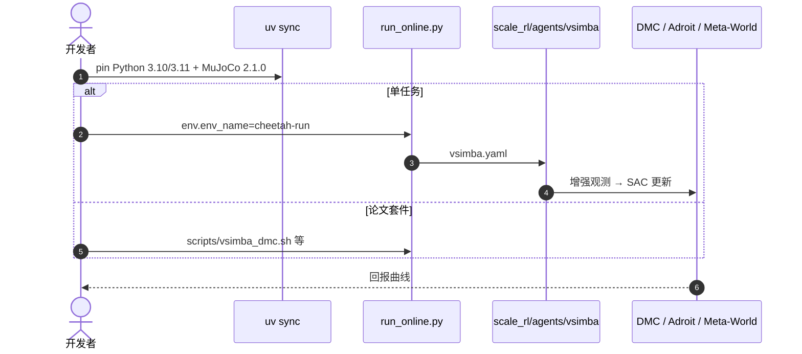

# V-Simba：视觉 RL 的样本效率也可以来自网络结构

**V-Simba**（*Unleashing the Architectural Potential of RL in Visual Continuous Control*；[arXiv:2608.07870](https://arxiv.org/abs/2608.07870)，[代码](https://github.com/DAVIAN-Robotics/V-Simba)）由 **KAIST** 等提出（RLC 2026）：视觉 RL 习惯把样本效率问题交给更好的动力学模型或探索策略；状态基 RL 里 Simba 已经证明 **架构本身** 能抬效率。

## 一句话定义

**在带数据增强的 SAC 上加归一化稳住高维视觉训练，并用 pointwise convolution 降计算——不换算法族，先换网络。**

## 英文缩写速查

| 缩写 | 英文全称 | 简要说明 |
|------|----------|----------|
| V-Simba | Visual Simba | 本文视觉连续控制架构 |
| SAC | Soft Actor-Critic | 被改网络的算法外壳 |
| DMC | DeepMind Control Suite | 主视觉连续控制榜 |
| DrQ-v2 | Data-regularized Q v2 | 算力与样本效率对照 |
| JAX | — | 官方实现栈 |

## 为什么重要

- 真机视觉 RL 的数据采集贵，算法创新往往比不过一次更稳的训练动态。
- 把 Simba 原则迁到像素，验证「架构贡献」不是状态基特供。
- 官方仓同时放 V-Simba 与 DrQ-v2，方便对拍墙钟和样本曲线。

## 核心信息

| 项 | 内容 |
|----|------|
| **机构** | KAIST；作者含 Mila / Google DeepMind 一线 |
| **评测** | DMC、Adroit、Meta-World |
| **开源** | **已开源**（Apache-2.0） |

## 核心原理

### 方法栈

外壳仍是 SAC + 图像增强。改动：normalization layer 抑制视觉特征尺度漂移；pointwise conv 代替更重的空间混合以降低计算。不引入新的世界模型或探索奖励。配置见 `configs/agent/vsimba.yaml`。

### 流程总览

## 源码运行时序图

官方仓 [DAVIAN-Robotics/V-Simba](https://github.com/DAVIAN-Robotics/V-Simba)（归档见 [sources/repos/v-simba.md](../../sources/repos/v-simba.md)）：

- **最短复现：** `uv sync` → `uv run python run_online.py --overrides env.env_name=cheetah-run`。
- **对拍：** 同一入口换 `configs/agent/drqV2.yaml`。

## 工程实践

| 项 | 建议 |
|----|------|
| GPU | 30/40 系 pin 3.10；Blackwell pin 3.11（JAX 栈不同） |
| 头less | `MUJOCO_GL=egl`；Adroit/Meta-World 需要 mujoco210 二进制 |
| Docker | `deps/Dockerfile.dev` 可避免污染宿主机 |
| 读论文数字 | 以仓内脚本套件为准，不要只跑一条 cheetah |

## 实验与评测

论文报告在 DMC、Adroit、Meta-World 上匹配或超过当时方法，同时比 DrQ-v2 更省计算。本页不转载未在 HTML 中抽全的逐任务表；复现以官方 `scripts/vsimba_*.sh` 曲线为准。

## 与其他工作对比

相对「更好的探索/世界模型」视觉 RL：V-Simba 把增量放在 **归一化与算子选择**。相对 [SAC 方法页](../methods/sac.md)：算法目标不变，换的是视觉编码器稳定性。相对 [SpeedTuning](./paper-speedtuning.md)：一个加速已有模仿策略的时钟，一个加速视觉 RL 的学习本身。

## 结论

**视觉连续控制缺样本效率时，先检查网络是否稳、是否算得动，再开新算法。**

1. **SAC 外壳可以不动** — 贡献在 encoder。
2. **归一化是训练稳定器** — 高维像素会放大 Q 尺度漂移。
3. **pointwise conv 换空间混合** — 用计算换足够的样本效率。
4. **对照必须含 DrQ-v2** — 同仓配置就是为这个。
5. **仓可跑** — 先 cheetah-run 打通，再上三套脚本。

## 局限与风险

- 论文 HTML 未在本库展开逐任务数值，引用时以 PDF/仓日志为准。
- Adroit/Meta-World 依赖旧版 mujoco-py，环境安装比 DMC 脆。
- 架构收益是否迁移到真机视觉操作未在本文验证。

## 关联页面

- [SAC](../methods/sac.md)
- [强化学习](../methods/reinforcement-learning.md)
- [RL Runner](../concepts/rl-runner.md)
- [SpeedTuning](./paper-speedtuning.md)

## 参考来源

- [V-Simba 论文摘录](../../sources/papers/v_simba_arxiv_2608_07870.md)
- [代码仓归档](../../sources/repos/v-simba.md)
- [具身智能小站 9 篇盘点（2026-08-17）](../../sources/blogs/wechat_embodied_station_9_papers_2026-08-17.md)
- [arXiv:2608.07870](https://arxiv.org/abs/2608.07870)

## 推荐继续阅读

- [DAVIAN-Robotics/V-Simba](https://github.com/DAVIAN-Robotics/V-Simba)
- Simba 状态基 RL 原架构（文内动机）
