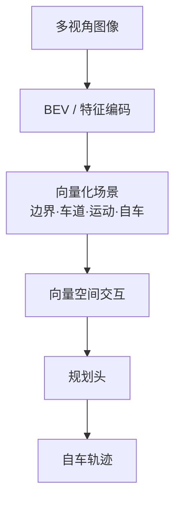
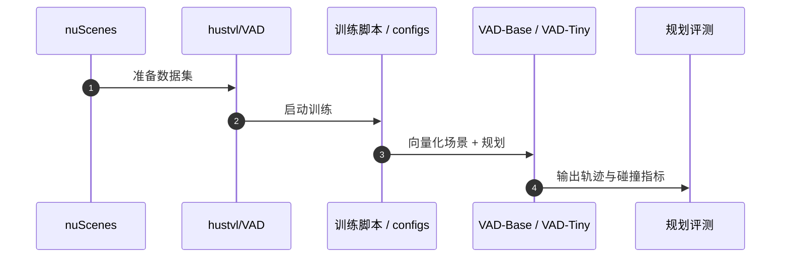

# VAD（VAD: Vectorized Scene Representation for Efficient Autonomous Driving · arXiv:2303.12077）

**VAD**（*VAD: Vectorized Scene Representation for Efficient Autonomous Driving*，[2303.12077](https://arxiv.org/abs/2303.12077)，ICCV 2023）由 **华中科技大学 hustvl（HUST）** 提出，收录于深蓝AI《端到端自动驾驶：十大前沿算法盘点》**全向量化** 线索代表作。

## 一句话定义

把驾驶场景压成边界/车道/运动/自车四类向量，在向量空间做交互与规划，摆脱密集栅格渲染。

## 英文缩写速查

| 缩写 | 英文全称 | 简要说明 |
|------|----------|----------|
| VAD | Vectorized Autonomous Driving | 全向量化端到端驾驶 |
| BEV | Bird's-Eye View | 鸟瞰表征 |
| E2E | End-to-End | 端到端规划 |
| IoU | Intersection over Union | 检测框重合度（模块化优化常对不齐规划） |
| FPS | Frames Per Second | 推理帧率 |

## 为什么重要

- 密集占用栅格算力重，且丢失车道线等实例级结构，对安全约束不友好。
- 向量化表示把地图元素与 agent 轨迹变成显式实例约束，安全与速度同时受益。
- 为后续 SparseDrive / DiffusionDrive 等 hustvl 系工作定下「实例优先」基调。

## 核心信息

| 字段 | 内容 |
|------|------|
| **机构** | 华中科技大学 hustvl（HUST） |
| **arXiv** | [2303.12077](https://arxiv.org/abs/2303.12077) |
| Venue | ICCV 2023 |
| **演进线索** | 全向量化 |
| **开源** | **已开源** — [`hustvl/VAD`](https://github.com/hustvl/VAD) |
| **指标索引** | 盘点称 VAD-Base 平均碰撞率较前作降约 **29.0%**，推理约 **2.5×**；VAD-Tiny 约 **9.3×**（以原论文为准）。 |

## 核心原理

### 四种向量

| 向量 | 含义 |
|------|------|
| 边界向量 | 道路边界等静态约束 |
| 车道向量 | 车道中心线/结构 |
| 运动向量 | 他车/行人等动态轨迹 |
| 自车向量 | ego 状态与规划 |

直接在向量空间建模 ego–环境交互，省略栅格化渲染与大量后处理。

### 流程总览

## 源码运行时序图

关键复现路径：[`hustvl/VAD`](https://github.com/hustvl/VAD) README（Code & Demos 见 arXiv comment）。

## 实验与评测

| 维度 | 记录 |
|------|------|
| 数据集 | nuScenes |
| 变体 | VAD-Base / VAD-Tiny |
| 报告点 | 碰撞率相对降幅约 **29%**；推理约 **2.5× / 9.3×**（盘点） |
| 对照定位 | 密集占用/栅格化规划表示 |

## 与相邻路线对比

| 路线 | 相对 VAD | 取舍 |
|------|----------|------|
| [UniAD](./paper-uniad.md) | 更强中间任务栈 | 算力与级联误差 |
| [SparseDrive](./paper-sparsedrive.md) | 稀疏更极致 | 工程栈更新 |
| [DiffusionDrive](./paper-diffusiondrive.md) | 多模态生成规划 | 扩散延迟需截断 |

## 工程实践

| 维度 | 记录 |
|------|------|
| 典型评测 | nuScenes / NAVSIM / Bench2Drive / Waymo Open（依论文） |
| 开源状态 | **已开源** — [`hustvl/VAD`](https://github.com/hustvl/VAD) |
| 复现入口 | https://github.com/hustvl/VAD |
| 工程关注点 | 延迟、帧间一致性、可解释中间量表征、与模块化栈的接口 |

## 局限与风险

- 底层特征提取仍可能依赖稠密图（SparseDrive 批评点）。
- 向量化质量受地图/检测上游影响；开环指标外推需谨慎。
- 与纯语言 / VLM 路线正交，不直接解决开放世界常识。

## 关联页面

- [e2e-autonomous-driving-top10-algorithms](../overview/e2e-autonomous-driving-top10-algorithms.md) — 十大盘点父节点
- [自动驾驶核心算法盘点专辑](../overview/autonomous-driving-core-algorithms-series.md) — 模块化栈姊妹篇
- [生成式世界模型](../methods/generative-world-models.md)
- [S²-VLA](./paper-s-squared-vla.md) — 驾驶 VLA / NAVSIM 对照
- [M⁴World](./paper-m4world.md) — 驾驶世界模型后继
- [VLA](../methods/vla.md)

## 参考来源

- [深蓝AI：端到端自动驾驶十大前沿算法盘点](../../sources/blogs/wechat_shenlan_ai_ad_e2e_top10.md)
- [e2e_ad_vad_vectorized_scene.md](../../sources/papers/e2e_ad_vad_vectorized_scene.md) — 论文 source
- arXiv: [2303.12077](https://arxiv.org/abs/2303.12077)
- [repos/hustvl_vad.md](../../sources/repos/hustvl_vad.md)

## 推荐继续阅读

- 论文 PDF：<https://arxiv.org/pdf/2303.12077.pdf>
- 官方代码：<https://github.com/hustvl/VAD>
