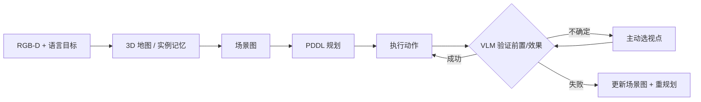

# VAP-TAMP（VLM-based Active Perception TAMP）

**Robot Planning and Situation Handling with Active Perception**（[arXiv:2604.26988](https://arxiv.org/abs/2604.26988)，[项目页](https://vap-tamp.github.io/vap-tamp/)，**IROS 2026** · **Full-Shift Robot Co-Workers Workshop 最佳论文**）提出 **VAP-TAMP**：在 **RGB-D + 自然语言目标** 下维护 **3D 地图、实例记忆与场景图**，转 **PDDL** 做集成任务–运动规划；执行中利用 **VLM** 在 **动作前后验证前置条件/效果**，视角不足时 **主动选视点**，失败则 **更新场景图并重规划**。

## 一句话定义

**TAMP 不能只规划一次就盲执行——用动作知识提示 VLM 做「执行前验 + 执行后验 + 看不清就换角度」，才能把半开门、掉柠檬这类意外变成可恢复状态。**

## 英文缩写速查

| 缩写 | 英文全称 | 简要说明 |
|------|----------|----------|
| VAP-TAMP | VLM Active Perception TAMP | 本文框架名 |
| TAMP | Task and Motion Planning | 任务与运动联合规划 |
| VLM | Vision-Language Model | 视觉–语言模型谓词验证 |
| PDDL | Planning Domain Definition Language | 符号动作模型 |

## 为什么重要

- 纳入 [IROS 2026 九篇获奖盘点](../../sources/blogs/wechat_iros_2026_awards_9_papers_2026-10-02.md)。
- 代表 **IROS 2026** 上 **执行期 situation handling + 主动感知** 工程线（Ford / Agility 等参与）。
- **开源结论（2026-10-02）：待发布** — 项目页 **Code — Coming soon**。

## 流程总览

## 源码运行时序图

**不适用**（项目页代码 **Coming soon**，截至入库日无官方可运行仓库。）

## 实验与评测

- 仿真服务任务 + **移动操作平台** 真机（切柠檬、捡 firewood 等演示视频）。
- 项目页：相对基线 **更高成功率** 与 **可接受执行时间**（见 success rate / time 图）。

## 与其他工作对比

| 路线 | 执行期处理 | 与 VAP-TAMP 差异 |
|------|------------|------------------|
| **一次性 TAMP（开环执行）** | 不验证谓词 | 半开门、物体掉落等意外无法检测；VAP-TAMP 前后验 + 重规划 |
| **VLM 作一次性规划助手** | 只在规划前调用 | 无执行监控；VAP-TAMP 用 PDDL 动作知识约束 VLM 谓词验证 |
| **被动感知（固定视角）** | 视角不足即误判 | VAP-TAMP 主动选视点，详见 [机器人视觉感知栈选型闭环](../queries/robot-perception-stack-selection-loop.md) |
| **[iFlax](./paper-iflax.md)**（同盘点） | 离散搜索空间剪枝学习 | 互补：VAP-TAMP 偏连续感知–规划–执行 |

## 结论

**VAP-TAMP 把 VLM 从「一次性规划助手」拉进 **闭环执行监控**** — 动作谓词结构化提示是降低幻觉验证的关键。

1. **前置/效果 VQA** 必须绑定 **PDDL 动作知识**，否则 VLM 输出不可审计。
2. **主动感知** 是成功率杠杆：半开门类失败多源于 **单次视角不够**。
3. 与 **iFlax** 对照：VAP-TAMP 强调 **连续感知–规划–执行**，iFlax 强调 **离散搜索空间剪枝学习**。
4. 代码发布前，复现难点在 **场景图–PDDL 同步** 与 **VLM 谓词模板**。

## 关联页面

- [IROS 2026 九篇获奖地图](../overview/iros-2026-awards-9-papers-technology-map.md)
- [iFlax](./paper-iflax.md)
- [轨迹优化 / TAMP 方法页](../methods/trajectory-optimization.md)
- [机器人视觉感知栈选型闭环](../queries/robot-perception-stack-selection-loop.md)

## 参考来源

- [IROS 2026 九篇获奖盘点（公众号）](../../sources/blogs/wechat_iros_2026_awards_9_papers_2026-10-02.md)
- [VAP-TAMP sources 归档](../../sources/papers/vap_tamp_arxiv_2604_26988.md)

## 推荐继续阅读

- 项目页：<https://vap-tamp.github.io/vap-tamp/>
