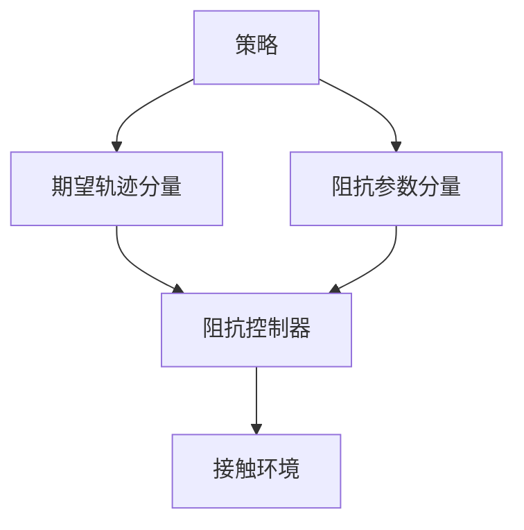

---

type: entity
tags: [manipulation, reinforcement-learning, impedance, contact, sim2real, max-planck, nyu]
status: stable
summary: "RA-L：关节空间同时学习期望轨迹与可变阻抗参数，并加正则以改善接触敏感任务中的样本效率与真机迁移；为可变刚度腿足提供思想前史。"
updated: 2026-08-02
arxiv: "1907.07500"
related:
  - ../entities/paper-variable-stiffness-locomotion-rl.md
  - ../entities/paper-learning-quiet-walking-aibo.md
  - ../queries/legged-humanoid-rl-pd-gain-setting.md
  - ../concepts/force-control-basics.md
  - ../methods/reinforcement-learning.md
sources:
  - ../../sources/papers/rl_pd_action_interface_locomotion.md
  - ../../sources/papers/learning_quiet_walking_aibo_arxiv_2502_10983.md
---

# Learning Variable Impedance Control for Contact Sensitive Tasks

**一句话定义**：在 **接触丰富** 的任务里，让 RL 策略输出 **关节空间期望轨迹 + 可变阻抗参数**，并用 **额外正则** 约束阻抗变化，使学习 **更快、更稳、更可迁移** 到真机（相对纯扭矩或纯位置策略）。

## 英文缩写速查

| 缩写 | 英文全称 | 简要说明 |
|------|----------|----------|
| Sim2Real | Simulation to Real | 把仿真中学到的策略迁移落地真机的工程主线 |
| RL | Reinforcement Learning | 通过与环境交互最大化长期回报来学习策略的范式 |
| VLA | Vision-Language-Action | 视觉-语言-动作多模态基础策略方向 |
| Locomotion | Robot Locomotion | 足式/人形等无轮移动能力的总称 |
| Kp | Proportional Gain | PD 控制的位置误差增益，影响刚度与响应 |
| Kd | Derivative Gain | PD 控制的速度误差增益，抑制振荡 |
| PD | Proportional–Derivative | 关节位置/阻抗底层控制，策略输出常为其 setpoint |

## 为什么重要

- 把 **「位置通道 + 阻抗通道」联合作为动作** 的思想讲清楚，是后来 **可变刚度腿足 loco** 与 **VLA+阻抗** 等路线的 **概念前史**。
- 与 [Variable Stiffness for Robust Locomotion…](./paper-variable-stiffness-locomotion-rl.md) 对照：前者偏 **接触敏感操作与弹跳**，后者偏 **户外腿足鲁棒行走**。
- 四足低噪部署上，[Learning Quiet Walking（aibo）](./paper-learning-quiet-walking-aibo.md) 把 **目标位置 + PD gain scale** 用到脚步降噪，是同一「学增益」思想在家用 locomotion 上的实例。

## 核心机制（提炼）

- **动作**：\((q_{\text{des}}, K_{\text{impedance params}})\) 或等价参数化；低层仍是 **阻抗/柔顺控制律**。
- **正则**：惩罚不合理的阻抗跳变，避免策略用极端刚度「作弊」穿过接触不确定性。

```mermaid
flowchart TB
  pol["策略"]
  q["期望轨迹分量"]
  z["阻抗参数分量"]
  imp["阻抗控制器"]
  env["接触环境"]
  pol --> q
  pol --> z
  q --> imp
  z --> imp
  imp --> env
```

## 与 Kp / Kd 设置的关系

- 当你把 **Kp/Kd 从常量改为可学习输出** 时，应同步设计 **阻抗正则与接触奖励**；否则易出现 **训练期刚度爆炸** 或 **真机无法执行的不连续刚度**。

## 实验与评测

- 量化指标、消融与 sim2real / 实机结果见 **原文 PDF** 与 [参考来源](#参考来源)；本页正文侧重方法结构与知识库交叉引用。

## 结论

**这篇 RA-L 的价值在动作接口设计：让策略同时输出期望轨迹与阻抗参数，把「用多大刚度去碰」从人工超参变成被学习的量，接触敏感任务的学习速度、稳定性与真机可迁移性因此一起改善。**

- 真正起作用的是 **双通道动作（关节期望轨迹 + 可变阻抗参数）搭配阻抗正则**：低层仍是阻抗/柔顺控制律，正则则阻止策略靠极端刚度「作弊」穿过接触不确定性——少了正则，这个接口反而更难用。
- 由此得到的工程规则很硬：把 **Kp/Kd 从常量改成可学习输出时，必须同步设计阻抗正则与接触奖励**，否则会出现训练期刚度爆炸或真机无法执行的不连续刚度。
- 本页侧重方法结构与交叉引用，**量化指标、消融与 sim2real / 实机结果需回原文**；与相邻路线的对照目前仅为定性。
- 定位是概念前史而非最终方案：它是可变刚度腿足 loco 与 VLA+阻抗路线的思想源头，与 [可变刚度腿足 RL](./paper-variable-stiffness-locomotion-rl.md) 的分工在于「接触敏感操作与弹跳」对「户外腿足鲁棒行走」。

## 与其他工作对比

- 正文已给出与相邻路线 / baseline 的 **定性对照**；定量表格与 ablation 见原文（[参考来源](#参考来源)）。

## 参考来源

- [RL+PD 动作接口与增益设计论文索引](../../sources/papers/rl_pd_action_interface_locomotion.md)
- Bogdanovic et al., *Learning Variable Impedance Control for Contact Sensitive Tasks*, [arXiv:1907.07500](https://arxiv.org/abs/1907.07500)（IEEE RA-L 2020）

## 关联页面

- [可变刚度腿足 RL](./paper-variable-stiffness-locomotion-rl.md)
- [Learning Quiet Walking（aibo）](./paper-learning-quiet-walking-aibo.md)
- [Force Control Basics](../concepts/force-control-basics.md)
- [Legged / Humanoid RL 中 Kp/Kd 设置](../queries/legged-humanoid-rl-pd-gain-setting.md)
- [Reinforcement Learning](../methods/reinforcement-learning.md)

## 推荐继续阅读

- [arXiv PDF](https://arxiv.org/pdf/1907.07500.pdf)
