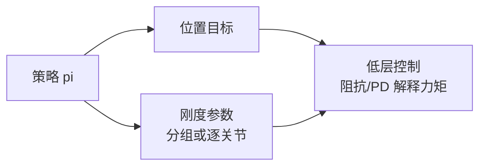

# Variable Stiffness for Robust Locomotion through Reinforcement Learning

**一句话定义**：策略同时输出 **关节位置（或等价目标）与可变刚度参数**，在仿真中学会鲁棒行走，并展示 **刚度参数化粒度**（逐关节、分腿、混合）对性能与能耗的影响。

## 为什么重要

- 直接回答 **「RL 能不能学增益/刚度」**：能，但 **参数化结构**（分组、分腿）往往比「每关节完全自由」更易稳定与迁移。
- 文中强调 **阻尼侧常保留物理一致或结构约束**，提醒实现者：不要把 `Kp` 与 `Kd` 都当成无结构独立通道，否则易与动力学或执行器模型冲突。

## 核心机制（提炼）

- **动作扩展**：\(a = [q_{\text{cmd}}, k_{\text{stiffness\_params}}]\)，低层仍可由 **位置环 + 可变刚度** 解释力矩生成（实现细节以论文为准）。
- **分组学习**：比较 PJS / PLS / HJLS 等方案，对应工程上「按腿组 / 按关节组」配置 `stiffness` 字段的习惯（参见 [legged_gym](./legged-gym.md)）。

## 与 Kp / Kd 设置的关系

- 若你把 **刚度从 URDF 常量** 改成 **策略输出**，需要同步改 **观测归一化、动作缩放、reward 中对冲击/滑移的惩罚**，否则同一 `Kp` 数值语义已变。
- 与 [Learning Variable Impedance…](./paper-variable-impedance-contact-rl.md) 对照阅读：后者更偏 **操作接触** 与 **阻抗 shaping**，本文偏 **腿足户外 loco**。

## 参考来源

- [RL+PD 动作接口与增益设计论文索引](../../sources/papers/rl_pd_action_interface_locomotion.md)
- Spoljaric et al., *Variable Stiffness for Robust Locomotion through Reinforcement Learning*, [arXiv:2502.09436](https://arxiv.org/abs/2502.09436)

## 关联页面

- [Legged / Humanoid RL 中 Kp/Kd 设置](../queries/legged-humanoid-rl-pd-gain-setting.md)
- [可变阻抗接触任务 RL](./paper-variable-impedance-contact-rl.md)
- [Locomotion](../tasks/locomotion.md)
- [Force Control Basics](../concepts/force-control-basics.md)

## 推荐继续阅读

- [arXiv PDF](https://arxiv.org/pdf/2502.09436.pdf)
