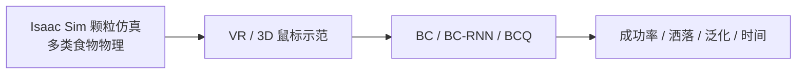

# VERAGMIL：VR 颗粒食物喂食仿真与模仿学习

**VERAGMIL**（*Virtual Environment for Scooping Granular Foods with Imitation Learning Models*；[arXiv:2608.18258](https://arxiv.org/abs/2608.18258)，[GitHub](https://github.com/AmanuelErgogo/VERAGMIL)，IROS 2025）由 **SANO Centre / USF / 维罗纳大学** 提出：助残喂食机器人处理米饭、豆类等 **颗粒食物** 时，材料动态与洒落约束使高质量示范难采。

## 一句话定义

**把高保真颗粒仿真与 VR 示范采集结合，在统一环境里对比 BC/BC-RNN/BCQ，证明示范接口本身决定策略上限。**

## 英文缩写速查

| 缩写 | 英文全称 | 简要说明 |
|------|----------|----------|
| VERAGMIL | Virtual Environment for Scooping Granular Foods with IL | 本文仿真+IL 框架 |
| BC | Behavior Cloning | 行为克隆 |
| BCQ | Batch-Constrained Q-learning | 离线 RL 变体（本文最佳） |
| VR | Virtual Reality | Quest 2/3 遥操作示范 |
| IL | Imitation Learning | 模仿学习 |

## 为什么重要

- **助残喂食** 是 contact-rich + **颗粒动力学** 的长尾任务。
- 3D 空间鼠标示范缺乏自然舀取姿态 → VR 显著改善数据质量。
- 综述将其归入「示范质量 → 执行可靠性」闭环。

## 核心信息

| 项 | 内容 |
|----|------|
| **机构** | SANO Centre；USF；University of Verona |
| **平台** | xArm7 + Isaac Sim GPU PhysX 颗粒 |
| **示范** | VR（Quest）vs 3D space mouse |
| **开源** | **待发布** — GitHub **仅 README + GIF**（2026-08-21） |

## 核心原理

### 仿真 + 示范 + IL

- **环境：** 机器人、传感器、多类颗粒食物（米饭、豆类等）。
- **训练：** 三类 IL 对照；BCQ 在洒落与未见食物上综合最好。
- **评测：** 成功率、**洒落量**、**未见食物泛化**、完成时间。

## 源码运行时序图

**不适用** — 截至 **2026-08-21** 仓内无 `scripts/`、`env/` 或 `weights/`。README 描述的预期路径：VR 采集 → 数据集 → BC/BCQ 训练 → 仿真评测。

## 工程实践

| 项 | 建议 |
|----|------|
| 示范接口 | 颗粒操作优先 **VR/真机 teleop**，而非桌面鼠标 |
| 算法 | BCQ 适合 offline 数据 + 洒落惩罚；BC-RNN 处理部分可观测 |
| 指标 | 必须报 **spillage** 与 unseen food，不单 success rate |
| 复现 | 跟踪 VERAGMIL 是否上传 Isaac 场景与 BCQ 权重 |

## 实验与评测

- **VR vs 3D mouse：** VR 示范显著优于空间鼠标（成功率与洒落）。
- **BCQ** 综合最佳，尤其减少洒落并接近人类表现。
- **泛化：** 未见食物类型测试（论文细节）。

## 结论

**在颗粒物操作里，示范接口本身就是学习系统的一部分；更自然的数据采集方式能直接改变策略上限。**

1. **VR 示范** — 相对 3D 鼠标是决定性数据质量因素。
2. **BCQ** — 在洒落约束下优于 BC/BC-RNN。
3. **颗粒仿真** — GPU PhysX + Isaac 是可行训练环。
4. **助残场景** — 洒落量与完成时间同为硬指标。
5. **开源** — README shell；完整框架 **待发布**。

## 与其他工作对比

| 对照 | 差异读法 |
|------|----------|
| 3D 空间鼠标示范 | 缺乏自然舀取姿态 → 数据质量受限；VR（Quest）示范在成功率与洒落上显著更优——**示范接口本身决定策略上限** |
| BC / BC-RNN | BC-RNN 处理部分可观测优于 BC，但在洒落约束下仍不及 BCQ；BCQ 综合最佳且接近人类表现 |
| 只报 success rate 的操作评测 | 助残喂食必须同时报 **洒落量（spillage）** 与 **未见食物泛化**，否则「成功但洒一桌」被计为成功 |
| 刚体/流体操作研究 | 颗粒动力学介于两者之间；本文用 GPU PhysX + Isaac Sim 建高保真颗粒环，而非近似成刚体或流体 |
| [SHRIMP](./paper-shrimp.md) | 同批但任务域不同：SHRIMP 做自然语言任务规划，本页做接触丰富的颗粒物操作数据与策略 |
| [ADEPT](./paper-adept-dexterity.md) | 综述同批 dexterity 线，走 **RL 预训练 + 后训练** 无 demo 路线；本页恰恰论证 demo 采集接口的决定性——两者是同一问题的两种答案 |

## 局限与风险

- **代码未上传** — 无法复现 VR 采集与 BCQ 训练。
- **Sim-to-real** — 论文以仿真评测为主；真机助残部署 gap 需另验。
- **食物域** — 米饭/豆类以外颗粒（流质、软食）未覆盖。
- **xArm7 专用** — 迁移到其他臂/勺具需重标定。

## 关联页面

- [模仿学习](../methods/imitation-learning.md)
- [Isaac Gym / Isaac Lab](./isaac-gym-isaac-lab.md)
- [SHRIMP](./paper-shrimp.md) — 自然语言任务规划（不同任务域）
- [ADEPT](./paper-adept-dexterity.md) — 综述同批 dexterity 线

## 参考来源

- [VERAGMIL 论文归档](../../sources/papers/veragmil_arxiv_2608_18258.md)
- [VERAGMIL 仓库归档](../../sources/repos/veragmil.md)
- [具身智能小站 8 篇综述](../../sources/blogs/wechat_embodied_station_8_papers_world_model_memory_2026-08-21.md)

## 推荐继续阅读

- [arXiv:2608.18258 PDF](https://arxiv.org/pdf/2608.18258)
- [GitHub: AmanuelErgogo/VERAGMIL](https://github.com/AmanuelErgogo/VERAGMIL)
