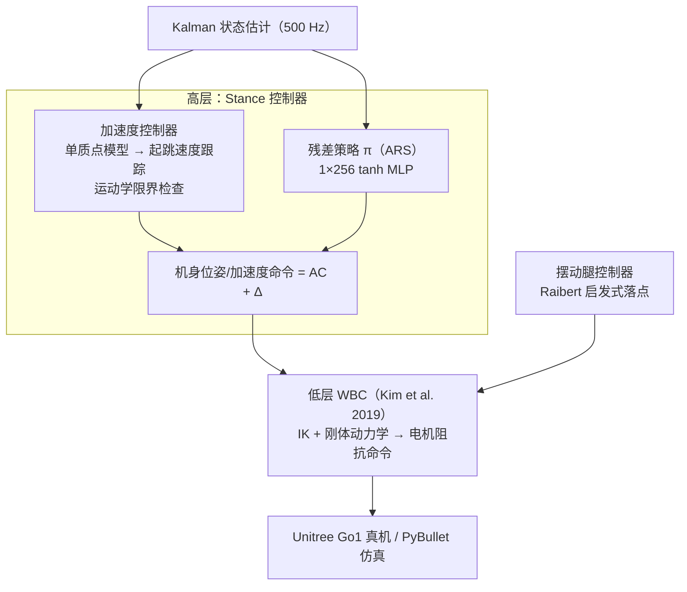

# Continuous Versatile Jumping Using Learned Action Residuals（L4DC 2022）

**Continuous Versatile Jumping Using Learned Action Residuals**（Yuxiang Yang, Xiangyun Meng, Wenhao Yu, Tingnan Zhang, Jie Tan, Byron Boots；University of Washington / Google，L4DC 2022，PMLR 211，[论文页](https://proceedings.mlr.press/v211/yang23b.html)，[arXiv:2304.08663](https://arxiv.org/abs/2304.08663)，[项目页](https://sites.google.com/view/learning-to-jump)）在分层控制框架中把**手工加速度控制器**与**学习残差策略**叠加为高层 stance 控制器：加速度控制器基于单质点模型保证足够起跳速度（warm start），残差策略微调机身姿态命令以稳定全程。仿真训练后**零微调**部署到 Unitree Go1，实现连续全向跳跃（最高约 **50 cm**、最远约 **60 cm**、单次转向跳约 **90°**）。

## 英文缩写速查

| 缩写 | 英文全称 | 简要说明 |
|------|----------|----------|
| WBC | Whole-Body Controller | 低层全身控制器（Kim et al. 2019 系），把机身/足端位姿命令转为电机力矩 |
| ARS | Augmented Random Search | 训练残差策略的无模型进化算法，在参数空间探索、不向动作注入噪声 |
| CoM | Center of Mass | 加速度控制器的单质点近似对象 |
| DoF | Degrees of Freedom | Go1 12 自由度；WBC 命令含机身 6 DoF 位姿/速度/加速度 |
| PPO | Proximal Policy Optimization | 文中对照的梯度类 RL 替代选项（未采用） |
| E2E | End-to-End | 端到端 RL 基线：直接输出电机位置命令 |

## 为什么重要

- **「为什么腿足机器人不让 RL 从零学」的教科书回答**：接触切换使奖励地形高度非光滑，纯策略陷入局部最优（跳不起来）；手工控制器注入「先跳起来」的结构知识，残差只需修稳定性——端到端 RL 需要约 **10×** 训练样本且回报更低。
- **分层职责清晰的工程模板**：高层 stance 控制器（加速度控制器+残差）→ 低层 WBC（Kim et al. 2019）→ 电机；摆动腿用 Raibert 启发式选落点；全线 500 Hz。模板可直接迁移到其他敏捷腿足技能。
- **Sim2Real 零微调**：PyBullet 训练、真机直接部署且多方向/转向跳成功，说明「控制器打底 + 参数空间探索（ARS）」路线对动力学误差天然鲁棒。

## 核心原理（方法）

### 分层结构

- **加速度控制器（base）**：把机身当单质点，按期望落点与摆动时间算起跳速度 $v_{\text{liftoff}}=(p_x/t_{sw},\,p_y/t_{sw},\,\frac12 g t_{sw},\,p_{yaw}/t_{sw})$，以 $a_{des}=(v_{\text{liftoff}}-v)/t$ 跟踪；数值积分预估起跳位置，超出近似运动学限界时改输出「准备蹲姿」加速度。
- **动作空间（残差）**：3 维线加速度 + 绕 z 轴角加速度 + roll/pitch 目标位置（每 DoF 只命令 1 维，其余 2 维启发式补齐）——把 WBC 的 18 维命令压缩到 6 维搜索空间。
- **训练**：ARS（参数空间探索、无动作噪声、无需价值估计——分层任务非马尔可夫时尤其合适）；策略为 1 隐藏层 256 单元 tanh；16 核 CPU 约 3 小时。
- **奖励**：存活奖励 + 落点距离 + 姿态（roll²+pitch²）+ **接触一致性**（实际接触 vs 接触调度 $\hat c_i$）；跌倒/触地/姿态越限提前终止。

## 实验与评测

| 实验 | 结果 |
|------|------|
| 全向跳（仿真） | 仅训 4 个方向（原地/前 1 m/后 0.5 m/左右 0.2 m），可插值到中间方向；转向跳平均约 3.5 rad/s |
| 真机 | 零微调直接部署；最高约 **50 cm**、最远约 **60 cm**、单次转向约 **90°**（略低于仿真，归因未建模电机饱和） |
| 消融：仅控制器 | 不摔倒但回报更低；摆动相 pitch 偏差大（单质点假设无法顾及姿态） |
| 消融：仅策略 | 陷入局部最优，跳高不足、腿常触地（接触切换噪声奖励地形） |
| 消融：端到端 RL | 收敛约慢 **10×**、回报最低 |
| 真机成功率（Table 1，5 次/项） | 残差加持：前/左/右/转向 100%、后 80%；仅控制器：前 20%、后/转向 0%、左 80%、右 60% |

## 源码运行时序图

**不适用**（截至 2026-07-28，[项目页](https://sites.google.com/view/learning-to-jump)与 PMLR 条目均未发布代码；论文实现基于 PyBullet + Kim et al. 2019 WBC 的 Python 管线，复现需自行搭建）。

## 结论

**敏捷腿足技能上，「单质点控制器打底 + 小动作空间残差 + ARS」是一条被真机验证的高效路线；它用 1/10 的样本换掉端到端 RL，还顺手解决了摆动相姿态这种控制器结构性盲区。**

1. **残差修的是控制器的模型假设** — 加速度控制器的单质点近似在摆动相产生大 pitch 偏差；残差学会在 stance 相预调姿态补偿（Figure 6 的 pitch 曲线是最直观的证据）。
2. **动作空间设计决定可学性** — 把 WBC 18 维命令压到 6 维（3 线加速度 + yaw 角加速度 + roll/pitch 位置）是 residual 能 3 小时 CPU 训练的关键。
3. **ARS 适合分层非马尔可夫** — 参数空间探索不污染动作、不需要价值函数；对「控制器+策略」混合管线比 PPO 更稳。
4. **接触一致性奖励不可省** — 它把起跳/落地时刻锚定到接触调度上，是连续跳跃不塌的节奏保障。
5. **真机锚点** — 50 cm 高 / 60 cm 远 / 90° 转向 + 成功率表（残差 100% vs 控制器最低 0%）是引用该文时应带的数字。

## 常见误区或局限

- **仅支持 pronking 步态**（四足同起同落）；bounding/galloping 等更优步态留作未来工作。
- **无感知**：跳跃方向/距离由用户指定，地形感知与自主越障未涉及。
- **真机性能折扣**：电机饱和未建模导致真机跳高/距离略低于仿真。
- **未开源**：复现需自建 PyBullet 环境 + WBC；摆腿落点、接触调度等细节散落在正文与引用文献中。

## 与其他工作对比

| 维度 | 本文 | [Multi-Modal ARRL](./paper-multimodal-legged-arrl.md) | 端到端 RL（Kumar/Miki 系） | 纯模型控制（Chignoli 等规划） |
|------|------|--------------------------------------------------------|------------------------------|--------------------------------|
| base | 手工加速度控制器 | PD + 开环步态（自动调参） | 无 | 全身规划 |
| 残差算法 | ARS | TD3/SAC | — | — |
| 样本需求 | 约 3 h CPU | 中 | 约 10× | 无 |
| 真机 | Go1 连续跳 | Mini Cheetah 双足走 | 视工作 | 单次跳规划 |
| 开源 | 否 | 是（三仓） | 部分 | 部分 |

## 关联页面

- [Residual Policy Learning 方法页](../methods/residual-policy-learning.md)
- [Whole-Body Control](../concepts/whole-body-control.md)
- [Locomotion](../tasks/locomotion.md)
- [Multi-Modal ARRL](./paper-multimodal-legged-arrl.md)
- [Reinforcement Learning](../methods/reinforcement-learning.md)

## 推荐继续阅读

- 项目页（真机视频）：<https://sites.google.com/view/learning-to-jump>
- PMLR 论文页：<https://proceedings.mlr.press/v211/yang23b.html>
- 底层 WBC 原始文献（Kim et al. 2019）：<https://arxiv.org/abs/1909.06586>

## 参考来源

- [Residual Policy / Residual RL 论文精读清单摘录](../../sources/personal/residual-policy-reading-list.md)
- [learning-to-jump 项目页归档](../../sources/sites/learning-to-jump-google-sites.md)
- Yang et al., *Continuous Versatile Jumping Using Learned Action Residuals*, L4DC 2022 (PMLR 211). <https://proceedings.mlr.press/v211/yang23b.html>
