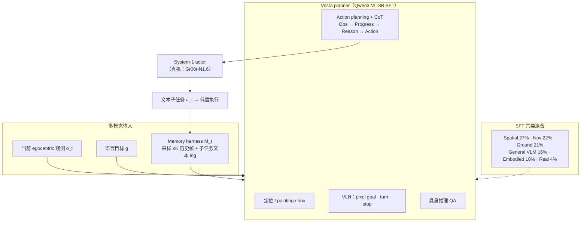

# Vesta（A Generalist Embodied Reasoning Model）

**Vesta** 是 NVIDIA 等团队提出的 **具身通才 planner VLM**（arXiv:2606.20905）：在 **Qwen3-VL-8B** 上，用 **六类空间导向 SFT 混合语料** 与 **极简多模态 memory harness**（采样历史帧 + 运行中子任务文本缓存），把 **定位（localization）、视觉–语言导航（VLN）、具身推理（embodied reasoning）、带记忆的动作规划（action planning）** 收进 **单一 checkpoint**，作为 **System-2 认知脑** 向 **System-1 actor**（论文真机用 **Gr00t-N1.6**）输出 ** grounded 自然语言子任务**，而非直接输出电机命令。

## 英文缩写速查

| 缩写 | 英文全称 | 简要说明 |
|------|----------|----------|
| VLM | Vision-Language Model | 视觉-语言多模态理解模型；Vesta 定位为 planner 而非端到端 VLA |
| VLN | Vision-and-Language Navigation | 依据自然语言与 egocentric 视觉在环境中导航的任务范式 |
| VLA | Vision-Language-Action | 视觉-语言-动作多模态策略；Vesta 与之分层，作高层 planner |
| SFT | Supervised Fine-Tuning | 监督微调；Vesta 在 Qwen3-VL-8B 上做混合能力 SFT |
| CoT | Chain-of-Thought | 链式推理；规划前 Observation→Progress→Reasoning→Action 四段 |
| SR | Success Rate | 导航成功率；R2R-CE val_unseen 主指标之一 |
| SPL | Success weighted by Path Length | 路径长度加权成功率；R2R 标准指标 |
| MCQ | Multiple-Choice Question | 离线 action planning 评测：从动态候选中选下一子任务 |
| IoU | Intersection over Union | 时序段重叠度量；离线规划用 temporal IoU 而非逐帧准确率 |

## 为什么重要

- **挑战「一能力一 specialist」默认假设：** 导航、记忆、空间 QA、子任务规划常被拆成独立 finetune 模型；多栈部署带来 **延迟、集成与级联错误**。Vesta 用同一 8B generalist 在 **四轴 benchmark 平均 >20 pt 超最强单基线**，且 **>10 pt 超 per-category oracle 集成**（每类取最强 specialist 再拼）。
- **Planner 而非 VLA：** 与 [Qwen-VLA](./qwen-vla.md)、[StarVLA](../methods/star-vla.md) 等 **端到端动作输出** 不同，Vesta 明确服务 **hierarchical planner + actor VLA** 栈（论文真机：**Vesta planner → Gr00t-N1.6 actor**），与 [SayCan](../methods/saycan.md) / 现代 **VLM planner + VLA actor** 工业范式同族但 **单模型覆盖多认知轴**。
- **Memory 设计可复用：** **Image+Text 混合 memory**（非 learned retriever）在 Table 5 已优于纯视觉或纯文本；transition 相 **2× 过采样** 对子任务切换准确率关键——对任何长时程 language planner 有工程参考价值。
- **VLN 与 embodied 的正向迁移：** Nav-only specialist 在 embodied 上为 0、Embodied-only 在 R2R 上 SR=0；**统一 mix** 在 R2R **+1.4 SR**、embodied **+3.9 avg** 超各自 specialist（Table 4），支持「通才 planner 可行且可优于 patchwork」论点。

## 流程总览

## 核心机制（归纳）

### 四能力与统一接口

| 能力轴 | 训练要点 | 推理输出形式 |
|------|----------|--------------|
| **Localization** | Objects365/COCO/LVIS base + 具身 tail；点/框经 **text token** 解码 | 指向、框、接触点描述 |
| **Navigation** | R2R/RxR/ScaleVLN 仿真轨迹；VLN-CE 闭环 | ↓+归一化 waypoint、←/→ 转向、stop |
| **Embodied reasoning** | 大规模 VQA/detection + affordance、placement、进度估计 | 自由形式 QA / 结构化答案 |
| **Action planning** | 长时程 egocentric 视频 + 子任务标注；**非 Markov** | CoT 后输出 **下一子任务文本** |

### Memory harness

- 每步 memory 元组：$m_i=\langle i,\tau_i,o_i,a_i,g\rangle$；历史图像 **≤K** 帧（uniform 或 **recency-biased**，**首帧必留**）。
- 规划 prompt 重注入 $\mathcal{M}_t$；仅 **Action 段** 的 $a_t$ 追加到文本 log。
- **消融（Table 5）：** 纯 Image memory 易 **过早切换子任务**；纯 Text 易 **过度 continue**；**Image+Text** 整体最优（~75.9% overall offline planning）。

### SFT 数据混合（Figure 4）

| 类别 | 占比 |
|------|------|
| Spatial Intelligence | 27.1% |
| Navigation | 21.8% |
| Grounding | 20.8% |
| General VLM | 16.2% |
| Embodied Reasoning | 9.8% |
| Real Robots | 4.3% |

训练：**1 epoch**，lr **1e-5**，wd **0.01**，128×H100，global batch **256**。

## 评测摘要

### 具身 cognition + localization（Table 1，8B 对比）

- **Cognition 平均：** Vesta **68.7** vs RynnBrain **64.8** / RoboBrain 2.5 **56.6** / Qwen3-VL **55.7**。
- **Localization 平均：** Vesta **69.9** vs **61.9 / 69.4 / 57.3**。
- 覆盖 Open-X VQA、SAT、VSI-Bench、MMSI-Bench、ERQA、MindCube、CV-Bench、CrossPoint、EmbSpatial 等。

### 离线 action planning（Table 2）

- **160 episode**（AgiBot 100 + Egocentric Human-Hand 60），**严格零样本**；**temporal IoU** 评分 + 连续 rollout 模拟。
- **平均：** Vesta **75.4%** vs RoboBrain 2.5 **38.5%** / Qwen3-VL **33.6%** / RynnBrain **33.5%**。

### 导航 R2R-CE val_unseen（Table 3）

| Model | SR↑ | SPL↑ | OS↑ | NE↓ |
|-------|-----|------|-----|-----|
| InternVLA-N1-8B（specialist） | 55.4 | 52.1 | 60.6 | 4.89 |
| **Vesta** | **55.5** | 50.8 | **61.4** | 5.16 |
| RynnBrain / RoboBrain / Qwen3-VL | 0.0 | 0.0 | 0.0 | ~8.9 |

论文注：部分 navigation specialist（如 InternVLA-N1）**域外灾难性遗忘**（总输出 →→）；Vesta 统一 mix 避免此问题。

### 真机（§4.4，YAM 双臂 + Gr00t-N1.6 actor）

| 任务 | 记忆/推理需求 |
|------|----------------|
| **Find Object** | 四格抽屉逐个打开，**记住已开抽屉** |
| **Count Fruits** | 按指令数量 **逐个** 放入野餐篮 |
| **Memorize Candy** | 关盒后 **记住糖果颜色** 对应托盘 |

- 每任务 **20 样本**；Vesta planner 相对 **actor-only +38.3%**、相对 **Qwen3-VL planner +25%**（>4σ）。
- 未与 academic benchmark specialist 做真机对比（机器人时间限制）。

### Generalist vs specialist 训练（Table 4）

| Mix | R2R SR | Embodied avg |
|-----|--------|--------------|
| Nav-only | 54.1 | ~0 |
| Embodied-only | 0 | 66.2 |
| **Vesta unified** | **55.5** | **70.2**（cognition+localization 均值口径见原文） |

## 常见误区或局限

- **不是端到端 VLA：** Vesta **不输出关节/末端动作**；需配对 **Gr00t-N1.6** 等 actor；actor 错误仍是失败主因（论文 §4.4）。
- **不是「消灭 specialist 的一切场景」：** 8B 固定规模；VLN 上 SPL/NE 仍略逊于 InternVLA-N1；真机仅 **桌面双臂 + 3 任务**。
- **Memory 极简有意为之：** 无 learned retriever / 3D map；lifelong、跨 episode  consolidate 留作 future work（Appendix E）。
- **代码/权重：** 截至 ingest **未见官方公开 repo**；复现依赖 Qwen3-VL-8B 与大规模混合 SFT 管线。
- **与 Qwen-RobotNav 对照：** [Qwen-RobotNav](./qwen-robot-nav.md) 强调 **导航专精 + 可控观测协议**；Vesta 强调 **导航+推理+规划同一 planner**，评测口径不同。

## 与其他页面的关系

- [VLA](../methods/vla.md) — System-1 动作策略层；Vesta 补 **System-2 多能力统一 planner** 参照。
- [SayCan](../methods/saycan.md) — LLM 子任务 + affordance 过滤；Vesta 用 **VLM SFT + 显式 memory** 实现类似分层。
- [Vision-Language Navigation](../tasks/vision-language-navigation.md) — R2R-CE / VLN-CE 指标与 generalist 遗忘问题语境。
- [Manipulation VLA 架构选型](../queries/manipulation-vla-architecture-selection.md) — planner+actor 选型树可纳入 Vesta 类 **通才 planner** 分支。
- [3D 空间 VQA](../concepts/3d-spatial-vqa.md) — Vesta cognition 轴与静态空间 benchmark 互补。

## 推荐继续阅读

- 论文：<https://arxiv.org/abs/2606.20905>
- 对照 planner 栈：[Qwen-Robot Suite](./qwen-robot-suite.md)、[Pelican-Unified 1.0](../methods/pelican-unified-1.md)
- Actor 对照：[Gr00t-N1（NVIDIA）](https://arxiv.org/abs/2503.14734) — 论文真机低层

## 参考来源

- [vesta_arxiv_2606_20905.md](../../sources/papers/vesta_arxiv_2606_20905.md) — arXiv 策展摘录

## 关联页面

- [VLA](../methods/vla.md)
- [Vision-Language Navigation](../tasks/vision-language-navigation.md)
- [SayCan](../methods/saycan.md)
- [Manipulation VLA 架构选型](../queries/manipulation-vla-architecture-selection.md)
