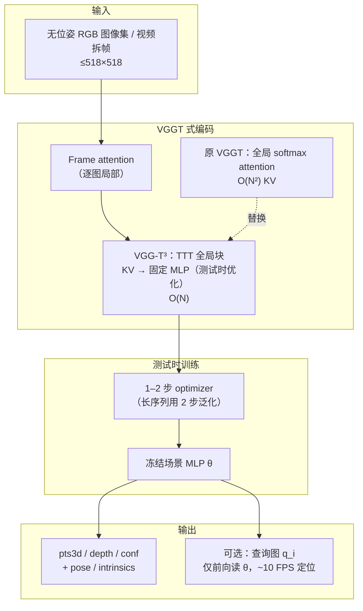
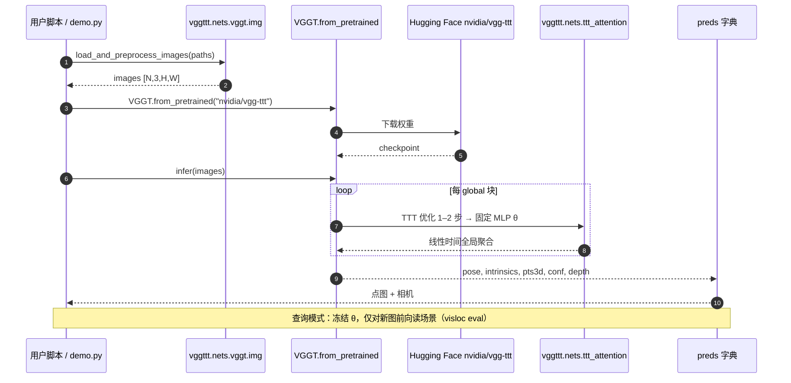

# VGG-T³：大规模离线前馈 3D 重建

**VGG-T³**（*Visual Geometry Grounded Test Time Training*，arXiv:[2602.23361](https://arxiv.org/abs/2602.23361)，[CVPR 2026](https://arxiv.org/abs/2602.23361)，[项目页](https://research.nvidia.com/labs/dvl/projects/vgg-ttt/)，[代码](https://github.com/nv-dvl/vgg-ttt)，[权重](https://huggingface.co/nvidia/vgg-ttt)）由 **英伟达 DVL**、**多伦多大学** 与 **矢量研究所** 提出：在 [VGGT](https://github.com/facebookresearch/vggt) 骨干上，把全局 **softmax attention** 替换为 **测试时训练（TTT）** 蒸馏出的 **固定尺寸 MLP**，把场景几何的变长 KV 表示压成常数记忆，使 **离线批处理前馈重建** 对输入视图数 **线性扩展**，同时保留全局场景聚合与 VGGT 兼容推理 API。

## 一句话定义

**用 TTT 把 VGGT 式全局几何 attention 线性化，在千图级离线集合上保持接近 VGGT 的点图质量，并支持冻结场景表示后的查询式视觉定位。**

## 英文缩写速查

| 缩写 | 英文全称 | 简要说明 |
|------|----------|----------|
| VGG-T³ | Visual Geometry Grounded Test Time Training | 本文方法总称；³ 指 Test Time Training |
| VGGT | Visual Geometry Grounded Transformer | Meta 前馈 3D 几何基础模型；本文骨干与 API 对齐对象 |
| TTT | Test-Time Training | 推理时用少量优化步把变长 KV 蒸馏进固定 MLP |
| SfM | Structure-from-Motion | 多视图相机与结构恢复；本文可替代 COLMAP 初始化环节 |
| KV | Key-Value (attention cache) | 全局 attention 中随视图数变长的场景几何表示 |
| MLP | Multi-Layer Perceptron | TTT 压缩后的固定尺寸场景记忆载体 |

## 核心信息

| 字段 | 内容 |
|------|------|
| **机构** | 英伟达（NVIDIA DVL）；多伦多大学（University of Toronto）；矢量研究所（Vector Institute） |
| **arXiv** | [2602.23361](https://arxiv.org/abs/2602.23361)（2026-02-26，v1） |
| **会议** | CVPR 2026 |
| **骨干** | VGGT 系 ViT（约 **1.19B** 参数）；**线性化预训练 VGGT** 后仅微调全局 attention 层 |
| **输出** | 每图 `pose`、`intrinsics`、`pts3d`、`conf`、`depth`（最大 **518×518** RGB） |
| **开源（截至 2026-09-09）** | **已开源**：推理、`demo.py`、评测脚本 + HF 权重；**训练部分开源**（harness 有、**数据集实现缺失**） |
| **许可** | NVIDIA OneWay **Noncommercial**（非商业科研/教育）；子模块另见 VGGT / LaCT / CUT3R 许可 |

## 为什么重要

- **直击离线前馈扩展瓶颈：** VGGT 类方法的全局 attention 对 $N$ 张图 **二次** 耗时/显存，限制长视频拆帧与大图集 COLMAP 替代场景；VGG-T³ 把复杂度降到 **线性**，论文报 1k 图 **54 s**、相对 softmax attention **11.6×** 加速。
- **质量–速度折中可部署：** 项目页 1k 图定性对比：VGGT **~11 min**、TTT3R **~61 s**（重建不完整）、VGG-T³ **~58 s**（完整场景）；点图误差 **优于其他线性时间方法**，整体 **略低于 VGGT** 但可实用。
- **查询式定位扩展用法：** 场景批处理后 **冻结 TTT MLP**，对新图只读场景表示、不更新权重 → **~10 FPS** 视觉定位（项目页 Wayspots 等演示），比「每次重跑全序列 VGGT」更适合 AR/机器人 **地图 + 查询** 分工。
- **机器人上游几何：** 与 [Macrodata Hand-Action](../methods/macrodata-egocentric-hand-action.md) 等管线中 **窗口化 VGGT** 同类——VGG-T³ 适合 **更长 support 集 / 更短 wall-clock** 的 pointmap 与相机初值，可对接 NeRF/3DGS 初始化或 [Glob3R](./paper-glob3r.md) 式离线精炼。

## 流程总览

## 核心原理

### 1. 变长 KV → 固定 MLP（TTT）

离线前馈 3D 模型在全局层维护 **随视图数增长** 的几何 KV；softmax attention 导致 **计算与显存二次增长**。VGG-T³ 在全局 attention 位置引入 **TTT**：推理时对小型 MLP 做 **少量梯度步**，把当前序列的几何上下文 **蒸馏进固定参数** $\theta$，再以 MLP 替代变长 KV 的读取路径——复杂度对 $N$ **线性**，类似在线流式模型的扩展律。

### 2. 从 VGGT 线性化微调

直接随机初始化线性块效果差；作者 **加载 VGGT 预训练** 并 **线性化全局 attention 层**，其余层基本保持，**只微调全局块**。这使 TTT 压缩在保留 VGGT 局部几何先验的前提下完成，点图质量 **接近 VGGT**、显著优于 TTT3R 等线性替代（项目页 1k 图 TTT3R **场景不完整**）。

### 3. 长度泛化（optimizer 步数）

训练分布内 **1 步** TTT 足够；对 **1k 图** 等更长 OOD 序列，将测试时优化步数增至 **2 步**（训练仍为 1 步）即可恢复重建质量——工程上这是 **默认长序列开关**，无需改网络结构。

### 4. 冻结场景 + 查询定位

全序列重建后 **冻结** $\theta$。对新查询图像，全局层 **只对 query 特征** 应用冻结 MLP 读取场景，**不再更新** $\theta$，模型退化为 **单图查询 transformer**；项目页演示 **实时视觉定位**，区别于每次对 $N+k$ 张图重跑完整 VGGT。

## 源码运行时序图

**复现路径：** `pip install .` 后 `VGGT.from_pretrained("nvidia/vgg-ttt").infer(...)`；交互演示 `python vggttt/demo.py`；论文表 `vggttt/evaluation/pointmaps/eval.py` / `visloc/eval.py`（需 `pip install .[evaluation]` 与 Pi3 式数据准备）。

## 评测要点

| 基准 / 设置 | 内容 | 印象 |
|-------------|------|------|
| **点图（Table 1）** | DTU、ETH3D、NRGBD、7-Scenes sparse/dense | 相对其他 **线性时间** 方法 **大幅领先**；整体 **接近 VGGT** |
| **可扩展性（Fig 4）** | 7-Scenes / NRGBD strided，附加 views 100/500/1000（分布式至 2000） | **线性** wall-clock；1k 图 **~54 s**（论文） |
| **视觉定位（Table 5）** | 7-Scenes、Wayspots | 冻结场景表示 + 查询前向 |
| **定性 1k 图** | VGGT vs TTT3R vs Ours（项目页） | Ours **完整场景** @ **~58 s**；VGGT **~11 min**；TTT3R 快但不完整 |

## 对比定位

| 对照 | VGG-T³ 差异 |
|------|-------------|
| **VGGT** | 同 API / 同输出语义；VGG-T³ **线性时间**、千图 **~11×** 更快，点图 **略低** 但可接受 |
| **TTT3R** | 同为 TTT 系线性替代；项目页 1k 图 **重建不完整**，VGG-T³ **保留全局聚合** |
| [LingBot-Map](../methods/lingbot-map.md) | **在线流式** GCA + Paged KV（~20 FPS 视频）；VGG-T³ 偏 **离线批处理大图集**，非实时视频前端 |
| [Glob3R](./paper-glob3r.md) | **离线全局 SfM 精炼**（tracks + BA）；VGG-T³ 是 **单趟前馈**，不做 BA，但更快作 COLMAP/NeRF **初始化** |
| [D4RT](./paper-d4rt.md) | **动态视频 4D** 统一查询（track/depth/pose）；VGG-T³ 偏 **静态多视图 pointmap**；D4RT **18–300×** 跟踪吞吐 |
| [SLAMFormer-∞](./paper-slamformer-infinity.md) | 学习型 **在线** dense SLAM + PGGO；VGG-T³ 无显式回环后端，但 **查询定位** 类似「地图已建、读图定位」 |

## 工程实践

| 项 | 建议 |
|----|------|
| **选型** | **千图级离线重建 / COLMAP 替代 / 3DGS 初值** → VGG-T³；**实时视频 SLAM** → [LingBot-Map](../methods/lingbot-map.md)；**最高精度离线位姿** → [Glob3R](./paper-glob3r.md) + BA |
| **安装** | `torch==2.7.1` + `pip install .`；评测 `pip install .[evaluation]` |
| **推理** | `VGGT.from_pretrained("nvidia/vgg-ttt").infer(images)` — 与 VGGT 相同字段 |
| **长序列** | 默认 **2 步** TTT optimizer（>训练长度时） |
| **定位** | 先 `infer` 全场景 → **冻结 θ** → 对查询图单独前向（见 `evaluation/visloc/`） |
| **许可** | **非商业**；量产机器人/产品需另谈 NVIDIA 许可 |
| **训练复现** | `train.py` 存在但 **数据集实现未发布** — 勿假设可从头训 |

## 结论

**VGG-T³ 的价值是把「VGGT 级离线前馈几何」从二次复杂度拉到线性，让千图重建从分钟级降到约一分钟，并附带可用的查询定位——它不是要取代 VGGT 的极致精度，而是要取代「大图集上跑不动 VGGT」这一工程现实。**

- **真影响指标的是全局 attention 的扩展律**：TTT 固定 MLP 取代变长 KV 后，1k 图 **~54–58 s**、论文 **11.6×** 加速；项目页上 TTT3R 虽也快但 **场景不完整**，说明 **线性化 + 保留全局聚合** 比单纯换线性算子更关键。
- **从 VGGT 线性化微调是必要配方**：随机线性块不够；加载 VGGT 并只调全局层，才能在 **速度–精度** 上同时贴近 VGGT、拉开与其他线性基线差距。
- **长序列默认多 1 步 TTT**：OOD 长度（如 1k 图）把测试时优化从 **1→2 步** 即可泛化——部署长视频拆帧时应把这一步当作 **标准配置** 而非可选调参。
- **查询模式改变使用形态**：冻结 $\theta$ 后 **~10 FPS** 定位，适合「一次建图、多次查询」的 AR/机器人地图服务，避免每来新帧就对 $N+k$ 视图重跑全模型。
- **许可与训练边界要前置**：权重与代码为 **NVIDIA OneWay Noncommercial**；训练 harness 已放但 **数据集代码缺失**——工业量产与从头训练都需另做预期管理。
- **下游读法**：作 **NeRF/3DGS/COLMAP 替代初始化** 或 **长 support 窗 pointmap** 上游；要厘米级轨迹或 BA 精炼仍应接 [Glob3R](./paper-glob3r.md) 或经典 SfM，而非单独信任前馈点图。

## 局限与风险

- **非商业许可：** 与许多 NVIDIA 研究权重相同，**商业机器人部署** 需合规审查。
- **精度仍略低于 VGGT：** 项目页承认 VGGT 质量 **略高**；极限精度场景仍可能选 VGGT 或后接 BA。
- **离线批处理定位：** 虽支持查询，但 **首遍仍要对全序列做 TTT**；纯在线 SLAM 环路与 [LingBot-Map](../methods/lingbot-map.md) 不同赛道。
- **训练未完全开放：** 数据集实现缺失，**复现论文训练** 暂不可行。
- **硬件：** HF 卡列出 Ampere–Blackwell；依赖 CUDA GPU 生态。

## 关联页面

- [LingBot-Map](../methods/lingbot-map.md) — 在线流式 3D 重建对照
- [Glob3R](./paper-glob3r.md) — 离线全局 SfM 精炼对照
- [SLAMFormer-∞](./paper-slamformer-infinity.md) — 学习型在线 dense SLAM 对照
- [State Estimation](../concepts/state-estimation.md) — 视觉几何在状态估计链中的位置
- [状态估计知识链](../overview/hub-state-estimation.md) — SLAM / VIO 入口
- [3D 空间 VQA](../concepts/3d-spatial-vqa.md) — 几何先验与空间推理下游
- [SE(3) 表示](../formalizations/se3-representation.md) — 位姿形式化底座
- [Macrodata Egocentric Hand-Action](../methods/macrodata-egocentric-hand-action.md) — 工程管线中的 VGGT 窗式用法对照

## 参考来源

- [VGG-T³ 论文摘录](../../sources/papers/vgg_ttt_arxiv_2602_23361.md)
- [NVIDIA DVL 项目页归档](../../sources/sites/nvidia-dvl-vgg-ttt.md)
- [nv-dvl/vgg-ttt 官方仓归档](../../sources/repos/vgg_ttt.md)
- Elflein et al., *VGG-T³: Offline Feed-Forward 3D Reconstruction at Scale* — <https://arxiv.org/abs/2602.23361>
- 项目页：<https://research.nvidia.com/labs/dvl/projects/vgg-ttt/>
- 代码：<https://github.com/nv-dvl/vgg-ttt>
- 权重：<https://huggingface.co/nvidia/vgg-ttt>

## 推荐继续阅读

- 项目页交互对比与定位演示：<https://research.nvidia.com/labs/dvl/projects/vgg-ttt/>
- VGGT 骨干：<https://github.com/facebookresearch/vggt>
- TTT 理论参考：Sun et al., *Learning to (learn at test time)* — <https://arxiv.org/abs/2407.04620>
- 评测数据准备（Pi3 指引）：<https://github.com/yyfz/Pi3/tree/evaluation>
