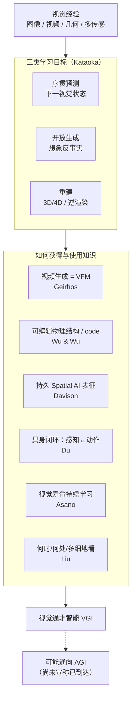

# Visual General Intelligence（视觉通才智能白皮书）

**Visual General Intelligence: A White Paper**（[arXiv:2608.25924](https://arxiv.org/abs/2608.25924)）由 **AIST / 牛津 VGG** 牵头，汇集 DeepMind、CMU、剑桥、帝国理工、哈佛、斯坦福、普林斯顿、OpenAI 等作者在 [CVPR 2026 VGI Workshop](https://cvpr2026-vgi-workshop.limitlab.xyz/) 上的立场。它 **不给单一 VGI 定义或模型**，而是把「视觉经验能否涌现智能、进而通向 AGI」写成一份 **多路径研究议程**。主体不是机器人系统论文；但对 **世界模型、VLA、Spatial AI 与具身持续学习** 读者，它提供与 [From AGI to ASI](./paper-from-agi-to-asi.md) 互补的 **视觉优先** 坐标系。

## 一句话定义

把 **视觉通才智能（VGI）** 定义为：从图像 / 视频 / 几何等视觉经验中获得可迁移的世界知识，并能用于预测、想象、重建与行动——而不是把视觉编码器接到大语言模型上。

## 英文缩写速查

| 缩写 | 英文全称 | 简要说明 |
|------|----------|----------|
| VGI | Visual General Intelligence | 本白皮书的研究议程：从视觉经验涌现的通才智能 |
| VFM | Vision Foundation Model | 视觉基础模型；白皮书追问其能力来自数据、任务、解码器还是规模 |
| VLM / MLLM | Vision-Language Model / Multimodal LLM | 图文对齐或视觉编码器+LLM；白皮书认为难分离视觉本身的贡献 |
| AGI | Artificial General Intelligence | 通用人工智能；VGI 被讨论为一条可能路径，而非已完成的路 |
| SLAM | Simultaneous Localisation and Mapping | Spatial AI 的前身：在线构建持久空间表征 |
| SSL | Self-Supervised Learning | 生成建模被 Ramanan 等视为 SSL 的自然终点 |

## 为什么重要（机器人读者视角）

- **把「VLA 默认路径」相对化：** 产业默认把视觉当 LLM/VLA 的输入通道。白皮书明确说：这会把 **视觉经验带来的能力** 与 **语言模型带来的能力** 缠死；具身系统需要一条 **vision-first / vision-native** 对照。
- **生成视频 ≠ 物理可行动：** Geirhos 主张视频生成模型已是 VFM 1.0（Veo 3 零样本视觉任务）；Wu & Wu 立刻补刀——好看的杯子落地 **不证明** 质量、接触、摩擦在模型里。这正是 [生成式世界模型](../methods/generative-world-models.md) 与真机控制之间的裂隙。
- **足式机器人仍大量「闭眼」：** Ramanan 指出多数腿式 / 人形演示仍是 **本体感觉盲策略**；视觉因维度高、延迟大而被工程上回避。白皮书把它写成研究欠账，而不是既成事实。
- **Spatial AI 与持续学习是部署约束：** Davison 强调持久可修订表征、实时算力与硬件图结构；Asano / Du 强调预训练后冻结不够。这对应真机 fleet 必须 **在线改世界模型** 的现实，而不是再训一个更大的 VLA。
- **评测要从榜单转向可干预性：** 创造性、无 GT 科学验证、主动看哪里、编辑/仿真/动作——比 ImageNet 式静态任务更接近开放世界机器人。

## 核心信息

| 项 | 内容 |
|----|------|
| **机构** | 产业技术综合研究所（AIST，FRONTia / METI / NEDO / JST ASPIRE）；牛津大学 Visual Geometry Group；OpenAI；剑桥大学；谷歌 DeepMind；卡内基梅隆大学；纽约大学；帝国理工学院；哈佛大学；斯坦福大学；普林斯顿大学 等 |
| **类型** | 多作者立场白皮书，非新算法 / 非新基准 |
| **工作坊** | CVPR 2026 Workshop on Visual General Intelligence（2026-06-03） |
| **开源** | **确认未开源** — 无可运行训练/推理代码；工作坊页仅 slides 与 poster |
| **源码运行时序图** | **不适用**（立场白皮书，无官方实现） |

## 流程总览：从视觉经验到 VGI 的互补路径

白皮书的十篇立场不收敛到一个模型，但可以读成 **同一目标上的并行赌注**：

## 核心原理

### 十条立场（Table 1 机器人读法）

| 作者 | 核心赌注 | 对具身栈的直接含义 |
|------|----------|-------------------|
| **Geirhos** | 大规模生成式视频模型会成为视觉基础模型；生成目标比分类更难抄近路 | 对照 [video-as-simulation](../concepts/video-as-simulation.md)：Veo 级零样本是 **感知/编辑** 证据，不是 **可闭环控制** 证据 |
| **Raghunathan** | 创造性：连贯、结构多样、相对训练经验原创、有用 | 机器人「多种可行计划」应进评测，而不是只测单一成功轨迹 |
| **Asano** | 从一条视觉寿命持续学习，而不是一次预训练后冻结 | 真机部署后的世界漂移 / 新物体要求 **可塑视觉系统**，不是只加数据重训 |
| **Ramanan 等** | 多模态 + 生成 + 效率；触觉与本体感觉不可缺；数据多样性重于盲目规模 | 解释为何盲策略仍统治 locomotion；也解释为何视频生成对学术难以承受（Sora 停更作例） |
| **Fouhey** | 科学视觉：数据不可再采、无 GT、仪器系统误差 | 类比稀缺真机演示与传感器偏差；验证工作量远大于刷榜 |
| **Davison** | Spatial AI = 持久、可共享、算力预算内的场景表征；SLAM 尚未被端到端学习完全取代 | 厨房整理 / 可穿戴记忆等产品受 **嵌入式效率** 约束，不只受模型分数约束 |
| **Du** | 视觉智能的中心测试是机器人能否在物理世界可靠感知–推理–行动 | 生成世界模型作分析-by-synthesis；视觉计划 + 低层控制器；主动探索；wake–sleep 巩固 |
| **Wu & Wu** | 看见 = 反演物理世界的结构（实体、内禀、外禀、关系、动力学），最好能写成可运行的 code | 像素级世界模型若不能干预/仿真/验证，就还不能当操作接口 |
| **Liu** | vision-native：系统自己决定看什么、看多细；视觉缺语言那种符号压缩层 | 解释为何视觉 scaling 可能比语言贵 10³–10⁴ 倍；主动视觉应进 VGI 测试 |
| **Kataoka 等** | 预测 + 想象 + 结构理解三目标汇合，才可能从 VFM 走到视觉智能 | 人类视觉不是上界；机器可吃超人类带宽的视觉流 |

### 生成路线的内部张力

白皮书 **同时** 把生成视频模型写成里程碑，又拒绝「生成即理解」：

- **支持生成：** 分类容易抄纹理/背景近路；生成必须交代物体、光照、运动与阴影（Geirhos）。Ramanan 视生成模型为 SSL 的终点，可能取代 DINO/JEPA 式显式表征学习。Du 把生成世界模型当鲁棒感知与视觉计划接口。
- **限制生成：** Wu & Wu 指出评测若只奖感知质量，质量/接触/摩擦可以完全不在内部出现。Liu 强调 **数据多样性 ≠ 数据体积**。Ramanan 强调长视频生成的 **状态记忆与效率**，主张把 3D / 复发 / 多尺度重新嵌回生成。

机器人选型时不要把这两边读成互斥：生成基座可以是 **经验压缩器**，物理结构 / 3D 记忆可以是 **可行动接口**。这与仓库里 [WAM](../concepts/world-action-models.md)「联合建模」vs 纯视频 rollout 的分裂同构。

### 具身闭环（Du）压缩版

1. **感知 = 对潜在场景的推断**（analysis-by-synthesis），而不是每帧独立识别。
2. **场景表征必须跨日可修订**：物体身份、关系、动态，而不是一次性地图。
3. **决策 = 条件视觉生成** 出任务级轨迹，再交给低层控制器；执行把预测误差变成世界模型测试。
4. **动作也是获取视觉证据的手段**（Held–Hein 式主动视觉）。
5. **部署后继续改模型**（SILVR、World Action Verifier），并用 wake–sleep 避免灾难遗忘。

### 物理结构作为 code（Wu & Wu）

应恢复的五类结构：**实体**（物体/部件层次）、**内禀**（几何、材质、关节限位、质量/摩擦）、**外禀**（位姿、光照、相机）、**关系**（支撑、包含、传动）、**动力学**（谁对谁做什么会怎样）。离散关系宜写成程序或词，连续外观宜留在嵌入里；Scene Language 是一个具体实例。编码 agent 若能写–跑–对照图像/运动，就把「结构」变成可自动校验的目标——但目前仍重度依赖人类先验，先验撤走即退化。

## 源码运行时序图

**不适用。** 本页对应资料是 CVPR 工作坊立场白皮书：工作坊页与 PDF 均无训练、推理或部署入口，无可对齐的官方仓库模块。

## 工程实践

对机器人读者，这份白皮书的「用法」是 **对照清单**，不是超参表：

| 你正在做的事 | 白皮书提醒你问的问题 |
|--------------|---------------------|
| 训 / 部署 [VLA](../methods/vla.md) | 能力有多少来自 LLM 脚手架，而不是视觉经验？能否在无语言标签下完成同一技能？ |
| 用视频世界模型做仿真 | rollout 好看是否转化为可干预的质量/接触/关节轴？有没有 [WorldScore](./paper-worldscore.md) 类结构评测之外的 **动作后果** 测试？ |
| 腿式 / 人形 locomotion | 是否仍在吃盲策略红利？视觉失败模式是延迟、维度，还是表征不可用？ |
| SLAM / 场景记忆 | 表征能否在固定算力下在线修订并与其他设备/人共享，还是每次重训一个大网络？ |
| 数据工厂 | 规模是否只是重复同一分布？Liu / Ramanan：多样性与策展可能比「再加一个数量级」更关键；RL 把采集责任还给学习器。 |
| 评测集 | 除成功率外，是否测多种可行计划、主动换视角、部署后适应、无 GT 时的物理一致性？ |

**关键调试指标（概念层，非论文数字）：** 同一请求下计划的结构多样性；重访同一房间时的几何一致性；对场景做「拉开门 / 推倒堆」时预测是否随关节轴/质量改变；冻结预训练后遇到新透明物体是否能局部更新。

## 评测与研究议程

本白皮书 **不做实证 benchmark**。§3–4 给出的是 VGI 评测应覆盖的维度，可映射到现有具身评测：

| 议程 | 白皮书主张 | 仓库内对照 |
|------|------------|------------|
| **零样本视觉任务** | 视频生成模型不经任务训练完成分割/关键点/推理 | [生成式视觉预训练](../concepts/generative-vision-pretraining.md)、Veo 3 零样本叙事 |
| **世界生成保真 vs 结构** | 观感不够；要问实体/物理是否可编辑可仿真 | [WorldScore](./paper-worldscore.md)；[生成式世界模型](../methods/generative-world-models.md) 的动作后果评测 |
| **创造性** | 连贯 + 结构多样 + 原创 + 有用 | 多计划操作 / 多样示范，而不只是 max success |
| **持续 / 主动** | 视觉寿命学习；何时看、看哪里 | 部署后适应、主动视觉、curiosity |
| **Spatial AI 产品约束** | 实时、功耗、可组合、可共享 | SLAM / 3D 记忆 vs 纯端到端 |
| **科学 / 稀缺数据** | 无 GT、系统误差、仪器单位 | 稀缺真机、传感器标定偏差 |

**总判断：** 固定视觉任务刷分 **不足以** 宣称 VGI；更近的里程碑是「智能是否已从视觉经验涌现」，证据要能迁移、能修订、能行动。

## 与其他工作对比

| 对照 | 差异 |
|------|------|
| [From AGI to ASI](./paper-from-agi-to-asi.md) | DeepMind 报告从 **语言/认知 AGI 之后** 外推 ASI（scaling、RSI、多智能体）。本白皮书从 **视觉经验能否先涌现智能** 提问。二者互补：前者的「抽象壁垒」几乎就是本页的动机。 |
| [VLM / VLA / VLX taxonomy](../comparisons/vlm-vln-vla-vlx-world-model-taxonomy.md) | 产业分类把视觉当跨模态栈的输入。VGI 主张视觉可以是 **组织原则**，语言后接为接口。 |
| [生成式视觉预训练](../concepts/generative-vision-pretraining.md) | Vision Banana / GenCeption 提供「生成基座 → 理解任务」的实证。白皮书把该主张升到 AGI 议程，同时用物理结构论点限制它。 |
| 经典 SLAM / Spatial AI | Davison 不认为「会不会被一个大网络吃掉」是最重要的问题；重要的是 **计算与存储结构** 能否满足产品约束。 |

## 结论

**对机器人读者，这份白皮书的真贡献是坐标系，不是新模型：把「视频生成很强」和「还不能当可行动的世界接口」写成必须同时盯住的两条轴，并明确 VGI ≠ 挂在 LLM 上的视觉编码器。**

1. **先问视觉经验有没有涌现智能，再问它是否通向 AGI** — 白皮书认为后一个问题现在提太早。
2. **生成视频模型可以是 VFM 1.0**（零样本视觉任务），但 **观感保真不是物理理解**；操作/仿真要用可编辑、可仿真、可验证的结构来测。
3. **具身是中心测试而不是下游应用**：主动换视角、干预物体、把预测误差写回世界模型，才是 VGI 闭环。
4. **预训练后冻结与语言中介栈都不够**：持续学习、持久 Spatial AI 记忆、何时看/看哪里，是部署约束，不是加分项。
5. **多数腿式演示仍是盲策略** — 这被写成视觉研究的欠账：高维视觉被工程回避，不等于视觉对机器人不重要。
6. **使用边界：** 十篇立场故意不统一；文中引用的 Veo 3 / SILVR 等能力是各作者先前工作，不是本白皮书的新实验。

## 局限与风险

- **不是方法论文：** 无新损失、无新 SOTA、无统一基准；不能当选型白皮书里的「已验证配方」。
- **立场互相不可同时全真：** 例如「只缩放视频生成就够」与「必须显式恢复物理结构」在同一份文件里并存。
- **引用能力 ≠ 本工作复现：** Veo 3 零样本、Scene Language、SILVR 等需回到原论文；本页只编译议程。
- **确认未开源：** 工作坊页无代码；不要把 slides 当成可跑基线。
- **科学发现 / 硬件图结构章节** 对多数机器人实验室是远景，落地优先级低于具身闭环与世界模型评测。

## 关联页面

- [From AGI to ASI](./paper-from-agi-to-asi.md) — 语言优先、后 AGI 宏观路径；与本页视觉优先议程对读
- [生成式世界模型](../methods/generative-world-models.md) — 生成路线在具身里的方法族
- [World Action Models](../concepts/world-action-models.md) — 世界预测与动作的联合建模
- [视频即仿真](../concepts/video-as-simulation.md) — 视频生成当模拟器的工程主张
- [生成式视觉预训练](../concepts/generative-vision-pretraining.md) — 生成基座解锁理解任务的实证线
- [五大具身模型分类](../comparisons/vlm-vln-vla-vlx-world-model-taxonomy.md) — 语言中介具身栈，本页提供对照
- [WorldScore](./paper-worldscore.md) — 白皮书引用的世界生成评测
- [VLA](../methods/vla.md) — 当前默认的语言条件执行层

## 参考来源

- [vgi_white_paper_arxiv_2608_25924.md](../../sources/papers/vgi_white_paper_arxiv_2608_25924.md) — arXiv 策展摘录
- [cvpr2026-vgi-workshop.md](../../sources/sites/cvpr2026-vgi-workshop.md) — 工作坊项目页核查（无代码）
- Kataoka, H., et al. (2026). *Visual General Intelligence: A White Paper*. arXiv:2608.25924. <https://arxiv.org/abs/2608.25924>

## 推荐继续阅读

- 白皮书：<https://arxiv.org/abs/2608.25924>
- 工作坊与 slides：<https://cvpr2026-vgi-workshop.limitlab.xyz/>
- Geirhos 等，*Video models are zero-shot learners and reasoners*，[arXiv:2509.20328](https://arxiv.org/abs/2509.20328)
- Davison，*FutureMapping: the computational structure of Spatial AI systems*，[arXiv:1803.11288](https://arxiv.org/abs/1803.11288)
- 宏观对照：[From AGI to ASI](https://arxiv.org/abs/2606.12683)
