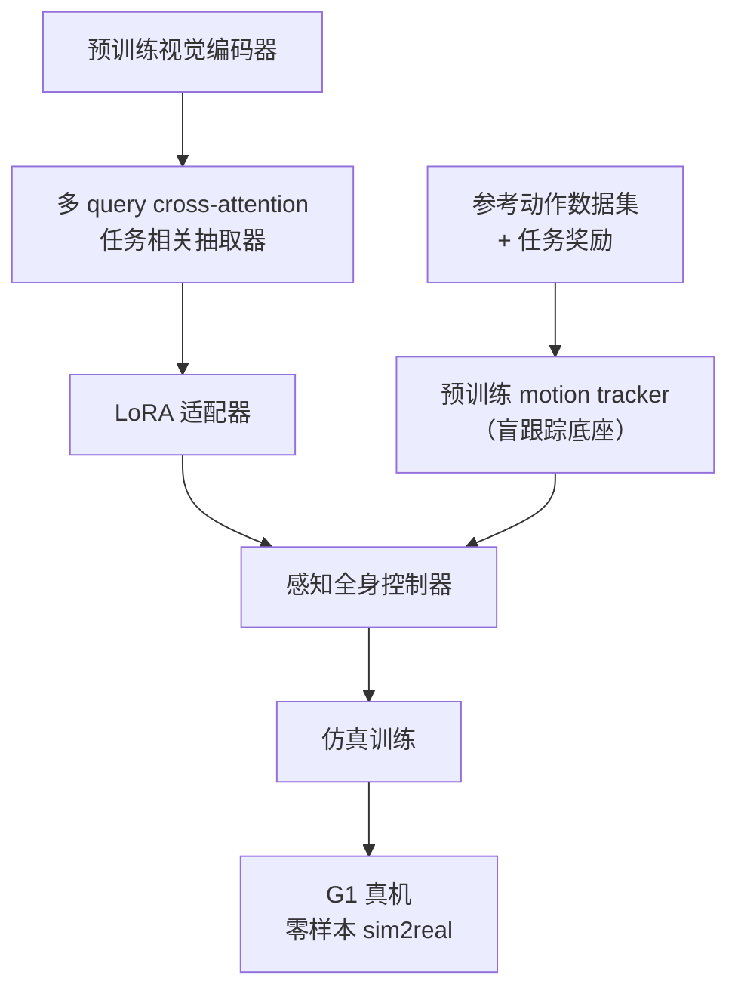

# ViBe：感知人形全身控制的视觉行为适配

**ViBe**（*Visual Behavior Adaptation for Perceptive Humanoid Whole-Body Control*，[arXiv:2609.09918](https://arxiv.org/abs/2609.09918)，[项目页](https://lok-i.github.io/vibe-control)）由 **南加州大学（USC）** 提出：在已有 **motion tracking** 策略之上做 **视觉后训练**，把预训练视觉编码器的任务相关反馈经 **LoRA** 嫁接进 tracker 输入，从而在保留可扩展跟踪底座的同时获得 **外感受闭环** 能力。

## 一句话定义

**不从头训几何-only 感知编码器，而是在成熟 motion tracker 上用多 query cross-attention 抽取预训练视觉特征，再以 LoRA 做参数高效微调，把盲跟踪器改成能应对路缘、跑酷、物体与动态障碍的感知全身控制器。**

## 英文缩写速查

| 缩写 | 英文全称 | 简要说明 |
|------|----------|----------|
| ViBe | Visual Behavior Adaptation | 本文视觉后训练框架 |
| LoRA | Low-Rank Adaptation | 低秩适配器，参数高效微调 |
| WBC | Whole-Body Control | 人形全身协调控制 |
| GMT | General Motion Tracking | 跟踪广分布参考动作的策略族 |
| sim2real | Simulation-to-Real | 仿真训练、真机零样本部署 |

## 为什么重要

- **补 tracking 的感知缺口：** Motion tracking 可规模化学高动态技能，但 **设计上无外感受反馈**；环境反应通常留给上层 planner。ViBe 把「感知」做成 **tracker 的后训练模块**，而不是另起一套 teacher–student 蒸馏管线。
- **复用预训练视觉语义：** 相对从零训几何编码器（易 sim2real、丢语义），本文用 **预训练视觉编码器 + 任务相关抽取器**，在任务奖励与参考数据集给定后直接 **策略优化**。
- **真机证据广：** 项目页展示 **零样本 sim2real**，覆盖路缘行走、跑酷、Repose Cube、全向物体 loco-manipulation、躲避球，并在户外、低光与 disco 灯光下保持鲁棒。

## 核心信息

| 项 | 内容 |
|----|------|
| **机构** | 南加州大学（USC） |
| **平台** | Unitree G1（项目页演示） |
| **arXiv** | [2609.09918](https://arxiv.org/abs/2609.09918) |
| **项目页** | <https://lok-i.github.io/vibe-control> |
| **开源** | **未开源**（截至 2026-09-11 项目页无代码/权重链接） |

## 核心原理

### 问题设定

1. **底座：** 已有 **motion tracker**（盲跟踪参考动作）。
2. **目标：** 在同一体上增加 **任务相关外感受反馈**，完成需看环境的全身任务。
3. **约束：** 避免「几何编码器从零训 + teacher–student 蒸馏」的高成本路线。

### 方法要点

| 模块 | 作用 |
|------|------|
| **预训练视觉编码器** | 提供语义丰富的视觉表征（非几何-only） |
| **多 query 抽取器** | cross-attention 从编码器输出中抽取 **任务相关** 感知反馈 |
| **LoRA 嫁接** | 将抽取结果 **参数高效** 注入 tracker 输入通道 |
| **策略优化** | 给定 **任务奖励 + 参考数据集**，直接微调模块化控制器 |

### 流程总览

### Planner + Controller 分工（Repose Cube 演示）

项目页 **Repose Cube** 交互演示采用 **固定规则 planner 选动作 + ViBe 执行感知全身控制**：说明 ViBe 定位是 **低层可感知执行器**，上层可用极简 planner，而不必端到端重训大模型。

## 源码运行时序图

**不适用**（截至 2026-09-11 项目页未列官方 GitHub 或可运行代码；发布后应补 `sources/repos/` 并更新本图。）

## 实验与评测

| 任务族 | 项目页展示要点 |
|--------|----------------|
| **Walk / Parkour** | 路缘、障碍上的 **感知行走**；注意力图与第三人称 rollout 对照 |
| **Repose Cube** | 规则 planner + 学习型控制器；含 **外部动力学**（推、搬）与 **视觉鲁棒性**（户外、 disco 灯光） |
| **Omni-Object Loco-Manipulation** | 全向物体相关的移动操作 |
| **Dodge Ball** | 动态障碍躲避 |

- **读法：** 上表来自 [项目页](https://lok-i.github.io/vibe-control) 与 [arXiv 摘要](https://arxiv.org/abs/2609.09918)；定量成功率、训练步数与观测接口以 **原文 PDF** 为准。
- **sim2real 口径：** 论文声称 **零样本** 真机迁移；引用时需对齐具体任务与视觉扰动设定。

## 与其他工作对比

| 对照路线 | 差异 |
|----------|------|
| [BeyondMimic](../methods/beyondmimic.md) / [YAHMP](./paper-yahmp.md) 等 GMT | 那边优化 **盲跟踪** 精度与可扩展性；ViBe 假设 tracker 已就绪，专注 **后训练感知适配**。 |
| 几何-only 感知 + teacher–student | 常见路线从零训编码器再蒸馏；ViBe 用 **预训练视觉 + LoRA**，模块化且参数高效。 |
| [PAC-MAN](./paper-pac-man-perceptive-cbf-rl.md) | 同为 G1 感知反应，但 PAC-MAN 把 **CBF 写进训练奖励** 做躲避；ViBe 是 **视觉反馈嫁接** 的通用后训练框架。 |
| [VBC](./paper-visual-whole-body-control-vbc.md) | VBC 分层「视觉高层 + 低层 WBC」；ViBe 在 **单一 tracker 接口** 上扩展感知，而非新建双层频率栈。 |

## 结论

**ViBe 把「感知」从 planner 专属责任变成 motion tracker 的可插拔后训练模块，适合已有跟踪栈、缺外感受闭环的人形团队。**

1. **架构读点：** 预训练视觉 + 多 query 抽取 + LoRA，比从零几何编码器更省样本、保留语义。
2. **任务覆盖广：** 行走、跑酷、物体操作、动态躲避均有真机演示；但 **定量表以 PDF 为准**。
3. **分层友好：** Repose Cube 证明 **简单 planner + ViBe 控制器** 可解目标导向任务。
4. **开源边界：** 截至 **2026-09-11** **未开源** — 选型时先当方法论文，复现需等官方发布。
5. **与 tracking 生态：** 可与 [BeyondMimic](../methods/beyondmimic.md)、[SONIC](../methods/sonic-motion-tracking.md) 等跟踪底座对照，评估「后训练感知」vs「上层 VLA/planner」分工。

## 关联页面

- [BeyondMimic](../methods/beyondmimic.md)
- [YAHMP](./paper-yahmp.md)
- [Unitree G1](./unitree-g1.md)
- [Loco-Manipulation](../tasks/loco-manipulation.md)
- [Whole-Body Control](../concepts/whole-body-control.md)

## 参考来源

- [vibe_arxiv_2609_09918.md](../../sources/papers/vibe_arxiv_2609_09918.md)
- [vibe-control 项目页归档](../../sources/sites/vibe-control-github-io.md)
- [arXiv:2609.09918](https://arxiv.org/abs/2609.09918)

## 推荐继续阅读

- [arXiv PDF](https://arxiv.org/pdf/2609.09918)
- [项目页](https://lok-i.github.io/vibe-control)
- [BeyondMimic 方法页](../methods/beyondmimic.md)
