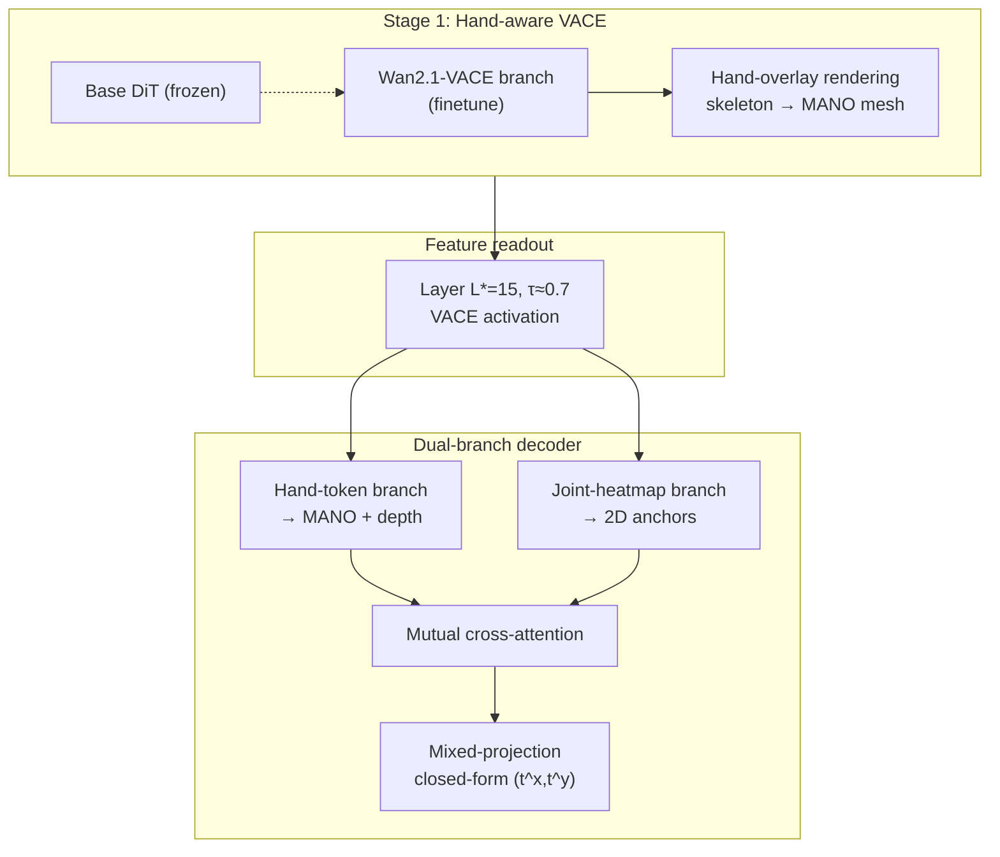

# ViDiHand — Video Diffusion for 4D Hand Motion Reconstruction

**一句话定义**：**ViDiHand** 将 **预训练 video diffusion（Wan2.1-VACE）** 的内部表征当作 **egocentric 双手 4D 重建** 的通用先验——经 **hand-overlay rendering** 轻量适配后，**双分支 decoder** 从单层中间激活读出 **metric-scale 双手 MANO 轨迹**，**无需手部检测器、运动 infiller 或 test-time optimization**。

## 英文缩写速查

| 缩写 | 英文全称 | 简要说明 |
|------|----------|----------|
| ViDiHand | Video Diffusion Hand | 本文：video diffusion 驱动的双手 4D 重建 |
| VACE | Video All-in-one Conditioning Engine | Wan2.1 的可控视频生成/编辑分支 |
| DiT | Diffusion Transformer | 扩散骨干中的 Transformer 块 |
| MANO | Mesh-based hand Model with Articulated joints | 参数化手部网格与关节模型 |
| MPJPE | Mean Per Joint Position Error | 关节 3D 位置平均误差（本文用 penalty 版） |
| PA-MPJPE | Procrustes-Aligned MPJPE | 对齐后的 MPJPE，消 global rigid |
| Ego | Egocentric | 第一人称视角视频 |
| TTO | Test-Time Optimization | 推理时优化；本文明确不使用 |

## 为什么重要

- **填补空白**：video diffusion 特征已用于 **点跟踪、稠密预测、3D 场景感知**，但此前 **无人** 将其用于 **4D hand motion reconstruction**；本文给出 **强实证**（ARCTIC/HOT3D/HOI4D 全面领先）。
- **直击 egocentric 痛点**：重度 **手–物 / 手–手遮挡** 下，**per-frame 检测式**（如 [WiLoR](../methods/wilor.md)）易掉检与闪烁；**hand-only 时序模块**（OmniHands、Dyn-HaMR 等）缺乏 **场景与交互上下文**。ViDiHand 继承 **互联网规模视频先验** 的 **遮挡推理与时序连贯**。
- **具身数据管线**：大规模 **人类 egocentric 视频** 是 dexterous imitation / policy 的主监督来源之一；**全帧端到端、无 TTO** 的重建有利于 **in-the-wild 手部标注 scale-up**（与 [EgoWAM](./paper-egowam-egocentric-human-wam-co-training.md) 等人视频利用路线互补）。

## 核心信息

| 字段 | 内容 |
|------|------|
| 机构 | 南洋理工大学（NTU）；上海交通大学（SJTU） |
| 骨干 | **Wan2.1-VACE 1.3B**（冻结 DiT，微调 VACE 分支） |
| 输出 | 双手 **MANO**（朝向、关节角、形状）+ **相机系平移** |
| 输入 | 全分辨率 **egocentric 视频 clip**（81 帧；特征 21 latent frames） |
| arXiv | <https://arxiv.org/abs/2606.30308> |
| 项目页 | <https://ACE-ViDiHand.github.io> |

## 流程总览

## 方法要点

### Hand-overlay rendering（适配目标）

- 在原始帧上 **alpha-blend 半透明手部渲染**（含 **物体完全遮挡手** 的帧），**flow-matching** 监督；**不向扩散骨干回传 MANO 损失**。
- **两阶段课程**：**1a** 2D **关节骨架** overlay（EgoDex 等关节监督，扩大 egocentric 运动覆盖）；**1b** **MANO mesh** overlay（对齐 decoder 的 MANO 表面）。
- 迫使模型在遮挡下维持 **per-hand 3D 状态**，而非仅拟合可见纹理。

### Dual-branch decoder

| 分支 | 归纳偏置 | 输出 |
|------|----------|------|
| **Hand-token** |  articulated pose 是 **整体** 属性 | 2 slot → MANO **R, Θ, β** + **log-depth** + on-screen 概率 |
| **Joint-heatmap** | 图像坐标是 **逐关节局部** 的 | spatial softmax → **2D anchor** + joint descriptor |
| **融合** | 互注意力交换 articulation ↔ image 证据 | |
| **Mixed-projection** | 深度回归 + **对 heatmap 的闭式 in-plane 平移** | metric **t** 与 **相机系关节** |

- **射线空间位置编码**（由相机内参 **K** 导出）使 decoder 跨 **鱼眼 / 针孔** 数据集泛化。

### 训练与推理

- Decoder 损失：**L_MANO + L_cam + L_img + L_vis + L_temp**（含 **幻觉手抑制** 与 **平移加速度平滑**）。
- 推理：**单次 VACE 前向** 取特征 → decoder；**无 detector、infiller、TTO**。

## 实验与评测

### 数据集

| 基准 | 压力点 | 与训练关系 |
|------|--------|------------|
| **ARCTIC** | 双手操作 articulated 物体、重度遮挡 | in-distribution |
| **HOT3D** | 鱼眼、HDR、快速头/手运动 | in-distribution（自划 5% val 作 test） |
| **HOI4D** | 跨数据集泛化 | **held-out**（各基线亦未在 HOI4D 训练） |

### Penalty protocol

- 标准 per-hand 指标只评 **TP**，会奖励「跳过硬帧」；本文对 **FN** 注入 **identity MANO @ 原点** 占位误差，使 **检测与重建** 在同一协议下可比。

### 相对基线（项目页摘要，ARCTIC）

| 方法 | FAcc ↑ | MPJPE-p ↓ | Jitter ↓ |
|------|--------|-----------|----------|
| WiLoR | 0.919 | 22.0 | 24.1 |
| OmniHands | 0.866 | 29.7 | 45.3 |
| HaMeR | 0.875 | 29.2 | 18.3 |
| **ViDiHand** | **0.997** | **21.7** | **3.18** |

- **定性**：同一段 egocentric 输入下，WiLoR **检测掉帧 + 姿态闪烁**；OmniHands **减闪烁** 但遮挡与大运动仍差；ViDiHand **双手 identity 稳定、遮挡下连贯**。

## 与其他路线对比

| 路线 | 代表 | 遮挡 / 时序 | 场景上下文 | 本文 |
|------|------|-------------|------------|------|
| 图像检测 + 重建 | [WiLoR](../methods/wilor.md)、HaMeR | 依赖 detector；逐帧抖 | 弱 | **无 detector；低 jitter** |
| 跨帧注意力 | OmniHands | 有限 hand 标注先验 | 弱 | **video generative 先验** |
| 运动先验 / infiller | Dyn-HaMR、HaWoR | 3D 轨迹生成；与场景解耦 | 无 | **全帧、单 pass** |
| Video diffusion 下游 | [mimic-video](../methods/mimic-video.md) 等 | 操作/动作生成 | 强 | **感知：4D hand 重建** |

## 常见误区与局限

- **不是「把 diffusion 当 TTO 拟合器」**：适配用 **渲染编辑目标**，推理 **前向一次**，与 HaMR 类 **test-time fitting** 不同。
- **算力与骨干绑定**：依赖 **Wan2.1-VACE** 规模；decoder 训练 **不反传** 扩散骨干，换骨干需重新适配。
- **双手 MANO 专精**：与 **全身 SMPL、机器人 retarget** 的系统集成仍是工程课题；与 [Manipulation](../tasks/manipulation.md) 策略栈的接口需额外标定/语义层。

## 参考来源

- [vidihand_arxiv_2606_30308.md](../../sources/papers/vidihand_arxiv_2606_30308.md)
- Wang et al., *The Surprising Effectiveness of Video Diffusion Models for Hand Motion Reconstruction*, [arXiv:2606.30308](https://arxiv.org/abs/2606.30308)

## 关联页面

- [WiLoR](../methods/wilor.md) — per-frame 强基线与失败模式对照
- [mimic-video（VAM）](../methods/mimic-video.md) — 另一 video diffusion 表征下游任务轴
- [Manipulation](../tasks/manipulation.md) — 手部运动作为操作模仿监督
- [Ego 采集链路](../overview/ego-category-01-data-collection.md) — egocentric 数据进入训练栈

## 推荐继续阅读

- [ViDiHand 项目页](https://ACE-ViDiHand.github.io)
- [VACE（Wan2.1 可控视频）](https://arxiv.org/abs/2503.07590) — 本文骨干来源
- [EgoWAM](./paper-egowam-egocentric-human-wam-co-training.md) — 野外 egocentric 人数据如何进入机器人策略
