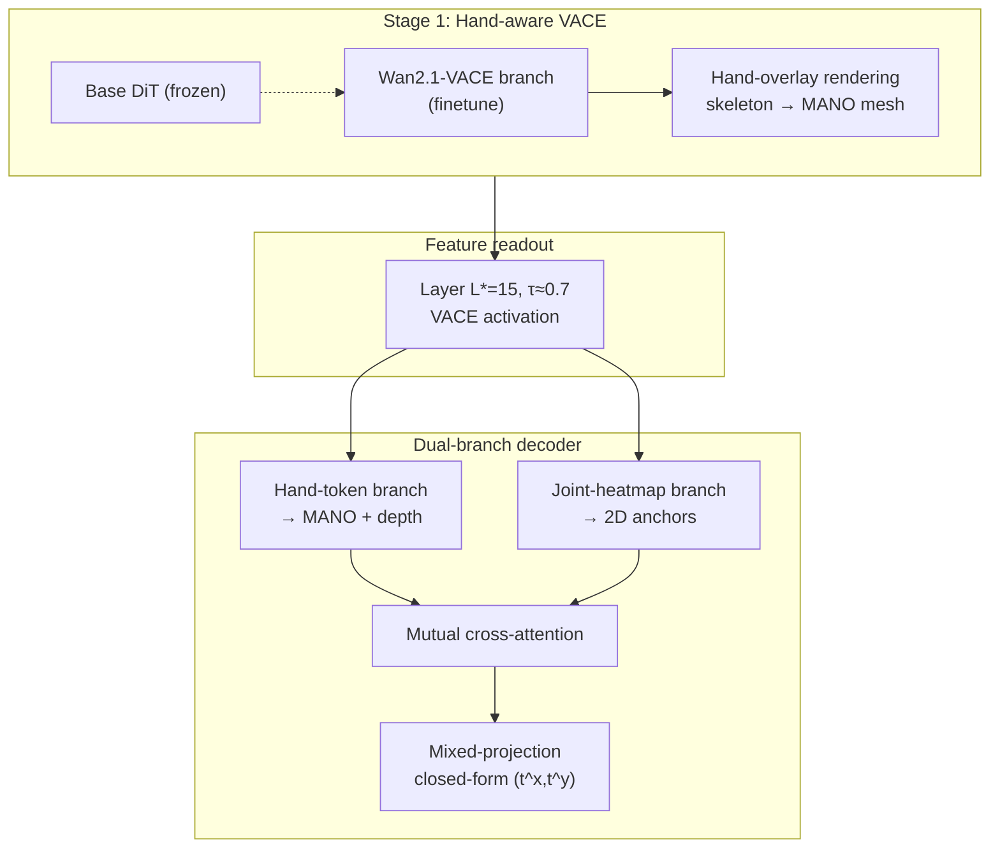

# ViDiHand — Video Diffusion for 4D Hand Motion Reconstruction

**一句话定义**：**ViDiHand** 将 **预训练 video diffusion（Wan2.1-VACE）** 的内部表征当作 **egocentric 双手 4D 重建** 的通用先验——经 **hand-overlay rendering** 轻量适配后，**双分支 decoder** 从单层中间激活读出 **metric-scale 双手 MANO 轨迹**，**无需手部检测器、运动 infiller 或 test-time optimization**。

## 英文缩写速查

| 缩写 | 英文全称 | 简要说明 |
|------|----------|----------|
| ViDiHand | Video Diffusion Hand | 本文：video diffusion 驱动的双手 4D 重建 |
| VACE | Video All-in-one Conditioning Engine | Wan2.1 的可控视频生成/编辑分支 |
| DiT | Diffusion Transformer | 扩散骨干中的 Transformer 块 |
| MANO | Mesh-based hand Model with Articulated joints | 参数化手部网格与关节模型 |
| MPJPE | Mean Per Joint Position Error | 关节 3D 位置平均误差（本文用 penalty 版） |
| PA-MPJPE | Procrustes-Aligned MPJPE | 对齐后的 MPJPE，消 global rigid |
| Ego | Egocentric | 第一人称视角视频 |
| TTO | Test-Time Optimization | 推理时优化；本文明确不使用 |

## 为什么重要

- **填补空白**：video diffusion 特征已用于 **点跟踪、稠密预测、3D 场景感知**，但此前 **无人** 将其用于 **4D hand motion reconstruction**；本文给出 **强实证**（ARCTIC/HOT3D/HOI4D 全面领先）。
- **直击 egocentric 痛点**：重度 **手–物 / 手–手遮挡** 下，**per-frame 检测式**（如 [WiLoR](../methods/wilor.md)）易掉检与闪烁；**hand-only 时序模块**（OmniHands、Dyn-HaMR 等）缺乏 **场景与交互上下文**。ViDiHand 继承 **互联网规模视频先验** 的 **遮挡推理与时序连贯**。
- **具身数据管线**：大规模 **人类 egocentric 视频** 是 dexterous imitation / policy 的主监督来源之一；**全帧端到端、无 TTO** 的重建有利于 **in-the-wild 手部标注 scale-up**（与 [EgoWAM](./paper-egowam-egocentric-human-wam-co-training.md) 等人视频利用路线互补）。

## 核心信息

| 字段 | 内容 |
|------|------|
| 机构 | 南洋理工大学（NTU）；上海交通大学（SJTU） |
| 骨干 | **Wan2.1-VACE 1.3B**（冻结 DiT，微调 VACE 分支） |
| 输出 | 双手 **MANO**（朝向、关节角、形状）+ **相机系平移** |
| 输入 | 全分辨率 **egocentric 视频 clip**（81 帧；特征 21 latent frames） |
| arXiv | <https://arxiv.org/abs/2606.30308> |
| 项目页 | <https://vidihand.github.io/> |
| 代码 | <https://github.com/NTUYWANG103/ViDiHand>（**待发布**） |
| 开源 | **代码待发布**（截至 2026-08-13：项目页有 Code 链，仓内仅 README「Code will be released soon」） |

## 流程总览

```mermaid
flowchart TB
  subgraph adapt ["Stage 1: Hand-aware VACE"]
    vace["Wan2.1-VACE branch\n(finetune)"]
    overlay["Hand-overlay rendering\nskeleton → MANO mesh"]
    dit["Base DiT (frozen)"]
    vace --> overlay
    dit -.-> vace
  end
  subgraph feat ["Feature readout"]
    L15["Layer L*=15, τ≈0.7\nVACE activation"]
  end
  subgraph dec ["Dual-branch decoder"]
    ht["Hand-token branch\n→ MANO + depth"]
    jh["Joint-heatmap branch\n→ 2D anchors"]
    fuse["Mutual cross-attention"]
    mix["Mixed-projection\nclosed-form (t^x,t^y)"]
  end
  adapt --> L15
  L15 --> ht
  L15 --> jh
  ht --> fuse
  jh --> fuse
  fuse --> mix
```

## 方法要点

### Hand-overlay rendering（适配目标）

- 在原始帧上 **alpha-blend 半透明手部渲染**（含 **物体完全遮挡手** 的帧），**flow-matching** 监督；**不向扩散骨干回传 MANO 损失**。
- **两阶段课程**：**1a** 2D **关节骨架** overlay（EgoDex 等关节监督，扩大 egocentric 运动覆盖）；**1b** **MANO mesh** overlay（对齐 decoder 的 MANO 表面）。
- 迫使模型在遮挡下维持 **per-hand 3D 状态**，而非仅拟合可见纹理。

### Dual-branch decoder

| 分支 | 归纳偏置 | 输出 |
|------|----------|------|
| **Hand-token** |  articulated pose 是 **整体** 属性 | 2 slot → MANO **R, Θ, β** + **log-depth** + on-screen 概率 |
| **Joint-heatmap** | 图像坐标是 **逐关节局部** 的 | spatial softmax → **2D anchor** + joint descriptor |
| **融合** | 互注意力交换 articulation ↔ image 证据 | |
| **Mixed-projection** | 深度回归 + **对 heatmap 的闭式 in-plane 平移** | metric **t** 与 **相机系关节** |

- **射线空间位置编码**（由相机内参 **K** 导出）使 decoder 跨 **鱼眼 / 针孔** 数据集泛化。

### 训练与推理

- Decoder 损失：**L_MANO + L_cam + L_img + L_vis + L_temp**（含 **幻觉手抑制** 与 **平移加速度平滑**）。
- 推理：**单次 VACE 前向** 取特征 → decoder；**无 detector、infiller、TTO**。

## 源码运行时序图

**不适用**（截至 2026-08-13：官方仓 [NTUYWANG103/ViDiHand](https://github.com/NTUYWANG103/ViDiHand) 无可运行训练/推理入口，README 写明代码即将发布）。论文宣称推理路径为：egocentric clip → 单次 VACE 前向取 \(L{=}15,\tau{\approx}0.7\) 特征 → 双分支 decoder → 双手 MANO；待代码落地后按 [`sources/repos/vidihand.md`](../../sources/repos/vidihand.md) 补 `sequenceDiagram`。

## 工程实践

| 项 | 建议读法 |
|----|----------|
| 选型场景 | 需要 **遮挡鲁棒 + 低 jitter** 的 egocentric 双手轨迹标注 / 模仿前置 |
| 对照基线 | 同输入下先看 [WiLoR](../methods/wilor.md) 是否掉检闪烁；再看 OmniHands 是否仍遮挡崩 |
| 复现状态 | Watch 官方仓；落地前勿承诺可训练 |
| 数据协议 | 读 ARCTIC/HOT3D/HOI4D 时用论文 **penalty protocol**（FN 计入占位误差） |
| 与开源栈分工 | 要立刻跑通 → [Macrodata Hand-Action](../methods/macrodata-egocentric-hand-action.md)；要 SOTA 遮挡叙事 → ViDiHand（待代码） |

## 实验与评测

### 数据集

| 基准 | 压力点 | 与训练关系 |
|------|--------|------------|
| **ARCTIC** | 双手操作 articulated 物体、重度遮挡 | in-distribution |
| **HOT3D** | 鱼眼、HDR、快速头/手运动 | in-distribution（自划 5% val 作 test） |
| **HOI4D** | 跨数据集泛化 | **held-out**（各基线亦未在 HOI4D 训练） |

### Penalty protocol

- 标准 per-hand 指标只评 **TP**，会奖励「跳过硬帧」；本文对 **FN** 注入 **identity MANO @ 原点** 占位误差，使 **检测与重建** 在同一协议下可比。

### 相对基线（项目页表，节选）

| 基准 | 方法 | FAcc ↑ | MPJPE-p ↓ | Jitter ↓ |
|------|------|--------|-----------|----------|
| ARCTIC | WiLoR | 0.919 | 22.0 | 24.1 |
| ARCTIC | OmniHands | 0.866 | 29.7 | 45.3 |
| ARCTIC | **ViDiHand** | **0.997** | **21.7** | **3.18** |
| HOT3D | WiLoR | 0.827 | 31.0 | 18.0 |
| HOT3D | **ViDiHand** | **0.948** | **21.5** | **3.74** |
| HOI4D（held-out） | WiLoR | 0.962 | 33.7 | 17.4 |
| HOI4D | **ViDiHand** | **0.984** | **30.1** | **4.01** |

- **定性**：同一段 egocentric 输入下，WiLoR **检测掉帧 + 姿态闪烁**；OmniHands **减闪烁** 但遮挡与大运动仍差；ViDiHand **双手 identity 稳定、遮挡下连贯**（项目页 Hot3D / Hoi4D / in-the-wild 多视角对照）。

## 结论

**ViDiHand 真正的主张是「预训练 video diffusion 的中间激活已经是一份可用的 4D 手部先验」：只用 hand-overlay 渲染做轻量适配，就能把 detector、infiller 与 test-time optimization 三段流水线一起砍掉。**

- 起作用的是适配目标而非推理时拟合：用半透明手部渲染（含物体完全遮挡手的帧）做 flow-matching 监督，且 **不向扩散骨干回传 MANO 损失**，迫使模型在遮挡下维持 per-hand 3D 状态；推理只需单次 VACE 前向。
- 双分支 decoder 把归纳偏置分开——articulated pose 作整体的 hand-token 分支、图像坐标逐关节局部的 heatmap 分支，再以 mixed-projection 闭式解 in-plane 平移得到 metric 尺度；射线空间位置编码使其跨鱼眼/针孔数据集泛化。
- 评测协议本身是贡献的一部分：对 FN 注入 identity MANO 占位误差，让「检测」与「重建」在同一口径下可比；ARCTIC 上 jitter 3.18 对 [WiLoR](../methods/wilor.md) 的 24.1，正是无 detector 路线的直接体现。
- 边界与代价：能力与 **Wan2.1-VACE** 规模绑定，decoder 训练不反传骨干，换骨干需重新适配；输出专精双手 MANO，与全身 SMPL 或机器人 retarget 的集成仍需额外标定/语义层。

## 与其他路线对比

| 路线 | 代表 | 遮挡 / 时序 | 场景上下文 | 本文 |
|------|------|-------------|------------|------|
| 图像检测 + 重建 | [WiLoR](../methods/wilor.md)、HaMeR | 依赖 detector；逐帧抖 | 弱 | **无 detector；低 jitter** |
| 跨帧注意力 | OmniHands | 有限 hand 标注先验 | 弱 | **video generative 先验** |
| 运动先验 / infiller | Dyn-HaMR、HaWoR | 3D 轨迹生成；与场景解耦 | 无 | **全帧、单 pass** |
| 开源工程配方（检测+时序手+前馈几何） | [Macrodata Hand-Action](../methods/macrodata-egocentric-hand-action.md) | 保守 WiLoR + HaWoR + VGGT；卡 Action MPJPE/FPS | 有（VGGT） | **无 detector；扩散先验** |
| Video diffusion 下游 | [mimic-video](../methods/mimic-video.md) 等 | 操作/动作生成 | 强 | **感知：4D hand 重建** |

## 局限与风险

- **不是「把 diffusion 当 TTO 拟合器」**：适配用 **渲染编辑目标**，推理 **前向一次**，与 HaMR 类 **test-time fitting** 不同。
- **算力与骨干绑定**：依赖 **Wan2.1-VACE** 规模；decoder 训练 **不反传** 扩散骨干，换骨干需重新适配。
- **双手 MANO 专精**：与 **全身 SMPL、机器人 retarget** 的系统集成仍是工程课题；与 [Manipulation](../tasks/manipulation.md) 策略栈的接口需额外标定/语义层。
- **复现缺口**：截至 2026-08-13 **代码与权重未发布**；数字以论文/项目页为准，暂不可本地闭环复现。

## 参考来源

- [vidihand_arxiv_2606_30308.md](../../sources/papers/vidihand_arxiv_2606_30308.md)
- [vidihand.github.io 项目页归档](../../sources/sites/vidihand-github-io.md)
- [NTUYWANG103/ViDiHand 仓库归档](../../sources/repos/vidihand.md)
- Wang et al., *The Surprising Effectiveness of Video Diffusion Models for Hand Motion Reconstruction*, [arXiv:2606.30308](https://arxiv.org/abs/2606.30308)

## 关联页面

- [WiLoR](../methods/wilor.md) — per-frame 强基线与失败模式对照
- [Hand Visibility Detector](./paper-hand-visibility-detector.md) — 单帧逐关节可见性插件；不替代 4D 重建
- [Macrodata Egocentric Hand-Action](../methods/macrodata-egocentric-hand-action.md) — 开源检测+HaWoR+VGGT 配方与 Action MPJPE 工程标尺
- [mimic-video（VAM）](../methods/mimic-video.md) — 另一 video diffusion 表征下游任务轴
- [Manipulation](../tasks/manipulation.md) — 手部运动作为操作模仿监督
- [Ego 采集链路](../overview/ego-category-01-data-collection.md) — egocentric 数据进入训练栈

## 推荐继续阅读

- [ViDiHand 项目页](https://vidihand.github.io/)
- [官方代码仓（待发布）](https://github.com/NTUYWANG103/ViDiHand)
- [VACE（Wan2.1 可控视频）](https://arxiv.org/abs/2503.07590) — 本文骨干来源
- [EgoWAM](./paper-egowam-egocentric-human-wam-co-training.md) — 野外 egocentric 人数据如何进入机器人策略
