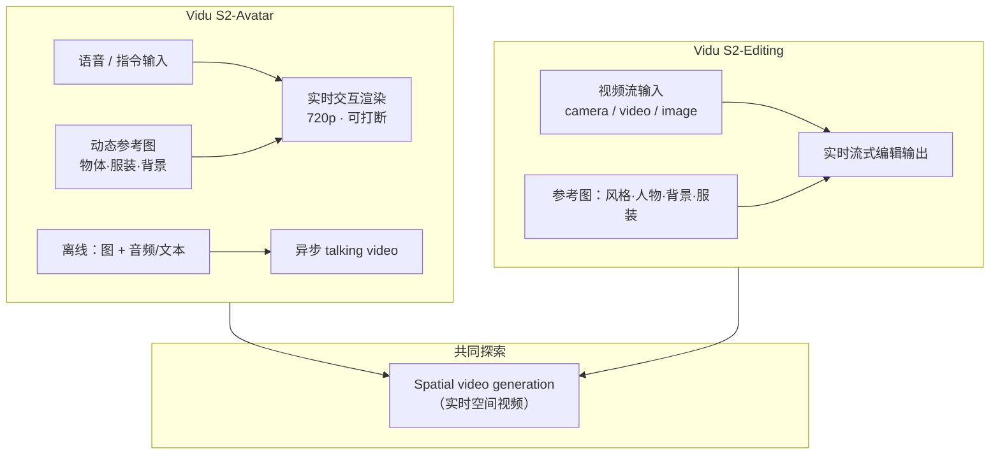

# Vidu S2：实时交互、可编辑与空间视频生成

**Vidu S2**（Zhang et al., arXiv:2609.11638，[项目页 / Demo](https://vidu.com/vidu-stream)）由 **清华大学** 与 **生数科技** 提出，包含 **Vidu S2-Avatar**（实时交互数字角色）与 **Vidu S2-Editing**（实时视频流编辑），并探索二者上的 **实时 spatial video generation**。相对 **Vidu S1**，Avatar 支持 **720p**、流中可更新的 **动态参考图** 与更强 **指令跟随**（如跳舞）；Editing 可对输入 **视频流** 连续做风格、人物、背景与虚拟试衣编辑。论文报告 **优于全部 baselines**；提供 [可玩在线 Demo](https://vidu.com/vidu-stream) 与 [API 平台](https://platform.vidu.com/vidu-stream/doc)。

## 英文缩写速查

| 缩写 | 英文全称 | 简要说明 |
|------|----------|----------|
| GWM | General World Model | 生数「理解–想象–行动」闭环框架；S2 对应 L2 交互世界 |
| NVS | Novel View Synthesis | 新视角/新场景视频合成；spatial 探索相关 |
| API | Application Programming Interface | 官方 `platform.vidu.com` 集成入口 |
| T2V | Text-to-Video | 文本到视频生成（产品线上下文） |
| RTC | Real-Time Chunking | 生数 L3 WAM 部署侧异步策略（与 S2 产品线并列） |

## 为什么重要

- **L2 交互世界的工程化样本：** 在 [GWM 路线图](./paper-gwm-first-principles.md) 中，S1 已代表「输入改变后续生成」；**S2 把交互推到实时流式**（可打断对话 + 流式编辑），是 L2→L3 之间的产品纵深。
- **Renderer 型 WM 的实时边界：** 按 [Fei-Fei 功能分类](../concepts/functional-taxonomy-world-models.md)，S2 仍属 **像素/视频输出** 而非物理仿真或机器人策略，但 **latency 与参考图条件** 已接近「在线环境」叙事。
- **数字人与流媒体编辑合一：** Avatar（语音全链路）与 Editing（camera/video in → edited out）覆盖 **人机交互内容生产** 两条管线，对具身 ** teleop 可视化 / 数字孪生呈现** 有参考意义。
- **复现口径清晰：** **Demo + API 可用、代码未开源** — 选型时勿与 [Motubrain](./paper-motubrain.md) 等 L3 WAM 训练栈混为一谈。

## 核心信息

| 字段 | 内容 |
|------|------|
| 作者 | Jintao Zhang, Kai Jiang, Jintao Chen, … , Jun Zhu 等（35 人，arXiv） |
| 机构 | 清华大学（Tsinghua）· 生数科技（Shengshu Technology） |
| 出处 | arXiv:2609.11638（2026-09-10） |
| 项目 / Demo | <https://vidu.com/vidu-stream> |
| API | <https://platform.vidu.com/vidu-stream/doc> |
| 代码 | **未开源**（截至 2026-09-20；无官方 GitHub / 权重） |
| 开源状态 | **Demo + 商业 API**；训练/推理栈未公开 |

## 流程总览

## 核心原理 / 双子系统

| 子系统 | 输入 | 输出 | 相对 S1 |
|--------|------|------|---------|
| **S2-Avatar** | 实时语音 + 可选参考图 + 指令 | 720p+ 交互数字人；可打断双向感知 | 540p→720p；动态参考图；更强指令（跳舞等） |
| **S2-Editing** | 连续视频流 + 四类参考图 | 实时编辑流（风格/人物/背景/试衣） | 新增 **流式 in/out** 编辑产品线 |

### Avatar：在线 vs 离线

| 模式 | 行为 |
|------|------|
| **在线** | 实时对话、任意时刻打断、参考图 mid-stream 更新 |
| **离线** | 单角色图 + 音频片段或文本 → 口型/动作对齐 talking video |

### Editing：参考图四类

1. **Style** — 风格参考图实时渲染整体美学  
2. **Character** — 人物参考图替换主体  
3. **Background** — 背景参考图替换环境  
4. **Outfit** — 服装参考图虚拟试衣  

## 源码运行时序图

**不适用**（截至 2026-09-20）：官方 **未发布** 可运行训练/推理代码仓；产品路径为 **Web Demo**（`vidu.com/vidu-stream`）与 **API**（`platform.vidu.com/vidu-stream/doc`）。若未来开源，应补：流输入 → Avatar/Editing 分支 → 参考图条件注入 → 实时渲染环 的 `sequenceDiagram`。

## 实验与评测（摘要）

- 论文摘要称 **Vidu S2 优于全部 baselines**（具体指标与对照方法见 [arXiv PDF](https://arxiv.org/pdf/2609.11638)）。
- 产品侧可验证：**在线 Demo** 交互质量、720p Avatar、流式 Editing 延迟与参考图切换连续性。

## 工程实践

| 项 | 说明 |
|----|------|
| **在线体验** | [vidu.com/vidu-stream](https://vidu.com/vidu-stream) — S2-Avatar / S2-Editing 分栏 Demo |
| **API 集成** | [platform.vidu.com/vidu-stream/doc](https://platform.vidu.com/vidu-stream/doc) — quick-start 分 Avatar / Editing |
| **GWM 坐标** | [L2 交互世界](./paper-gwm-first-principles.md) 产品线；L3 真机控制见 [Motubrain](./paper-motubrain.md) |
| **开源状态** | **未开源** — 无权重/训练脚本；评估依赖 Demo 或 API SLA |

## 局限与风险

- **非机器人 WAM：** 输出是 **视频像素**，不含动作 chunk、力矩或 sim-ready 状态；不能替代 [Motubrain](./paper-motubrain.md) / [Motus2](./paper-motus2.md) 类 L3 闭环。
- **闭源复现：** 论文数字无法本地 ablation；baseline 对照需信任作者协议。
- **API 依赖：** 工程集成受 **平台配额、延迟与条款** 约束；与自托管 3DGS/NeRF 栈运维模型不同。
- **spatial 探索：** 摘要强调 feasibility exploration；空间一致性与长时几何稳定性需独立验收。

## 结论

**Vidu S2 把生数 L2 交互世界从「能改生成」推进到「实时流式能改」：Avatar 负责可打断的 720p 语音数字人，Editing 负责不中断流的四参考图编辑，共同探测 spatial video 的实时边界。**

- **选型：** 要 **在线数字人 / 直播级视频编辑** → Demo/API；要 **真机 WAM** → 转 [Motubrain](./paper-motubrain.md) 线，勿混产品线。
- **读 GWM 地图：** 在 [First-Principles](./paper-gwm-first-principles.md) 中把 **S2 接在 S1 后、Motus 前**，看清 L2 产品演进。
- **复现：** 截至入库日 **仅 Demo/API**；写进 wiki 局限，避免误标「已开源」。
- **对比 S1：** 分辨率、动态参考图、跳舞级指令与 **Editing 流式管线** 是验收 S2 的四条硬指标。
- **研究延伸：** spatial video generation 若落地，可能服务 **沉浸式 teleop 视图**；与 [Generative World Models](../methods/generative-world-models.md) 中像素 WM 章节同读。

## 关联页面

- [GWM First-Principles](./paper-gwm-first-principles.md) — L1–L5 与 Vidu 产品线映射
- [Generative World Models](../methods/generative-world-models.md) — 生成式世界模型总览
- [Motubrain](./paper-motubrain.md) — 同机构 L3 Joint WAM
- [Motus2](./paper-motus2.md) — L3 自进化 GWM 实例
- [WAM 实时异步部署](./paper-wam-realtime-async.md) — L3 部署侧 RTC 实证
- [GWM 闭环五篇地图](../overview/gwm-closed-loop-5-papers-technology-map.md)

## 参考来源

- [Vidu S2 论文摘录](../../sources/papers/vidu_s2_arxiv_2609_11638.md)
- [vidu.com/vidu-stream 项目页归档](../../sources/sites/vidu_s2_stream.md)

## 推荐继续阅读

- [Vidu S2 在线 Demo](https://vidu.com/vidu-stream) — 可玩 Avatar / Editing 体验
- [Vidu Stream API 文档](https://platform.vidu.com/vidu-stream/doc) — 集成入口
