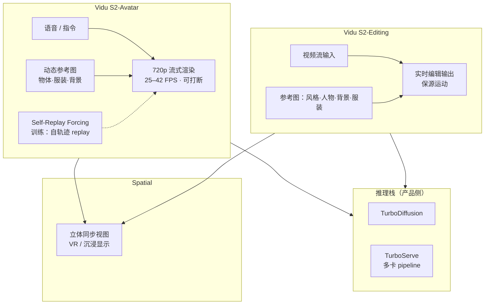
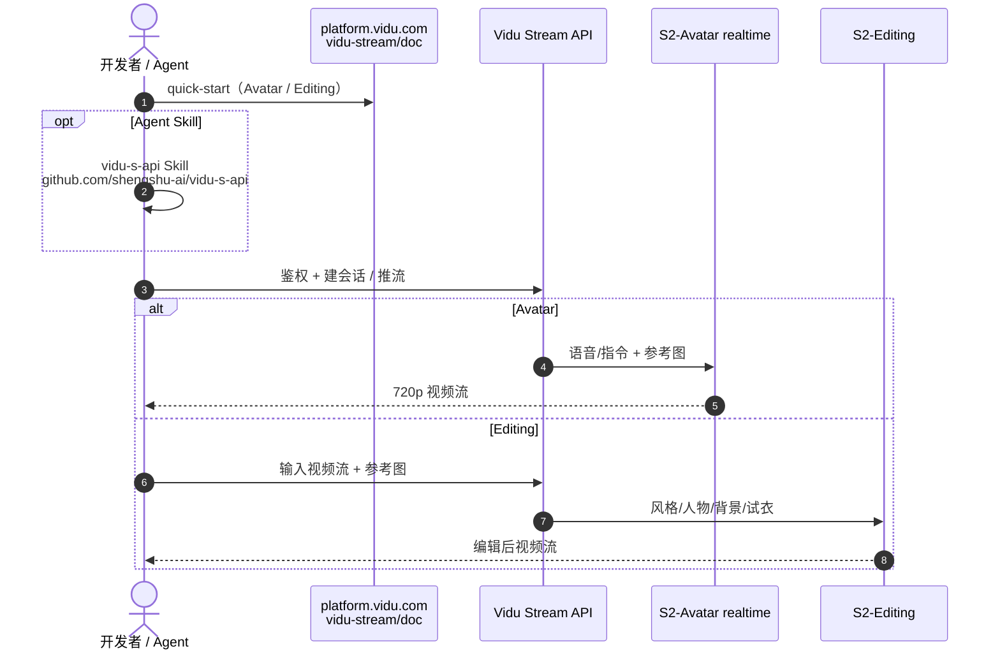

# Vidu S2：实时交互、可编辑与空间视频生成

**Vidu S2**（Zhang et al., [arXiv:2609.11638](https://arxiv.org/abs/2609.11638)，[项目页 / Demo](https://vidu.com/vidu-stream)）由 **清华大学** 与 **生数科技** 提出，包含 **Vidu S2-Avatar**（实时交互数字角色）与 **Vidu S2-Editing**（实时视频流编辑），并探索 **实时 spatial video generation**（同步立体视图，沉浸显示 / VR）。相对 **Vidu S1**，Avatar 升至 **720p（25–42 FPS）**、流中 **动态参考图** 与更强 **指令跟随**（如跳舞）；Editing 对 **视频流** 连续做风格、人物、背景与虚拟试衣编辑。方法侧强调 **Self-Replay Forcing**（长时流式稳定）与 **TurboDiffusion + TurboServe**（低成本 GPU 实时推理）。产品侧提供 [在线 Demo](https://vidu.com/vidu-stream)、[API](https://platform.vidu.com/vidu-stream/doc) 与官方文档仓 [shengshu-ai/Vidu-S](https://github.com/shengshu-ai/Vidu-S)；**模型权重与本地 train/infer 栈截至 2026-09-26 未公开**。

## 英文缩写速查

| 缩写 | 英文全称 | 简要说明 |
|------|----------|----------|
| GWM | General World Model | 生数「理解–想象–行动」闭环；S2 对应 L2 交互世界 |
| NVS | Novel View Synthesis | 新视角合成；spatial stereo 相关 |
| API | Application Programming Interface | `platform.vidu.com/vidu-stream` 集成 |
| SRF | Self-Replay Forcing | 训练 replay 自生成轨迹以减流式误差累积 |
| VR | Virtual Reality | spatial 立体输出目标场景之一 |

## 为什么重要

- **L2 交互世界的工程化样本：** 在 [GWM 路线图](./paper-gwm-first-principles.md) 中，S1 代表「输入改变后续生成」；**S2 把交互推到实时流式**（可打断 + 流式编辑 + spatial），是 L2→L3 之间的产品纵深。
- **Renderer 型 WM 的实时边界：** 按 [Fei-Fei 功能分类](../concepts/functional-taxonomy-world-models.md)，S2 仍属 **像素/视频输出**，但 **latency、SRF 长时稳定与参考图条件** 已接近「在线环境」叙事。
- **训练–部署叙事可对照：** SRF 针对 **流式分段误差**；TurboDiffusion/TurboServe 针对 **推理成本** — 机器人读者可类比 **chunk 策略 + 推理加速**，但 **无开源权重** 暂无法 ablation。
- **复现口径（2026-09-26）：** **Demo + API + GitHub 文档仓**；**非** 自托管 Motubrain 类训练栈。

## 核心信息

| 字段 | 内容 |
|------|------|
| 作者 | Jintao Zhang, Kai Jiang, Jintao Chen, … , Jun Zhu 等（35 人，arXiv） |
| 机构 | 清华大学（Tsinghua）· 生数科技（Shengshu Technology） |
| 出处 | arXiv:2609.11638（2026-09-10）· [HF Papers](https://huggingface.co/papers/2609.11638) |
| 项目 / Demo | <https://vidu.com/vidu-stream> |
| API | <https://platform.vidu.com/vidu-stream/doc> |
| GitHub | [shengshu-ai/Vidu-S](https://github.com/shengshu-ai/Vidu-S)（README / 图 / 文档索引） |
| 开源状态 | **部分开源** — 文档仓 + Demo/API；**无** 公开权重与本地推理代码 |

## 流程总览

## 核心原理 / 双子系统

| 子系统 | 输入 | 输出 | 相对 S1 |
|--------|------|------|---------|
| **S2-Avatar** | 实时语音 + 参考图 + 指令 | 720p 交互数字人；可打断 | 540p→720p；SRF 长时流；跳舞级指令 |
| **S2-Editing** | 连续视频流 + 四类参考图 | 实时编辑流 | 新增 **流式 in/out** 管线 |
| **Spatial** | Avatar/Editing 之上 | 同步 stereo | 探索 **immersive / VR** |

### Editing：参考图四类

1. **Style** — 风格参考图  
2. **Character** — 人物替换  
3. **Background** — 背景替换  
4. **Outfit** — 虚拟试衣  

## 源码运行时序图

**本地模型推理：不适用** — 无公开 checkpoint / `train`·`infer` 入口（[Vidu-S 仓](https://github.com/shengshu-ai/Vidu-S) 为文档与概览）。

**官方 API 集成路径**（可运行，商业 API + 文档）：

## 实验与评测（摘要）

- 论文摘要称 **Vidu S2 优于全部 baselines**（指标与对照见 [PDF](https://arxiv.org/pdf/2609.11638)）。
- 产品可验：**Demo** 交互、720p Avatar FPS、Editing 延迟与 mid-stream 换参考图。

## 与其他工作对比

| 维度 | 读法 |
|------|------|
| **文内基线** | 摘要「优于全部 baselines」须回 PDF；本页不转存数值 |
| **与 S1** | 720p、SRF、Editing 流式管线、spatial stereo 为四条硬指标 |
| **与 Motubrain** | S2 = L2 视频 WM；Motubrain = L3 真机 WAM，勿混产品线 |
| **开源横比** | 2026-09-26：**无权重** — 仅 Demo/API/文档仓可验 |

## 工程实践

| 项 | 说明 |
|----|------|
| **在线体验** | [vidu.com/vidu-stream](https://vidu.com/vidu-stream) |
| **API** | [platform.vidu.com/vidu-stream/doc](https://platform.vidu.com/vidu-stream/doc) |
| **文档仓** | [GitHub Vidu-S](https://github.com/shengshu-ai/Vidu-S) + Feishu 用户指南（README 链） |
| **Agent 集成** | [vidu-s-api Skill](https://github.com/shengshu-ai/vidu-s-api/tree/main/skills/vidu-s-api) |
| **GWM 坐标** | [L2 交互世界](./paper-gwm-first-principles.md) |

## 局限与风险

- **非机器人 WAM：** 输出为 **视频像素**，不含动作 chunk 或 sim 状态。
- **闭源权重：** SRF / Turbo 栈无法本地 ablation；数字依赖 PDF 与 Demo。
- **API 依赖：** 配额、延迟、条款约束自托管运维模型。
- **spatial：** 摘要为 feasibility；长时几何一致性需独立验收。

## 结论

**Vidu S2 把生数 L2 从「能改生成」推到「720p 实时流式能改 + spatial 探索」，SRF 与 Turbo 栈解决长时流与推理成本，但工程复现仍绑定 Demo/API，GitHub 仅为文档入口。**

- **选型：** 在线数字人 / 直播级编辑 → Demo 或 API；真机 WAM → [Motubrain](./paper-motubrain.md)。
- **开源读法（2026-09-26）：** **部分** — [Vidu-S](https://github.com/shengshu-ai/Vidu-S) ≠ 权重发布；勿标「已开源可自托管推理」。
- **验收 S2 vs S1：** 720p+FPS、SRF 长时稳定、Editing 流式、spatial stereo。
- **研究延伸：** spatial 若成熟，可服务 **immersive teleop 视图**；与 [Generative World Models](../methods/generative-world-models.md) 同读。

## 关联页面

- [GWM First-Principles](./paper-gwm-first-principles.md)
- [Generative World Models](../methods/generative-world-models.md)
- [Motubrain](./paper-motubrain.md) · [Motus2](./paper-motus2.md)
- [WAM 实时异步部署](./paper-wam-realtime-async.md)
- [GWM 闭环五篇地图](../overview/gwm-closed-loop-5-papers-technology-map.md)

## 参考来源

- [Vidu S2 论文摘录](../../sources/papers/vidu_s2_arxiv_2609_11638.md)
- [vidu.com/vidu-stream 项目页归档](../../sources/sites/vidu_s2_stream.md)
- [Vidu-S GitHub 归档](../../sources/repos/vidu-s.md)

## 推荐继续阅读

- [Vidu S2 Demo](https://vidu.com/vidu-stream)
- [Vidu Stream API](https://platform.vidu.com/vidu-stream/doc)
- [shengshu-ai/Vidu-S（GitHub）](https://github.com/shengshu-ai/Vidu-S)
- [Hugging Face Papers 2609.11638](https://huggingface.co/papers/2609.11638)
