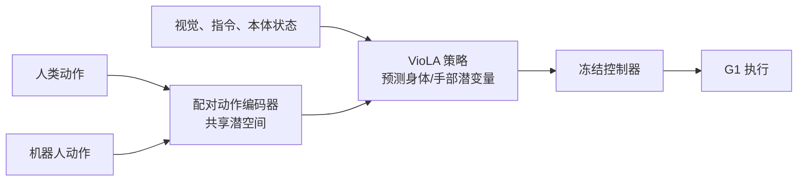

# VioLA：从人类数据学习人形通用控制

**VioLA** 将人类动作数据转成机器人可执行的身体与手部运动潜变量，以预训练控制器作为动作解码器，降低通用策略对机器人关节级示范的依赖。

## 英文缩写速查

| 缩写 | 英文全称 | 简要说明 |
|---|---|---|
| VioLA | Vision-language locomotion and action | 人类数据驱动的人形通用控制框架 |
| VLA | Vision-Language-Action | 视觉、语言条件下生成机器人动作的策略范式 |
| WAM | World Action Model | 结合环境未来预测与动作生成的模型类别 |
| G1 | Unitree G1 Humanoid Robot | 论文报告的真机评测平台 |

## 方法栈

人类骨架与机器人关节空间不同，人体姿态不能直接当作机器人关节目标。VioLA 用配对动作编码器将 human/robot motion 放到共享潜空间。策略以视觉、指令和本体状态为条件，输出分块的身体与手部运动潜变量；冻结的预训练控制器将其解码执行。该接口把跨具身迁移问题从逐关节 retargeting 转向表征对齐与潜变量可执行性。

论文报告训练池 140.6M 帧，93.2% 来自人类数据；这不是机器人真机交互帧数。

## 流程总览

## 评测

| 任务 | 论文报告 | 解读 |
|---|---:|---|
| G1 locomotion | 100% 成功率 | 限论文所用任务与协议 |
| G1 manipulation | 88.6% 成功率 | 示例含关笔记本、挂衣服、转椅 |
| 训练池 | 140.6M 帧；93.2% 人类 | 数据来源占比，不代表机器人帧占比 |

摘要与 GR00T N1.7、Psi_0 的比较依赖特定任务协议与模型版本，不宜外推成普遍基准排名。

## 与其他工作对比

| 路线 | 动作接口 | 主要依赖 |
|---|---|---|
| 直接关节策略 | 机器人关节目标 | 机器人动作标签 |
| 运动重定向 | 人体骨架映射姿态 | retargeting 与跟踪控制 |
| VioLA | human/robot 共享潜变量 | 对齐表示与预训练身体/手部控制器 |

## 源码运行时序图

**不适用：** 截至 2026-10-11 未核实到官方可运行代码或公开 checkpoint；论文仅承诺未来发布。

## 结论

**结论：** VioLA 的关键是让策略预测既能吸收人类动作、又能由现成人形控制器执行的共享潜变量。

1. 已有稳定身体与手部控制器时，潜变量接口可扩大可利用的人类动作来源。
2. 93.2% 人类帧显示数据来源结构，不证明跨任务泛化。
3. G1 报告结果应结合样本量、成功定义和基线协议解读。
4. 主要风险从关节 retargeting 转为潜空间对齐及控制器覆盖边界。
5. 代码与权重待发布，目前不是可直接复现的开源基线。

## 局限与风险

- 依赖预训练控制器的动作范围、延迟和任务覆盖。
- 共享潜空间对齐质量决定人类动作是否可执行。
- 摘要结果不足以判断样本量、置信区间和失败类型。
- 论文称代码/checkpoint 将发布；截至入库日无已核实下载入口。

## 关联页面

- [VLA 方法总览](../methods/vla.md)
- [World Action Models](../concepts/world-action-models.md)
- [人形策略网络架构](../concepts/humanoid-policy-network-architecture.md)
- [人形机器人移动](../tasks/humanoid-locomotion.md)

## 参考来源

- [论文摘录](../../sources/papers/viola_arxiv_2610_12435.md)
- [项目页核查](../../sources/sites/viola-project.md)
- [arXiv](https://arxiv.org/abs/2610.12435)
