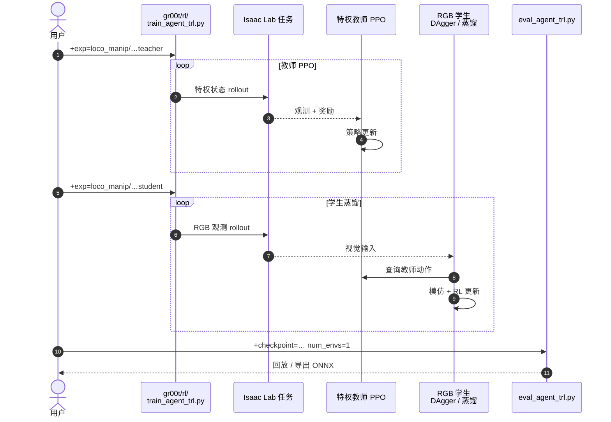

---

type: entity
tags: [paper, humanoid, sim2real, visual-rl, loco-manipulation, teacher-student, dagger, ppo, unitree-g1, isaac-lab, cvpr2026, nvidia, cmu, berkeley, cuhk, body-system-stack]
status: complete
updated: 2026-07-24
arxiv: "2511.15200"
venue: "CVPR 2026"
code: https://github.com/NVlabs/GR00T-VisualSim2Real
related:
  - ../overview/humanoid-rl-motion-control-body-system-stack.md
  - ../overview/humanoid-amp-motion-prior-survey.md
  - ./paper-doorman-opening-sim2real-door.md
  - ./gr00t-visual-sim2real.md
  - ./tairan-he.md
  - ../concepts/sim2real.md
  - ../concepts/privileged-training.md
  - ../concepts/domain-randomization.md
  - ../concepts/system-identification.md
  - ../concepts/whole-body-control.md
  - ../methods/imitation-learning.md
  - ../tasks/loco-manipulation.md
  - ./unitree-g1.md
  - ./isaac-gym-isaac-lab.md
sources:
  - ../../sources/papers/viral-humanoid-visual-sim2real.md
  - ../../sources/papers/humanoid_rl_stack_28_viral_visual_sim_to_real_at_scale_for_humanoid_l.md
  - ../../sources/papers/humanoid_rl_stack_42_catalog.md
  - ../../sources/blogs/wechat_embodied_ai_lab_humanoid_rl_motion_survey.md
summary: "VIRAL（arXiv:2511.15200，CVPR 2026）给出人形 loco-manipulation 的视觉 Sim2Real 全栈配方：PPO 特权教师以 delta 命令驱动预训练 WBC，大规模分块渲染仿真中用 DAgger+BC 蒸馏 RGB 学生，并结合 SysID、相机对齐与强视觉域随机化在 Unitree G1 上零样本部署。"
---

# VIRAL（Visual Sim-to-Real at Scale for Humanoid Loco-Manipulation）

**VIRAL** 是一篇面向 **人形机器人 loco-manipulation** 的 **视觉 Sim2Real** 系统论文（arXiv:2511.15200，CVPR 2026）：策略 **完全在仿真中训练**，以 **机载 RGB + 本体感知** 在 **Unitree G1** 上 **零样本真机** 执行多步行走–放置–抓取–转向循环。作者强调贡献是 **「全栈技术配方 + 规模化」**——何种设计有效、何处失效、如何相互作用——而非单一新 RL 公式。

## 英文缩写速查

| 缩写 | 英文全称 | 简要说明 |
|------|----------|----------|
| Sim2Real | Simulation to Real | 把仿真中学到的策略迁移落地真机的工程主线 |
| PPO | Proximal Policy Optimization | 人形/足式 locomotion 中最常用的 on-policy 策略梯度算法 |
| WBC | Whole-Body Control | 协调全身关节满足多任务/约束的控制基础设施 |
| DAgger | Dataset Aggregation | 迭代收集策略诱导状态下的专家标注以纠偏的模仿学习方法 |
| BC | Behavior Cloning | 将状态映射到动作的监督式模仿，易受分布偏移影响 |
| RGB | Red-Green-Blue | 彩色图像通道，常与深度 (RGB-D) 配合 |
| SysID | System Identification | 系统辨识，估计物理/动力学参数 |
| G1 | Unitree G1 Humanoid | 宇树入门级教育科研人形平台 |
| Manipulation | Robot Manipulation | 抓取、移动、操作物体的任务总称 |
| RL | Reinforcement Learning | 通过与环境交互最大化长期回报来学习策略的范式 |
| GPU | Graphics Processing Unit | 图形处理器，大规模并行仿真训练的算力基础 |
| API | Application Programming Interface | 应用程序编程接口 |
| MLP | Multi-Layer Perceptron | 多层感知机，处理本体向量等低维输入 |
| IL | Imitation Learning | 从专家演示学习策略，奖励难定义时的主路线 |
| VLA | Vision-Language-Action | 视觉-语言-动作多模态基础策略方向 |
| Isaac Gym | NVIDIA Isaac Gym | GPU 并行刚体仿真训练环境 |
| Isaac Lab | NVIDIA Isaac Lab | 基于 Omniverse 的机器人学习训练框架 |

## 为什么重要

- **问题对准**：多数工作将 **盲走**、**固定基座操作** 或 **重度遥操作 / 非机载传感** 分开；VIRAL 针对 **机载视觉下的移动操作** 长时域闭环。
- **算力与可复现性**：论文通过 scaling study 论证 **并行 GPU 数量** 对教师与学生阶段 **成功率与稳定性** 的关键作用（学生训练可达 **64 GPU** 量级与 **分块渲染**）。
- **工程闭环完整**：从 **特权教师**、**蒸馏混合策略** 到 **灵巧手 SysID** 与 **相机外参对齐**，与 [GR00T-VisualSim2Real](./gr00t-visual-sim2real.md) 开源栈叙事一致，便于对照实现细节。
- **姊妹工作**：同仓 [DoorMan（论文实体）](./paper-doorman-opening-sim2real-door.md) 聚焦 **铰接门 loco-manipulation** 与 **GRPO 自举**，与 VIRAL 的 **规模化并行 + delta-WBC 教师** 形成互补阅读。

## Survey 坐标（策展索引）

### 在 42 篇 RL 运动控制身体系统栈中

| 字段 | 内容 |
|------|------|
| 编号 | 28/42 |
| 系统栈层 | 04 视觉闭环 · 任务接口 · 世界模型 |
| 索引来源 | [具身智能研究室 · 42 篇 humanoid RL 运动控制长文](https://mp.weixin.qq.com/s/hz9JXtJeUPRfUGzfD-pZuA) |

## 核心机制（归纳）

### 教师（privileged RL）

- **算法**：PPO；分布式 TRL 自定义实现。
- **动作**：对预训练 **HOMIE** 类 **WBC** 发送 **delta 命令**（平面线速度、yaw、臂与手指关节增量），将低层稳定运动收口为「安全 API」。
- **观测**：特权本体（速度、重力投影、上一动作、关节状态、指尖力等）+ 特权外感受（任务阶段、放置/抬起目标、物体与桌相对位姿等）。
- **任务分解奖励**：行走接近抓取物、靠近托盘时放置、抓取抬升与朝向目标、转向等分段 shaping。
- **Reference State Initialization（RSI）**：用约 **200 条** 仿真遥操作轨迹作 reset buffer，每回合从演示快照初始化场景，缓解长时域探索与脆弱奖励调参（与仓库中 [GR00T-VisualSim2Real](./gr00t-visual-sim2real.md) 所述 RSI 一致）。

### 学生（RGB 蒸馏）

- **数据混合**：**在线 DAgger** 与 **行为克隆（BC）** 共用 MSE 模仿教师动作；在教师诱导与学生诱导的观测分布上做 **凸组合（α，默认 0.5）**——BC 快速 imprint，DAgger 覆盖学生自身会遇到的分布，减轻复合误差。
- **视觉**：**DINOv3** 等强视觉骨干 + 本体；消融 **历史编码**（含 LSTM）相对单步 MLP。
- **系统**：定制 TRL + Accelerate，追求多节点 **近线性扩展** 以撑住视觉仿真吞吐。

### Sim2Real 对齐与随机化

- **灵巧手 SysID**：针对 **高减速比三指** 手，在真机重复抓放 primitive，与仿真对齐 **armature / 刚度 / 阻尼**，显著改善关节轨迹重合度。
- **相机**：匹配内参规格；**外参** 做轻量 **real-to-sim** 视觉对齐，并在训练中 **外参随机化** 抗单元差异与漂移。
- **视觉 / 场景随机化**：光照、材质、图像质量（亮度对比度噪声模糊等）、**传感器延迟**、场景资产等多维随机化；消融表明 **材质、穹顶光、相机外参** 等主项互补，全关时成功率大幅下降。

### 真机结果（论文报告）

- **连续试验**：59 次中 **54 次成功**（约 **91.5%**），与 [GR00T-VisualSim2Real](./gr00t-visual-sim2real.md) 页中引用的统计一致。
- **与遥操作对比**：在相同 HOMIE 底层下，相对 **专家** 成功率接近且 **周期时间更短**；显著优于 **非专家** 遥操作。

## 源码运行时序图

官方代码在 [NVlabs/GR00T-VisualSim2Real](https://github.com/NVlabs/GR00T-VisualSim2Real)（与 DoorMan 同仓）：教师 / 学生均经 `gr00t/rl/train_agent_trl.py`（Hydra `+exp=loco_manip/...`），评测与导出用 `gr00t/rl/eval_agent_trl.py`。VIRAL 走 **特权教师 PPO → RGB 学生蒸馏**。一次完整运行如下（exp 名以仓库为准）：

- **同仓多论文**：换 Hydra exp 切换 VIRAL / DoorMan 等配方，共享 `gr00t/rl` 基础设施。
- **教师不部署**：真机只跑视觉学生策略。

## 常见误区或局限

- **算力前提**：低并行度训练在论文消融中 **易失败**；阅读时需把 **集群规模** 与 **分块渲染** 当作方法的一部分，而非仅算法超参。
- **WBC 依赖**：教师依赖 **预训练 WBC 接口**；更换人形栈需重新对齐命令空间与安全区域，但框架声明 **不绑定特定 WBC 实现**。

## 关联页面

- [GR00T-VisualSim2Real](./gr00t-visual-sim2real.md) — NVlabs 开源实现与 DoorMan 姊妹工作
- [DoorMan（论文实体）](./paper-doorman-opening-sim2real-door.md) — arXiv:2512.01061，铰接 loco-manipulation 与 GRPO 自举
- [LEGS（论文实体）](./paper-legs-embodied-gaussian-splatting-vla.md) — 同为 G1 loco-manip 数据路线：VIRAL 走 RL 蒸馏，LEGS 走 3DGS 合成 IL 微调 VLA（arXiv:2606.01458）
- [OASIS（论文实体）](./paper-loco-manip-04-oasis.md) — 仿真 teleop + 视觉域随机化 + Flow Matching 层级策略（arXiv:2606.08548）
- [Tairan He](./tairan-he.md) — 作者侧总索引
- [Sim2Real](../concepts/sim2real.md)
- [Privileged Training](../concepts/privileged-training.md)
- [Domain Randomization](../concepts/domain-randomization.md)
- [System Identification](../concepts/system-identification.md)
- [Whole-Body Control](../concepts/whole-body-control.md)
- [Imitation Learning](../methods/imitation-learning.md)
- [Loco-Manipulation](../tasks/loco-manipulation.md)
- [Unitree G1](./unitree-g1.md)
- [Isaac Gym / Isaac Lab](./isaac-gym-isaac-lab.md)
- [人形 RL 身体系统栈](../overview/humanoid-rl-motion-control-body-system-stack.md) — 42 篇栈总框架（本文 #28/42）
- [AMP 运动先验专题](../overview/humanoid-amp-motion-prior-survey.md) — 姊妹篇总览

## 实验与评测

- 量化指标、消融与 sim2real / 实机结果见 **原文 PDF** 与 [参考来源](#参考来源)；本页正文侧重方法结构与知识库交叉引用。

## 结论

**机载视觉 loco-manip 的可迁移性取决于「特权教师 + 规模化蒸馏 + SysID/外参对齐」整条闭环；低并行度不是小超参问题，而是方法前提。**

1. **真机主数字** — 连续试验 **59** 次中 **54** 次成功（约 **91.5%**）；同 HOMIE 底层下接近专家遥操作成功率且周期更短，显著优于非专家。
2. **教师动作是 delta-WBC，不是从零力矩** — 对预训练 HOMIE 类 WBC 发平面速度/yaw/臂指增量，把稳定运动收口为安全 API。
3. **学生用 DAgger∪BC 凸组合** — \(\alpha\) 默认 **0.5**：BC 快速 imprint，DAgger 覆盖学生自诱导分布，减轻复合误差。
4. **RSI 缓解长时域探索** — 约 **200** 条仿真遥操作轨迹作 reset buffer，从演示快照初始化。
5. **Sim2Real 三项要对齐** — 灵巧手 SysID（armature/刚度/阻尼）、相机外参 real-to-sim + 训练期随机化、材质/穹顶光等主项互补；全关随机化时成功率大幅下降。
6. **算力是方法一部分** — 学生训练可达 **64 GPU** 量级与分块渲染；低并行度消融易失败；真机只部署视觉学生。

## 与其他工作对比

- 正文已给出与相邻路线 / baseline 的 **定性对照**；定量表格与 ablation 见原文（[参考来源](#参考来源)）。

## 参考来源

- [sources/papers/viral-humanoid-visual-sim2real.md](../../sources/papers/viral-humanoid-visual-sim2real.md)
- He, Wang, Xue, Ben, Luo, Xiao, Yuan, Da, Castañeda, Sastry, Liu, Shi, Fan, Zhu, *VIRAL: Visual Sim-to-Real at Scale for Humanoid Loco-Manipulation*, arXiv:2511.15200v1, 2025. <https://arxiv.org/abs/2511.15200v1>
- [humanoid_rl_stack_28_viral_visual_sim_to_real_at_scale_for_humanoid_l.md](../../sources/papers/humanoid_rl_stack_28_viral_visual_sim_to_real_at_scale_for_humanoid_l.md) — 42 篇栈策展摘录
- [humanoid_rl_stack_42_catalog.md](../../sources/papers/humanoid_rl_stack_42_catalog.md) — 42 篇总表
- [wechat_embodied_ai_lab_humanoid_rl_motion_survey.md](../../sources/blogs/wechat_embodied_ai_lab_humanoid_rl_motion_survey.md) — 微信公众号编译导读

## 推荐继续阅读

- [VIRAL 项目主页](https://viral-humanoid.github.io/)
- [NVlabs/GR00T-VisualSim2Real](https://github.com/NVlabs/GR00T-VisualSim2Real) — 官方代码与复现配置
