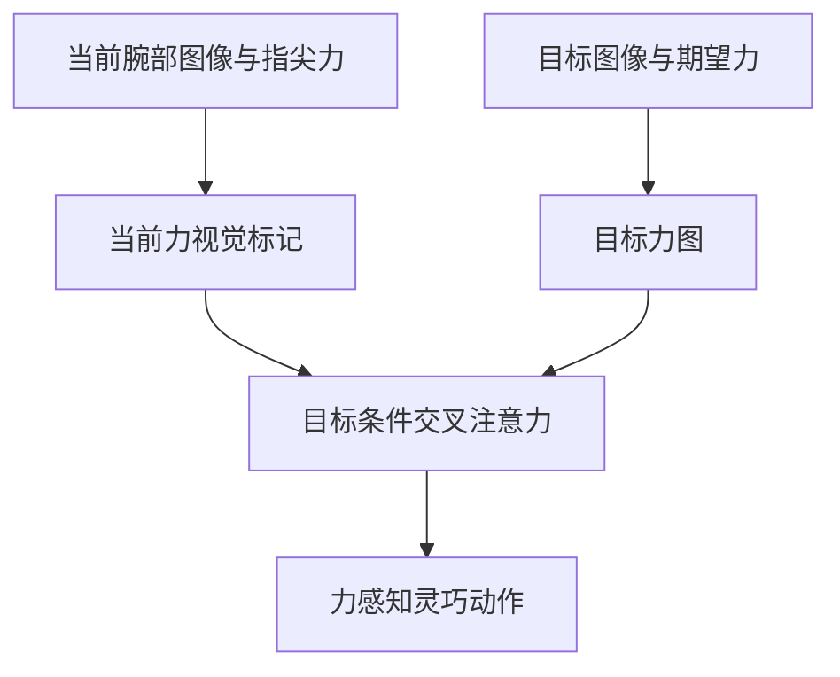

# VisForce：视觉对齐当前力与目标力

## 一句话定义

VisForce 把当前指尖力和子任务目标力渲染至对应视觉图像，再用目标条件策略生成力感知操作动作。

## 英文缩写速查

| 缩写 | 英文全称 | 说明 |
|---|---|---|
| VLA | Vision-Language-Action | 视觉-语言-动作模型，本文以 π0.5 为骨干 |
| CA | Cross-Attention | 当前腕部 token 关注目标图前景 token 的交叉注意力 |
| SR | Success Rate | 成功率，论文附 95% Wilson 置信区间 |

## 流程总览

## 方法与证据

论文以 π0.5 VLA 为骨干：在 MuJoCo 中复现真机构型并对齐仿真/真实腕部相机外参（hand-mask IoU + 边缘 Chamfer 损失，Differential Evolution 粗搜后 Powell 精调），把每根手指的执行器力渲染为指尖处沿法向的视觉箭头并叠加到真实腕部图像；期望力以同样方式渲染到按子任务离线检索的前景目标图上。两路图像与外部相机图像共用 SigLIP 编码器，再经单个带前景掩码的目标条件交叉注意力块（8 头，pre-LN + FFN）融合，输出 12 维 delta 关节动作块（6 臂关节 + 6 手关节）。实验全部在 UR10 + Inspire RH56F1 灵巧手真机上完成；它不是人形全身控制器。

## 实验与评测

- **平台（论文报告）：** UR10 6-DoF 机械臂 + Inspire RH56F1 6-DoF 灵巧手，腕部与外部各一台 RealSense D405；策略推理在 RTX A6000 工作站上运行。仅真机实验，无仿真评测基准（MuJoCo 只用于力渲染）。
- **数据：** 图像 30 Hz、状态/动作/力 200 Hz，按相机时间戳最近邻对齐；T1–T4 各采集 30 / 25 / 30 / 30 条示教。骨干 VLM 与 action expert 用 LoRA（r=16）微调，SigLIP 编码器与交叉注意力模块全参训练。
- **任务：** T1 力条件抓取（刚体 / 鸡蛋 / 牙膏管，低-中-高三档期望力）；T2 杯子插入 + 瓶子倾倒（强力抓握时指尖大面积被遮挡）；T3 夹子辅助面包转移（保持工具接触下多次改变力）；T4 滑移调制插孔（低力滑移扶正销钉后加大力插入 1 mm 间隙孔）。
- **对照组：** 同数据、同动作表示、同骨干，仅改变力的表示方式——π0.5（无力、无目标图）、State Force + Text Force Goal（力拼接到状态，期望力写进语言提示）、Visual Force + Text Force Goal（当前力可视化，期望力仍为文本）、VisForce w/o CA（目标图 token 直接拼接，不用交叉注意力）。
- **T1 结果（论文报告）：** 刚体实验中 VisForce 的执行器合力随期望力三档清晰分离，对照组区分度有限；中档期望力下鸡蛋 / 牙膏管抓起成功率 70% / 80%，Visual Force + Text Force Goal 为 40% / 20%，State Force + Text Force Goal 为 35% / 5%。
- **T2–T4 最终成功率（论文报告，每任务 20 次）：** T2 为 70%（Visual Force + Text Force Goal 65%，π0.5 与 State Force 均 20%）；T3 为 55%（对照 20% / 5% / 5%）；T4 为 40%（对照 20% / 5% / 5%）。95% Wilson 区间较宽，如 T4 VisForce 为 21.9–61.3%。
- **消融（论文报告）：** 同样输入下去掉交叉注意力（VisForce w/o CA）在 T2 / T3 / T4 仅 10% / 5% / 15%，说明当前-目标融合方式是主要增益来源之一。

## 与其他工作对比

| 对照 | 区别 | 取舍 |
|---|---|---|
| [ForceVLA](./paper-forcevla.md) | 把力/力矩作为独立模态经 force-aware MoE 融入 VLA；VisForce 把逐指执行器力画到图像上走视觉通路 | VisForce 获得指尖空间对应、无需新增力编码器，但依赖仿真-真实相机对齐与手部运动学渲染 |
| [Tactile-VLA](./paper-sa-2507-09160-tactile-vla-unlocking-vision-language-action-mod.md) / [VLA-Touch](./paper-sa-2507-17294-vla-touch-enhancing-vision-language-action-model.md) | 以触觉信号或触觉条件控制器增强 VLA；VisForce 只用灵巧手执行器力，不需要触觉传感器 | 硬件门槛低，但执行器力只是标量估计，分辨率低于触觉阵列 |
| [ImplicitRDP](./paper-implicitrdp-visual-force-diffusion-policy.md) | 端到端视觉-力扩散策略，力作为独立时序输入、强调慢-快反应；VisForce 是 VLA 上的目标条件化，按子任务给定期望力 | VisForce 能显式指定“该用多大力”，但期望力需人工按子任务设定，闭环反应速度未专门评估 |
| 视觉目标 / 子目标方法（如 π0.5 + 目标图） | 目标图只描述手-物构型，期望力不在视觉条件中；论文的 State/Visual Force + Text Force Goal 对照即属此类 | 把期望力渲染进目标图后 T3/T4 增益明显，但目标图需离线制作并在推理时按子任务检索 |

## 局限与风险

- 全部结论来自单一 UR10 + RH56F1 平台、每任务 20 次真机试验，置信区间宽；未报告跨物体、跨场景泛化。
- 力可视化依赖 MuJoCo 中手部模型与相机外参的精确对齐，换手或相机位姿漂移需重新标定。
- 期望力（Table I/II，单位 N）与目标图按子任务人工设定，推理时由用户指定当前子任务，尚非自主的力规划。
- 代码开放状态以论文和官方项目页为准。

## 结论

- 把逐指力“画”进腕部图像，让 VLA 用视觉通路理解力，在指尖遮挡场景（T2）下比把力拼到状态向量更可靠。
- 期望力以视觉目标而非文本数字给出，是 T3/T4 力切换类任务的主要增益；目标条件交叉注意力相较直接拼接差距显著。
- 结果仅为受控真机展示，不应视为开放场景下通用的力感知操作能力。

## 关联页面

- [操作任务](../tasks/manipulation.md)
- [TF-ART：触觉和力觉学习综述](./paper-tf-art-tactile-force-survey.md)

## 参考来源

- [来源档案](../../sources/papers/visforce_arxiv_2609_25785.md)
- [arXiv:2609.25785](https://arxiv.org/abs/2609.25785)

## 推荐继续阅读

- [Day 4：移动操作](../overview/humanoid-motion-intelligence-day4-loco-manipulation.md)
