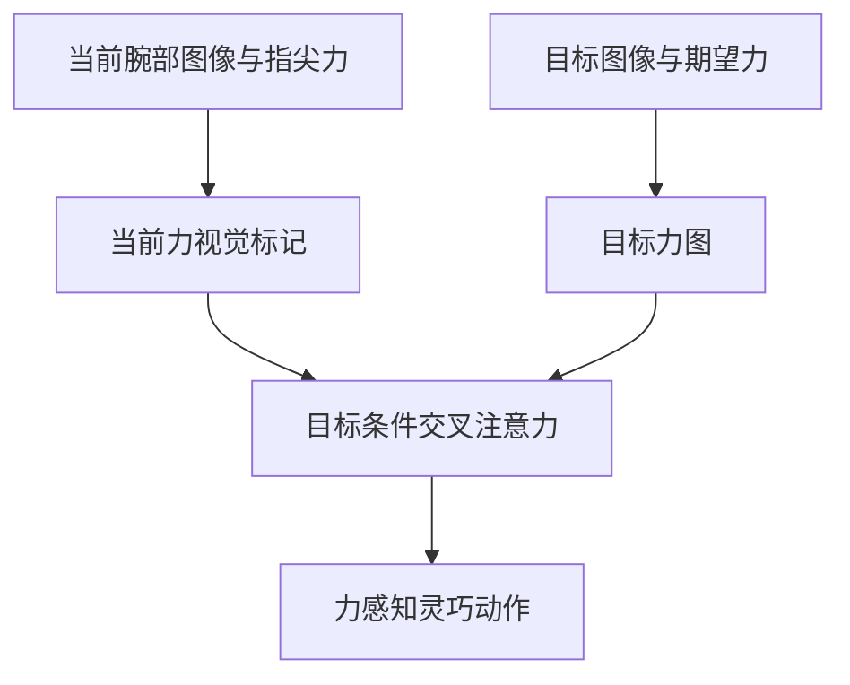

# VisForce：视觉对齐当前力与目标力

## 一句话定义

VisForce 把当前指尖力和子任务目标力渲染至对应视觉图像，再用目标条件策略生成力感知操作动作。

## 英文缩写速查

| 缩写 | 英文全称 | 说明 |
|---|---|---|
| WBC | Whole-Body Control | 全身协调控制 |
| RL | Reinforcement Learning | 强化学习策略训练 |
| G1 | Unitree G1 Humanoid | 相关论文的真机平台 |

## 流程总览

## 方法与证据

论文在 UR10 与 RH56F1 灵巧手上评估力条件抓取及多阶段操作。arXiv 摘要报告鸡蛋/牙膏管抓取，以及插入、倾倒、工具递送和滑移控制任务；它不是人形全身控制器。

## 局限与风险

结果依赖训练覆盖、机器人配置、传感器和论文中的任务协议。文章摘要可辅助定位；定量结果与代码开放状态应以论文和官方项目页为准。

## 结论

- 识别策略接收的目标和部署时实际可见的观测。
- 区分仿真评测、受控真机展示与开放场景能力。
- 结合接触、身体平衡和任务进度评估，不用单一成功率代表通用性。

## 关联页面

- [操作任务](../tasks/manipulation.md)
- [TF-ART：触觉和力觉学习综述](./paper-tf-art-tactile-force-survey.md)

## 参考来源

- [来源档案](../../sources/papers/visforce_arxiv_2609_25785.md)
- [arXiv:2609.25785](https://arxiv.org/abs/2609.25785)

## 推荐继续阅读

- [Day 4：移动操作](../overview/humanoid-motion-intelligence-day4-loco-manipulation.md)
