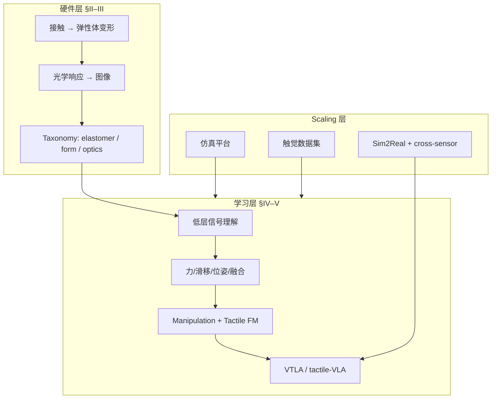

# Vision-Based Tactile Intelligence：VBTS 综述（arXiv:2608.15490）

**Vision-Based Tactile Intelligence for Robotics: Sensing, Learning, and Embodied Manipulation**（[arXiv:2608.15490](https://arxiv.org/abs/2608.15490)，Peng Zhou 等 · **港大 / 清华 / NTU / KTH** 等多机构）将 VBTS **硬件 taxonomy**、**分层触觉智能学习** 与 **仿真–数据集–sim2real** scaling 层作为 **一体化 sensing-and-learning 系统** 综述，并讨论 open challenges。

## 一句话定义

**把 VBTS 从「传感器子话题」读成 embodied intelligence 的三层栈——硬件光学/弹性体 taxonomy、低层信号到 foundation model 的学习层次、以及仿真与数据集 scaling 基础设施。**

## 英文缩写速查

| 缩写 | 英文全称 | 简要说明 |
|------|----------|----------|
| VBTS | Vision-Based Tactile Sensing | 视觉式触觉传感 |
| Sim2Real | Simulation to Real | 仿真到真机迁移 |
| SSL | Self-Supervised Learning | 触觉 foundation 预训练（如 Sparsh） |
| VTLA | Vision-Tactile-Language-Action | 视触觉语言动作策略族 |
| FM | Foundation Model | 触觉基础模型章节 |
| CRM | Contact-Rich Manipulation | 接触丰富操作 |

## 核心信息

| 项 | 内容 |
|----|------|
| 类型 | **Survey**（arXiv 2026） |
| 机构 | Great Bay University；HKU；Tsinghua；NTU；PolyU；KTH；KCL 等 |
| 配套代码 | **无**（综述未给官方 GitHub） |
| 引用开源资源 | Sparsh、GelSight、DIGIT、TacBench 等第三方 |

## 为什么重要

- **硬件–学习–scaling 耦合叙事：** 相对孤立子 survey，强调 VBTS 信号经 **直接几何 → 间接力相关 → 时序动态** 三层递进，推理难度递增。
- **硬件 taxonomy 可操作：** 沿 **deformable elastomer / size & shape / optical system** 三轴组织 DM-Tac、TacTip、DIGIT、GelStereo、TacShade 等（Fig. 3）。
- **本批 ingest 的阅读枢纽：** 将 [Sparsh](./paper-sparsh.md)、[AnySkin](./painode-146-anyskin.md)、[Tactile-VLA](./paper-sa-2507-09160-tactile-vla-unlocking-vision-language-action-mod.md) 等钉在同一框架（见 [九篇地图](../overview/tactile-intelligence-nine-papers-map.md)）。
- **Open challenges 清单：** 标准化 benchmark、跨传感器泛化、实时部署、数据规模、LLM/VLA 融合——对接工程选型。

## 核心贡献/方法

| 贡献轴 | 内容 |
|--------|------|
| **贡献 1 — 硬件 taxonomy** | 相对 GelSight baseline；弹性体 / 尺寸形状 / 光学系统三维度；Table I 对比 marker tracking、photometric stereo、stereo、shading |
| **贡献 2 — 学习层次** | 低层信号 → 物理推理/位姿 → 识别与 multimodal fusion → manipulation → **tactile foundation models** |
| **贡献 3 — Scaling 层** | 仿真平台、触觉数据集、sim2real、**cross-sensor adaptation** |
| **信息层级** | 直接几何 / 间接力相关 / 时序动态（滑移、接触转移） |
| **§VI Open challenges** | benchmark、泛化、实时、数据、VLA 融合等 |

## 流程总览

## 评测与指标

| 维度 | 综述如何处理 |
|------|--------------|
| 硬件对比 | Table I 光学机制；Fig. 3 分类图 |
| 学习路线 | 分层表格 + Sparsh/TacBench 等代表工作 |
| 数据集 | Touch-Slide、ObjectFolder、ObjTac 等索引 |
| 量化 benchmark | **汇总引用**，非本文新实验 |
| VTLA 族 | Tactile-VLA、OmniVTLA、ForceVLA、TaF-VLA 等语境化 |

## 与其他工作对比

| 类型 | 本文综述 | 本批深度实体 |
|------|----------|--------------|
| 角色 | **坐标系 / taxonomy** | 单篇方法、实验表、开源状态 |
| Sparsh | SSL + TacBench 章节引用 | [paper-sparsh.md](./paper-sparsh.md) 全栈 |
| AnySkin | 磁触觉 vs VBTS 硬件轴 | [painode-146-anyskin.md](./painode-146-anyskin.md) 跨实例 BC |
| VTLA | VLA 融合 open challenges | 四篇 VTLA 实体各自指标 |
| TouchWorld / ViTacWorld | WM / foundation 语境 | 独立 WM 实体页 |

## 结论

**这篇综述的价值是把 VBTS 读成「硬件 taxonomy → 分层学习 → scaling 基础设施」的一体化系统，而不是 scattered 论文列表——选型时先定层，再落到本批九篇里的具体节点。**

1. **先 hardware taxonomy** — 光学机制与 form factor 决定信号层级上限。
2. **再 learning 层** — 低层信号 vs foundation model vs VTLA 是不同工程投入。
3. **Scaling 不可省** — 数据集与 cross-sensor 是 Sparsh/ObjTac/TaF 的共同主题。
4. **Open challenges = 路线图** — benchmark 与 VLA 融合直接指向 [九篇地图](../overview/tactile-intelligence-nine-papers-map.md)。
5. **无独立代码** — 深度复现回到各论文实体页。
6. **与 Awesome Touch 互补** — 策展列表 + 本综述框架 + 站内深度页三层阅读。

## 源码运行时序图

**不适用**（综述 **无** 官方配套代码仓；所引 Sparsh、AnySkin 等第三方开源见各实体页 [`paper-sparsh.md`](./paper-sparsh.md)、[`painode-146-anyskin.md`](./painode-146-anyskin.md)）。

## 局限与风险

- 2026 年初版；VTLA 领域迭代快，新工作需补 [九篇地图](../overview/tactile-intelligence-nine-papers-map.md)。
- Table/Figure 细表 wiki 未全量搬运；细节以 PDF 为准。
- 多机构作者列表；不代表单一实验台结论。
- 磁触觉（AnySkin）在 VBTS 综述中篇幅有限，需交叉读硬件实体页。

## 关联页面

- [触觉传感](../concepts/tactile-sensing.md) — VBTS 原理与信息层级
- [视触觉融合](../concepts/visuo-tactile-fusion.md) — multimodal fusion 章节
- [VLA](../methods/vla.md) — VTLA 融合 open challenges
- [Sparsh](./paper-sparsh.md) — tactile foundation model 代表
- [AnySkin](./painode-146-anyskin.md) — 非 VBTS 磁触觉对照
- [触觉智能九篇地图](../overview/tactile-intelligence-nine-papers-map.md) — 本批结构化索引

## 参考来源

- [Vision-Based Tactile Intelligence 论文归档（arXiv:2608.15490）](../../sources/papers/vision_based_tactile_intelligence_arxiv_2608_15490.md)

## 推荐继续阅读

- [arXiv:2608.15490](https://arxiv.org/abs/2608.15490) — 全文 Fig. 3 / Table I / §VI
- [触觉智能九篇地图](../overview/tactile-intelligence-nine-papers-map.md) — 本批论文结构化对照
- [Awesome Touch 技术地图](../overview/sun-awesome-touch-technology-map.md) — 策展清单坐标
