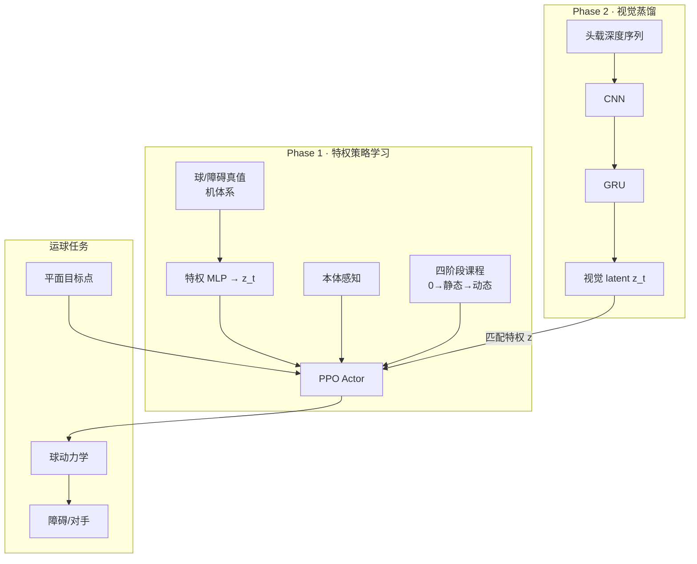

# 视觉特权表征人形足球运球（Lab-RoCoCo）

**Vision-Based Dribbling for Humanoid Soccer via Privileged Representation Learning**（Sapienza / CSIC-UPC / EPFL，arXiv:[2607.12702](https://arxiv.org/abs/2607.12702)，2026-07-15）将 **运球 + 避障** 建模为 POMDP，用 **Phase 1 特权编码器 + 四阶段课程 PPO** 学闭环策略，再 **冻结策略、训练 Phase 2 深度时序编码器** 重建同一 latent，使部署侧仅依赖 **头载深度** 即可完成目标导向运球与对手规避（mjlab / Booster T1，**仿真**）。

## 一句话定义

**运球别先训检测再拼控制——让深度图直接蒸馏出策略真正需要的球与对手 latent。**

## 英文缩写速查

| 缩写 | 英文全称 | 简要说明 |
|------|----------|----------|
| POMDP | Partially Observable Markov Decision Process | 部署时无全状态，仅部分观测 |
| RMA | Rapid Motor Adaptation | 特权训练→历史/传感估计的蒸馏范式（本文灵感来源） |
| PPO | Proximal Policy Optimization | Phase 1 策略优化；Stage 1–3 叠加 DAgger 正则 |
| CNN | Convolutional Neural Network | 深度图空间特征提取 |
| GRU | Gated Recurrent Unit | 聚合多帧深度，补短时序与遮挡 |
| SR | Success Rate | 球到达目标（≤0.75 m）试验占比 |
| DAgger | Dataset Aggregation | 用 Stage 0 教师约束防灾难性遗忘 |

## 核心信息

| 字段 | 内容 |
|------|------|
| 机构 | 罗马大学 Sapienza、IRI (CSIC-UPC)、洛桑联邦理工学院（EPFL） |
| 作者 | Flavio Maiorana、Valerio Spagnoli、Eugenio Bugli 等 |
| 平台 | Booster T1（mjlab 仿真） |
| 传感 | 训练：特权球/障碍状态；部署：头载 **深度相机** |
| 项目页 | <https://lab-rococo-sapienza.github.io/learning-to-dribble/> |

## 为什么重要

- **感知-控制联合优化：** 相对 RoboCup 经典 **检测+滤波** 栈，latent 由 **下游运球任务** 塑形，更适配遮挡与贴身控球。
- **对手课程可验证：** 从无障碍→静态走廊障碍→追球 dynamic opponent，消融显示 **无课程时动态场景几乎学不会**（Stage 1 SR 2% vs 完整 46%）。
- **与 DeepMind OP3 等对照：** 人形足球从 **射门/战术** 扩展到 **视觉闭环运球**；难点在动态平衡下的 **球-脚-障碍** 三体耦合。
- **部署路径清晰：** Actor 接口在 Phase 1/2 **不变**，仅 latent 生成机制从特权 MLP 换为 CNN+GRU。

## 方法

| 阶段 | 内容 |
|------|------|
| **Phase 1 · 特权策略** | 球/障碍机体系状态 → MLP latent；四阶段课程；Stage 0 纯 PPO，后续 DAgger 正则 |
| **Phase 2 · 视觉适应** | 冻结策略；深度 $108\times192$ → CNN → GRU → 投影 latent；MSE + 球/障碍辅助头 |
| **奖励** | 球速/朝向跟踪、progress、到达目标大稀疏奖；碰撞与步态正则 |
| **评测** | 无障碍 / 单静态障碍 / ball attacker（0.1–0.4 m/s 追球脚本） |

### 流程总览

## 实验要点（归纳）

| 条件 | SR | 主要失败模式 |
|------|-----|--------------|
| 无障碍 | **100%** | — |
| 静态障碍 | **96%** | 少量跌倒 (4%) |
| Ball attacker | **46%** | 跌倒 52%、人机碰撞 68% |
| **感知误差** | 球位置 ~0.05–0.08 m | 跨场景稳定，非主要瓶颈 |

## 与其他工作对比

- **vs RoboCup 经典感知栈：** 相较传统「检测 + 滤波」的感知管线，本文的 latent 由 **下游运球任务** 塑形，更适配遮挡与贴身控球。
- **vs DeepMind OP3 等人形足球：** 将人形足球从射门 / 战术扩展到 **视觉闭环运球**，难点在动态平衡下的 **球-脚-障碍三体耦合**。
- **特权→可部署表征范式（vs RMA）：** 采用 [RMA](./paper-rma-rapid-motor-adaptation.md) 式两阶段范式——Actor 接口在 Phase 1/2 保持不变，仅 latent 生成机制从特权 MLP 换为 CNN+GRU 的视觉蒸馏。

## 常见误区或局限

- **误区：「感知准就能过动态对手」。** 诊断显示 blocked 时段 **球速角误差上升**，控制仍是主矛盾。
- **误区：「端到端 RGB 一定更好」。** 本文选用 **深度 + 时序** 平衡遮挡与 sim 可训练性；sim2real 尚未验证。
- **局限：** 仅仿真；单策略种子；动态对手行为仍脚本化；**项目页材料发布，截至入库日无独立 GitHub 仓**。

## 工程实践与开源状态

- **开源状态（2026-07-20）：** 论文写 code 发布于 [learning-to-dribble 项目页](https://lab-rococo-sapienza.github.io/learning-to-dribble/)；页面含表格与阶段视频，**未发现与 semantic-WBC 同级的独立 GitHub 仓库** → 记为 **项目页发布 / 部分开源待跟进**。
- **未来工作：** 更强对手、sim2real on Booster T1（论文结论）。

## 关联页面

- [Humanoid Soccer](../tasks/humanoid-soccer.md) — 人形足球任务与技能栈
- [Loco-Manipulation](../tasks/loco-manipulation.md) — 移动中操控球体
- [RMA](./paper-rma-rapid-motor-adaptation.md) — 特权→可部署表征的经典范式
- [Reinforcement Learning](../methods/reinforcement-learning.md) — PPO 与课程学习

## 参考来源

- [运球论文摘录（arXiv:2607.12702）](../../sources/papers/vision_dribbling_humanoid_soccer_arxiv_2607_12702.md)
- [learning-to-dribble 项目页](../../sources/sites/lab-rococo-learning-to-dribble.md)

## 推荐继续阅读

- 项目页：<https://lab-rococo-sapienza.github.io/learning-to-dribble/>
- 论文 PDF：<https://arxiv.org/pdf/2607.12702>
- Haarnoja et al., *Learning Agile Soccer Skills for a Bipedal Robot* (Science Robotics 2024) — 人形足球 RL 标杆
- Kumar et al., *RMA* (RSS 2021) — 特权蒸馏原始框架
