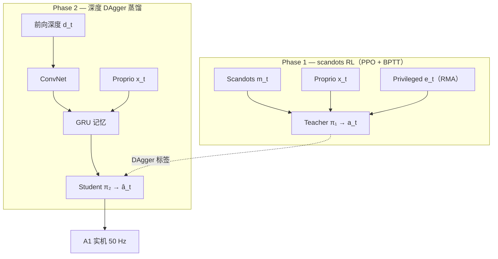

# Vision Locomotion（Egocentric Depth 四足穿越复杂地形）

**Legged Locomotion in Challenging Terrains using Egocentric Vision**（Agarwal et al., [arXiv:2211.07638](https://arxiv.org/abs/2211.07638)，**CoRL 2022 Best Systems Paper**）在 **Unitree A1 级小型四足** 上，用 **单前向 Intel RealSense 深度 + 端到端 RNN 策略** 实机穿越 **楼梯、路缘、踏石、沟隙** 与户外非结构化地形——**不构建 metric 高程图、不依赖 VIO 融合**。官方材料：[项目页](https://vision-locomotion.github.io/)、[PMLR 论文](https://proceedings.mlr.press/v205/agarwal23a.html)。

## 一句话定义

**Phase 1 用廉价 scandots 训 PPO Teacher（Monolithic GRU 或 RMA 解耦 base policy），Phase 2 用 DAgger 把深度 ConvNet–GRU Student 对齐 Teacher 动作——部署时仅前视深度 + 本体历史即可 50 Hz 输出关节角，靠 RNN 记忆弥补后足无 direct 视觉。**

## 英文缩写速查

| 缩写 | 英文全称 | 简要说明 |
|------|----------|----------|
| CoRL | Conference on Robot Learning | 机器人学习顶会；本文获 2022 Best Systems Paper |
| RL | Reinforcement Learning | Phase 1 用 PPO 在仿真中训 scandots Teacher |
| DAgger | Dataset Aggregation | Phase 2 在线聚合 Teacher 标签蒸馏深度 Student |
| PPO | Proximal Policy Optimization | Phase 1 on-policy 策略梯度算法 |
| RMA | Rapid Motor Adaptation | 可选 Phase 1 架构：scandots/extrinsics  latent 条件化 MLP base policy |
| GRU | Gated Recurrent Unit | 处理深度–本体时序，记忆后足即将落地的地形 |
| BPTT | Backpropagation Through Time | Phase 1/2 均截断 24 步展开训练 |
| Sim2Real | Simulation to Real | 仿真两阶段训练后 **零微调** 实机部署 |
| VIO | Visual-Inertial Odometry | 高程图管线常需的位姿估计；本文刻意避免 |

## 为什么重要

- **端到端 ego-depth 的系统级标杆（2022）：** 在 **单相机、低成本 A1** 上首次系统展示 stair + stepping stone + gap 的 **同一策略** 实机能力，并获 CoRL **Best Systems**——影响后续「要不要建高程图」的争论。
- **前视-only + 记忆** 的设计原则来自人类 locomotion：看前方几步、用短时记忆落脚；项目页 **bar stool 后足记忆** 与 **1/16 后足踩空** 直观展示该范式边界。
- **与 RMA / Extreme Parkour 同谱系：** 同作者组（Kumar / Pathak / Agarwal）的 **scandots→深度蒸馏** 与 **legged_gym** 训练栈；[Extreme Parkour](./extreme-parkour.md) 项目页将其作为 **楼梯场景失败对照**，说明跑酷需更强闭环或双重蒸馏。
- **开源边界需分清：** 本文 **无官方代码**；Ashish Kumar 后续 [CMS（ICRA 2023）](https://antonilo.github.io/vision_locomotion/) 才有 [`vision_locomotion`](https://github.com/antonilo/vision_locomotion) 仓库——勿混为同一论文实现。

## 核心结构

| 模块 | 作用 |
|------|------|
| **Phase 1 Teacher（PPO）** | 输入 scandots $m_t$、本体 $x_t$、速度指令；RMA 变体另加特权 $e_t$（摩擦、质心、电机强度等） |
| **Monolithic** | $\gamma_t=\mathrm{MLP}(m_t)$ → GRU → 关节目标角 $a_t$ |
| **RMA 架构** | $\gamma_t=\mathrm{GRU}(m_t)$，$z_t=\mathrm{MLP}(e_t)$ → **共享** MLP base policy（Phase 2 只重训 estimator） |
| **Phase 2 Student（DAgger）** | ConvNet 压缩深度 $d_t$ → GRU 得 $\hat{\gamma}_t$（+ $\hat{z}_t$）；MSE 对齐 Teacher $a_t$；仿真内 rollout 24 步再标注 |
| **部署** | D435 **480×848 → 58×87**；深度 ConvNet 经 UDP 送 base policy；**50 Hz** 策略 + **400 Hz** PD；UPboard + Jetson NX |

### 流程总览

## 方法栈（提炼）

- **相对高程图管线：** 不融合多帧深度、不做 foothold optimization；对比 **noisy elevation map baseline** 在踏石上几乎不动（Table 1），而本文 Monolithic/RMA 可走 **~20 m**。
- **相对盲走：** 盲策略 upstairs **0%**（13 级）；downstairs 虽 **100%** 但学出 **摔落式高冲击步态**（实机损腿）；gap / 踏石盲策略 **0%**。
- **无步态先验：** 小 A1（髋高 ~28 cm）攀 **~24–26 cm** 台阶需 **自发 hip abduction**（Fig.2c）——预定义 gait / 参考轨迹无法覆盖。
- **训练环境：** Isaac Gym + [legged_gym](./legged-gym.md)；20×10 子地形网格；课程 promotion/demotion；域随机 + 观测噪声。

## 源码运行时序图

**不适用** — 截至 2026-09-21，[项目页](https://vision-locomotion.github.io/) 与 [OpenReview](https://openreview.net/forum?id=Re3NjSwf0WF) **均未列出可运行官方仓库**（与 ICRA 2023 CMS 的 [`antonilo/vision_locomotion`](https://github.com/antonilo/vision_locomotion) 不同论文）。复现需自建 Isaac Gym + legged_gym 两阶段管线，或参考同栈 [RMA 训练代码](./paper-rma-rapid-motor-adaptation.md) 再扩展视觉 Phase 2。

## 工程实践

| 项 | 内容 |
|----|------|
| 硬件 | Unitree **A1**；**1× 头载 D435**（前向）；UPboard + Jetson NX |
| 感知预处理 | 裁左侧 200 px、最近邻填洞、下采样 **58×87**；深度延迟 **~10±10 ms**（Phase 2 训练计入） |
| 控制频率 | 策略 **50 Hz** 关节位置目标 → PD **400 Hz** 力矩 |
| 训练栈 | Isaac Gym + legged_gym；Phase 1 PPO；Phase 2 DAgger；**单 GPU 数天**（论文：避免数十亿步深度渲染） |
| 实机指标（项目页 / 论文） | 楼梯 **24 cm×30 cm**；路缘 **26 cm**；gap **26 cm 100%**；踏石 **94%**；弱光 IR 深度可用 |
| 开源状态 | **未开源** — 项目页无 Code 链接；勿与 CMS 仓库混用 |

## 实验与 ablation（摘要）

- **仿真（Table 1）：** 四地形总 mean time to fall **Monolithic 275 s / RMA 278 s** vs blind **175 s**、noisy map **148 s**。
- **实机（Fig.4）：** Ours vs blind on upstairs / downstairs / stones / gaps（见上表）。
- **Extreme Parkour 对照（后续工作）：** 同团队跑酷页展示 Vision locomotion 在 **楼梯跌落** — 说明极限动态技能需 [Extreme Parkour](./extreme-parkour.md) 式 **clearance + 航向蒸馏** 等增强。
- **失败模式（项目页）：** 过高路缘 **dip 不可见** → 跌落；后足 **记忆误差** → 踩空（16 次中 1 次）。

## 局限与风险

- **前视-only 几何盲区：** 后足落脚依赖 GRU 记忆，**无顶视/侧视** 时 bar stool / 宽 gap 仍可能失败；不适合要求后向精确落脚的无结构场景。
- **sim–real 覆盖：** 论文 §6 承认视觉/地形 OOD 需 **回仿真增广重训**，非在线自适应（对照 [RMA](./paper-rma-rapid-motor-adaptation.md) 的 extrinsics 适应）。
- **机体尺度：** 结论绑定 **小型 A1**；更大 Go1/ANYmal 上步态先验与 dynamics 不同，不可直接外推。
- **复现门槛：** 官方代码缺失；Isaac Gym Preview + legged_gym 版本钉定；与 CMS / Extreme Parkour 开源栈 **不同论文**。

## 与其他工作对比

| 维度 | 本文（ego-depth 两阶段） | [RMA](./paper-rma-rapid-motor-adaptation.md) | [Extreme Parkour](./extreme-parkour.md) |
|------|---------------------------|-----------------------------------------------|------------------------------------------|
| 外感知 | **第一人称深度**（Student 输入） | 无外感知，靠 proprio 在线估 extrinsics | 视觉 + 更激进的技能课程 |
| 特权信息 | scandots / extrinsics → Teacher | extrinsics → adaptation module | 类似特权→学生 |
| 学生训练 | [DAgger](../methods/dagger.md) 行为克隆 | 监督回归 adaptation latent | 蒸馏 + 课程 |
| 能力边界 | 本文自身在 **楼梯** 上留有失败案例，被后续工作当对照 | 地形自适应，但不主动看几何 | 大高差/跳跃 |

- **从 RMA 到本文，补的是「看得见几何」：** RMA 用本体感知 **事后适应** 地形属性，对楼梯/台阶这类 **需要提前知道落脚点** 的几何无能为力；ego-depth 把信息提前了，但也引入了感知时延与标定误差这条新失效链。
- **本文在同团队谱系里的位置是「对照」而非「终点」：** [Extreme Parkour](./extreme-parkour.md) 明确把本文的楼梯失败当作出发点；引用本文成功率时应说明这一点，否则会高估 ego-depth 单独带来的收益。
- **在感知栈里的归位：** 属 [感知栈选型闭环](../queries/robot-perception-stack-selection-loop.md) 的 ④ 下游策略消费层——真正的约束不是深度图质量，而是 **感知帧率能否被控制闭环带宽吃下**；这也是 [特权信息训练](../concepts/privileged-training.md) + 蒸馏范式在此类工作中反复出现的原因。

## 结论

**Vision Locomotion 证明了「单前向深度 + 短时记忆 + 两阶段 scandots→深度蒸馏」可以在小型四足上零微调完成 stair/踏石/gap 的系统级穿越，但其能力边界 tightly coupled 于前视几何与仿真覆盖，而非通用 elevation-free 万能策略。**

- **真影响指标是 Teacher–Student 分工 + 记忆：** 深度渲染太贵 → Phase 1 scandots RL 拿行为，Phase 2 DAgger 只换 sensing；GRU 负责 **后足不可见区域** 的地形推断，这是相对高程图栈的核心结构差异。
- **次要代价是无 VIO 也无前向以外相机：** 高 dip 路缘、后足记忆失败是 **设计内 trade-off**，Extreme Parkour 等后续工作用更强蒸馏与奖励补跑酷，而非简单复用本策略。
- **部署读法：** 50 Hz 单向前馈 + onboard 算力友好；但 **无官方代码** — 工程选型应把本文当 **方法与失败案例库**，复现走 legged_gym 自建或跟进 CMS / Extreme Parkour 开源栈。
- **与 blind baseline 对比：** 盲走 **不能** upstairs；downstairs「100%」以 **硬件损伤式步态** 为代价 — 读表时勿把 blind 成功率当可用部署。
- **选型：** 需要 **结构化 stair/gap/踏石** + 单相机 → 本文仍是经典引用；需要 **跑酷 / 大动态** → 转 [Extreme Parkour](./extreme-parkour.md)；需要 **在线适应** → [RMA](./paper-rma-rapid-motor-adaptation.md)；需要 **人形深度** → 近年 [Now You See That](./paper-now-you-see-that-humanoid-vision-locomotion.md) 等线。

## 参考来源

- [Vision Locomotion 论文摘录（arXiv:2211.07638）](../../sources/papers/vision_locomotion_corl_2022_arxiv_2211_07638.md)
- [vision-locomotion.github.io 项目页归档](../../sources/sites/vision-locomotion-github-io.md)

## 关联页面

- [Privileged Training（特权信息训练）](../concepts/privileged-training.md) — scandots / extrinsics → 深度 Student
- [DAgger](../methods/dagger.md) — Phase 2 行为克隆
- [legged_gym](./legged-gym.md) — Isaac Gym 四足 RL 训练框架
- [RMA: Rapid Motor Adaptation](./paper-rma-rapid-motor-adaptation.md) — 同作者 RMA 架构与后续 CMS 视觉扩展
- [Extreme Parkour](./extreme-parkour.md) — 同团队后续；本文作为楼梯失败对照
- [楼梯与障碍 Locomotion](../tasks/stair-obstacle-perceptive-locomotion.md) — 四足 ego-depth 条目索引
- [Locomotion](../tasks/locomotion.md) — 四足 RL 任务地图
- [机器人视觉感知栈选型闭环](../queries/robot-perception-stack-selection-loop.md) — 本页归其 ④ 下游策略消费层：ego-depth 感知输出与四足控制闭环带宽的对齐

## 推荐继续阅读

- Agarwal et al., [Legged Locomotion in Challenging Terrains using Egocentric Vision](https://arxiv.org/abs/2211.07638)（CoRL 2022 Best Systems）
- [项目页视频与失败案例](https://vision-locomotion.github.io/)
- Kumar et al., [RMA: Rapid Motor Adaptation](https://arxiv.org/abs/2107.04034)（RSS 2021）— 同栈 scandots / adaptation 先例
- Cheng et al., [Extreme Parkour with Legged Robots](https://arxiv.org/abs/2309.14341)（ICRA 2024）— 同 lab 跑酷线与 Vision locomotion 对照
- Kumar et al., [Learning Visual Locomotion with Cross-Modal Supervision](https://antonilo.github.io/vision_locomotion/)（ICRA 2023）— **有代码** 的后续视觉 loco 扩展（不同论文）
