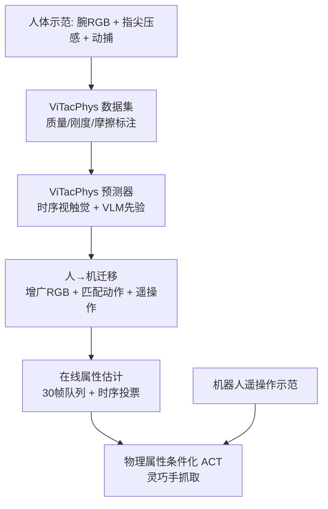

# ViTacPhys：视触觉物理属性感知自适应抓取

**ViTacPhys**（*Physical Property-Aware Grasping from Human Visual-Tactile Demonstrations*，[arXiv:2608.21355](https://arxiv.org/abs/2608.21355)，[项目页](https://vitacphys.github.io/ViTacPhys/)）由 **小米机器人实验室（Xiaomi Robotics）** 提出：从 **人体视触觉抓取示范** 在线估计物体 **质量、刚度、摩擦**，经 **人→机迁移** 作为结构化 token 条件化 **ACT** 灵巧手策略，在视觉相似但物理属性不同的 OOD 物体上实现 **力自适应抓取**。

## 一句话定义

**先把人体抓取里的视触觉时序 + 接触前 VLM 语义先验蒸馏成可部署的物理属性估计器，再把它当作策略的显式条件，而不是让模仿学习隐式猜物体有多重、多软、多滑。**

## 英文缩写速查

| 缩写 | 英文全称 | 简要说明 |
|------|----------|----------|
| ACT | Action Chunking with Transformers | 下游灵巧手模仿学习基座 |
| VLM | Vision-Language Model | 接触前 RGB 语义先验（GPT-5.4 文本假设） |
| ID / OOD | In-Distribution / Out-of-Distribution | 训练见过物体 vs 视觉相似属性不同物体对 |
| MAPE | Mean Absolute Percentage Error | 刚度回归主相对误差指标 |
| GRU | Gated Recurrent Unit | 视触觉时序编码 |
| ONNX | Open Neural Network Exchange | Jetson 部署导出格式 |

## 为什么重要

- **显式物理属性 vs 纯视觉策略：** 多数 VLA/WAM 不显式建模质量/刚度/摩擦，面对「看起来一样、手感不同」的 OOD 物体易 **过力压扁软物或欠力滑落**。
- **人体示范可扩展：** 相对推/拉/戳等机器人专属交互协议，自然抓取 + 可穿戴采集更易规模化，且动作模式更接近灵巧手操作。
- **系统级闭环：** 不只离线预测 benchmark——完整链路含 **数据集标注协议、人→机域迁移、30 Hz 在线部署与力剖面对齐评测**。
- **OOD 增益显著：** 相对 ACT，OOD **clean-success +38.9 pp**，且在共同成功物体上力剖面更接近人类遥操作。

## 核心信息

| 项 | 内容 |
|----|------|
| **机构** | 小米机器人实验室（Xiaomi Robotics） |
| **作者** | Yiwen Liu、Yujun Zhu、Kui Jia、Zhao Liao、Yangwei You、Shuaijun Wang（通讯） |
| **状态** | 2026-08 arXiv 预印本，同行评审前 |
| **开源** | 项目页标注 Code/Dataset **Coming Soon**（截至 2026-08-24） |

## 核心方法与结构

| 模块 | 作用 |
|------|------|
| **ViTacPhys 数据集** | 60 物体 × 2 协议 × 15 试次 = **1800** 条 1 s@30 Hz 人体示范；质量/刚度/摩擦显式标注 |
| **时序预测器** | ResNet-18 内容 + 光流运动 → GRU；视触觉双向 cross-attention + VLM 文本门控融合 |
| **有序回归头** | 质量/摩擦三档有序分类；刚度连续回归；GradNorm 多任务平衡 |
| **人→机迁移** | 同型传感器 + Seedance 机器人风格 RGB 增广 + 匹配动作人体数据 + 遥操作微调 |
| **ACT 条件化** | 接触标志 + 预测属性嵌入 → \(t_{\mathrm{phys}}\) token；时序投票稳定在线估计 |

### 流程总览

## 源码运行时序图

项目页 Code / Dataset 均为 **Coming Soon**，截至入库日 **无可运行官方仓库**。

| 项 | 说明 |
|----|------|
| **源码运行时序图** | **不适用**（代码与数据集待发布；仅有论文方法与 ONNX 部署描述） |

## 实验要点

### 物理属性预测（held-out object）

| 指标 | 数值 |
|------|------|
| 质量 Acc | **87.5%** |
| 摩擦 Acc | **97.5%** |
| 刚度 MAPE | **9.08%** |
| 刚度 Pearson \(r\) | **0.947** |

### 真机自适应抓取（ViTacPhys 在线预测）

| 划分 | 总成功率 | 相对 ACT clean-success |
|------|----------|----------------------|
| **ID**（40 物体） | **95.0%** | **+12.5 pp** |
| **OOD**（6 对视觉相似物体） | **83.4%** | **+38.9 pp** |

- **基线：** ACT、ViTacFormer；统一 4 层 encoder/decoder Transformer 与优化预算。
- **力对齐：** 在 OOD 共同成功物体上，相对 ACT 绝对力误差 **−19.7%**，Pearson \(r\) **+0.414**。
- **部署：** Jetson Orin 上预测 **9 ms** + 策略 **10 ms**；VLM 先验接触前一次性约 **10 s**。

## 结论

**ViTacPhys 把「物体物理属性」从隐式视觉先验里拆出来，做成可在线注入策略的结构化 token，在视觉欺骗性 OOD 抓取上比纯 ACT 更稳、更贴近人类力策略。**

- **显式条件是真增益** — OOD clean-success 领先 ACT **38.9 pp**，且过力成功（压扁软物仍举起）更少。
- **人体数据 + 三源迁移必要** — 仅遥操作在 OOD 质量 Acc 仅 **44.5%**；预训练 + Tele.+Aug.+H 可达 **78.0%**。
- **VLM 先验补接触前** — 五帧 pre-contact RGB 文本假设与接触后视触觉证据因子化，消融去掉文本质量 Acc 可降 **21.5 pp**。
- **与 ViTacFormer 分界** — 后者学跨模态表征/下一触觉帧；ViTacPhys 专注 **物理属性估计 → 策略条件化** 系统闭环。
- **待开源** — 代码与 1800 示范数据集均 **Coming Soon**；复现前只能参照论文与项目页表图。

## 工程实践与开源状态

| 项 | 状态 |
|----|------|
| **代码** | **宣称将开源 / 待发布**（项目页按钮无 URL） |
| **数据集** | **宣称将开源 / 待发布** |
| **可复现入口** | arXiv PDF + 项目页实验表；真机需自研同型腕 RGB + 指尖压感 + 7-DoF/6-DoF 平台 |

## 常见误区或局限

- **误区：** 把刚度当成材料本征常数——本文是 **操作级** 测量，含物体变形与手部/传感器顺应。
- **误区：** 认为摩擦是物体固有属性——标注为 **硅胶接触对** 静摩擦系数（斜面法）。
- **局限：** 单参与者采集；OOD 仅 6 对物体各 3 试次；触觉无法直接测切向力，质量/摩擦只能分档；VLM 先验有秒级冷启动延迟。

## 与其他页面的关系

- [ViTacFormer](./paper-sa-2506-15953-vitacformer-learning-cross-modal-representation.md) — 视触觉灵巧操作基线
- [ViTacWorld](./paper-vitacworld.md) — 视触觉世界模型缩放（上科大）
- [Action Chunking](../methods/action-chunking.md) — ACT 下游策略范式
- [Imitation Learning](../methods/imitation-learning.md)
- [Contact-Rich Manipulation](../concepts/contact-rich-manipulation.md)
- [Xiaomi-Robotics-0](./xiaomi-robotics-0.md) — 同机构 VLA 工程对照

## 推荐继续阅读

- [ViTacPhys 论文（arXiv:2608.21355）](https://arxiv.org/abs/2608.21355)
- [ViTacPhys 项目页](https://vitacphys.github.io/ViTacPhys/)

## 参考来源

- [ViTacPhys 论文归档](../../sources/papers/vitacphys_arxiv_2608_21355.md)
- [ViTacPhys 项目页归档](../../sources/sites/vitacphys-github-io.md)
