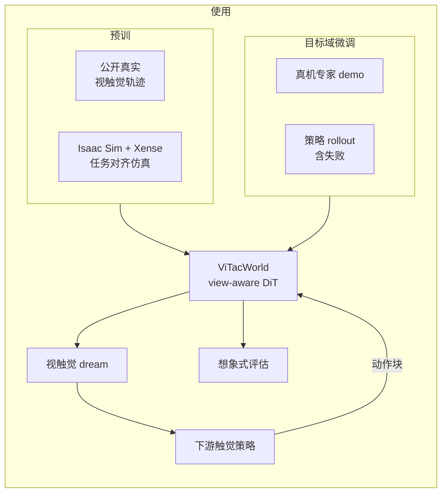

# ViTacWorld（视触觉世界模型 · arXiv:2607.22530）

**ViTacWorld**（*Scaling Visuo-Tactile World Models for Contact-Rich Robot Manipulation*，[arXiv:2607.22530](https://arxiv.org/abs/2607.22530)，Yunao Huang 等 · **上海科技大学（ShanghaiTech）** / **因思特自适应（InstAdapt）**；[项目页](https://vitacworld.github.io/)）把动作条件机器人视频世界模型扩展到 **视触觉联合生成**：主摄、腕摄与图像式触觉作为并列视图，经 view-aware DiT 产生时间对齐的 rollout，既做 **dream 数据增强**，也做 **想象式策略评估**。

## 一句话定义

**用可缩放的动作条件视触觉世界模型生成接触丰富轨迹，给下游触觉策略当合成数据与部署前评估器。**

## 英文缩写速查

| 缩写 | 英文全称 | 简要说明 |
|------|----------|----------|
| ViTacWorld | Visuo-Tactile World Model | 本文框架 |
| DiT | Diffusion Transformer | 动作条件生成骨干 |
| AdaLN | Adaptive Layer Normalization | 时间步/动作/流身份调制 |
| VLA | Vision-Language-Action | 下游 π₀.₅ 等策略族 |
| ACT | Action Chunking with Transformers | 轻量模仿基线 |
| WM | World Model | 前向观测预测器 |
| LPIPS | Learned Perceptual Image Patch Similarity | 生成质量感知距离 |

## 为什么重要

- **补上「视觉 WM 不够接触」的缺口：** 插装/削皮时成败常写在接触力与形变上，纯 RGB dream 对触觉策略监督不足。
- **定位不同于 VT-WAM / N₀-TWAM：** 那些工作把视触觉预测嵌进 **WAM/策略**；ViTacWorld 主打 **可复用数据生成器 + 评估器**。
- **缩放叙事清晰：** 公开真实触觉 + 任务对齐仿真预训 → 真机 demo/策略分布微调 → 过滤成功 dream 回灌策略。
- **真机增益可感：** π₀.₅+触觉平均 **42.5%→67.5%**；再一轮 dream 到 **80%**。

## 核心信息

| 项 | 内容 |
|----|------|
| 机构 | 上海科技大学（ShanghaiTech）、因思特自适应（InstAdapt） |
| 平台 | Franka Panda + Robotiq 2F-85；指端 **Xense**；D435 + ZED Mini |
| 任务 | Charger Plugging / Cucumber Peeling / U-/Cuboid Insertion |
| 数据 | 300 专家；每任务 50 策略 rollout 调 WM；筛 200 成功 dream |
| 开源（2026-07-27） | **宣称将开源**（项目页 Code *coming soon*） |

## 流程总览

## 核心原理（方法）

### 1）问题形式

\[
\hat{o}_{t+1:t+H}=f_\theta(o_t,u_{t:t+H-1},m),\quad
o_t=\{I_t^{v}\}_{v\in\{\mathrm{main},\mathrm{wrist},\mathrm{tactile}\}}
\]

\(u\)：相对末端 + 夹爪；\(m\)：视图存在掩码，兼容异构语料。

### 2）View-aware DiT

- 各视图 VAE 编码为 latent token；流身份嵌入进 AdaLN（与时间步/动作同路）。
- **流内 Self-Attn** 后再 **CrossViewAttn**，避免相机/触觉 token 无控混叠，同时交换接触信息。
- 继承动作条件视频先验的动作通路，跨流复用。

### 3）缩放管线

1. **预训：** 大规模公开视触觉 + 3DGS 对齐的 Isaac/Xense 仿真接触模式。
2. **微调：** 专家轨迹对齐任务执行；策略 rollout 暴露失败与策略诱导状态。
3. **闭环使用：** 策略出动作块 → WM 自回归想象 → 成功/合理过滤 → \(\mathcal{D}_{\mathrm{aug}}=\mathcal{D}_{\mathrm{expert}}\cup\mathcal{D}_{\mathrm{dream}}\)。

## 源码运行时序图

**不适用**（截至 **2026-07-27**：项目页 Code 为 *coming soon*，无公开训练/推理仓；见 [`sources/sites/vitacworld-github-io.md`](../../sources/sites/vitacworld-github-io.md)）。

## 实验与评测

### 策略增强（实机成功率 %，10 trials/任务）

| 数据 | Method | Charger | Peel | U-Block | Cuboid | Avg |
|------|--------|---------|------|---------|--------|-----|
| Expert only | ACT+触觉 | 0 | 0 | 30 | 30 | 15.0 |
| Expert only | π₀.₅ | 10 | 30 | 60 | 40 | 35.0 |
| Expert only | π₀.₅+触觉 | 20 | 40 | 70 | 40 | **42.5** |
| +Round-1 dream | π₀.₅+触觉 | 40 | 80 | 80 | 70 | **67.5** |
| +Round-2 dream | π₀.₅+触觉 | 60 | 90 | 90 | 80 | **80.0** |

### WM 质量（held-out，Full vs 无预训）

主摄 PSNR **22.72→24.26**；腕摄 **21.08→21.93**；触觉 LPIPS **0.021→0.016**（任务对齐仿真再抬一档）。

### 策略评估

同一 Round-1 增强 π₀.₅+触觉：实机 Avg **67.5** vs ViTacWorld 多数票 **57.5**（偏保守，可作部署前筛选信号）。

## 工程实践

| 项 | 实践要点 |
|----|----------|
| 传感 | 图像式指端触觉（Xense）+ 双视角 RGB |
| 动作空间 | WM 用相对 EEF；策略动作需映射 |
| Dream 筛选 | 成功 + 视触觉合理性；当前仍含人工 |
| 迭代 | Round-2：用增强后策略再生 dream 再训 |
| 开源 | **待发布** |

## 结论

**视触觉世界模型若定位为「可过滤的 dream 数据工厂」，就能把稀缺接触演示放大成策略增益；评估信号偏保守时仍有部署前筛查价值。**

1. **读表先看触觉策略列** — π₀.₅+触觉从 42.5→67.5，增益大于纯视觉。
2. **预训不可省** — 无预训/无任务对齐仿真都会掉生成质量。
3. **失败 rollout 要进微调** — 否则 WM 只见专家分布。
4. **与 WAM 路线正交** — 这里不强制联合出动作，专注生成与评估。
5. **筛选是瓶颈** — 人工过滤限制规模；自动化是下一步。
6. **代码未落地** — 复现排期需等官方仓。

## 局限与风险

- Dream 质量控制仍部分人工。
- 四任务、单臂 Franka+Xense；跨传感器/embodiment 未充分验证。
- 想象评估偏低，过度依赖会拒绝可用策略。
- **开源未落地**。

## 与其他工作对比

| 路线 | 角色 | 相对 ViTacWorld |
|------|------|-----------------|
| [VT-WAM](./paper-vt-wam-visuotactile-contact-rich.md) / [N₀-TWAM](./paper-n0-twam.md) | 联合预测视触觉+动作的 WAM | 策略内耦合 vs 外置数据生成器 |
| [TACO](./paper-taco-tactile-wm-vla-posttrain.md) | 触觉 WM 服务 VLA 后训练 | 同属触觉前向；数据缩放叙事不同 |
| [Ctrl-World](./paper-ctrl-world.md) | 视觉多视角 WM 评估/SFT | 缺触觉通道 |
| 端到端触觉 VLA | 直接吃触觉观测 | 不解决「触觉轨迹太少」 |

## 关联页面

- [视触觉融合](../concepts/visuo-tactile-fusion.md) — 视觉全局 + 触觉局部
- [Contact-Rich Manipulation](../concepts/contact-rich-manipulation.md) — 接触任务语境
- [VT-WAM](./paper-vt-wam-visuotactile-contact-rich.md) — 视触觉 WAM
- [Generative World Models](../methods/generative-world-models.md) — 生成式 WM
- [VLA](../methods/vla.md) — 下游 π₀.₅
- [Manipulation](../tasks/manipulation.md) — 操作任务
- [世界模型物理保真输出轴](../overview/world-model-physics-fidelity-outputs.md) — 几何·触觉混合输出族
- [具身评测基准选型](../queries/embodied-eval-benchmark-selection-loop.md) — 想象式策略评估如何接入验收

## 参考来源

- [ViTacWorld 论文归档](../../sources/papers/vitacworld_arxiv_2607_22530.md)
- [ViTacWorld 项目页](../../sources/sites/vitacworld-github-io.md)

## 推荐继续阅读

- [项目页](https://vitacworld.github.io/) — 表格与定性对比
- [arXiv:2607.22530](https://arxiv.org/abs/2607.22530) — 方法与附录评测全文
