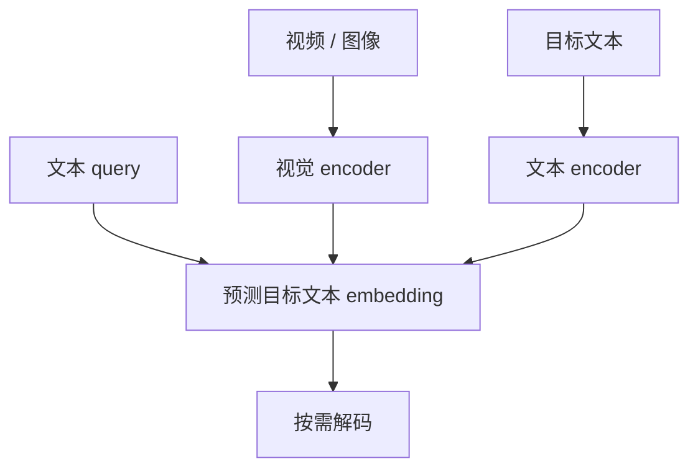

# VL-JEPA: Joint Embedding Predictive Architecture for Vision-language

**VL-JEPA**（arXiv:2512.10942）由 Meta FAIR、香港科技大学、Sorbonne Université 与纽约大学研究者提出。它把常见的视觉到文本 token 生成改为预测目标文字的连续 embedding：视觉 encoder 提取画面状态，文本 encoder 编码目标语句，predictor 根据视觉 embedding 和 query 预测目标文本 embedding；需要输出文字时再使用轻量 decoder。

## 英文缩写速查

| 缩写 | 英文全称 | 简要说明 |
|------|----------|----------|
| VL-JEPA | Vision-Language Joint-Embedding Predictive Architecture | 在视觉语言 embedding 空间进行目标预测的架构 |
| VLM | Vision-Language Model | 联合处理视觉输入与语言输入/输出的模型 |
| VQA | Visual Question Answering | 视觉问答 |
| JEPA | Joint-Embedding Predictive Architecture | 以 latent target prediction 为核心的架构思路 |

## 方法流程

训练目标使用目标文本 embedding 作预测目标，而不是逐 token 生成目标句子。嵌入空间也可用于开放词汇分类、视频检索和区分式 VQA 等任务。

## 论文报告的实验

在受控比较中，作者报告与 token-space VLM 相比可训练参数约减少 50%，同时保持或改善指定任务表现；选择性解码在相近输出质量下减少约 2.85 倍解码操作。评估涵盖视频分类、检索和 VQA，具体结果依论文数据集与基线设置。

这项工作不是 action model：论文没有给出可供机器人执行的关节/末端动作策略。它更适合视为视觉语言语义表征路线的一种 JEPA 实例。

## 参考来源

- [V-JEPA 2.1](./paper-sa-2603-14482-v-jepa-2-1-unlocking-dense-features-in-video-sel.md) — 视频自监督表征工作
- [LeJEPA](./paper-lejepa.md) — 通过 SIGReg 约束 embedding 的 JEPA 配方
- [VideoDB JEPA 长文](./article-videodb-jepa-world-models.md)
- [论文来源归档](../../sources/papers/vl_jepa_arxiv_2512_10942.md)
- [arXiv:2512.10942](https://arxiv.org/abs/2512.10942)
