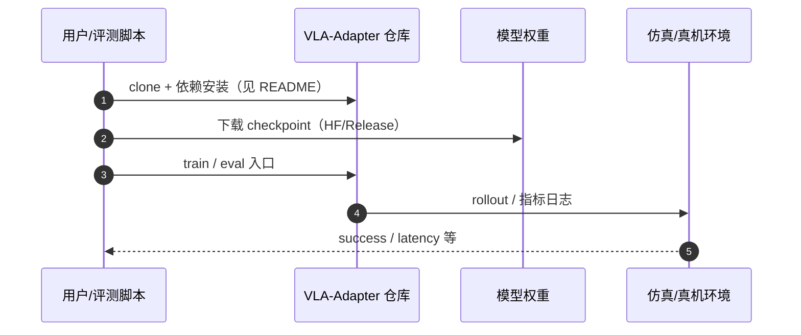

# VLA-Adapter（arXiv:2509.09372）

**VLA-Adapter**（*VLA-Adapter: An Effective Paradigm for Tiny-Scale Vision-Language-Action Model*，[arXiv:2509.09372](https://arxiv.org/abs/2509.09372)，[代码](https://github.com/OpenHelix-Team/VLA-Adapter)）来自 [机器人研发工程师 · 前沿算法盘点](../../sources/blogs/wechat_robot_engineer_embodied_frontier_algorithms_2026-09-23.md)。

## 一句话定义

**~0.5B 轻量 VLA：Bridge Attention 注入 VL 条件，低机器人预训练数据依赖；OpenHelix 开源训练/评测栈。**

## 英文缩写速查

| 缩写 | 英文全称 | 简要说明 |
|------|----------|----------|
| VLA-Adapter | Vision-Language-Action Adapter | 本文轻量 VLA 范式 |
| VLA | Vision-Language-Action | 视觉–语言–动作策略 |
| VL | Vision-Language | 视觉–语言多模态 |
| LIBERO | Lifelong Robot Learning Benchmark | 操作基准 |

## 为什么重要

- OpenVLA/π 族算力与数据门槛高；VLA-Adapter 提供单卡可试的适配范式（ReflexVLA 等亦作骨干）。
- 开源结论：**已开源**（步骤 2.5，2026-09-23）。
- 与 [具身前沿算法技术地图](../overview/embodied-frontier-algorithms-technology-map.md) 同路线条目可横向对照。

## 核心机制

| 项 | 内容 |
|----|------|
| **arXiv** | [2509.09372](https://arxiv.org/abs/2509.09372) |
| **开源** | **已开源** |
| **要点** | 小型 VLM + Bridge Attention 融合机器人状态/动作；强调跨本体低成本微调。 |
| **文内指标** | LIBERO 等榜（以原文与仓库 README 为准）；社区复现见 vla-open-source-repro-landscape-2025。 |

## 源码运行时序图

图下说明：复现以 [`sources/repos/vla_adapter.md`](../../sources/repos/vla_adapter.md) 与官方 README 为准。

## 实验与评测

- LIBERO 等榜（以原文与仓库 README 为准）；社区复现见 vla-open-source-repro-landscape-2025。
- **读法：** 索引级摘要；逐项 baseline 以原文 PDF 为准。

## 与其他工作对比

| 维度 | VLA-Adapter（本页） | [OpenVLA](./openvla.md) 等大尺度 VLA | 从零训练小 VLA |
|------|----------------------|----------------------------------------|-----------------|
| 参数量 | **~0.5B** | 数 B 量级 | 视设计而定 |
| VL 条件注入 | **Bridge Attention**（把 VL 条件接进动作侧） | 骨干内融合 | 自行设计 |
| 机器人预训练数据依赖 | **低**，强调跨本体低成本微调 | 高 | 高（无预训练可用） |
| 复现成本 | 低；OpenHelix 开源训练/评测栈 | 高 | 中 |

- **它的卖点是「同等成绩下的成本」，不是绝对上限：** 在 LIBERO 一类仿真榜上与更大模型可比时，真正值得记的是 **0.5B + 低机器人数据依赖** 这个组合；把它当成「小模型更强」读会外推过头。
- **Bridge Attention 解决的是接口问题：** 小骨干直接吞多模态 token 容易被动作损失冲垮语义，桥接注意力把 VL 条件按需注入动作分支，是与 [THAW-VLA](./paper-thaw-vla.md) 的蒸馏、[ReflexVLA](./paper-reflexvla.md) 的延迟处理并列的 **不同旋钮**，不构成强弱关系。
- **横比口径：** LIBERO 等榜 **以原文与仓库 README 为准**；社区复现结果见 [VLA 开源复现全景](../overview/vla-open-source-repro-landscape-2025.md)，跨基准比榜无效。

## 结论

**VLA-Adapter 是轻量 VLA 工程基线之一；选型时勿与 OpenPI 数据规模假设混用。**

1. 开源边界：**已开源** — 以项目页/仓库实际链接为准（入库日 2026-09-23）。
2. 核心机制：小型 VLM + Bridge Attention 融合机器人状态/动作；强调跨本体低成本微调。…
3. 部署前核对硬件栈与评测协议，勿直接横比公众号摘录数字。

## 关联页面

- [vla](../methods/vla.md)
- [vla-open-source-repro-landscape-2025](../overview/vla-open-source-repro-landscape-2025.md)
- [openvla](./openvla.md)
- [paper-reflexvla](./paper-reflexvla.md)

## 参考来源

- [vla-adapter_arxiv_2509_09372.md](../../sources/papers/vla-adapter_arxiv_2509_09372.md)
- [wechat_robot_engineer_embodied_frontier_algorithms_2026-09-23.md](../../sources/blogs/wechat_robot_engineer_embodied_frontier_algorithms_2026-09-23.md)
- [arXiv:2509.09372](https://arxiv.org/abs/2509.09372)

## 推荐继续阅读

- [arXiv PDF](https://arxiv.org/pdf/2509.09372)
- [代码](https://github.com/OpenHelix-Team/VLA-Adapter)

