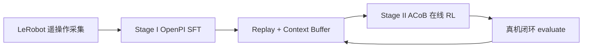
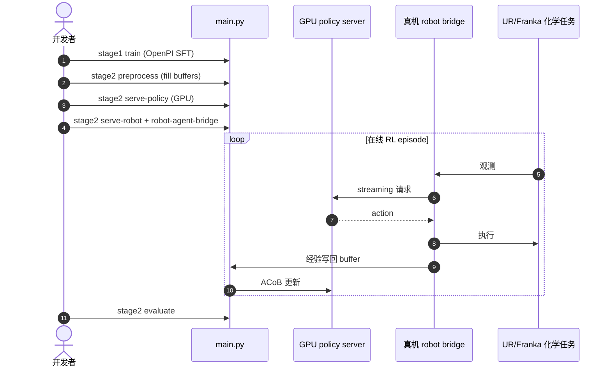

# VLA-Precision：精密实机 VLA 在线强化学习

**VLA-Precision**（*Asymmetric Co-Bootstrapping for Efficient Real-World Online RL of Vision-Language-Action Models*，[arXiv:2609.04355](https://arxiv.org/abs/2609.04355)，[项目页](https://vla-precision.github.io/)，[代码](https://github.com/scy-v/VLA-Precision)）由 **中国科学技术大学（USTC）** 自动化系提出：预训练 VLA 泛化广，但在 **精度与重复性** 任务上仍不可靠；真机在线 RL 能超越演示，但面临 **value 不可靠致策略漂移** 与 **大 VLA 吞吐瓶颈**。VLA-Precision 给出 **ACoB（Asymmetric Co-Bootstrapping）** 算法与 **ACoB-Stream** 闭环架构：早期干预引导行为学习，经验积累后全局 return + 局部偏好排序校准 value，reference-regularized 改进抑制漂移；Stream 侧 invariant-state decoupling + on-demand streaming 带来 **最高 10.9×** 吞吐提升。九项精密化学操纵、四机型 embodiment 上平均成功率 **98.3%**，**45.8 min/task** 训练预算。

## 一句话定义

**精密化学操纵上，用非对称共自举稳住 value、用 Stream 架构喂饱吞吐，让大 VLA 在真机 trial-and-error 里既准又快。**

## 英文缩写速查

| 缩写 | 英文全称 | 简要说明 |
|------|----------|----------|
| VLA-Precision | — | 本文真机精密 VLA 在线 RL 框架 |
| ACoB | Asymmetric Co-Bootstrapping | 跨时间尺度非对称共自举 RL 算法 |
| ACoB-Stream | — | experience–policy 闭环流式架构 |
| OpenPI | — | Stage I 全参微调基座 |
| RL | Reinforcement Learning | Stage II 在线后训练 |
| UR | Universal Robots | 评测机器人之一（UR5e/UR7e 等） |

## 为什么重要

- **真机精密 RL 可复现栈：** Apache-2.0 公开 Stage I/II 训练、部署、评测与 LeRobot 遥操作分支。
- **同时解 drift 与吞吐：** ACoB 抑制 value 噪声导致的策略漂移；Stream **10.9×** 算效使大 VLA 在线 RL 可行。
- **九任务四机型：** 移液枪、比色皿、试管刷、灯芯熄灭等 **接触丰富/轻/无/双臂** 四类；非玩具 pick-place。
- **时间与成功率并重：** **98.3%** 成功率 + episode **27.6 s**（快于 VLA/RL 基线 **1.2× / 1.8×**）。

## 核心结构与方法

| 模块 | 方法要点 |
|------|----------|
| **Stage I** | OpenPI **全参** 微调；LeRobot 演示 → `norm-stats` + `train` |
| **Stage II ACoB** | 干预引导早期行为 → 全局 return 传播 + 局部偏好排序 → reference-regularized 策略改进 |
| **ACoB-Stream** | invariant-state decoupling；on-demand streaming；GPU server ↔ 真机 robot bridge |
| **部署** | `serve-policy` / `serve-robot` / `robot-agent-bridge` 三进程闭环 |
| **开源** | **已开源** — `uv sync` 分 stage1/stage2/real-robot 组 |

### 两阶段流水线

## 实验要点

| 轴 | 报告口径（以论文为准） |
|----|------------------------|
| **九任务平均成功率** | **98.3%** |
| **训练预算** | **45.8 min/task** |
| **episode 时长** | **27.6 s**；速度 **1.2×** VLA 基线、**1.8×** RL 基线 |
| **吞吐/算效** | ACoB-Stream **最高 10.9×** |
| **任务域** | 精密化学操纵四类接触属性 |
| **embodiment** | 四种机器人平台 |

## 结论

**VLA-Precision 把「真机在线 RL 会 drift、大模型跑不动」拆成 ACoB（稳 value）+ Stream（提吞吐）两个可工程化模块——精密任务上 98.3% 说明演示后 trial-and-error 仍值得做。**

- 早期 **干预引导** 快速拉高性能并改善在线经验质量；后期 **return + 偏好** 校准 value，reference 正则抑制 drift。
- **10.9×** 吞吐是 large-VLA 在线 RL 能否落地的硬门槛，不是锦上添花。
- 九项化学任务覆盖 contact-rich/light/free/bimanual，比单场景 peg-in 更有外推价值。
- **已开源** 全链路：遥操作 → SFT → preprocess buffer → 在线 RL → evaluate。
- 与 [VLA-RFT](./paper-sa-2510-00406-vla-rft-vision-language-action-reinforcement-fin.md) 等同属 VLA 后训练，但强调 **真机精密 + 闭环架构** 而非仿真 reward 微调。

## 源码运行时序图

配置：`configs/stage1/*.yaml`、`configs/stage2/tasks/*.yaml` + `deployments/*.yaml`。

## 工程实践

| 项 | 建议 |
|----|------|
| 环境 | `uv sync --group stage1|stage2|real-robot` |
| 采集 | README 列 UR/Franka LeRobot 遥操作分支 |
| Stage I | `main.py --stage stage1 --mode norm-stats|train` |
| Stage II | preprocess → serve-policy + serve-robot + bridge |
| 评测 | `--mode evaluate`；结果 `results/<experiment>/acob/` |
| 扩展 | 见 `docs/EXTENDING.md` 新机器人/任务 |

## 局限与风险

- 任务域为 **实验室化学精密操纵**；泛化到其他工业场景需重采集与重训。
- 在线 RL 仍依赖 **干预/安全** 与硬件一致性；多机部署需按 deployment yaml 调网络与 GPU。
- Stage I 基于 OpenPI 全参微调，算力与数据需求高于小策略 baseline。

## 与其他工作对比

| 对照 | 差异读法 |
|------|----------|
| 纯 BC VLA | 演示上限；VLA-Precision **真机 trial-and-error** 超越 |
| 仿真 VLA-RFT | 仿真 reward；本框架 **真机 closed-loop + Stream** |
| [CheckVLA](./paper-checkvla-execution-time-verification.md) | 执行时验证；本工作 **训练期在线 RL** |
| [DreamSteer](./paper-dreamsteer-vla-deployment-steering.md) | 部署筛选；本工作 **策略权重在线更新** |

## 关联页面

- [VLA](../methods/vla.md)
- [Reinforcement Learning](../methods/reinforcement-learning.md)
- [Manipulation](../tasks/manipulation.md)
- [VLA-RFT](./paper-sa-2510-00406-vla-rft-vision-language-action-reinforcement-fin.md)

## 推荐继续阅读

- [arXiv:2609.04355](https://arxiv.org/abs/2609.04355)
- [VLA-Precision 项目页](https://vla-precision.github.io/)
- [scy-v/VLA-Precision](https://github.com/scy-v/VLA-Precision)

## 参考来源

- [vla_precision_arxiv_2609_04355](../../sources/papers/vla_precision_arxiv_2609_04355.md)
- [VLA-Precision 项目页](../../sources/sites/vla-precision-github-io.md)
- [scy-v/VLA-Precision](../../sources/repos/scy-v-vla-precision.md)
