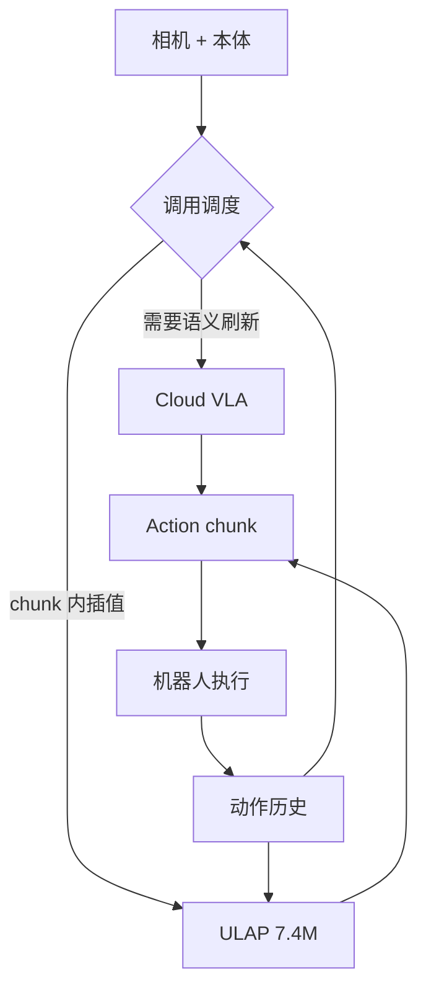

# VLA-ULAP：云端 VLA 与边缘超轻量动作预测交错

**VLA-ULAP**（*Interleaving Cloud VLA Calls with Ultra-Lightweight Local Action Prediction at the Edge*，[arXiv:2609.18663](https://arxiv.org/abs/2609.18663)，**东京大学** 等）在 **十亿参数云端 VLA** 与 onboard **Ultra-Lightweight Local Action Predictor（ULAP，~7.4M）** 之间交错调用：ULAP 用当前视图、本体与已执行动作历史 **单 pass** 预测 chunk，**独立训练**，不需 VLA hidden state 或 server 往返验证。

## 一句话定义

**大 VLA 负责「什么时候需要再想一次」，7M 边缘头负责 chunk 之间的填空——用更少云端调用换几乎不变的成功率。**

## 英文缩写速查

| 缩写 | 英文全称 | 简要说明 |
|------|----------|----------|
| VLA | Vision-Language-Action | 远程/cloud 大策略 |
| ULAP | Ultra-Lightweight Local Action Predictor | ~7.4M 边缘 chunk 预测器 |
| SR | Success Rate | 相对 full cloud baseline 保留比例 |
| ACT | Action Chunking Transformer | 对照基线之一 |
| SP-VLA | （论文对照）VLA 加速方法 | 与 ULAP 比 time/energy |
| LIBERO | Lifelong Robot Learning | latency-aware Safety 子集 |

## 为什么重要

- **边缘算力现实：** Jetson Orin Nano 上 ULAP **19.9 ms / 0.183 J** vs GR00T on A6000 **284.3 ms / 50.55 J** — 数量级差距。
- **Operating point 可选：** 三仿真 base-policy/benchmark 对上，减 **48.8–76.7%** VLA 调用仍留 **95.0–97.5%** baseline SR。
- **动态任务：** latency-aware LIBERO-Safety 上较 **π₀.₅** **+11.0 / +15.5 pp**，约减半 VLA 调用。
- **与 [APXInf](./apxinf.md) 对照：** APXInf 压单模型 onboard 延迟；VLA-ULAP 接受 cloud VLA + 极小本地 predictor 混合。

## 核心信息

| 项 | 内容 |
|----|------|
| **机构** | 东京大学（The University of Tokyo） |
| **ULAP 规模** | ~7.4M（含 frozen vision encoder） |
| **硬件** | Jetson Orin Nano（ULAP）；SO-101 真机 |
| **开源** | **截至 2026-09-18 arXiv v1 未列代码** |

## 核心原理（方法）

ULAP 输入 \((o_t, q_t, a_{t-k:t-1})\)，输出 action chunk。**Interleaving policy** 在运行时决定何时调用 cloud VLA vs 本地 ULAP。训练 ULAP **与 VLA 解耦**，便于边缘部署迭代。

### 流程总览

## 工程实践

| 项 | 建议 |
|----|------|
| Operating point | 按任务 latency 敏感度选 VLA 调用率 — Safety 任务 benefit 更大 |
| 能耗 accounting | 论文用 **successful-episode** 级 time/energy — 失败 trial 不计会偏乐观 |
| 对照 | ACT / SP-VLA on VLA-JEPA；[APXInf](./apxinf.md) 单栈 onboard |
| 部署 | 需 cloud 链路 — 纯 offline 机器人不适用 |

## 实验与评测

| 设定 | 数字 |
|------|------|
| Orin Nano ULAP | **19.9 ms**，**0.183 J**/inference |
| vs GR00T A6000 | **284.3 ms**，**50.55 J** |
| 三仿真对 | **95.0–97.5%** baseline SR；VLA 调用 **−48.8–76.7%** |
| SO-101 真机 | **95.2–100%** baseline SR；time **−47.9–58.0%**；energy **−52.1–62.5%** |
| LIBERO-Safety | vs π₀.₅ **+11.0 / +15.5 pp** |

## 结论

**VLA-ULAP 给「大模型在云端、控制在边缘」一个可量化配方：7M ULAP 足够保住 95%+ 成功率，同时砍掉一半以上 VLA 调用。**

1. **独立训练 ULAP 是工程亮点** — 不必碰 VLA 内部表征。
2. **latency-aware benchmark 才显优势** — 静态 LIBERO 不足以说明 dynamic 任务收益。
3. **19.9 ms 改变闭环语义** — 与 280 ms 级 VLA 不是同一控制环。
4. **cloud 依赖仍在** — 交错 ≠ 完全边缘化。
5. **代码未发布** — operating point 选择细节待开源验证。

## 局限与风险

- **Cloud 可用性与隐私** — 交错策略假设稳定远程 VLA。
- **ULAP 泛化边界** — held-out placement 真机仍近训练分布。
- **无公开权重** — 7.4M 结构可复现性未知。

## 关联页面

- [VLA](../methods/vla.md) — 部署与加速索引
- [APXInf](./apxinf.md) — π₀.₅ Thor 端侧引擎
- [Action Chunking](../methods/action-chunking.md)
- [π0.5](./paper-pi05-open-world-vla.md)

## 参考来源

- [vla-ulap_arxiv_2609_18663](../../sources/papers/vla-ulap_arxiv_2609_18663.md)

## 推荐继续阅读

- [arXiv:2609.18663](https://arxiv.org/abs/2609.18663)
