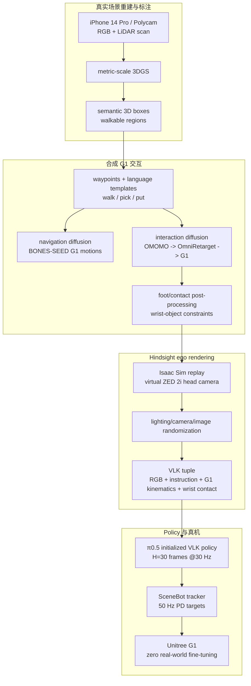

# VLK（Vision-Language-Kinematics）

**VLK: Learning Humanoid Loco-Manipulation from Synthetic Interactions in Reconstructed Scenes**（arXiv:2606.30645）是 Amazon FAR、UC Berkeley、Stanford、CMU 等团队的 2026 工作，收录于 [具身智能研究室 Loco-Manip 接触专题](../../sources/blogs/wechat_embodied_ai_lab_loco_manip_contact_survey.md) **01 接触数据** 组，同时也连接 **03 生成式补数**：它用 3DGS 重建真实室内场景，在其中自动合成 **egocentric image + language command + G1 whole-body kinematics** 三元组，训练可感知的 humanoid loco-manipulation policy。

## 一句话定义

VLK 用 **3DGS Real2Sim 场景 + privileged scene geometry + G1 运动扩散合成 + hindsight egocentric rendering** 生成 48k 级视觉-语言-运动学监督，再用 SceneBot 把策略预测的全身运动学轨迹转成真机动作。

## 英文缩写速查

| 缩写 | 英文全称 | 简要说明 |
|------|----------|----------|
| VLK | Vision-Language-Kinematics | 本文的数据三元组与策略名称：视觉、语言、全身运动学 |
| VLA | Vision-Language-Action | VLK policy 从 π0.5 VLA 初始化，但输出是运动学轨迹 |
| 3DGS | 3D Gaussian Splatting | 从 iPhone/Polycam 扫描重建 metric-scale 室内场景 |
| WBT | Whole-Body Tracking | SceneBot 负责将 kinematic prediction 转成低层动作 |
| BPS | Basis Point Set | 物体几何编码，用于交互扩散模型条件 |
| DR | Domain Randomization | 渲染时随机光照、相机和图像增强以缩小视觉 sim2real gap |

## 为什么重要

- **补齐完整监督三元组**：真实 teleop 有动作但贵，ego 视频有视觉但无 G1 运动学，mocap 有运动但无机器人第一视角；VLK 合成三者同步配对。
- **把重建场景从“预览资产”变成数据工厂**：3DGS 不只是渲染好看，而是承载语义 boxes、walkable regions、waypoint sampling 和 ego rendering。
- **合成不止导航，还含物体交互**：通过 OMOMO → OmniRetarget → G1-object interaction diffusion，生成 pick/put/carry 的全身运动与腕接触标签。
- **执行接口清晰**：高层 VLK 只预测 1 秒未来 G1 kinematics，低层 [SceneBot](./paper-scenebot.md) 负责 50 Hz 接触感知跟踪，降低端到端控制风险。
- **对应接触专题的数据与生成交叉点**：它既是 **01 接触数据** 的 paired data source，也是 **03 生成式补数** 的 scene-grounded synthetic-data 路线。

## 流程总览

## 核心机制

### 1）Scene reconstruction and annotation

VLK 从真实环境扫描开始：每个 lab/apartment layout 用 iPhone 14 Pro + Polycam 获取 RGB 和 LiDAR 深度，优化为 3DGS。由于 3DGS 本身没有明确语义和碰撞结构，作者再导出 point cloud，通过交互工具标注：

- **semantic 3D bounding boxes**：chair、table、box 等目标对象，用于语言模板和任务目标采样。
- **walkable regions**：地面多边形，用于采样机器人初始位姿和导航路点。
- **visibility constraint**：walk-to-object 任务要求目标物在初始 ego camera FOV 内且无遮挡，保证训练样本视觉可 grounding。

### 2）Interaction synthesis：把 HOI 迁到 G1 表示

VLK 合成两类行为：

| 模块 | 训练来源 | 输出 |
|------|----------|------|
| Navigation model | BONES-SEED 的 G1 motions | 面向目标对象的 G1 walking / turning |
| Interaction model | OMOMO 经 OmniRetarget 转为 G1-object trajectories | pick floor/surface、put floor/surface、carry 等交互 |

交互模型借鉴 CHOIS/HIHI 类 conditional DDPM，输入语言、初始 G1/物体状态、scene waypoints、object geometry、desired relative wrist poses 和 wrist-object contact labels。G1 motion 表示包含全局关节位置、6D rotations、关节角的 sin/cos；物体轨迹包含位置和 6D rotation。额外的 G1 FK loss 用来提高腕/末端几何准确性。

### 3）Hindsight rendering 与 domain randomization

合成运动后，系统在 Isaac Sim 中回放 G1 轨迹，加载 3DGS 场景，并用虚拟 ZED 2i 头部相机渲染 egocentric RGB。训练时加入：

- camera translation jitter：±2 cm；
- camera rotation jitter：±3°；
- focal perturbation：±2%；
- dome light intensity/yaw、brightness/contrast/saturation/hue、noise 和 blur。

视觉消融显示 full randomization 将 lab walking 模式成功率从 no randomization 的 **41%** 提升到 **90%**。

### 4）VLK policy：预测运动学而非直接 torque

VLK policy 输入当前 ego RGB、任务语言和当前 G1 kinematic state，输出 **H=30** 帧、**1 秒** 未来全身运动学轨迹：

- root heading-normalized displacement/yaw/root height；
- root 6D orientation；
- joint angles 的 sin/cos；
- left/right wrist-object contact labels。

模型从 **π0.5** 初始化，使用 flow-matching 的 x0-prediction objective；辅助 loss 包括 foot-floor contact、accumulated root trajectory、FK ankle/wrist、foot-skating regularization。

### 5）SceneBot tracker 与部署系统

高层 VLK 预测会被转换为 SceneBot 参考格式：lower-body joint targets、upper-body head/wrist 6D poses、root target pose 和 binary wrist-object contact labels。SceneBot 在 50 Hz 读当前 proprioception，输出 joint-level PD targets；VLK inference client 约每秒级重规划。论文部署栈报告 RTX 5090 上 VLK inference 为 **31 ms**，端到端 replan 平均约 **63 ms**，远小于 chunk 覆盖的 1 秒。

## 工程实践

| 维度 | 记录 |
|------|------|
| 平台 | Unitree G1；头部 ZED 2i；SceneBot tracker |
| 场景 | Lab 与 Apartment，各 4 个 reconstructed layouts |
| 数据规模 | 每环境 4 layouts × 12 modes × 1000 trajectories = **48,000 trajectories**；每 1000 条一个 mode/layout 合成约 4 h，渲染约 8.3 h（L40S） |
| 策略 | π0.5 初始化；flow-matching VLK policy；H=30 future frames |
| 真机 | lab/apartment real-world layouts；无真实微调 |
| 开源状态 | 项目页 Code 按钮标注 **coming soon**；footer 的 GitHub 是网页模板源码，不是论文代码 |
| 源码运行时序图 | **不适用**：截至 2026-07-22 未发布可运行官方代码或数据仓库 |

## 实验与评测

### 全系统真机与仿真成功率

| Setting | Scene | Walk To | Turn Around | Pick (Floor) | Put (Floor) | Pick (Surface) | Put (Surface) |
|---------|-------|---------|-------------|--------------|-------------|----------------|---------------|
| Real | Lab | 20/20 | 20/20 | 16/20 | 20/20 | 11/20 | 8/20 |
| Real | Apartment | 19/20 | 18/20 | 18/20 | 20/20 | 13/20 | 15/20 |
| Sim | Lab | 994/1000 | 843/1000 | 731/1000 | 991/1000 | 458/1000 | 569/1000 |
| Sim | Apartment | 948/1000 | 813/1000 | 749/1000 | 987/1000 | 521/1000 | 722/1000 |

表明导航和地面箱体操作较稳，surface-level pick/place 更难，主要受 OMOMO/retargeted interaction 数据覆盖和不同支撑面高度影响。

## 与相邻路线对比

| 路线 | 数据来源 | 策略输出 | 执行依赖 |
|------|----------|----------|----------|
| VLK | 3DGS 重建场景中合成 RGB+语言+G1 运动学 | 1 秒 future whole-body kinematics + wrist contact | SceneBot tracker |
| [LEGS](./paper-legs-embodied-gaussian-splatting-vla.md) | 3DGS/渲染合成视觉演示 | VLA action / policy fine-tuning | 低层控制与 sim2real pipeline |
| [HumanoidUMI](./paper-humanoidumi.md) | Robot-free VR-UMI 人类示范 | 稀疏关键点动作块 | SKR + WBC |
| 真机 teleop | 机器人遥操作 | 目标机器人动作 | 硬件与操作者 |

## 局限与风险

- **物体类型窄**：当前 interaction synthesis 主要适合大箱体/盒状物体；小物体、杯子、工具和灵巧抓取不在能力中心。
- **依赖手腕接触标签**：真实 deployment 无法直接观测接触标签，策略需要自回归预测；接触预测错会影响 SceneBot 稳定搬运。
- **场景标注仍需人工**：3D boxes 和 walkable regions 需交互标注，尚未成为完全自动数据工厂。
- **3DGS 缺少显式物理**：碰撞和可行性依赖从 point cloud/annotation 提取的近似结构，不等同于完整 CAD/digital twin。
- **代码未开放**：无法独立验证 48k 数据生成、渲染、训练和真机部署栈。

## 关联页面

- [Loco-Manip 接触技术地图](../overview/loco-manip-contact-technology-map.md)
- [01 接触数据分类 hub](../overview/loco-manip-contact-category-01-contact-data.md)
- [03 生成式补数分类 hub](../overview/loco-manip-contact-category-03-generative-data.md)
- [Loco-Manipulation](../tasks/loco-manipulation.md)
- [VLA](../methods/vla.md)
- [Sim2Real](../concepts/sim2real.md)
- [SceneBot](./paper-scenebot.md)
- [LEGS](./paper-legs-embodied-gaussian-splatting-vla.md)

## 参考来源

- [VLK 来源摘录](../../sources/papers/vlk_arxiv_2606_30645.md)
- [具身智能研究室 Loco-Manip 接触专题](../../sources/blogs/wechat_embodied_ai_lab_loco_manip_contact_survey.md)
- arXiv: <https://arxiv.org/abs/2606.30645>
- 项目页：<https://vision-language-kinematics.github.io>

## 推荐继续阅读

- [SceneBot](./paper-scenebot.md)
- [LEGS VLA 实体](./paper-legs-embodied-gaussian-splatting-vla.md)
- [3D Gaussian Splatting 原项目](https://repo-sam.inria.fr/fungraph/3d-gaussian-splatting/)
