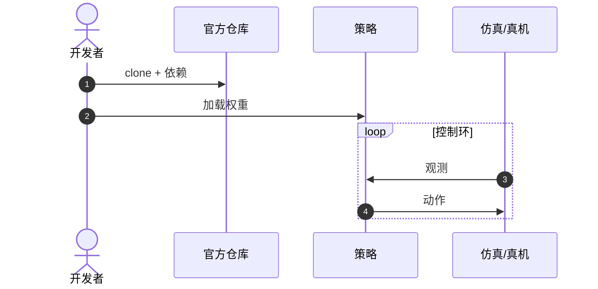

# VoxPoser

**VoxPoser**（[arXiv:2307.05973](https://arxiv.org/abs/2307.05973)，[代码](https://github.com/huangwl18/VoxPoser)）收录于 Lumina [Embodied-AI-Guide 微信专辑](../../wiki/overview/embodied-ai-guide-wechat-album-curator.md)。本页为独立详情节点；实验数字以原文为准。

## 一句话定义

**不直接输出关节角，而是让 LLM 在体素空间里「画」出该去哪、该避哪。**

## 英文缩写速查

| 缩写 | 英文全称 | 简要说明 |
|------|----------|----------|
| VLA | Vision-Language-Action | 视觉–语言–动作策略 |
| LLM | Large Language Model | 大语言模型 |
| IL | Imitation Learning | 模仿学习 |
| BC | Behavior Cloning | 行为克隆 |

## 核心信息

| 项 | 内容 |
|----|------|
| **机构** | Stanford / NVIDIA 等 |
| **arXiv** | [2307.05973](https://arxiv.org/abs/2307.05973) |
| **开源** | **已开源** |

## 结论

VoxPoser 代表「3D 中间表示 + 传统规划器」路线：可解释、可约束，但完成率常低于端到端 VLA。

- value map 是规划接口，不是最终策略
- 轻接触/稳定 ≠ 高任务成功率（见 HRC benchmark 对照）
- 官方 GitHub 可复现仿真管线
- 与 CaP 对照：代码原语 vs 体素场

## 源码运行时序图

官方仓库提供训练/推理入口；节点对齐 README。

## 关联页面

- [paper-pai-2209-07753-codeaspolicies](./paper-pai-2209-07753-codeaspolicies.md)
- [paper-omnimanip](./paper-omnimanip.md)
- [vla](../methods/vla.md)
- [manipulation](../tasks/manipulation.md)

## 参考来源

- [wechat_lumina_embodied_practice_part2_code_as_policy_2026-09-20.md](../../sources/blogs/wechat_lumina_embodied_practice_part2_code_as_policy_2026-09-20.md)

## 推荐继续阅读

- [arXiv:2307.05973](https://arxiv.org/abs/2307.05973)
