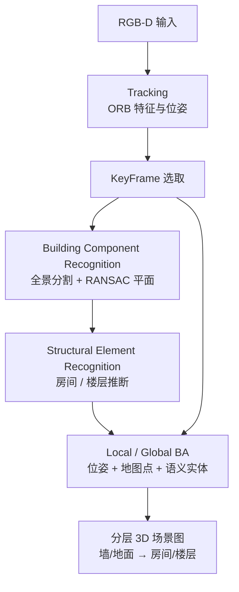

# vS-Graphs（视觉 SLAM + 3D 场景图）

**vS-Graphs**（Tourani et al., arXiv:2503.01783，[IEEE RA-L 2026](https://arxiv.org/abs/2503.01783)，[代码](https://github.com/snt-arg/visual_sgraphs)，[结果页](https://snt-arg.github.io/vsgraphs-results/)）由 **Ali Tourani、Saad Ejaz、Hriday Bavle、Miguel Fernandez-Cortizas、David Morilla-Cabello、Jose Luis Sanchez-Lopez、Holger Voos**（卢森堡大学 SnT / 萨拉戈萨大学 I3A）提出。系统在 **[ORB-SLAM3](./orb-slam3.md)** 基线上，将 **建筑构件**（墙、地面）与 **结构元素**（房间、楼层）纳入 **可联合优化的分层 3D 场景图**，在 **RGB-D 实时 VSLAM** 过程中同步完成 **轨迹估计、稠密建图与可解释场景理解**，无需预置 fiducial marker。灵感来自同团队 **[LiDAR S-Graphs](https://github.com/snt-arg/lidar_situational_graphs)**，但利用视觉外观与全景分割做语义验证，在 AutoSense 等多房间数据上达到与激光版相近的结构检测精度。

## 一句话定义

**在 ORB-SLAM3 滑窗优化内联建筑平面检测与房间/楼层几何约束，把环境布局语义写进可优化 3D 场景图，从而同时提升 VSLAM 轨迹精度与地图可解释性。**

## 英文缩写速查

| 缩写 | 英文全称 | 简要说明 |
|------|----------|----------|
| vS-Graphs | visual Situational Graphs | 本文视觉驱动的情境/场景图 VSLAM 框架 |
| VSLAM | Visual Simultaneous Localization and Mapping | 视觉同步定位与建图 |
| SLAM | Simultaneous Localization and Mapping | 同步定位与建图 |
| RGB-D | Red-Green-Blue + Depth | 彩色图与深度图组合传感器 |
| BA | Bundle Adjustment | 光束法平差，联合优化位姿与地图/语义实体 |
| ATE | Absolute Trajectory Error | 绝对轨迹误差 |
| pFCN | Panoptic Fully Convolutional Network | 全景分割骨干之一（Panoptic-FCN） |
| YOSO | You Only Segment Once | 高效全景分割骨干，默认选项之一 |
| RANSAC | RANdom SAmple Consensus | 随机采样一致性，用于平面拟合 |
| RA-L | IEEE Robotics and Automation Letters | 论文发表期刊 |

## 为什么重要

- **地图不止几何点云：** 移动机器人长期运行需要 **房间、走廊、楼层** 等布局级语义，纯 ORB 点云难以直接服务任务规划或 [视觉语言导航](../tasks/vision-language-navigation.md)。
- **场景图应在线、可优化：** Hydra、HOV-SG 等多为 **离线全图** 或依赖 **真值语义**；vS-Graphs 把实体放进 **SLAM BA**，使语义约束反过来 **收紧位姿**。
- **视觉可达激光级结构检测：** 在 AutoSense 多房间序列上，墙/房间检测与 **LiDAR S-Graphs** 精度相当，说明 **低成本 RGB-D** 足以支撑室内布局理解。
- **工程可复现：** 开源 C++ 实现基于成熟 ORB-SLAM3，便于与 [导航·SLAM 栈](../overview/navigation-slam-autonomy-stack.md) 对照集成。

## 核心信息

| 字段 | 内容 |
|------|------|
| 作者 | Ali Tourani, Saad Ejaz, Hriday Bavle, Miguel Fernandez-Cortizas, David Morilla-Cabello, Jose Luis Sanchez-Lopez, Holger Voos |
| 机构 | 卢森堡大学 SnT 自动化与机器人研究组 · 萨拉戈萨大学 I3A |
| 出处 | arXiv:2503.01783 · IEEE RA-L 2026 |
| 项目 | <https://snt-arg.github.io/vsgraphs-results/> |
| 代码 | <https://github.com/snt-arg/visual_sgraphs> |

## 方法与核心结构

| 模块 | 作用 |
|------|------|
| **ORB-SLAM3 基线** | Tracking / Local Mapping / Loop Closure / Atlas 多地图管理 |
| **Building Component Recognition** | KeyFrame RGB-D → 全景分割（pFCN/YOSO）→ 墙/地面点云 → RANSAC 平面 + 垂直/水平验证 |
| **Structural Element Recognition** | 每 2 s 从墙/地面关联合并 → 推断房间（n 墙围合自由空间）与楼层 → 平行/垂直/质心几何代价 |
| **联合优化** | Local/Global BA 同时优化 KeyFrame、地图点、平面构件与结构元素；回环时合并冗余语义实体 |
| **可选 ArUco 增强** | 标记仅用于房间/走廊语义命名，**非定位必需** |

### 流程总览

## 实验与评测（论文报告摘要）

| 维度 | 设置 | 主要结论 |
|------|------|----------|
| **轨迹 ATE** | ICL / OpenLORIS / ScanNet / TUM-RGBD / AutoSense；对比 ORB-SLAM3、ElasticFusion、BAD SLAM | vS-Graphs（YOSO + 结构元素）全库平均 **改善 15.22%**；多房间 MR 序列改善 **9.39–16.47%** |
| **分割骨干** | pFCN vs YOSO | 对 ATE 影响边际；YOSO 更高效 |
| **模块消融** | 仅建筑构件 (BC) vs BC+结构元素 (SE) | 房间–墙约束在回环/多房间场景进一步降低 ATE（如 deer-w **75.38%**） |
| **建图 RMSE** | AutoSense vs ORB-SLAM3 | 中位数 RMSE 更低；点云规模约 **−10.15%** 仍更精确 |
| **场景理解** | AutoSense MR01–03；对比 S-Graphs、Hydra | 墙/房间 **精度 0.86–0.96**、**召回 0.92–1.00**，接近 LiDAR S-Graphs |
| **实时性** | i9-11950H + T600 | **22±3 FPS**（基线 **29±3 FPS**） |

## 与代表性路线的对照

| 维度 | ORB-SLAM3 | Hydra / HOV-SG | LiDAR S-Graphs | vS-Graphs |
|------|-----------|----------------|----------------|-----------|
| 在线 SLAM | 是 | 多离线/需全图 | 是（激光） | **是（RGB-D）** |
| 场景图 | 无 | 有（常离线） | 可优化分层图 | **可优化分层图** |
| 传感器 | 单/双/ RGB-D + IMU | 多模态 | LiDAR | **RGB-D** |
| 布局实体 | 无 | 房间等 | 墙/房间/楼层 | **墙/地面/房间/楼层** |
| 标记依赖 | 无 | 无 | 无 | **无（ArUco 可选）** |

## 常见误区或局限

- **误区：「语义 VSLAM = 过滤动态物体特征点」。** 本文关注 **建筑布局级实体** 与 **可优化场景图**，而非仅物体级语义滤点。
- **误区：「场景图只能后处理」。** vS-Graphs 在 **Local/Global BA** 内优化语义节点，约束可反馈到位姿。
- **局限：** 当前以 **平面墙/地面** 为主，曲面墙、复杂凹房间仍需未来 GNN 等扩展。
- **局限：** **低纹理走廊**、快速运动与噪声深度仍会影响分割与平面拟合，并传导至结构识别。
- **局限：** 基于 ORB-SLAM3，**ROS 2 对接、Nav2 坐标系对齐** 需自行工程化（见 [导航栈总览](../overview/navigation-slam-autonomy-stack.md)）。

## 与其他页面的关系

- [ORB-SLAM3](./orb-slam3.md) — 本文直接扩展的 VSLAM 基线
- [导航·SLAM·自动驾驶栈总览](../overview/navigation-slam-autonomy-stack.md) — RGB-D / 视觉 SLAM 在移动机器人栈中的位置
- [LiDAR SLAM / LIO / VIO 选型](../comparisons/lidar-slam-lio-vio-selection.md) — 传感器与后端横向对照
- [State Estimation（概念）](../concepts/state-estimation.md) — 位姿估计在自主系统中的角色
- [Vision-Language Navigation（任务）](../tasks/vision-language-navigation.md) — 结构化场景表示对语义导航的潜在价值

## 参考来源

- [vsgraphs_arxiv_2503_01783.md](../../sources/papers/vsgraphs_arxiv_2503_01783.md)
- [visual_sgraphs.md](../../sources/repos/visual_sgraphs.md)
- Tourani et al., *vS-Graphs: Tightly Coupling Visual SLAM and 3D Scene Graphs Exploiting Hierarchical Scene Understanding*, arXiv:2503.01783, IEEE RA-L 2026 — <https://arxiv.org/abs/2503.01783>

## 推荐继续阅读

- [vS-Graphs 结果与媒体页](https://snt-arg.github.io/vsgraphs-results/)
- [visual_sgraphs 代码仓库](https://github.com/snt-arg/visual_sgraphs)
- [LiDAR S-Graphs](https://github.com/snt-arg/lidar_situational_graphs) — 同团队激光情境图 SLAM 前序工作
- Campos et al., *ORB-SLAM3* — 本文基线（<https://arxiv.org/abs/2007.11898>）
- Hughes et al., *Hydra* — 实时场景图构建对照
